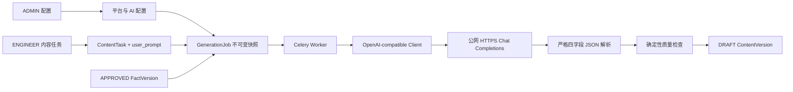

# 配置中心与 AI 生成策略技术设计

## 1. Design Summary

采用模块化单体内的三个明确业务边界，不引入通用插件系统或多协议框架：

1. **账号与权限**：`ADMIN` / `ENGINEER` 两种账号类型、用户生命周期与密码流程。
2. **AI 与平台配置**：平台类型、单份 Markdown Prompt、OpenAI-compatible 渠道、Header 和模型配置。
3. **内容生成**：任务级 `user_prompt`、作业级不可变请求快照、Chat Completions 调用、严格响应解析和既有内容版本流程。

第三方 HTTP、凭据加解密和数据库分别作为基础设施边界依赖业务服务；业务路由不直接拼接外部请求或解密密钥。

## 2. Domain Ownership

### 2.1 Identity

- `User.account_type` 是权限唯一来源，值为 `ADMIN` 或 `ENGINEER`。
- `ADMIN` 包含全部工程师权限，并额外拥有用户和配置管理权限；不再维护可组合业务角色。
- 用户行只停用、不删除，历史外键保持有效。
- 密码重置、强制改密、会话撤销和最后管理员保护由身份服务统一执行。
- 事实与内容审批保留命令和审计，只移除创建者不同于审核者的约束。

### 2.2 Platform Configuration

- `PlatformType` 拥有类型名称与唯一 `slug`。
- `PlatformPrompt` 与 `PlatformType` 一对一，拥有当前 `template_markdown`，没有版本和启停状态。
- `PlatformProfile` 关联当前平台类型；重新归类只影响后续创建的内容任务。
- `ContentTask` 在创建时冻结平台类型身份快照，避免平台后续重新归类改变任务含义。

### 2.3 AI Configuration

- `AIChannel` 拥有 API 根地址、API Key 密文、超时、启用状态和连接级 Header。
- `AIChannelHeader` 归属渠道。普通值可读，敏感值只保存密文；Header 名按小写归一化后唯一。
- `AIModel` 归属渠道，拥有 `model_id`、显示名、自定义 JSON 参数、启用状态和测试状态。
- 渠道不维护第二套测试结果。模型测试成功是模型启用前提，至少一个模型测试成功是渠道启用前提。
- 渠道或模型配置变化在同一事务内把受影响模型重置为 `UNTESTED` 并停用。

### 2.4 Generation

- `ContentTask.user_prompt_markdown` 是工程师可编辑草稿，使用任务 `revision` 做乐观锁。
- `GenerationJob.input_snapshot` 是一次生成的权威输入，包含非敏感连接、模型、Prompt、事实和任务数据。
- API Key 与敏感 Header 永不进入作业快照；Worker 执行和重试时从仍存在的渠道读取当前密文并解密。
- `ContentVersion` 继续拥有不可变 Markdown 内容。模型自报事实/证据 ID 被移除，事实追溯改为作业快照。

## 3. Data Model

新增迁移，不修改 `0001` 至 `0008` 的冻结迁移模型。

### 3.1 Identity Changes

`users` 新增：

- `account_type`: `ADMIN | ENGINEER`，非空。
- `must_change_password`: 布尔值，默认 `false`。

迁移规则：现有用户只要拥有 `SYSTEM_ADMIN` 就映射为 `ADMIN`，其余映射为 `ENGINEER`。迁移完成后删除 `user_roles`、`roles` 及对应运行时模型，避免保留第二套权限来源。

### 3.2 Platform Tables

`platform_types`：

- `id`, `name`, `slug`, `revision`, `created_by`, `created_at`, `updated_at`。
- `slug` 全局唯一。

`platform_prompts`：

- `platform_type_id` 作为主键和外键。
- `template_markdown`, `revision`, `updated_by`, `created_at`, `updated_at`。
- 类型删除时级联删除当前 Prompt；作业不持有该表外键。

`platform_profiles` 新增可空 `platform_type_id` 与 `revision`：

- 外键使用 `RESTRICT`，被具体平台引用的类型不能删除。
- 旧平台迁移后保持空值，等待管理员明确归类；新建平台和新业务操作要求非空。

`content_tasks` 新增：

- `platform_type_id`: 可空外键，类型删除时 `SET NULL`。
- `platform_type_snapshot`: 不可变 JSONB，保存任务创建时的类型 ID、名称、`slug`。
- `user_prompt_markdown`: 文本，旧任务初始为空；生成前必须非空。

现有任务不自动补平台类型或 Prompt；需要重新创建可生成任务，避免静默改变已锁定含义。

### 3.3 AI Configuration Tables

`ai_channels`：

- `id`, `name`, `base_url`, `api_key_ciphertext`, `api_key_updated_at`。
- `timeout_seconds`, `is_enabled`, `revision`, `created_by`, `created_at`, `updated_at`。

`ai_channel_headers`：

- `id`, `channel_id`, `name`, `normalized_name`, `is_sensitive`。
- 普通值使用 `plain_value`，敏感值使用 `encrypted_value`，两者必须且只能存在一个。
- `(channel_id, normalized_name)` 唯一；渠道删除时级联删除。

`ai_models`：

- `id`, `channel_id`, `display_name`, `model_id`, `request_parameters` JSONB。
- `is_enabled`, `test_status` (`UNTESTED | PASSED | FAILED`)。
- `last_tested_at`, `last_test_error_summary`, `revision`, `created_by`, `created_at`, `updated_at`。
- `(channel_id, model_id)` 唯一；渠道删除时级联删除。

### 3.4 Generation Changes

`generation_jobs` 新增：

- `ai_channel_id`, `ai_model_id`: 可空外键，配置删除时 `SET NULL`。
- `provider_request_id`, `response_duration_ms`。
- `prompt_tokens`, `completion_tokens`, `total_tokens`: 可空整数。

`input_snapshot` 保存：

- 渠道 ID、名称、`base_url`、超时、普通 Header 和敏感 Header 名称，不保存敏感值。
- 模型 ID、显示名、`model_id` 和完整自定义参数。
- 平台类型快照、平台 Prompt Markdown、固定契约版本和最终 system message。
- 工程师 `user_prompt` 原文、批准事实文本块、任务要求和最终 user message。

`content_versions` 删除 `used_fact_ids`、`used_evidence_ids`、`required_disclosure_ids`。`fact_version_id` 与 `source_job_id` 继续提供事实版本和作业级追溯。

## 4. API Contracts

### 4.1 User Management

- `GET /api/v1/users`
- `POST /api/v1/users`
- `PATCH /api/v1/users/{user_id}`：显示名、账号类型、启停，带 `expected_revision`。
- `POST /api/v1/users/{user_id}/reset-password`
- `POST /api/v1/auth/change-password`

临时密码会话只允许调用改密、退出和当前会话读取接口。最后管理员保护在服务端事务内执行。

### 4.2 Platform Configuration

- 平台类型：列表、创建、带修订号更新、删除。
- 平台 Prompt：按平台类型读取、`PUT` 原地保存、`DELETE` 物理删除。
- 平台配置创建和更新必须提交 `platform_type_id`；旧平台提供显式归类操作。

### 4.3 AI Configuration

- 渠道：列表、创建、读取、更新、启用、停用、删除。
- Header 随渠道详情读取和写入；敏感值只返回配置状态。
- `POST /api/v1/ai-channels/{channel_id}/discover-models` 调用 `/models`，不落库。
- 模型：列表、创建、更新、启用、停用、删除。
- `POST /api/v1/ai-models/{model_id}/test` 执行固定最小 Chat Completions 请求。

### 4.4 Content Generation

- `PATCH /api/v1/content-tasks/{task_id}/user-prompt` 保存任务草稿并校验修订号。
- `GET /api/v1/content-tasks/{task_id}/generation-options` 返回锁定平台、类型、只读 Prompt 和可用模型，不暴露管理详情。
- 创建作业请求只接收 `ai_model_id`；平台、Prompt、事实和任务草稿全部由服务端权威解析。
- 作业详情增加非敏感快照、供应商请求 ID、耗时和 token 用量。
- 事实追溯接口/页面不再返回模型自报事实或证据 ID。

## 5. Request Construction

### 5.1 System Message

最终 system message 由两段组成：

1. 固定、版本化且不可编辑的生成契约：批准事实优先、禁止使用输入外产品事实、四字段 JSON Schema、不得输出代码块或附加文本。
2. 当前平台类型的 Prompt Markdown。

作业保存最终拼接结果与固定契约版本，不只保存配置外键。

### 5.2 User Message

最终 user message 由明确标题分隔的三段组成：

1. 工程师 `user_prompt` Markdown。
2. 服务端序列化的批准事实值，不包含文件和私有源文档。
3. 目标问题、平台规则及任务要求。

不使用模板变量，也不把整个 ORM 或任意 JSON 对象直接序列化给模型。

### 5.3 External Client

单一 `OpenAICompatibleClient` 负责模型列表与 Chat Completions：

- 每次请求前校验 URL、解析 DNS 并拒绝非公网目标，关闭重定向。
- 使用 `Authorization: Bearer <API Key>`，再合并允许的渠道 Header。
- `model`、`messages`、`stream=false` 由系统写入，再合并自定义参数。
- 使用渠道超时，不执行自动重试或流式响应。
- 对供应商错误只保留状态码、请求 ID 和经过脱敏的短错误摘要。

## 6. Credentials

新增聚焦的 `CredentialCipher`，使用经认证加密保存 API Key 与敏感 Header：

- 主密钥由 `AI_CREDENTIAL_ENCRYPTION_KEY` 注入，代码和数据库没有默认生产密钥。
- 密文包含格式版本、随机 nonce 和认证密文；关联数据绑定记录类型与 ID，防止密文跨记录替换。
- 解密失败显式返回配置错误并阻止测试或生成，不尝试把密文当明文使用。
- MVP 不提供自动主密钥轮换；部署必须备份主密钥，轮换前需显式重新加密或重新录入全部凭据。

## 7. Generation Flow

1. 工程师保存任务 `user_prompt`。
2. 生成页读取平台类型、当前 Prompt 与已启用模型。
3. 创建作业事务锁定任务并校验任务、事实、平台类型、Prompt、渠道、模型和测试状态。
4. 服务端构造全部非敏感输入并写入 `GenerationJob.input_snapshot`；Redis 只收到作业 UUID。
5. Worker 再次校验任务与事实，读取仍存在且启用的渠道/模型，解密当前凭据，按快照发起一次请求。
6. 响应正文直接 `json.loads` 后交给 `extra=forbid` 的 Pydantic Schema；任何包装、附加字段或缺失字段失败。
7. 确定性检查以“批准事实 + 工程师输入”的数字并集作为来源集合，继续检查披露和平台规则；不声称自动判断自由文本语义冲突。
8. 成功时创建一个 `DRAFT ContentVersion` 并记录用量；失败时保存错误码和脱敏摘要。

重试创建新作业并复制原 `input_snapshot`。它只从当前渠道读取 API Key 与敏感 Header；配置行不存在时拒绝重试。

## 8. Frontend Structure

- 主导航新增独立 `用户管理` 与 `配置中心`，仅 `ADMIN` 可见。
- `用户管理` 提供用户列表、新增、账号类型修改、停用/启用和密码重置。
- `配置中心` 分为：
  - AI 渠道与模型：渠道表单、Header 表格、获取模型、手工模型、JSON 参数表、测试连接和启停。
  - 平台类型与 Prompt：类型 CRUD、单一 Markdown 编辑框、保存和删除。
  - 具体平台规则：复用并扩展现有平台规则界面，增加平台类型归类。
  - 审计日志：复用现有读取界面。
- 内容任务页增加任务级 `user_prompt` Markdown 编辑框、只读 Prompt、按渠道分组的模型选择和作业追溯详情。
- TanStack Query 继续管理服务端状态；表单状态保持局部，不新增全局状态库。

## 9. Migration And Rollout

1. 先更新 `contracts/database.md` 与 `contracts/openapi.yaml`。
2. 新增迁移完成账号类型映射、平台类型/Prompt、AI 配置、任务/作业快照和内容追溯字段调整；不编辑旧迁移。
3. 部署前设置 `AI_CREDENTIAL_ENCRYPTION_KEY`，备份数据库与密钥。
4. 部署后管理员先归类旧平台、创建 Prompt、配置渠道/Header/模型、完成测试并启用。
5. 未归类平台、缺 Prompt、无测试通过模型时生成明确不可用，不回退开发生成器。

回滚优先停用渠道并回退应用。数据库降级会丢失新配置，只有在备份可恢复且未产生需保留的新作业时执行。

## 10. Trade-offs And Risks

- Prompt 原地覆盖保持管理简单，但配置表没有版本历史；作业快照是生成历史唯一权威。
- 自由 `user_prompt` 提高专业可控性，但无法确定性识别所有语义冲突；自动检查边界必须在 UI 和审核流程中明确。
- 通用 JSON 参数与自定义 Header 是不同云服务的实际需求，但增加错误配置和泄密风险，因此保留字段、敏感标记、测试门禁和脱敏是必要复杂度。
- 应用层 DNS 校验不能替代基础设施出站防火墙；生产部署仍应限制服务器出站网络。
- 账号类型从六角色简化为两类会改变既有权限契约，迁移和端到端权限回归测试必须一次完成，不能并存两套权限来源。
