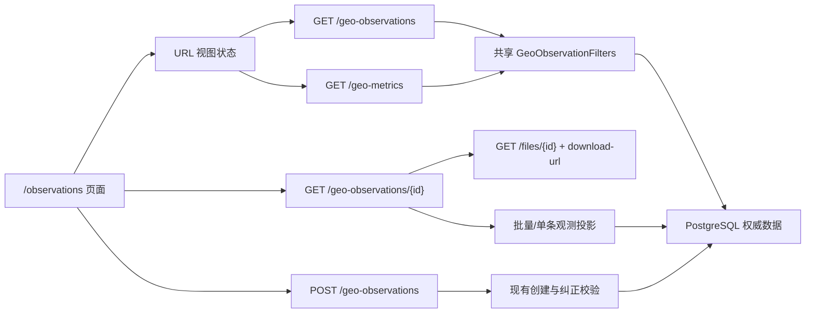

# GEO 观测记录页面技术设计

## 设计结论

采用现有模块化单体、OpenAPI 生成类型、React Query、Ant Design 和 PostgreSQL 查询能力完成，不新增依赖、缓存、表、列或通用筛选框架。后端在现有 GEO 服务中增加一个共享筛选边界，列表与指标复用它；前端保留现有真实新建表单，只拆出详情抽屉和新建/纠正表单这两个有独立责任的局部组件。

核心不变量：观测只能追加，纠正通过新记录的 `supersedes_id` 建链；默认列表、指标和操作能力都以未被下一条记录纠正的链尾为准。任何详情展示、筛选和前端按钮都不能改变这个服务端事实。

## 架构和边界

- 路由层负责解析和约束 HTTP 查询参数、注入当前用户、转换响应与错误码。
- `backend/app/services/geo_observation.py` 继续拥有 GEO 观测读写规则，增加 `GeoObservationFilters`、链尾条件、分页读取、批量投影和单条读取；不引入只有一个实现的 repository/interface。
- Schema 仍以 `LegacyGeoObservation | ManualGeoObservation` 为唯一联合类型。列表和详情返回同一个联合类型，避免另建一套重复详情 DTO；列表最多 100 条，并通过批量加载消除当前逐行查询。
- 前端只使用 `frontend/src/shared/api/schema.d.ts` 生成类型；不手写兼容字段、候选字段或 fallback DTO。

## API 与契约变更

### 1. 分页列表

扩展 `GET /api/v1/geo-observations`：

| 参数 | 类型/默认值 | 语义 |
| --- | --- | --- |
| `page` | integer，默认 1 | 从 1 开始 |
| `page_size` | 1..100，默认 20 | 前端提供 20/50/100 |
| `date_from` / `date_to` | date，可空 | 按现有 UTC 自然日边界筛选，`date_to` 包含当天 |
| `observation_kind` | 联合类型枚举，可空 | 精确筛选观测类型 |
| `product_id` | UUID，可空 | 精确产品 |
| `search` | string，可空 | 在人工 `search_query` 与历史 `actual_prompt` 中不区分大小写匹配 |
| `query_topic_id` | UUID，可空 | 只匹配历史模型观测 |
| `model_name` | string，可空 | 只匹配历史模型观测 |
| `search_platform` | string，可空 | 只匹配人工观测 |
| `publication_search` | string，可空 | 通过关联发布标题、实际标题或最终 URL 匹配，不把普通 Citation URL 当作已关联发布 |
| `mentioned` | boolean，可空 | 只匹配历史模型观测 |
| `recommendation` | `NONE/CANDIDATE/RECOMMENDED`，可空 | 只匹配历史模型观测 |
| `has_citation` | boolean，可空 | 按历史 Citation 是否存在匹配 |
| `accuracy` | 准确性枚举，可空 | 只匹配历史模型观测 |
| `article_recommendation` | `RECOMMENDED/NOT_RECOMMENDED`，可空 | 至少一个逐篇结果匹配，只适用于人工观测 |
| `recorder_search` | string，可空 | 对记录人的用户名或显示名匹配，不依赖管理员专用 `/users` 列表 |
| `only_mine` | boolean，默认 false | 由服务端替换为当前会话用户 ID |
| `include_history` | boolean，默认 false | false 时只保留纠正链尾 |
| `sort_order` | `DESC/ASC`，默认 `DESC` | 固定排序字段为 `tested_at`，再按 `id ASC` 稳定排序 |

`GeoObservationList` 增加必需的 `page`、`page_size`、`total`；`items` 继续使用现有 `GeoObservation` 联合类型。

### 2. 独立详情

新增 `GET /api/v1/geo-observations/{observation_id}`，返回与列表项相同的 `GeoObservation`。不存在返回标准 404；已被纠正的历史记录仍可读取，不因默认列表范围而隐藏。

### 3. 共同投影字段

在两种 `GeoObservation` 输出中增加：

- `product_label: string`：由当前产品的品牌和料号形成显示文本，`product_id` 仍是关系主键。
- `recorder: ActorSummary`：复用现有用户摘要 Schema；保留原 `tested_by` 以维持明确外键语义。
- `is_current: boolean`：是否不存在指向该记录的下一条纠正记录。
- `available_actions: GeoObservationAction[]`：当前仅允许 `CORRECT`。只有当前人工观测且当前用户通过工程师权限语义时才返回；历史模型或已被纠正记录返回空数组。

关联发布内容继续使用现有字段：人工观测用带标题/平台/URL 的 `article_results`；历史模型用 Citation 和 `publication_record_ids`，需要显示发布详情时按所选记录调用现有 `GET /publication-records/{id}`，不把签名 URL 或冗余发布快照塞回观测表。

### 4. 指标

扩展 `GET /api/v1/geo-metrics` 使用与列表相同的全部业务筛选参数，但不接受分页与排序。返回 Schema 不变；前端第五张“观测总数”直接计算 `sample_count + manual_observation_count`。`accuracy_rate` 和 `article_recommendation_rate` 为 null 时展示“暂无数据”，不修改契约为 0。

### 5. 写入

`POST /api/v1/geo-observations` 的请求结构不变。新建传 `supersedes_id: null`；纠正传当前人工观测 ID。现有服务继续校验目标尚未被纠正、产品一致、当前发布候选完整、证据有效和权限，前端只消费结果，不复制这些业务判断。

## 后端数据流

### 共享筛选

- 用一个 `GeoObservationFilters` 值对象表达列表与指标共同参数；路由用一个依赖函数完成参数约束，服务不接收原始字符串字典。
- 基础查询始终从 `GeoObservation` 出发。`include_history=false` 使用现有 `NOT EXISTS` 链尾条件；关联发布、Citation 和逐篇结论使用 `EXISTS` 子查询，避免多对多 JOIN 放大记录数和破坏分页总数。
- `only_mine=true` 只使用服务端当前用户 ID；`recorder_search` 联接 `User` 并匹配受控字段。
- 类型专属条件显式附加对应 `observation_kind`，不存在人工字段为空时误命中历史记录的兼容分支。

### 分页与投影

1. 对同一过滤条件执行 `count(*)` 得到 `total`。
2. 按 `tested_at` 和 `id` 排序后应用 offset/limit。
3. 对当前页 ID 批量读取附件、人工文章结果、历史 Citation/发布关联、产品、记录人和是否存在下一条纠正记录。
4. 使用一个批量投影函数构造现有联合类型；单条详情复用同一投影函数，避免列表与详情出现字段口径差异。

当前 `observation_out()` 的逐行关系查询将被替换，不保留并行实现。最多 100 条的分页上限保持与项目其他列表一致。

### 指标一致性

指标从共享过滤后的观测集合计算。历史指标只读取历史子集，人工逐篇指标只读取人工子集；任一类型专属条件都会先限定类型。这样列表总数和统计卡代表同一结果范围，同时保留两类指标各自真实含义。

## 前端设计

### 路由与视图状态

- `/observations`：记录列表；URL 查询参数拥有筛选、分页、排序、历史开关和 `record` 详情 ID。
- `/observations/:observationId/correct`：复用同一页面壳并打开纠正表单；提交或取消后返回保留原列表查询参数的 `/observations`。
- 新建表单保持页面内状态，不为本任务增加 `/new` 路由。
- 一个局部解析/序列化函数负责 URL 参数的受控枚举、数字和布尔转换；无效值规范化后替换 URL，服务端仍保留 422 边界校验。

### 组件责任

- `GeoObservationsPage.tsx`：URL 状态、指标/列表查询、页头、指标、筛选、表格和分页编排。
- `GeoObservationDrawer.tsx`：按 ID 查询详情、分型展示、文件元数据/短期 URL、历史发布详情和错误状态。
- `GeoObservationForm.tsx`：从现有页面提取真实新建表单，并增加纠正模式；不创建通用动态表单框架。
- `queryOptions.ts`/`queryKeys.ts`：新增参数化列表、指标、详情查询键，所有会改变结果的参数都是查询键组成部分。

列定义和筛选配置保持在页面功能目录内；只有项目已共享的 UI/数据能力放到 `shared`。如果实现后单个页面仍可清晰维护，不再继续拆分。

### 新建与纠正

- 新建沿用当前产品选择和当前发布候选请求。
- 纠正先读取服务端详情并确认 `available_actions` 包含 `CORRECT`；产品、搜索平台和搜索词只读固定，测试时间、全部当前逐篇结论、截图和备注重新填写。
- 不把旧逐篇结论静默复制到新候选集。候选集请求失败或为空时阻止提交并显示真实错误。
- 提交成功后失效列表、指标、详情和 Dashboard 查询，关闭表单并选中新记录。

### 详情与附件

- 桌面 Drawer 使用无额外业务状态的 Ant Design 原生组件，目标宽度约 340–380px，以截图对比最终确定；移动端占满可用宽度。
- 打开详情才申请短期下载地址；URL 不进入 React Query 长期持久化、本地存储或观测响应。
- 图片使用可访问的预览/链接；非图片提供下载。一个附件失败不伪装为已加载，其他附件仍可查看。
- Drawer 只读且不提供新增截图。纠正从行操作进入独立表单，避免把读详情变成隐式编辑器。

## 视觉实现

- 复用现有 dashboard 紧凑外壳尺寸：桌面侧栏约 192px、顶栏约 62px、内容内边距约 18–24px；通过 GEO 路由专用 class 复用规则，不改变其他工作页面。
- 1582px 宽时指标为 5 等分；中等宽度降为 2 列，小屏为 1 列。筛选区桌面两行，控件宽度由 CSS Grid 控制，不用 JS 计算位置。
- 表格采用固定关键列宽、单行省略和局部滚动，目标行高约 40–44px；详情中的长文本恢复自然换行。
- 所有颜色、圆角、阴影和动效来自 `theme.ts` 与 `global.css` 的 `--ps-*` token。只新增 `.geo-observations-*` 局部样式，不引入 Tailwind、CSS-in-JS 或新的 token 层。
- 原型中的平台 Logo 若项目没有可信资产，则使用现有图标/文字组合，不抓取或伪造第三方 Logo。

## 权限、安全与错误

- 列表、指标、详情和文件读取沿用 `CurrentUser`；新建/纠正沿用 `EngineerUser + CsrfProtected`。
- `available_actions` 由服务端基于账号类型、观测类型和链尾状态计算。前端隐藏按钮只是体验，直接调用 POST 仍会重新执行全部权限和业务校验。
- 所有搜索字符串有长度上限并使用 SQLAlchemy 参数化表达式；UUID、枚举、页码和日期由 FastAPI/Pydantic 校验。
- 未知产品、记录、附件或发布关系返回明确错误；不添加 broad catch、空数组 fallback 或兼容字段轮询。

## 兼容性、迁移与文档

- OpenAPI 变化是列表分页元数据、查询参数、详情路径和新增只读投影字段；写入契约不变。
- 列表默认从“全部历史”改为“仅链尾”，这是本页面与现有指标统一所需的有意行为变化。需要历史的调用者必须显式传 `include_history=true`。
- 数据库结构不变，无 Alembic 迁移和回填；回滚前端/后端代码即可，不涉及数据逆变换。
- 更新 `contracts/openapi.yaml`、生成类型、`contracts/database.md` 和 `docs/GEO多平台内容运营系统方案设计.md`；测试说明如新增专用 E2E 命令或截图流程则同步更新 `docs/testing.md`。

## 关键取舍

- 不新增列表摘要 DTO：分页上限与批量投影已经解决全量和 N+1 问题，共用联合类型能避免列表/详情第二套字段；若实测 payload 成为瓶颈，再以测量结果引入摘要类型。
- 不新增记录人选项接口：文本匹配和“仅看我的记录”满足真实筛选，同时避免把管理员用户目录权限扩大到普通用户。
- 不新增导出、分析、截图编辑或人工摘要：这些都没有当前契约和验收定义，且会扩大公共 API 或破坏追加式不变量。
- 不预先新增索引：现有数据结构足以正确查询，只有实施期真实 `EXPLAIN` 或测试规模证明不足时才另立影响说明。

## 回滚与风险控制

- API 与前端必须同一变更交付；`make contract-check` 阻止运行时 Schema、OpenAPI 和生成类型漂移。
- 风险最高的是共享筛选口径、纠正链尾和批量投影。先用后端集成测试锁定这些行为，再切换页面查询。
- 视觉调整限定 GEO 专用 class；若截图回归不达标可独立回退样式，不影响数据契约。
- 不提交、不推送；实施完成后先检查 diff 并向用户给出提交计划，获得确认后才允许提交。
