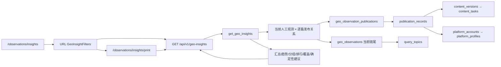

# GEO 观测分析洞察技术设计

## 设计状态

本设计给出完整原型可真实运行的已确认方案。全部产品决策已于 2026-07-22 确认，并已完成数据结构、契约、聚合页面和验证实现。任务不拆父子任务：页面、聚合契约、登记事实和 Playwright 验收共享同一筛选与指标不变量，拆分会增加重复契约协调而不能独立交付。

已确认以补充后的人工观测作为未来洞察权威数据集；新登记和更正关联真实 `query_topic_id`，逐篇保存发现、提及、现有推荐、引用和准确性。旧模型观测和补采前人工记录不混入新指标，只提供历史可读性和明确的数据完整性说明。

## 核心不变量

1. PostgreSQL 中当前纠正链尾的真实观测与发布关系是唯一事实来源。
2. 一个筛选对象决定页面、导出和所有分区的同一数据范围；前端不计算业务指标。
3. 一个事实只存一处。已确认补采的人工内容级发现、提及、推荐、引用和准确性只保存在逐篇关系，不在观测根重复保存同义值。
4. 无分母是 `null`，不是 0；未知历史事实保持 `NULL`，不回填猜测值。
5. 页面展示的每个数值必须能追溯到响应中的分子、分母、计数单位和筛选周期。
6. 建议是服务端确定性读模型，不是可编辑业务状态；建议依据变化时重新计算，不创建第二套数据库真相。

## 架构和数据流



- `backend/app/routers/observation.py` 只解析、校验 HTTP 查询参数和返回契约。
- `backend/app/services/geo_observation.py` 继续拥有 GEO 读写规则，新增洞察聚合；不引入单实现 repository、规则引擎或通用 BI 抽象。
- 洞察基础范围从当前链尾人工观测与其逐篇发布关系出发，向发布内容、内容任务、内容平台和问题主题做显式联接。
- 所有洞察聚合使用 SQL 分组/条件聚合，不像当前 `get_geo_metrics()` 一样把全部行载入 Python 后计算。旧模型汇总与人工洞察只复用已证实相同的筛选/SQL 构件，并用明确字段名区分分析单位；不把两种分母塞进同一指标。
- React Query 的洞察查询键包含全部筛选；页面和打印路由复用同一 `geoInsightsQueryOptions(filters)`。

## 已确认的数据模型演进

### 1. 人工观测关联问题主题

`geo_observations.query_topic_id` 已存在且可空。已确认修改 `0018` 后续迁移中的类型约束，使新的 `MANUAL_ARTICLE_SEARCH` 必须关联一个真实 `QueryTopic`：

- `GeoObservationCreate` 新增必需 `query_topic_id`。
- 登记/更正表单从现有 `/api/v1/query-topics` 选择问题主题，同时仍保存用户实际输入的 `search_query`；两者职责不同，不用文本相似度推导。
- 补采前人工观测保留 `query_topic_id = NULL`，洞察问题覆盖排除这些行并返回排除数量。
- 旧模型观测保持原有必需关联和只读行为。

这一步只复用现有列，但需要新的 Alembic 迁移调整数据库 Check Constraint；不能只改 Pydantic。

### 2. 逐篇内容阶段事实

为支持完整原型，已确认在 `geo_observation_publications` 增加以下可空列，并使用 D2a 的严格累计关系：

| 字段 | 类型 | 责任 |
| --- | --- | --- |
| `discovered` | boolean nullable | 该发布内容是否在本次真实搜索结果中被发现 |
| `mentioned` | boolean nullable | 该发布内容是否在真实结果中被明确提及 |
| `recommendation_status` | 现有二值 | 是否获得推荐，继续作为唯一推荐事实 |
| `cited` | boolean nullable | 结果是否明确展示该发布内容的引用/链接 |
| `accuracy` | `ACCURATE/PARTIAL/INCORRECT/UNJUDGEABLE` nullable | 与该发布内容相关的结果准确性 |

- 历史关系保持这些新增列为 `NULL`，不从 `recommendation_status` 或截图反推其他阶段。
- 新 `GeoArticleResultCreate` 要求提交经批准的全部字段；服务端继续要求对当前全部公开发布精确覆盖一次。
- 已确认阶段严格累计，服务端和数据库 Check Constraint 同时强制 `cited ⇒ recommendation_status=RECOMMENDED ⇒ mentioned ⇒ discovered`。逐篇 `accuracy` 只有在前序阶段完整时参与最后阶段，且只有 `ACCURATE` 进入“结果准确”；历史空值不参与。
- 根表已有旧类型的 `mentioned/recommendation/accuracy`，但推荐的新人工洞察不再复制这些内容级事实到根表，避免第二来源。

### 3. GEO 平台

当前 `search_platform` 是必需自由文本。最小方案按数据库精确字符串分组和筛选：

- 不把旧类型 `model_name` 和人工 `search_platform` 合并。
- 不做别名、大小写、模糊或 Logo 猜测。
- 筛选选项取当前人工观测中的 distinct 精确值，展示文字或中性首字标识。
- 如果用户要求受控平台、别名或可信 Logo，另行批准 `geo_platforms` 配置模型和管理界面；本设计不预建。

## API 设计

### `GET /api/v1/geo-insights`

使用一个页面专用读模型，避免前端为每块区域分别拉原始记录并计算。

查询参数：

| 参数 | 类型 | 语义 |
| --- | --- | --- |
| `date_from` / `date_to` | date | 可空时由服务端采用与记录页一致的近 30 个 UTC 自然日；首尾包含 |
| `content_platform_id` | UUID | 经发布账号精确关联 `platform_profile_id` |
| `geo_platform` | string max 160 | 精确匹配人工 `search_platform` |
| `content_angle` | string | “内容主题”的权威字段，精确匹配关联发布内容所属 `ContentTask.content_angle` |
| `publication_record_id` | UUID | 精确筛选一个发布内容 |
| `query_topic_id` | UUID | 精确筛选一个配置问题 |

不接受分页、排序、`include_history`、旧模型字段或“候选参数”。洞察始终排除被更正记录，避免用户误把历史重复计入当前效果。

响应使用固定字段而非开放字符串 Map，建议结构：

```text
GeoInsights
├── period: current + previous adjacent equal-length window
├── filter_options
│   ├── content_platforms
│   ├── geo_platforms
│   ├── content_angles
│   ├── publications
│   └── query_topics
├── trends
│   ├── mention_rate: GeoRateTrend
│   ├── recommendation_rate: GeoRateTrend
│   ├── citation_rate: GeoRateTrend
│   ├── accuracy_rate: GeoRateTrend
│   └── not_recommended_content_count: GeoCountTrend
├── platform_performance[]
├── funnel[]
├── content_rankings
│   ├── best[]
│   ├── declining[]
│   └── long_unmentioned[]
├── question_coverage
│   ├── by_status
│   └── matrix[]
├── recommendations[]
└── data_quality
    ├── eligible_observation_count
    ├── excluded_incomplete_observation_count
    ├── excluded_incomplete_relation_count
    └── unavailable_sections[]
```

`GeoRateTrend` 固定返回 `current {numerator, denominator, value}`、`previous`、`change` 和每日 `points[{date,numerator,denominator,value}]`。`denominator=0` 时 `value=null`、`change=null`。计数趋势返回 `current/previous/change/points[{date,count}]`。

`not_recommended_content_count` 对当前筛选周期内的完整关系按 `publication_record_id` 分组：关系数至少为 1 且不存在 `recommendation_status=RECOMMENDED` 才计入。它是去重内容数，不是未推荐关系次数；每日趋势点在各自 UTC 日期子集上应用同一去重公式。

`filter_options` 从权威配置/发布/观测表生成，不从当前页面已有列表猜测。选项投影使用稳定 ID；只有 GEO 平台和内容角度保留精确字符串。“内容主题”选项只取具有关联真实发布记录的 `ContentTask.content_angle` distinct 原值。筛选应用于全部结果区块，选项本身保持可取消选择的稳定全集。

### 现有 `GET /api/v1/geo-metrics`

- 保留观测记录页的现有公共入口，但把旧模型字段显式改名为 `legacy_sample_count`、`legacy_mention_rate`、`legacy_recommendation_rate`、`legacy_citation_rate`、`legacy_accuracy_rate`；人工逐篇计数字段同样使用明确的 `manual_*`/`article_*` 名称。
- 旧模型三个比率改为 nullable，空分母返回 `null`；前端继续显示“历史模型”并在无样本时显示“暂无数据”。
- 旧模型汇总改为 SQL 聚合，复用链尾和公共筛选构件；它与人工关系级洞察是两个明确命名的指标族，不共享错误的分母。人工推荐关系公式如同时被记录页和洞察使用，则只保留一个关系级聚合函数。
- 根据已批准的 D1，洞察只使用新 `GeoInsights` 契约，不把人工内容级口径悄悄替换到 `legacy_*` 字段。

### 写入契约

`GeoObservationCreate` 增加问题主题和逐篇发现、提及、引用、准确性事实；`ManualGeoObservation` 同步返回它们。更正继续固定产品、GEO 平台、实际搜索词和问题主题，并重新加载当前发布候选、重新填写全部事实和新证据；旧记录不可原地修改。逐篇事实遵守已批准的严格累计阶段。

## 指标和分组设计

以下分析单位、阶段关系、内容排行、覆盖阈值和优化建议优先级均已确认：

### 分析单位

- 趋势、平台四率、内容排行和漏斗统一使用“当前链尾人工观测 × 该次要求核对的公开发布内容关系”作为基础单位。
- 观测次数单独按 `GeoObservation.id` 去重；所有率的 Tooltip 明示关系级分子/分母，避免把观测数误当率分母。
- 问题覆盖先按 `query_topic_id + search_platform + observation_id` 聚合，再应用覆盖阈值，避免一个观测中的多篇内容把问题样本放大。

### 时间与比较

- 当前周期使用包含首尾的 UTC 自然日。
- 比较期为紧邻当前周期之前的等长周期，不与当前周期重叠。
- 趋势固定日粒度，不根据数据量静默换成周/月；如果用户需要超长周期，再明确增加粒度参数。
- 无当前值或前值时不计算百分比变化；前值为 0 时返回明确不可计算状态，不能显示无穷大。

### 转化链

以基础关系的累计交集统计，保证每阶段单位一致：

1. 完成发布：进入当前观测候选集的发布关系。
2. 被检索发现：阶段 1 且 `discovered=true`。
3. 获得提及：阶段 2 且 `mentioned=true`。
4. 获得推荐：阶段 3 且 `recommendation_status=RECOMMENDED`。
5. 展示引用：阶段 4 且 `cited=true`。
6. 结果准确：阶段 5 且 `accuracy=ACCURATE`；`UNJUDGEABLE` 不进入准确率判断。

数据库约束、服务校验和聚合测试共同锁定上述包含关系；不得仅为了匹配原型柱高而调整数据。

### 内容排行和覆盖

- 排行使用当前筛选的稳定 `publication_record_id`，比较期由同一 ID 对齐。
- “未推荐内容数量”与长期未提及是不同指标：前者按整个当前周期是否曾获得推荐去重；后者按已批准的 30 天周期/发布时长、3 次样本和零提及规则计算，不能互相替代。
- “表现最佳内容 Top 5”要求当前周期至少 3 次完整观测，依次按引用率、推荐率、提及率、观测次数降序，再按 `publication_record_id` 升序；没有加权综合分。样本不足时返回空列表并说明门槛。
- “表现下降内容 Top 5”以紧邻当前周期的等长周期为比较期，两个周期均至少 3 次完整观测；任一引用率、推荐率、提及率下降达到 10 个百分点即候选。固定按最大单项下降、引用率下降、推荐率下降、提及率下降、当前观测次数降序和 `publication_record_id` 升序取前 5，`basis` 返回触发指标及前后值；其他指标改善不抵消已达阈值的下降。
- “长期未获得提及的内容 Top 5”要求当前周期至少 30 个 UTC 自然日、发布截至 `date_to` 已满 30 天、当前周期至少 3 次完整观测且零提及。未提及持续天数从相同非时间筛选下最近一次历史提及计算，从未提及时从 `published_at` 计算；按持续天数、当前观测次数降序和 `publication_record_id` 升序取前 5。短周期在 `unavailable_sections` 返回机器原因，更早历史只计算持续天数，不改变当前候选资格。
- 问题覆盖的全集来自 `query_topics`，不是“本周期出现过的搜索词”。没有任何完整观测的问题可以真实进入“尚未覆盖”。
- 问题覆盖先按 `query_topic_id + search_platform + observation_id` 去重；同一观测任一逐篇关系达到 `mentioned=true` 即命中，覆盖率为命中观测数/完整观测数，不按逐篇关系放大。
- 至少 3 次完整观测后按固定阈值分级：稳定覆盖 `≥60%`、偶尔命中 `≥30% 且 <60%`、尚未覆盖 `<30%`；0–2 次返回独立 `INSUFFICIENT_DATA`，值保持真实分子/分母，不伪装成 0%。

## 确定性优化建议

服务端在聚合结果上运行一组有限、可测试的规则。每条建议返回：

```text
rule_code
priority: HIGH | MEDIUM | LOW
title
basis_text
basis_values
publication_record_ids[]
geo_platforms[]
query_topic_ids[]
```

- 规则只引用 D2g 已批准的长期未提及、内容/平台下降、从未推荐、问题覆盖和数据不足阈值。
- 高优先级规则：长期未提及内容；内容或 GEO 平台最大单项下降 `≥20` 个百分点。
- 中优先级规则：内容或 GEO 平台最大单项下降 `≥10 且 <20` 个百分点；当前至少 3 次完整观测但从未推荐的内容；至少 3 次观测且覆盖率 `<30%` 的问题/平台组合。
- 低优先级规则：覆盖率 `≥30% 且 <60%` 的问题/平台组合；0–2 次观测的数据不足组合，建议补充观测。
- 同一对象的相同原因只保留最高优先级建议。排序固定为优先级、影响关系数、`rule_code` 和关联 ID，保证同一输入输出稳定。
- 页面只展示前 5，Drawer/Modal 展示同一响应中的全部建议；不新增建议表、不写数据库。
- 缺数据的规则跳过，并在 `data_quality.unavailable_sections` 中返回机器可读原因。

## 前端设计

### 路由和共享状态

- `/observations`：现有观测记录。
- `/observations/insights`：分析洞察。
- `/observations/insights/print`：已确认的同筛选打印视图，复用同一洞察响应。
- GEO 侧栏子项和页面页签均使用 `NavLink`，不维护独立选中状态。
- 一个 `GeoInsightFilters` 解析/序列化函数放在分析页面功能目录，使用 OpenAPI 参数类型；不创建通用筛选框架。

### 页面组件

- `GeoInsightsPage.tsx` 负责编排 URL、单个洞察查询、筛选、全部区块和错误/空状态。
- 原生 SVG 趋势卡和漏斗若只在本页使用，先作为同目录局部组件；只有 DOM/交互复杂度影响可读性时再拆成 `GeoTrendCard.tsx`、`GeoFunnel.tsx`，不提前建立图表库封装。
- 表格、矩阵和建议列表复用 Ant Design `Card`/`Table`/`Tooltip`、`TableRegion`、`StatusTag`、`AsyncState` 和现有主题 token。
- 趋势 SVG 使用固定 `viewBox` 和响应式宽度；数据坐标只负责绘制。Tooltip 读取服务端点值，鼠标和键盘焦点都能触发，空点不连线。
- 原型只展示 Top 5，服务端仍返回完整建议供“查看全部建议”；排行是否只返 5 由契约固定，不让前端排序裁剪原始数据。

### 顶部搜索

根据 D4，本任务不修改公共顶栏去增加全局搜索。用户操作区继续复用当前主题切换和账户菜单，真实问题/发布内容搜索保留在分析筛选器；截图验收把缺少原型顶部搜索记录为已批准差异，不增加空入口。

### 导出

已批准的打印方案：

1. 当前按钮以完整查询参数打开 `/observations/insights/print`。
2. 打印路由使用同一 `GeoInsights` 请求和只读组件，增加筛选摘要、生成时间、数据完整性说明和打印 CSS。
3. 用户点击打印后使用浏览器原生打印/另存为 PDF；无新依赖、无第二套服务端模板。
4. Playwright 验证按钮携带全部筛选、打印页真实请求和主要区块；浏览器系统保存对话框不作为自动化成功条件。

## 视觉与响应式

- 保留现有 GEO 紧凑壳：桌面侧栏 192px，内容区与顶栏对齐；只新增 `.geo-insights-*` 局部样式。
- 1570×1001 下优先单屏呈现原型主要区块，但不通过过小字体或截断业务文本强行塞满；最小正文 12px，交互控件保持可访问点击区域。
- 筛选器桌面使用 CSS Grid；1440px 以下允许两行，1024px 以下按可用宽度重排。排行表和覆盖矩阵只在自身容器横向滚动。
- 趋势卡在宽桌面 5 等分；较窄桌面可降为 3+2 或 2+2+1，不允许重叠。
- 颜色使用 `theme.ts` 的 `chartSeries*`、`chartGrid`、`chartAxis`、`chartTooltipBg` 和语义 token；状态同时显示文字/图例。
- 截图比较按导航/页头、筛选、趋势、平台+漏斗、排行、问题+建议六个区域记录位置、尺寸和明显差异。

## 权限、安全和错误

- `GET /geo-insights` 使用 `CurrentUser`；新登记/更正字段仍走现有 `EngineerUser + CsrfProtected`。
- 所有字符串查询有长度上限并用 SQLAlchemy 参数化表达式；UUID、日期和枚举由 FastAPI/Pydantic 校验。
- 未知筛选 ID 返回 404/422。没有数据返回结构化空结果；数据不完整返回 `data_quality`，数据库/服务异常仍返回标准错误，不降级成空数组。
- 打印页受同一登录保护，不把敏感信息或签名文件 URL写入报告；报告只包含洞察读模型已批准字段。

## 兼容性、迁移与回滚

- 已确认方案需要一个新的 Alembic 迁移：调整人工观测 Check Constraint，并为逐篇关系增加 nullable 事实列。历史数据不回填。
- 新字段先 nullable 是真实历史兼容需求；新写入由 Pydantic、服务和数据库触发器/约束要求完整。服务端聚合只纳入完整关系并报告排除数量。
- OpenAPI、FastAPI 运行时 Schema 和前端生成类型必须同一变更交付，`make contract-check` 阻止漂移。
- 如果新字段已有生产写入，向后删除列会丢失观测事实；回滚应使用前向修复或迁移前 PostgreSQL 备份，不自动 downgrade 丢数据。
- 不预先添加索引。实施时使用真实集成数据/`EXPLAIN` 检查日期、链尾、平台、问题和发布联接；只有证据证明缺索引才在同一迁移中增加并记录原因。
- 不新增 Redis 缓存或后台聚合作业。先用直接 SQL 聚合；只有真实响应时间超过验收预算时再提出物化方案。

## 关键取舍

- **一个洞察端点而非多个图表端点**：所有区域共享筛选和数据完整性，一个读模型能避免并发响应口径漂移和客户端拼接。
- **原生 SVG 而非新图表库**：当前图形只有小折线、柱状漏斗和矩阵，现有 React/SVG/CSS 足够，新增图表依赖没有证据收益。
- **浏览器打印而非服务器 PDF**：满足真实筛选和可视报告，复用页面组件并避免第二套渲染；不实现直接文件生成接口。
- **确定性规则而非 AI 建议**：建议必须可解释、可测试、同输入稳定，且不能引入未知产品事实。
- **不合并旧/新观测**：两种记录的分析单位和字段不同，混合会产生不可比较分母；历史数据只读并显式说明。

## 规划门禁

实施前必须全部满足：

- 现有 `07-20-geo-observation-records` 工作树变更已形成稳定、可验证基线；本任务不得覆盖其未完成逻辑。
- 用户明确批准 `prd.md`、本文件和 `implement.md` 并允许运行 `task.py start`。
