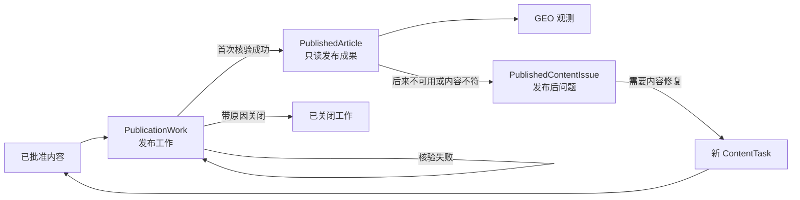
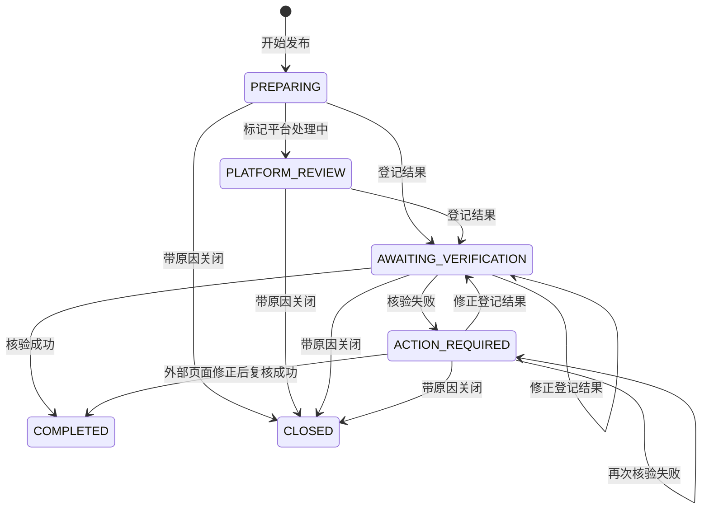

# 重新设计发布管理业务流程：技术设计

## 1. 设计结论

发布管理不再围绕一条混合状态的 `PublicationRecord` 组织，而是拆成三个有明确完成边界的业务生命周期：

核心不变量只有四条：

1. `PublicationWork` 只表达从“准备人工发布”到“首次核验”的未完成工作。
2. 首次核验成功才创建 `PublishedArticle`；失败不能创建公开成果或发布后问题。
3. `PublishedArticle` 形成后只读，GEO 和问题处理只能引用它，不能回写原发布工作。
4. 业务对象不提供物理删除；未完成工作通过带原因关闭结束，环境级测试数据通过显式数据库重置处理。

这套设计不增加工作流引擎、通用状态机、事件总线或兼容适配层。后端继续在现有 `publication.py` 模型、Schema、Router、Service 和 Query 边界内实现。

## 2. 领域对象与唯一责任

| 对象 | 唯一责任 | 可变性 | 不负责 |
|---|---|---|---|
| 发布就绪项 | 从 `OPEN ContentTask + APPROVED ContentVersion` 实时派生“可以开始发布”的输入 | 不持久化 | 不保存工作状态 |
| `PublicationWork` | 保存一次人工发布工作的当前阶段、锁定身份和尚未核验成功的结果 | 仅按状态机更新，终态后冻结 | 不表达发布后页面健康 |
| `PublicationWorkEvent` | 追加保存工作创建、资料调整、平台处理中、结果登记、完成或关闭历史 | 只追加 | 不作为第二个当前状态 |
| `PublicationVerification` | 追加保存每次首次核验尝试及当时被核验的结果快照 | 只追加 | 不覆盖工作结果，不创建问题 |
| `PublishedArticle` | 标记一条工作已首次核验成功，并作为公开文章、GEO 和问题处理的稳定身份 | 只读 | 不承担待办状态 |
| `PublishedContentIssue` | 保存首次核验成功后发生的页面不可用、内容变化及其显式处理结果 | `OPEN -> RESOLVED` | 不改写发布工作或文章字段 |
| `PlatformAccount` | 保存不含凭据的平台运营账号身份 | 沿用现有生命周期 | 不保存发布状态 |

`PublishedArticle` 使用与 `PublicationWork` 相同的主键形成一对一子类型。实际标题、最终 URL、发布时间、内容版本、平台和账号继续只保存在冻结后的 `PublicationWork`；成功核验的操作者、时间和结果只保存在其关联的 `PublicationVerification`。这样既有可被外键引用的公开文章身份，又不复制一份可漂移的 URL、标题或核验事实。

## 3. 发布工作状态机

### 3.1 状态

| 状态 | 用户含义 | 推荐动作 |
|---|---|---|
| `PREPARING` | 已开始发布，正在准备或执行外部人工操作 | 登记发布结果 |
| `PLATFORM_REVIEW` | 已提交到外部平台，正在等待平台处理 | 登记发布结果 |
| `AWAITING_VERIFICATION` | 已登记公开结果，等待首次核验 | 首次核验 |
| `ACTION_REQUIRED` | 最近一次首次核验失败，发布工作仍未完成 | 修正外部页面后再次核验；必要时修正登记结果 |
| `COMPLETED` | 首次核验成功，已形成只读发布成果 | 无发布工作命令 |
| `CLOSED` | 未成功完成，由用户填写原因后显式终止 | 无；再次发布需新内容任务 |

### 3.2 转换

- `PLATFORM_REVIEW` 是可选阶段；立即公开的平台可以从 `PREPARING` 直接登记结果。
- 失败核验必须填写非空说明，并冻结当时的实际标题、最终 URL 和发布时间快照。
- `ACTION_REQUIRED` 可以直接再次核验，支持外部页面已修正但登记字段未变化的场景；只有登记字段变化时才重新登记结果。
- 任一非终态工作都可带原因关闭。关闭原因使用最小枚举 `PLATFORM_REJECTED | BUSINESS_CANCELLED | OTHER`，且说明必填。
- 成功与关闭均为不可逆终态。成功同时把来源 `ContentTask` 置为 `COMPLETED`；关闭同时置为 `CANCELLED`。

## 4. 数据模型

### 4.1 保留对象

- `platform_accounts` 保留现有结构、启停、唯一标识和 revision 规则。
- `file_records` 及通用文件生命周期保留。
- `publication_attachments` 保留“发布证据只追加”的职责，但外键改为 `publication_work_id`。

### 4.2 新对象

#### `publication_works`

主要字段：

- 身份：`id`、`idempotency_key`、`content_version_id`、`platform_profile_id`、`platform_account_id`、`content_hash`；
- 准备信息：`section_url`；
- 当前待核验结果：`actual_title`、`final_url`、`published_at`；
- 状态：`status`、`revision`；
- 关闭事实：`close_reason`、`close_comment`、`closed_by`、`closed_at`；
- 审计：`created_by`、`created_at`、`updated_at`。

约束：

- `content_version_id` 唯一，一份已批准内容只产生一条发布工作；关闭后不会自动重新成为同一候选。
- `(platform_profile_id, content_hash)` 在 `status <> 'CLOSED'` 时唯一。关闭的旧工作允许未来新内容任务重试；活动或已成功工作永久阻断同平台同内容哈希的重复发布。
- `platform_profile_id` 与内容任务的平台、`platform_account_id` 所属平台必须相等；应用服务和 PostgreSQL 都校验。
- `content_version_id`、`platform_profile_id`、`content_hash` 和创建人不可更新。`platform_account_id` 与 `section_url` 只允许在 `PREPARING | PLATFORM_REVIEW` 中修正且必须继续属于同一平台；结果字段仅在非终态的登记命令中更新，`COMPLETED | CLOSED` 后全部冻结。
- `revision` 每次合法更新只增加 1；命令使用 `expected_revision` 防止覆盖并发操作。
- 表及其业务历史不允许运行时 `DELETE`。

#### `publication_work_events`

字段：`id`、`publication_work_id`、`action`、`from_status`、`to_status`、`comment`、`actor_id`、`created_at`。只允许追加，记录同状态资料修正和所有状态转换；当前状态仍只读 `publication_works.status`。

#### `publication_verifications`

字段：`id`、`publication_work_id`、`outcome`、`actual_title_snapshot`、`final_url_snapshot`、`published_at_snapshot`、`comment`、`actor_id`、`created_at`。`outcome` 仅允许 `PASSED | FAILED`；失败说明非空；同一工作最多一条 `PASSED`，失败记录数量不受限；任何行不可更新或删除。

#### `published_articles`

字段：`id`（同时外键到 `publication_works.id`）、`verification_id`（唯一外键到成功的 `publication_verifications.id`）。只有核验成功命令可以写入；文章详情通过工作与成功核验的一对一投影读取冻结的来源、结果和核验字段。

数据库使用延迟约束保证：

- 每个 `COMPLETED publication_work` 在事务提交时恰有一条 `published_articles`；
- 每条 `published_articles` 的工作必须是 `COMPLETED`；
- `verification_id` 必须指向同一工作唯一的 `PASSED` 核验；
- 其他工作状态不能被 GEO 或发布后问题引用。

#### `published_content_issues`

主要字段：

- `id`、`published_article_id`；
- `kind`：`PAGE_UNAVAILABLE | CONTENT_CHANGED | OTHER`；
- `description`；
- `status`：`OPEN | RESOLVED`；
- `revision`；
- 打开与解决的操作者、时间；
- `resolution_outcome`：`RESTORED | RETIRED`；
- `resolution_comment`。

约束：

- 每篇文章同时最多一条 `OPEN` 问题，但允许问题解决后再次出现并形成新行。
- `OPEN -> RESOLVED` 是唯一更新，解决说明和结果必填。
- 文章一旦存在 `RETIRED` 解决结果，不再允许打开新问题或进入新的 GEO 观测。
- `ContentTask.source_published_content_issue_id` 替换旧 `source_publication_attention_id`，保持可空、唯一和写入后不可改绑；一条问题最多创建一个修复任务。
- 问题是否解决、修复任务是否存在、新文章是否完成三者分别读取各自对象，不互相推断。

## 5. 发布就绪项和业务身份

发布就绪项不建表，从以下事实实时派生：

- `ContentTask.status = OPEN`；
- 任务存在唯一 `APPROVED ContentVersion`；
- 事实版本在开始发布时仍有效；
- 具体平台启用，且至少有一个可选启用账号；
- 该内容版本不存在 `PublicationWork`；
- 同平台同 `content_hash` 不存在非关闭工作。

创建发布工作时按 `platform_profile_id + content_hash` 获取 PostgreSQL 事务 advisory lock，再锁内容任务、内容版本、平台和账号，最后重新执行全部资格校验。`Idempotency-Key` 继续使用 8–128 字符合同，同键同载荷返回原工作，同键异载荷返回 `IDEMPOTENCY_CONFLICT`。

平台或账号在工作创建后停用，不改写已经锁定的身份，也不阻止该工作完成；停用只阻止创建新的工作。

## 6. 命令与事务边界

| 命令 | 允许状态 | 原子结果 |
|---|---|---|
| 开始发布 | 发布就绪项 | 创建 `PREPARING` 工作、创建事件和成功审计 |
| 更新准备信息 | `PREPARING | PLATFORM_REVIEW` | 更新账号/栏目允许范围内的资料、revision、事件 |
| 标记平台处理中 | `PREPARING` | 状态改为 `PLATFORM_REVIEW`、追加事件 |
| 登记或修正结果 | `PREPARING | PLATFORM_REVIEW | AWAITING_VERIFICATION | ACTION_REQUIRED` | 校验真实结果与附件；状态改为或保持 `AWAITING_VERIFICATION`、追加事件 |
| 首次核验失败 | `AWAITING_VERIFICATION | ACTION_REQUIRED` | 追加失败核验快照；状态为 `ACTION_REQUIRED`；不创建文章或问题 |
| 首次核验成功 | `AWAITING_VERIFICATION | ACTION_REQUIRED` | 追加成功核验、创建 `PublishedArticle`、工作 `COMPLETED`、任务 `COMPLETED`、事件和审计同事务提交 |
| 关闭工作 | 任一非终态 | 工作 `CLOSED`、任务 `CANCELLED`、关闭事实、事件和审计同事务提交 |
| 打开发布后问题 | 合格 `PublishedArticle` | 创建唯一 `OPEN` 问题，文章立即退出新 GEO 候选 |
| 创建修复任务 | `OPEN` 问题且尚无来源任务 | 创建继承产品和平台的新 `ContentTask`，问题仍保持 `OPEN` |
| 解决发布后问题 | `OPEN` 问题 | 显式写 `RESTORED` 或 `RETIRED`，问题 `RESOLVED`；不自动完成修复任务 |

结果登记必须保留现有边界：实际标题非空，URL 为符合平台域名的 HTTP(S) 公开地址，发布时间和附件合法，正文内容仍由批准的 Markdown 与 `content_hash` 锁定。未知或无法核对的字段直接返回结构化错误，不补默认值。

所有写命令：

- 由服务端投影 typed `available_actions` 和可空的唯一 `primary_action`；待办必须有主动作，终态资源可以为空；前端不从状态复制资格规则；
- 到达服务端后重新锁行、校验 `expected_revision`、状态和权限；
- 成功业务写入、工作事件和 `SUCCESS` 审计同事务提交；关键命令失败按既有审计合同记录 `FAILED | DENIED`；
- 使用当前 `ADMIN | ENGINEER` 权限边界、CSRF 和真实操作者，不增加新角色。

## 7. API 合同

删除旧的通用 `POST /publication-records/{id}/{command}` 和选项式 `PublicationCommand`，改为显式端点和严格请求模型：

### 7.1 工作台读取

- `GET /api/v1/publication-ready-items`
- `GET /api/v1/publication-workbench-summary`
- `GET /api/v1/publication-works`
- `GET /api/v1/publication-works/{publication_work_id}`
- `GET /api/v1/published-articles`
- `GET /api/v1/published-articles/{published_article_id}`
- `GET /api/v1/published-content-issues`
- `GET /api/v1/published-content-issues/{issue_id}`

列表使用稳定排序、服务端筛选和分页。摘要只返回真实运营口径：`ready_count`、`active_count`（`PREPARING | PLATFORM_REVIEW`）、`awaiting_verification_count`、`action_required_count`、`open_issue_count`。

### 7.2 显式命令

- `POST /api/v1/publication-works`
- `PATCH /api/v1/publication-works/{id}/preparation`
- `POST /api/v1/publication-works/{id}/platform-review`
- `PUT /api/v1/publication-works/{id}/result`
- `POST /api/v1/publication-works/{id}/verifications`
- `POST /api/v1/publication-works/{id}/close`
- `POST /api/v1/published-articles/{id}/issues`
- `GET /api/v1/published-content-issues/{id}/repair-context`
- `POST /api/v1/published-content-issues/{id}/repair-task`
- `POST /api/v1/published-content-issues/{id}/resolve`

不保留旧路径别名、兼容请求字段、双写或前端转换层。平台账号 API 保持现有合同，仅把引用门禁从 `PublicationRecord` 改为 `PublicationWork`。

## 8. 前端信息架构

稳定入口继续使用 `/publications`，页面改为数据列表工作台，按用户工作而非表名分成三类：

### 8.1 发布工作

- 默认展示“待开始”和“进行中”两个业务区块；`ACTION_REQUIRED`、待核验、平台处理中和准备中按处理优先级排序。
- 提供“已关闭”筛选查看失败关闭历史；关闭项不混入默认待办，也不会重新变成待开始候选。
- 每行显示内容、平台、当前阶段、阻断原因、最近事件和服务端 `primary_action`；次级动作进入“更多操作”。
- 工作详情 Drawer 展示锁定内容、账号/栏目、当前登记结果、核验历史和工作事件。

### 8.2 发布成果

- 只展示 `PublishedArticle`，即首次核验成功的只读结果。
- 详情展示实际标题、最终 URL、发布时间、账号、内容版本、首次核验和历史问题；不显示修改或删除动作。
- 符合资格时只从服务端 `available_actions` 显示“登记内容问题”。

### 8.3 内容问题

- 默认展示 `OPEN` 问题，已解决问题通过筛选查看。
- 详情独立显示问题、原文章、修复任务入口和显式解决动作；创建修复任务不会自动解决问题。

Tab、筛选、分页和 Drawer 选中对象继续以 URL 为唯一导航状态。页面复用现有 `PageHeader`、`MetricTile`、`TableRegion`、`StatusTag`、Ant Design Drawer/Form/Dropdown 和查询反馈，不新增组件库、状态 Store 或页面壳。移动端使用全宽 Drawer，危险关闭操作经过影响说明和确认。

旧 `/publications/:publicationId`、`/publication-attentions/:id`、修复独立页及对应兼容类型在新页面可覆盖全部路径后删除。

## 9. GEO 与修复回流

- `geo_observation_publications.publication_record_id` 和 `geo_observation_citations.publication_record_id` 改为 `published_article_id`。
- GEO 候选只读取 `PublishedArticle`：不存在 `OPEN` 问题，且从未以 `RETIRED` 结果解决问题。
- 创建人工 GEO 观测时继续在同一事务锁定产品和完整文章候选集合；问题打开或文章新增造成集合变化时仍返回 `GEO_PUBLICATIONS_CHANGED`，不补造遗漏结论。
- 既有 GEO 发现率、提及率、准确率和更正链公式不变；只替换文章身份和资格查询。
- 打开内容问题和创建 GEO 观测都锁同一 `PublishedArticle`，避免问题打开与新观测同时提交产生竞态。
- 修复任务从问题的原文章投影产品和具体平台，并要求用户选择同产品有效批准事实版本；后续内容审核和新发布完全走普通流程。

## 10. 迁移与测试数据重置

新增迁移文件 `0034_publication_workflow_redesign.py`，其 head revision 为 `0034_publication_redesign`，`down_revision = "0033_task_owned_history_delete"`。不修改任何历史 revision。

迁移先检查旧发布、关注事项、发布附件和依赖旧发布身份的 GEO 关系是否为空。任一非空时使用 PostgreSQL `55000` 明确列出阻断表并中止，不在 Alembic 中静默删除或猜测映射业务数据。

在已确认的开发和预发布环境执行一次完整数据库重置后，从空库升级到 head：

1. 停止写入并核对目标数据库；预发布先使用既有备份脚本留存回滚点。
2. 重建目标数据库或本地开发卷，不对单表执行零散清理。
3. 从 `0001` 升级到新 head；旧 revision 创建的发布结构在 `0034` 中于空表条件下被替换。
4. 重新运行账号 seed 和现有真实 HTTP/E2E 数据准备流程。
5. 验证旧表、旧触发器、旧 API 和旧生成类型均不存在。

`0034` 删除旧 `publication_records`、`publication_status_events`、`publication_attentions` 及其旧门禁，创建新表和触发器，替换内容任务修复来源与 GEO 外键，并更新文件引用检查。由于新旧语义无法无损逆向映射，downgrade 明确失败并要求恢复迁移前备份。

## 11. 删除策略

新设计不提供以下日常删除能力：

- 删除发布就绪项：它只是权威内容事实的派生投影；
- 删除发布工作：用带原因关闭表达业务终止；
- 删除核验记录、工作事件、已发布成果或内容问题：这些都是审计和后续归属依据；
- 通过删除已发布成果改变 GEO 历史：GEO 观测保持追加式历史。

因此旧 `DELETE /publication-records/{id}`、`PublicationAction.DELETE` 和 revision `0030` 的运行时删除门禁在新 head 中整体移除。开发环境重置是一次性运维动作，不进入页面或业务 API。

## 12. 主要错误与并发结果

| 条件 | 结果 |
|---|---|
| 内容版本非批准、任务非开放、事实无效 | `409 INVALID_STATE_TRANSITION` |
| 平台或账号不存在/停用，或平台不匹配 | `404`、`409 PLATFORM_DISABLED` 或明确平台账号错误 |
| 同请求键异载荷 | `409 IDEMPOTENCY_CONFLICT` |
| 同内容版本已有工作，或同平台哈希已有非关闭工作 | `409 PUBLICATION_IDENTITY_CONFLICT` |
| 状态或 revision 已变化 | `409 INVALID_STATE_TRANSITION` 或 `REVISION_CONFLICT`，客户端刷新服务端投影 |
| 结果不完整、URL/域名/附件非法 | `422 VALIDATION_ERROR` 或现有结构化文件错误 |
| 失败核验或关闭缺少说明 | `422 VALIDATION_ERROR` |
| 已完成/关闭工作再次执行命令 | `409 INVALID_STATE_TRANSITION` |
| 文章已有打开问题或已退役 | `409 PUBLISHED_CONTENT_ISSUE_CONFLICT` |
| GEO 提交文章集合已变化 | `409 GEO_PUBLICATIONS_CHANGED` |

列表和详情的 `available_actions`、`primary_action` 由同一批量投影器产生；命令处理器在锁内重复最终校验。任何唯一约束竞态转换为同一领域错误，不暴露数据库细节，也不增加自动重试或静默 fallback。

## 13. 影响范围

必须同步修改并删除冲突旧逻辑的边界：

- 权威文档：`docs/GEO多平台内容运营系统方案设计.md`、`docs/architecture.md`；
- 合同：`contracts/database.md`、`contracts/openapi.yaml`；
- Trellis 规范：发布工作台、数据库、前端组件/质量中引用旧模型的部分；
- 后端：发布模型/Schema/Router/Service/Query，内容任务修复来源，GEO 候选和写入门禁，总览摘要，文件引用检查，Alembic；
- 前端：发布工作台及路由，GEO 文章类型与页面，总览指标，生成 API 类型；
- 测试与数据准备：迁移、合同、发布闭环、内容任务删除门禁、GEO、总览、前端组件和真实 HTTP E2E。

本任务保持一个跨层 Trellis 任务，不拆子任务：数据库身份、API、状态机、GEO 外键和页面必须在同一版本切换，任何部分独立落地都会制造第二套状态源或不可运行的中间态。
