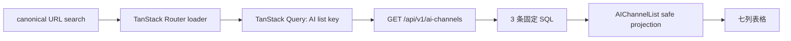

# Frontend V2 AI 渠道列表设计

## 1. 设计结论

沿用已落地的 Platform List 结构，不造新的列表框架：路由负责 canonical URL、预取与跨域 cache invalidation；`ai-channel-list.model.ts` 负责搜索参数映射、显示注册表和服务端动作 token；页面复用 Table Kit 完成七列、状态与命令交互；API 模块只封装一条集合查询和三条直接命令。

为满足固定列与安全边界，需要先收紧共享 OpenAPI/后端投影。现有列表已经在数据库内分页和聚合，并保持固定请求数，因此不改数据模型、不加缓存、不拆服务，只补两个服务端字段、移除一个敏感字段并补全 revision/no-op 命令语义。

## 2. 现状审计与缺口

| 主题 | 已验证现状 | 缺口与决定 |
| --- | --- | --- |
| 集合能力 | `GET /api/v1/ai-channels` 已支持 `q/status/provider_brand/sort/page/page_size`，由 DB 筛选、排序、分页 | 直接复用；V2 URL `provider/pageSize` 映射为 API snake_case |
| 模型计数 | SQL 已计算 `model_count`，响应仅返回 `enabled_model_count` | 直接把既有计算暴露为必填 `model_count`，不增加 SQL |
| 连接状态 | 已返回最近已测试模型状态，无记录时服务端填 `UNTESTED` | 直接展示，不在前端推导 |
| 配置状态 | 只有 `api_key_configured`、模型数和 workflow stage | 新增服务端 `configuration_status`，规则唯一落在后端 |
| 列表敏感面 | `AIChannelSummary` 返回完整 `base_url`；搜索也匹配 base URL | 从 summary 删除；`q` 只匹配名称/描述，避免不回显字段成为探测面 |
| 启停响应 | 返回完整 `AIChannelOut`，包含 base URL、Header 结构和非敏感 Header 值 | 改为安全 summary；V1 不消费响应体，可失效后重取详情 |
| 删除并发 | 删除命令不接收 revision | 增加必填 `expected_revision` query，并在行锁后校验 |
| 状态转换 | 启停检查 revision 与启用门禁，但相同状态仍递增 revision | revision 后增加 no-op 拒绝，返回 `INVALID_STATE_TRANSITION` |
| 动作投影 | `workflow_stage/primary_task/available_actions` 已由服务端返回 | V2 仅做穷尽映射；未知/矛盾 token 显式失败 |
| 查询数量 | 当前列表固定执行 counts、total、rows 三条 SQL；行聚合为相关子查询 | 保持实现，新增固定查询数回归测试，禁止逐行加载 |
| 权限 | 集合、详情和命令均依赖 `AdminUser`；现有 integration 已覆盖 Engineer 403 | 路由挂 `_admin`，保留后端直接 403 回归 |
| V1 影响 | V1 列表显示 `base_url`，搜索提示含地址；编辑类型允许 summary；删除不带 revision | 同任务做最小兼容修改，不改变 V1 Workspace 功能 |

详细证据与影响文件见 `research/ai-channel-list-audit.md`。

## 3. 页面信息架构

### 3.1 页面骨架

1. 标题“AI 渠道”，一句说明服务端状态与动作是最终依据。
2. `TableToolbar + FilterBar`：搜索、状态、Provider、排序；不显示无验收价值的汇总卡或“新建渠道”按钮。
3. `TableShell`：固定七列与 `RowActions`。
4. `TablePagination`：总数、当前页、page size。
5. Notice：旧数据刷新失败、命令失败、revision 冲突。
6. 复用 Dialog：启用、停用、删除确认。

创建渠道需要 base URL、API Key 等完整配置表单，属于未来 Workspace/创建流程；把创建入口塞进本列表会扩大当前任务并违反“无 API Key 编辑器、无 Workspace”的边界，因此本任务明确不提供。

组件层级保持在一个领域页面内，不提前拆通用组件：

```text
Route(/settings/ai)
└─ AIChannelListPage
   ├─ header
   ├─ Notice（刷新/命令/冲突，按状态出现）
   ├─ TableToolbar
   │  └─ AIChannelFilters
   │     └─ FilterBar + input + Status/Provider/Sort Select
   ├─ TableShell
   │  ├─ TableSkeleton | EmptyTable
   │  └─ tbody
   │     └─ row
   │        ├─ ChannelPrimaryCell（名称链接 + 移动摘要）
   │        ├─ Badge / count cells
   │        └─ RowActions（primary + overflow）
   ├─ TablePagination
   └─ CommandDialog（enable/disable/delete 共用既有 Dialog primitives）
```

`AIChannelFilters`、主单元与确认框可先作为同文件私有组件；只有实现中出现可验证的独立复用或测试边界才拆文件。

### 3.2 固定列

| 列 | 服务端字段 | 展示 |
| --- | --- | --- |
| 渠道 | `provider_brand/name/description/id` | Provider 标记、名称链接、可选一行描述 |
| Provider / Protocol | `provider_brand/protocol_type` | 注册表标签；未知值显式错误 |
| 状态 | `is_enabled` | `Enabled` / `Disabled` badge |
| 模型 | `enabled_model_count/model_count` | `已启用 / 总数`，例如 `2 / 5` |
| 连接 | `latest_test_status` | `Passed` / `Failed` / `Untested` badge |
| 配置 | `configuration_status` | `Ready` / `Needs setup` badge |
| 操作 | `primary_task/available_actions/revision` | 最多一个主动作和 overflow |

Provider 标记使用已安装的 Lucide 图标或两字符文字标记加统一容器；注册表只保存固定品牌标签/标记，不引入图片资产、远程资源或新依赖。协议首期只有 `openai-compatible-chat-completions -> OpenAI Compatible`。

## 4. URL 与服务端请求

### 4.1 canonical URL

Frontend V2 继续使用 camelCase 搜索参数；`page` 与 `pageSize` 总是显式存在，其余只在有效且非空时存在：

```text
/settings/ai?page=1&pageSize=20
/settings/ai?q=OpenAI&status=ENABLED&provider=OPENAI&sort=NAME_ASC&page=2&pageSize=50
```

| URL 字段 | 合法值/默认 | API 字段 |
| --- | --- | --- |
| `q` | trim 后 1..200 字符；默认省略 | `q` |
| `status` | `ENABLED | DISABLED`；默认省略 | `status` |
| `provider` | `AIProviderBrand`；默认省略 | `provider_brand` |
| `sort` | `CREATED_DESC | NAME_ASC | NAME_DESC | UPDATED_DESC | LAST_TESTED_DESC`；默认 `CREATED_DESC` 并省略 | `sort` |
| `page` | 正整数；默认 `1`，显式保留 | `page` |
| `pageSize` | `10 | 20 | 50`；默认 `20`，显式保留 | `page_size` |

Zod schema 只做 URL 边界规范化；路由比较 raw 与 canonical record，不一致时 `replace`。筛选变化通过 TanStack Router search 更新，浏览器历史是唯一页面状态。请求 key 使用规范化后的完整 search。

### 4.2 URL state 与 query-key 所有权

| 事实 | 唯一 owner | 责任 |
| --- | --- | --- |
| `q/status/provider/sort/page/pageSize` | TanStack Router URL search | 持久化、历史、直达、刷新恢复 |
| URL 解析/canonical/API 映射 | `ai-channel-list.model.ts` | Zod 边界、默认值、camelCase → snake_case |
| `['configuration', 'ai-channels', 'list', apiParams]` | `ai-channel.api.ts` | query key、集合 fetch、list root invalidation |
| 预取与跨域 invalidation | `/settings/ai` route | loader 复用同 key；命令成功后精确通知消费者 |
| 行 pending/error/confirm target | `AIChannelListPage` 局部 UI state | 短生命周期交互，不复制列表业务事实 |

本任务不定义 detail/query keys，不把筛选复制进 React state，也不把服务端 counts 或 action projection写入独立 store。

### 4.3 数据流与请求数



- 首屏只有一条集合 HTTP 请求；loader 只在 query cache 无状态时预取，页面 `useQuery` 复用同一 key。
- 不读取 channel detail、models、headers、usage 或 audit logs。
- DB 保持三条语句：全部/启停计数、筛选后总数、当前页投影。相关聚合位于当前页 SQL，不随行数增加 SQL 次数。

## 5. 服务端投影与规则

### 5.1 安全列表投影

`AIChannelSummary` 目标字段：

```text
id, name, description, protocol_type, provider_brand,
is_enabled, api_key_configured, header_count,
enabled_model_count, model_count,
latest_test_status, last_tested_at,
configuration_status, workflow_stage, primary_task,
available_actions, revision
```

`api_key_configured` 与 `header_count` 暂时保留是为了共享 V1 与服务端 workflow 兼容，但 Frontend V2 本页不展示它们。summary 删除 `base_url`；完整 detail 端点仍保留经管理员授权的 base URL 和已脱敏 Header，用于现有 V1 与未来 Workspace。

### 5.2 配置状态

服务端新增枚举：

```text
READY       = api_key_configured and model_count > 0
NEEDS_SETUP = otherwise
```

该状态回答“是否具备基本配置”，不等于连接测试或可启用：

- `configuration_status`：Key + 至少一个模型。
- `latest_test_status`：最近一次实际模型测试。
- `workflow_stage/primary_task`：服务端业务迁移方向。
- `is_enabled`：当前运行状态。

四者不在前端互相推断，避免第二套状态机。

### 5.3 搜索兼容性

删除 base URL 的搜索条件是有意的合同收紧：列表不再输出 base URL，就不能通过 `q` 对隐藏地址做真假探测。V1 搜索占位文案同步为“搜索渠道名称或描述”。这是唯一有意改变的 V1 列表行为；详情页仍可查看和编辑 base URL。

## 6. 动作与迁移映射

未来 Workspace 链接统一为 `/settings/ai/{channelId}?tab={tab}`。本任务只生成 href，不注册 `$channelId` 路由。

### 6.1 主动作

| `primary_task` | UI | 目标/命令 |
| --- | --- | --- |
| `COMPLETE_CONFIGURATION` | 完成配置 | `?tab=basic` |
| `TEST_MODEL` | 测试模型 | `?tab=models` |
| `ENABLE_CHANNEL` | 启用渠道 | 列表直接命令，带确认与 revision |
| `VIEW_RUNTIME` | 查看运行 | `?tab=usage` |

名称链接默认进入 `?tab=basic`。`TEST_MODEL` 不在列表直接执行，因为 summary 没有模型 ID，补它会迫使列表逐行读取模型或猜测目标。

### 6.2 overflow

| `available_actions` | UI | 目标/命令 |
| --- | --- | --- |
| `UPDATE` | 编辑渠道 | `?tab=basic` |
| `REPLACE_API_KEY` | 重新配置 API Key | `?tab=request` |
| `CREATE_HEADER` | 新增 Header | `?tab=request` |
| `DISCOVER_MODELS` | 获取模型 | `?tab=models` |
| `CREATE_MODEL` | 新增模型 | `?tab=models` |
| `ENABLE` | 启用渠道 | 直接命令 |
| `DISABLE` | 停用渠道 | 直接命令 |
| `DELETE` | 删除渠道 | 直接破坏性命令 |

若主动作已是 `ENABLE_CHANNEL`，overflow 过滤同义 `ENABLE`，避免重复。链接类动作只迁移，不读取未实现页面；直接命令由服务端再次校验 `available_actions` 所依据的事实。

### 6.3 revision 与错误

| 场景 | 客户端 | 服务端 |
| --- | --- | --- |
| 启用/停用 | body `{expected_revision}`，发送一次 | 行锁、revision、no-op、启用门禁 |
| 删除 | query `?expected_revision=`，发送一次 | 行锁、revision、引用约束/删除 |
| `409 REVISION_CONFLICT` | 不自动 invalidate、不自动重放；显示“数据已变化”与“重新加载列表” | 返回标准错误与 request ID |
| 其他失败 | 保留当前行，显示服务端错误，可关闭后重试 | 不伪造成功 |
| 成功 | 失效精确 cache；删除最后一行且非首页时返回前一页 | 返回 safe summary 或 204 |

后端 no-op 拒绝位于共同的 `set_channel_enabled`，避免在 enable/disable 两个路由重复逻辑。

## 7. Cache 失效矩阵

| 命令 | AI 渠道 | Prompt Preview | 内容生成选项 | 其他 |
| --- | --- | --- | --- | --- |
| ENABLE | invalidate `aiChannelKeys.lists()` | invalidate `promptKeys.previewOptionsRoot()` | predicate invalidate `contentKeys.isGenerationOptions` | 不刷新 Prompt 内容、Content Task、历史 |
| DISABLE | 同上 | 同上 | 同上 | 同上 |
| DELETE | invalidate list；未来 detail key 若存在再移除，本任务不预建 | 同上 | 同上 | 不刷新不可变历史 |
| 409 conflict | 不改 cache；用户点“重新加载列表”后 invalidate list | 不变 | 不变 | 禁止自动重放 |

列表筛选可能因启停/删除改变行归属，因此不做跨所有 list key 的手工乐观 patch，直接失效列表更短且正确。

## 8. 敏感信息边界

- 列表 GET 响应 schema 不含 `base_url`、API Key、Header 名/值；V2 不发 detail/models/headers 请求，因此这些值不会进入 TanStack Query cache。
- 启用/停用请求只含 `expected_revision`，响应为 safe summary；删除 query 只含 `expected_revision`，返回 204。CSRF 继续由共享 API client 处理且不记录。
- 标准错误只呈现 code/message/request ID；后端不得把请求 payload、base URL、Key 或 Header 写入错误 details、日志或审计 facts。
- E2E fixture 从类型层就不定义敏感字段；同时对响应 JSON、DOM、console、trace 可见文本使用 sentinel 断言，防止未来合同回归。
- 完整 detail 仍只通过管理员 detail API 提供给 V1/未来 Workspace；本 Task 不改变凭据加密、敏感 Header 永不回显或审计脱敏规则。

## 9. 响应式与可访问性

- 1024px 及以上显示七列。
- 768px 与 375px：主单元追加紧凑的 Provider/Protocol、模型数、连接、配置文本；隐藏对应独立列，保留 Enabled/Disabled 与操作列。描述可截断但名称、状态和动作不能消失。
- 复用 `TableShell` 的横向容器作为最后边界；页面 section 维持 `min-w-0`，自动化断言 `documentElement.scrollWidth <= clientWidth`。
- Provider mark 设置可读文字；badge 同时呈现文字；动作按钮/菜单项使用完整 label。
- Dialog 关闭后使用既有 RowActions/Dialog 模式恢复触发元素焦点。

只在 `global.css` 增加 `ai-channel-list-table` 的局部响应式规则；不修改通用列角色语义，以免影响现有列表。

## 10. 状态与测试边界

- 初次加载：`TableSkeleton`。
- 初始空：`EmptyTable(kind=empty)`，不提供无效创建入口。
- 筛选空：`filtered-empty` + 清除筛选。
- 初始错误：错误 EmptyTable + 重试。
- 后台刷新错误：保留旧表格 + Notice。
- 越界页：提示并导航到最后一页。
- 命令 pending：仅禁用当前命令目标；不锁死整个页面。
- 未知 token：model 单测显式断言错误，不在运行时变成“不可用”或空白。

## 11. 严格 E2E fixture

新增 Frontend V2 AI 渠道 fixture，采用生成类型定义响应，只拦截当前页面允许的端点：

- `GET /api/v1/auth/me`、`GET /api/v1/auth/csrf`。
- `GET /api/v1/ai-channels`，根据实际 query 做服务端语义搜索/筛选/排序/分页。
- `POST .../enable`、`POST .../disable`、`DELETE ...?expected_revision=`，检查 CSRF、revision、no-op 和冲突。
- 未登记 API 返回 `501` 并在 teardown 失败；fixture 不包含 base URL、API Key 或 Header 数据。

E2E 覆盖 ADMIN/ENGINEER、canonical URL、直达/刷新/前进后退、七列、迁移 href、三条命令、冲突不重放、加载/空/错误、四档视口、焦点恢复、console/pageerror/requestfailed 和敏感字段缺失。

## 12. V1 兼容改动

- `AIChannelsPage.tsx` 移除列表 base URL 列与地址搜索文案，读取新增模型总数/配置状态只在必要测试 fixture 中补齐；其余 V1 三栏行为不变。
- `AIChannelFormModal.tsx` 的编辑输入类型只接受完整 `AIChannel`，因为 summary 不再含 base URL。
- V1 列表与详情删除请求补 `expected_revision`；现有 afterEach/E2E 清理先 GET 当前 revision 或保存创建 revision 后删除。
- V1 启停不依赖响应体，继续成功后 invalidate/refetch；无需兼容 wrapper。
- 同步两套生成类型并运行 V1 组件、类型与真实 AI 管理 E2E。

## 13. 文档与稳定规范

- 更新 `.trellis/spec/backend/ai-configuration-guidelines.md`：safe list projection、configuration status、fixed query count、delete revision、no-op。
- 更新 `.trellis/spec/frontend/state-management.md`：AI canonical search、动作 token、冲突和 cache 边界。
- 更新 `docs/frontend-v2/03-information-architecture.md`：列表入口与未来 Workspace handoff。
- 更新 `docs/frontend-v2/05-api-and-state.md`：AI summary、命令和安全字段边界。
- 更新 `docs/frontend-v2/07-migration-plan.md`：实现完成后才标记本 slice；本计划阶段不提前勾选。
- 更新 `docs/frontend-v2/08-testing.md`：AI strict fixture 与视口验收。
- 更新 `docs/frontend-v2/09-decisions.md`：新增 ADR，记录列表 safe projection 与无占位 Workspace。
- `contracts/database.md` 不变：没有表、列、约束或持久化语义变化。
- `docs/frontend-v2/02/04/06` 当前原则已覆盖视觉、组件和响应式，不重复维护同一事实。

## 14. Ponytail 约束

- 复用 Platform List、Table Kit、TanStack Router/Query、Zod、现有服务端聚合和错误合同。
- 不加依赖、不造品牌图标包、不造通用 registry framework、不造 Workspace 占位、不做乐观缓存同步。
- 服务端只增加当前 UI 必需字段/校验；不增加数据库字段或第二状态机。
- 测试以一个模型单测、一个页面组件测试、一个严格 E2E slice 和现有后端/V1 回归为主，不为每个简单 label 重复建套件。

## 15. 风险、阻塞与 Workspace handoff

- 当前无技术或产品阻塞项；唯一阶段门禁是用户批准本计划。批准前 task 必须保持 `planning`。
- 共享 summary 与 DELETE 合同会影响 V1，控制措施是先 contract-first、全仓修正直接消费者，再运行 V1 typecheck/组件/真实 AI E2E；不保留双字段或旧删除分支。
- 未来 Workspace 直接承接本页约定的 `/settings/ai/{channelId}?tab=basic|request|models|usage`。下一 Task 可复用完整 detail/models/usage/audit 端点，但需独立审计 Workspace read model、创建入口和 secret form，不得反向让本列表预取这些数据。
- 若实现审计发现 `configuration_status` 规则与后端业务约束不一致，停止合同实现并回到本 Task 设计评审；不得用前端 fallback 消化不确定性。
