# PartSignal GEO 业务流程与状态机

| 项目 | 内容 |
|---|---|
| 文档版本 | V1.0 |
| 文档状态 | 目标设计 |
| 规则 | 状态由服务端应用服务唯一拥有，前端只消费 typed stage/action |

## 1. 监测计划流程

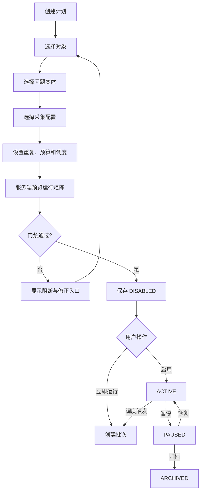

### 1.1 Plan 状态机

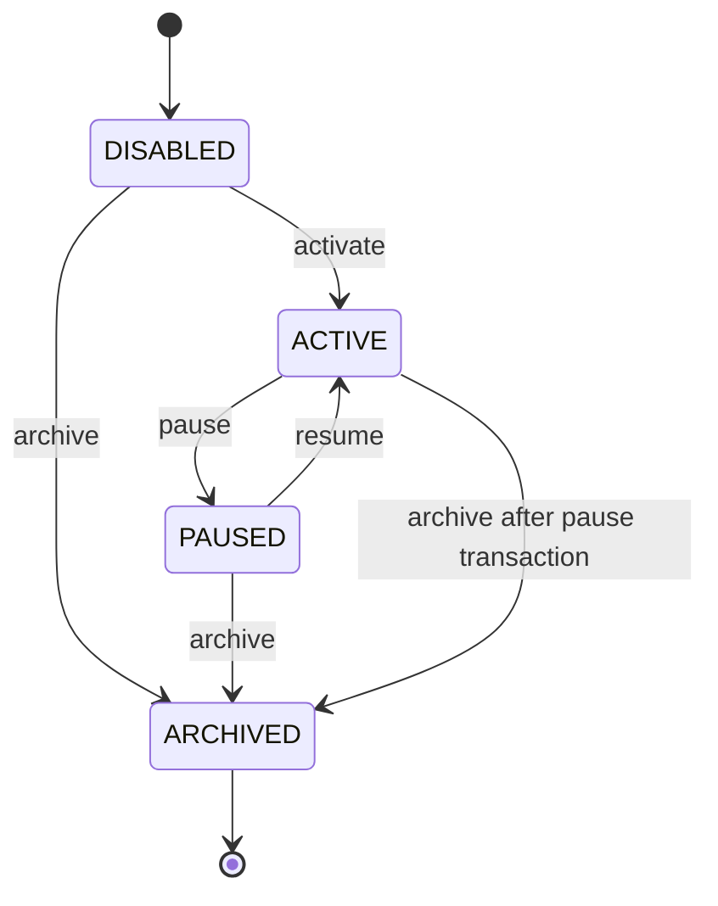

| 状态 | 主任务 | 可用动作 |
|---|---|---|
| DISABLED | 完成配置或启动 | UPDATE, PREVIEW, ACTIVATE, RUN_NOW, DELETE_IF_UNUSED |
| ACTIVE | 查看运行健康 | VIEW_RUNTIME, RUN_NOW, PAUSE, CREATE_REVISION |
| PAUSED | 恢复或归档 | UPDATE, PREVIEW, RESUME, RUN_NOW, ARCHIVE |
| ARCHIVED | 查看历史 | VIEW_HISTORY, COPY |

## 2. 批次创建流程

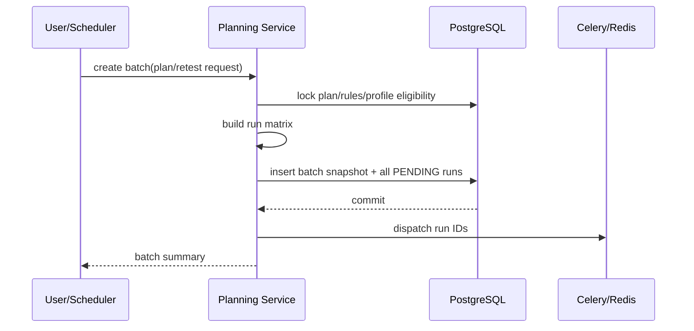

### 2.1 原子边界

- 计划资格检查、批次快照和全部运行记录在一个数据库事务中；
- 队列投递发生在提交之后；
- 投递失败不回滚业务记录，由补投递扫描处理；
- Redis 消息只携带 `run_id`；
- `requested_run_count` 与插入的运行数量必须一致。

## 3. Batch 状态机

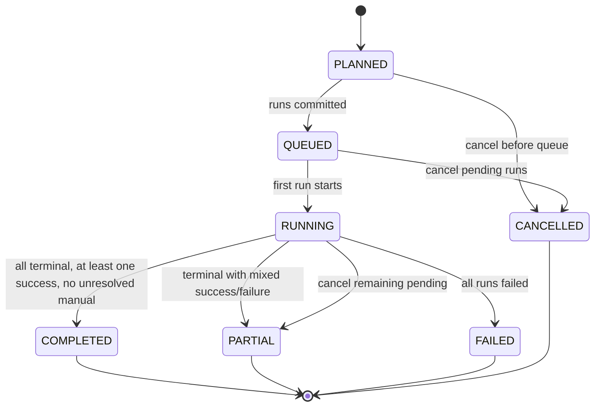

批次状态从运行集合确定性投影，不允许用户任意设置。

## 4. Run 状态机

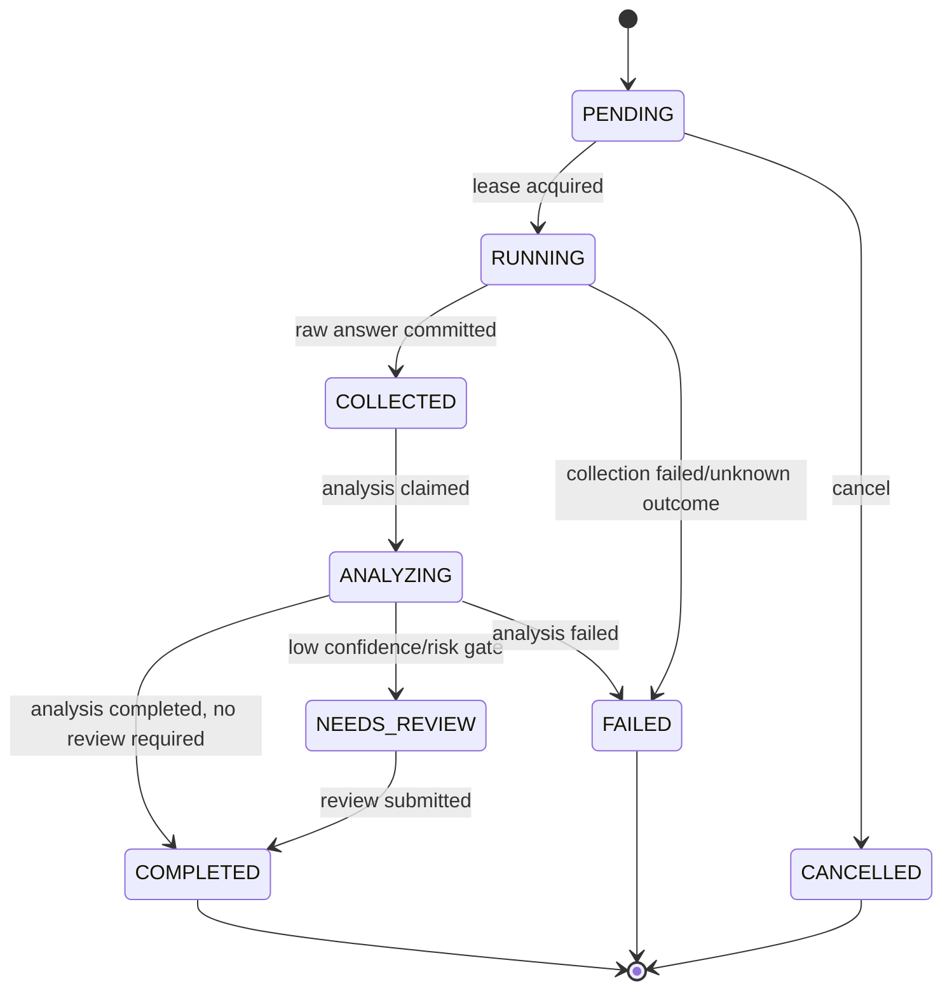

### 4.1 状态语义

| 状态 | 含义 |
|---|---|
| PENDING | 数据库存在，外部采集尚未开始 |
| RUNNING | Worker 获得租约，可能即将或已经发生外部调用 |
| COLLECTED | 原始答案和证据已原子保存 |
| ANALYZING | 分析任务持有租约 |
| NEEDS_REVIEW | 原始答案和分析存在，但需人工复核后进入业务指标 |
| COMPLETED | 已有可用于当前口径的成功分析/复核 |
| FAILED | 该尝试失败，保存稳定错误码和阶段 |
| CANCELLED | 外部调用开始前被取消 |

### 4.2 重试规则

- PENDING 消息丢失：允许补投递同一 run ID；
- RUNNING 租约过期且未确认外部调用：只有在持久化阶段标记证明“未发送”时才允许回到 PENDING；
- 外部请求已发送或状态未知：原 run 标记 FAILED/UNKNOWN_OUTCOME；
- 用户重试：创建 `attempt_no + 1` 的新 run，复制原输入快照；
- 原尝试不修改、不删除；
- 迟到结果必须检查当前状态和 lease token，不能覆盖终态。

## 5. 人工采集流程

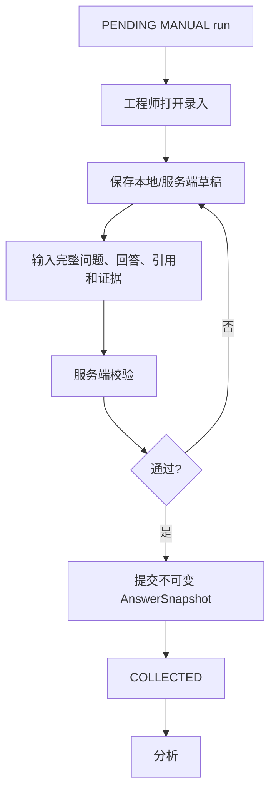

人工草稿只属于 MANUAL 模式，并应有独立 `draft_revision` 或临时编辑上下文。正式提交后不得再次编辑；错误通过新尝试或复核修正分析，不修改证据。

## 6. API 采集流程

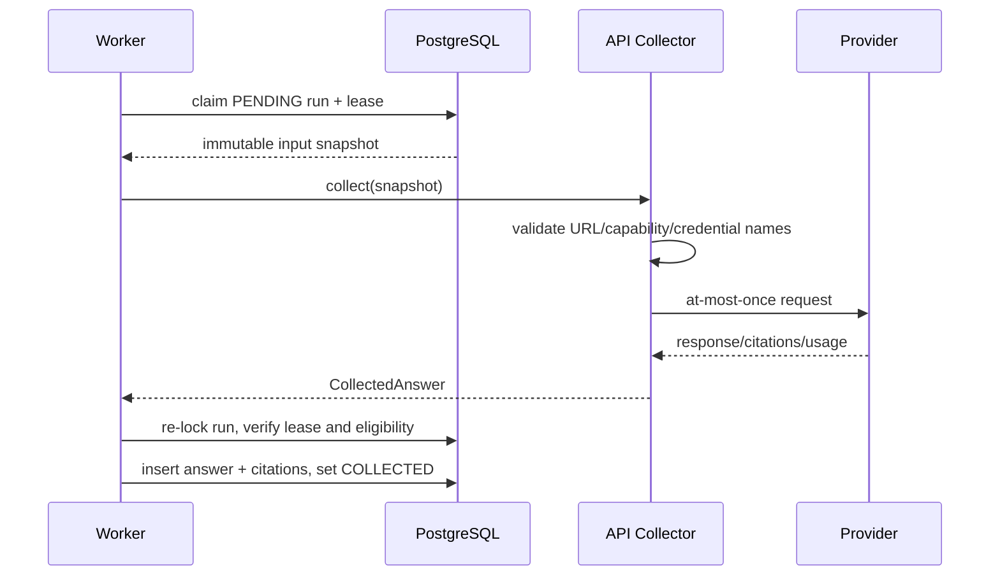

失败分类至少包括：

- `COLLECTOR_CONFIGURATION_INVALID`
- `COLLECTOR_DISABLED`
- `PROVIDER_AUTH_FAILED`
- `PROVIDER_RATE_LIMITED`
- `PROVIDER_TIMEOUT`
- `PROVIDER_UNAVAILABLE`
- `PROVIDER_RESPONSE_INVALID`
- `PROVIDER_RESPONSE_TOO_LARGE`
- `COLLECTOR_UNKNOWN_OUTCOME`
- `DATA_CLASSIFICATION_FORBIDDEN`

## 7. 浏览器采集流程

浏览器采集只能在 ADR-005 的试点门禁后启用。

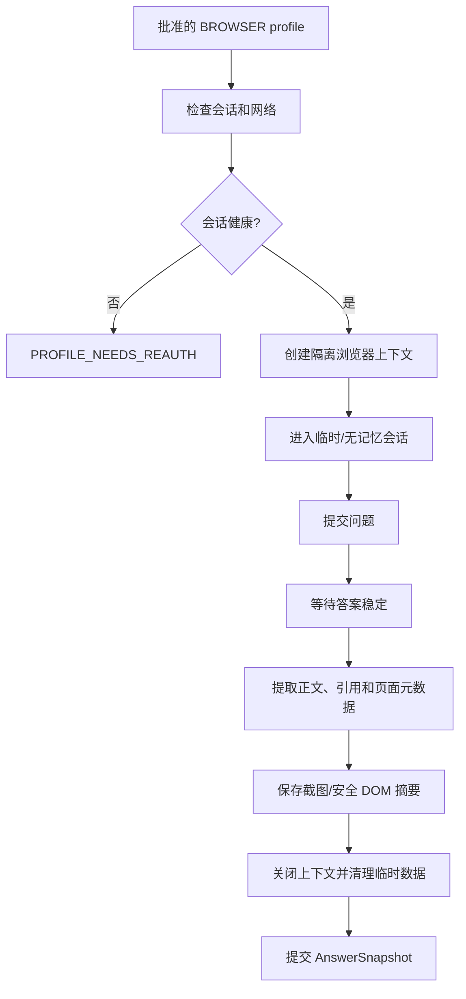

关键规则：

- 不绕过验证码、访问控制或平台安全限制；
- 不在 CI 访问真实第三方平台；
- Cookie、localStorage 和登录资料不进入日志、审计或 answer snapshot；
- 使用独立运行账号和最小权限；
- 适配器必须有 kill switch；
- 平台 DOM 变化导致提取不确定时明确失败，不保存空成功。

## 8. 分析流程

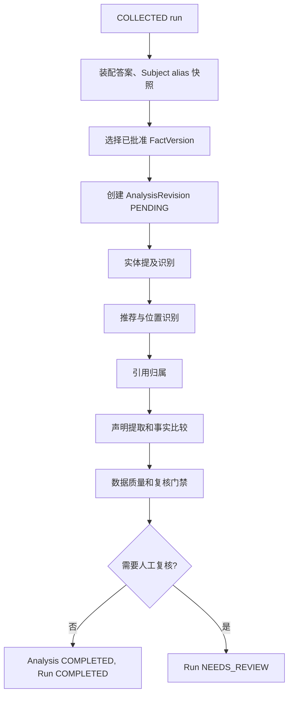

### 8.1 分析复跑

- 分析规则、alias 或事实版本变化后可以显式重跑；
- 重跑创建新 revision；
- 历史指标默认使用当前成功 revision 或最新人工复核；
- 报告必须记录实际使用的 revision；
- 大规模重分析需要批次、限速和独立运维入口，不允许请求线程同步扫描全部历史。

## 9. 人工复核流程

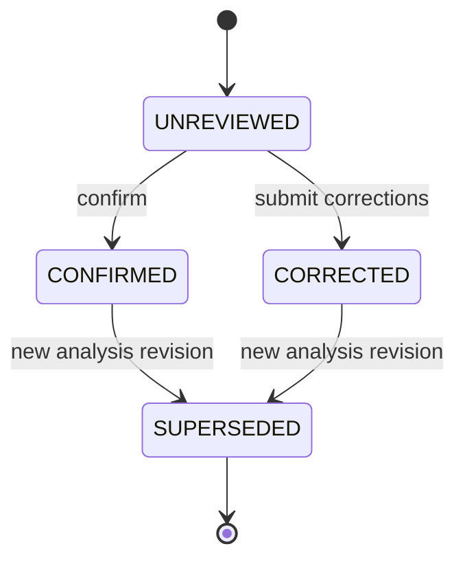

需要复核的典型条件：

- 推荐判断置信度低；
- 同一别名命中多个对象；
- 声明涉及关键替代关系或安全边界；
- 严重错误候选；
- 回答格式异常；
- 引用解析与文本不一致；
- 分析器版本发生重大变化。

## 10. 指标生成流程

```text
选择筛选与时间窗口
→ 查询候选运行
→ 应用可比性维度
→ 应用 MetricEligibility
→ 选择当前有效分析/复核
→ 计算分子、分母和样本状态
→ 生成趋势、SOV、引用、风险和数据质量
→ 返回明细下钻 token/filters
```

不把汇总指标保存为可编辑业务表。性能需要时可增加可重建物化视图，但原始运行和分析仍是唯一事实源。

## 11. 机会状态机

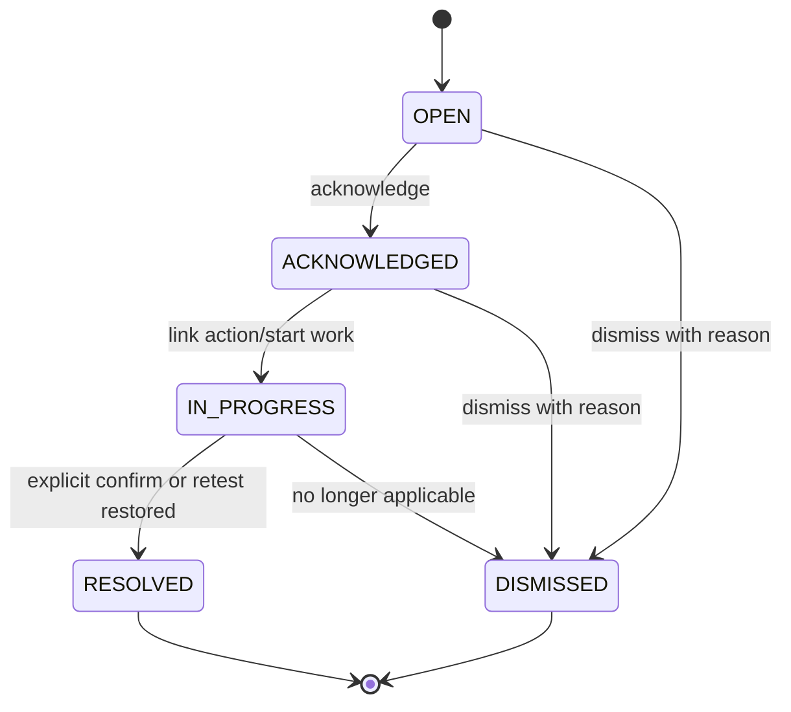

### 11.1 机会触发流程

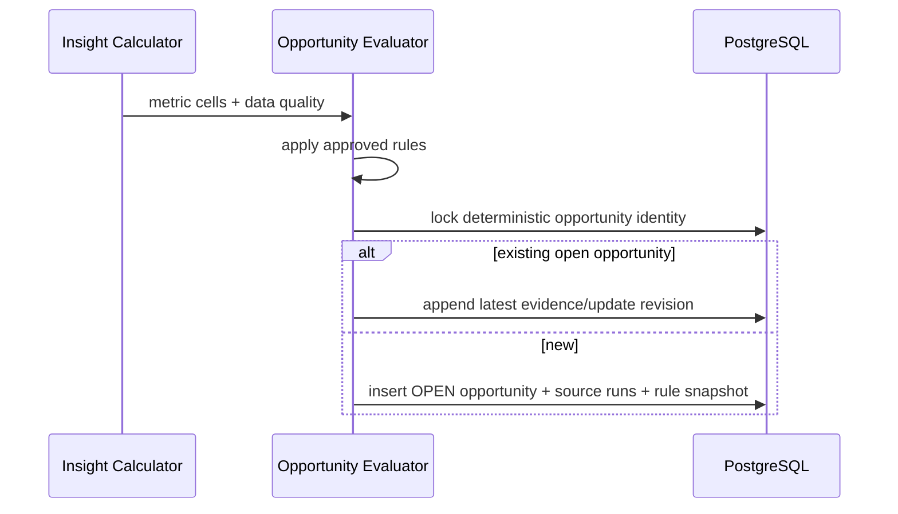

### 11.2 机会行动

| 机会类型 | 建议动作 |
|---|---|
| CRITICAL_FACT_ERROR | 打开产品事实工作区并创建修订 |
| TOPIC_COVERAGE_GAP | 创建普通内容任务 |
| OWN_CITATION_LOST | 检查发布成果或创建修复任务 |
| COMPETITOR_SURGE | 创建竞品比较或渠道内容任务 |
| VISIBILITY_DROP | 先补充观测，再决定内容行动 |
| DATA_QUALITY_PROBLEM | 修复计划/profile/采集器，不创建内容 |
| RUN_FAILURE | 运行治理和重新尝试 |

## 12. 复测流程

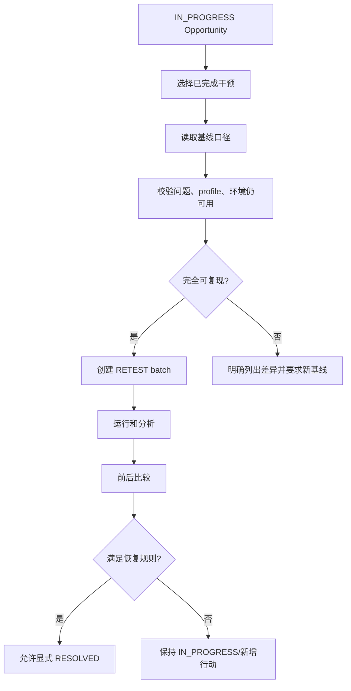

严格同口径至少包括：

- 相同问题变体版本；
- 相同观测面和采集方式；
- 相同语言、地区和登录状态；
- 相同重复次数或明确归一；
- 相同指标资格规则；
- 可识别的模型/产品版本差异。

模型版本或平台产品不可控变化必须在比较中显式展示。

## 13. 调度与暂停

- Scheduler 只为 ACTIVE 计划创建批次；
- 同一计划同一调度窗口必须有幂等 identity；
- 计划暂停后不再创建新批次，不取消已存在批次；
- 全局 kill switch 可以阻止 API/BROWSER 新外部调用，但保留人工录入和只读能力；
- 运维停止 Scheduler 不得修改数据库运行状态；
- 恢复后通过数据库扫描补投递 PENDING run。
