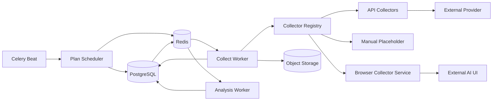

# PartSignal GEO Worker 与采集器架构

| 项目 | 内容 |
|---|---|
| 文档版本 | V1.0 |
| 文档状态 | 目标设计 |
| 执行原则 | PostgreSQL 权威、Redis 仅传 ID、外部调用 at-most-once、失败显式 |

## 1. 目标

采集框架需要同时支持：

- 人工录入；
- OpenAI-compatible 或其他批准 API；
- 后续真实产品界面浏览器采集；
- 可调度、重复采样；
- 费用和速率控制；
- 可靠失败分类；
- 不因 Worker 丢失而重复发送外部请求；
- 原始结果和分析任务分离。

## 2. 组件



## 3. Collector Registry

Collector 通过稳定 `adapter_key` 注册：

```text
manual
openai-compatible-chat
provider-x-search-api
browser-chatgpt
browser-deepseek
...
```

注册表负责：

- adapter 是否存在；
- 支持的 collection mode；
- 支持的能力；
- 需要哪些 profile 配置；
- 是否允许在当前环境启用；
- 是否需要合规批准；
- 费用估算能力；
- collector 版本。

未知 adapter 必须明确失败，不能回退到 generic collector。

## 4. Collector 接口

建议数据结构：

```python
@dataclass(frozen=True)
class CollectionRequest:
    run_id: UUID
    prompt_text: str
    engine_surface: EngineSurfaceSnapshot
    profile: CollectionProfileSnapshot
    subject_snapshot: tuple[SubjectSnapshot, ...]
    timeout_seconds: int
    max_response_bytes: int
    budget_remaining: Decimal | None

@dataclass(frozen=True)
class CollectedCitation:
    url: str
    title: str | None
    position: int
    extraction_source: Literal['STRUCTURED', 'DOM', 'TEXT', 'MANUAL']

@dataclass(frozen=True)
class CollectedAnswer:
    answer_text: str
    answer_format: Literal['TEXT', 'MARKDOWN', 'HTML_TEXT']
    source_product: str | None
    source_model: str | None
    source_version: str | None
    web_search_observed: bool | None
    citations: tuple[CollectedCitation, ...]
    provider_request_id: str | None
    usage: Usage | None
    cost: Money | None
    duration_ms: int
    raw_payload_summary: dict[str, JsonSafeValue]
    screenshot_bytes: bytes | None
    raw_payload_bytes: bytes | None
```

Collector 不接收 ORM Session，也不提交事务。

## 5. Profile 校验

Collector 必须提供纯配置校验：

```python
validate_profile(profile_snapshot) -> ValidationResult
```

校验包括：

- collection mode 匹配；
- adapter 版本；
- channel/model 资格；
- URL 和网络策略；
- 搜索和引用能力；
- language/region 支持；
- 登录状态；
- 超时和响应上限；
- 合规状态；
- 生产开关。

Plan preview 和 Worker 使用同一校验逻辑，但 Worker 在实际执行前必须重新校验当前外部凭据和运行开关。

## 6. 调度器

### 6.1 扫描

Scheduler 按固定频率扫描 ACTIVE CRON 计划，计算应触发窗口。

每个窗口构造：

```text
schedule_identity = sha256(plan_id + scheduled_at + plan_revision)
```

数据库唯一约束保证同一窗口只创建一个批次。

### 6.2 时区和错过窗口

- Cron 使用计划 IANA timezone；
- 数据库保存 UTC 计划时间；
- Scheduler 重启后是否补跑由 `missed_run_policy` 决定；核心版建议 `SKIP | RUN_LATEST`；
- 不无限补跑全部历史窗口；
- DST 重复/缺失时间由 cron 库和测试固定语义。

### 6.3 批次大小

大矩阵应分批插入，但对用户保持一个 batch identity。创建过程必须保证：

- 要么全部运行存在；
- 要么事务失败无部分批次；
- 或使用显式 `BUILDING` 内部状态和恢复命令。核心版优先单事务支持 1,000 运行。

## 7. Dispatch 与补投递

### 7.1 首次投递

批次提交后，按限批方式投递每个 PENDING run ID。

### 7.2 补投递

Beat 扫描：

- `status=PENDING`；
- `last_dispatch_attempt_at` 为空或超过阈值；
- 未取消；
- profile/全局开关允许。

补投递只增加消息和 dispatch metadata，不修改业务输入。

### 7.3 消息风暴保护

- 每轮 batch size；
- 每 run 最小投递间隔；
- Scheduler/redispatch 指标；
- Redis DB 必须独占；
- 消息重复由数据库状态幂等处理。

## 8. Run claim 和租约

Worker 收到 run ID 后：

1. 开启事务；
2. `SELECT ... FOR UPDATE`；
3. 只有 PENDING 可 claim；
4. 检查 profile 和开关；
5. 写 RUNNING、lease token、lease expiry、started_at；
6. 写 `external_call_state=NOT_STARTED`；
7. 提交；
8. 释放数据库连接；
9. 执行外部调用。

外部调用前尽可能晚地将 `external_call_state=SENT` 持久化。对于单请求 transport，可以在发送前用短事务更新 SENT，再发送。这样 Worker 丢失后可区分：

- NOT_STARTED：允许安全恢复；
- SENT/UNKNOWN：禁止自动重发；
- COMPLETED：等待结果提交或按迟到结果规则处理。

## 9. At-most-once 外部调用

### 9.1 原则

一个 run attempt 最多向外部 provider 发送一次业务请求。

允许在发送前：

- 尝试多个已批准 DNS 地址；
- 获取连接；
- 验证 TCP peer；
- 建立 TLS；

一旦发送任何请求字节：

- 不自动换地址；
- 不自动 provider retry；
- 不自动创建第二 attempt；
- 超时或 Worker 丢失标记 UNKNOWN_OUTCOME；
- 由用户或规则显式创建新 attempt。

### 9.2 Provider 429

即使 provider 明确 429，也不在同一 attempt 内自动重试。记录 `PROVIDER_RATE_LIMITED`、可选 retry-after，并允许用户/调度策略稍后创建新 attempt。

## 10. API Collector

### 10.1 复用边界

可复用现有：

- `CredentialCipher`；
- AIChannel/AIModel；
- Header 校验；
- pinned HTTP transport；
- SSRF、TLS、peer 和响应大小防线。

不得复用：

- 内容生成的严格 `GeneratedDraft` 四字段解析；
- 内容任务和 FactVersion 生成消息；
- GenerationJob 状态表。

### 10.2 OpenAI-compatible 初始 adapter

请求建议：

```json
{
  "model": "configured-model",
  "messages": [{"role": "user", "content": "<prompt>"}],
  "stream": false,
  "...configured_parameters": "..."
}
```

不自动添加品牌背景，以免污染非点名可见度。任何 system message 必须是 profile 明确配置、可审计并进入 snapshot 的监测设置；核心版默认无 system message。

### 10.3 搜索和引用

Generic Chat Completions 不保证提供引用。Adapter 必须：

- 只在结构化 provider 字段真实存在时提取；
- 或对明确文本引用做受控解析并标注 `TEXT`；
- 不从分析模型推测引用；
- `web_search_observed` 未知时保存 null；
- profile 声称 REQUIRED 但响应无法证明搜索时可标记数据质量问题或失败，规则由 adapter 固定。

## 11. Manual Collector

MANUAL 不由 Worker 调用外部服务。Batch 创建时 run 保持 PENDING 并显示主任务 `ENTER_MANUAL_OBSERVATION`。

人工草稿：

- 可以存数据库临时表或 run draft 字段；
- 不进入 AnswerSnapshot；
- 使用 revision；
- 提交时一次性冻结 answer + citations + evidence；
- 提交后触发分析任务。

人工模式 profile 定义是否强制截图、引用和来源模型字段。

## 12. Browser Collector

### 12.1 独立执行面

浏览器 collector 推荐作为独立容器或受控主机代理，不与普通 API/Worker 镜像共享完整浏览器依赖。

### 12.2 Adapter 接口

浏览器 adapter 除通用 collect 外需要：

- `session_health()`；
- `login_probe()`；
- `open_temporary_chat()`；
- `submit_prompt()`；
- `wait_for_stable_answer()`；
- `extract_answer()`；
- `extract_citations()`；
- `capture_evidence()`；
- `cleanup_context()`。

### 12.3 稳定等待

不能仅使用固定 sleep。至少组合：

- 页面指定完成信号；
- 文本长度/DOM 在一段时间内不变化；
- loading indicator 消失；
- 最大超时；
- 截图前二次确认。

### 12.4 会话

- 使用专用测试账号；
- profile 只保存加密会话引用和健康状态；
- Cookie/profile bytes 存受控加密位置；
- 不进入数据库普通 JSON、对象存储 public bucket、日志和截图；
- 过期返回 `PROFILE_NEEDS_REAUTH`；
- 不自动输入账号密码绕过 MFA/验证码。

## 13. Analysis Worker

Collection 成功后投递 `run_id` 给 analysis task。

Analysis claim 与 collection 类似，但不改变外部调用 at-most-once 语义。若使用外部分析模型，每个 AnalysisRevision 也采用独立 at-most-once request。

处理步骤：

1. 锁 run，确认 COLLECTED/可重分析；
2. 创建 PENDING AnalysisRevision；
3. 装配 answer、subjects aliases、fact version；
4. 在事务外分析；
5. 重新锁 revision/run；
6. 写 normalized child rows；
7. 确定 review reasons；
8. 更新 run 到 COMPLETED 或 NEEDS_REVIEW；
9. 投递 opportunity evaluation（可批量）。

## 14. Batch 状态更新

不要在每个 run 完成时全表扫描大批次。可采用：

- 事务内增量计数 + 定期校验；或
- 状态更新后投递 batch ID，由服务聚合查询；
- 小规模初期直接使用索引聚合。

无论优化方式，Batch 状态必须可从 runs 重建，计数缓存不能成为不可恢复事实。

## 15. 费用和预算

### 15.1 预估

Plan preview 调用 Collector `estimate`：

- 返回 known/unknown；
- 按 profile × prompt × repeat 聚合；
- 显示估算覆盖率；
- 不能把未知费用当 0。

### 15.2 运行门禁

- Batch 保存预算上限；
- Worker 在 claim 前计算已报告/已预留费用；
- 超过上限的未开始 run 标记 `BUDGET_EXCEEDED` 或保持暂停，具体状态在任务中固定；
- 已发送请求不因预算变化取消；
- 并发预算使用行锁或原子预留，不能只在前端判断。

## 16. 错误模型

CollectorError 至少包含：

```python
code: str
stage: Literal['CONFIGURATION', 'CONNECT', 'SEND', 'RECEIVE', 'PARSE', 'EVIDENCE']
retryability: Literal['SAFE_BEFORE_SEND', 'NEW_ATTEMPT_ONLY', 'NOT_RETRYABLE']
message: str  # 非敏感
provider_status: int | None
retry_after_seconds: int | None
external_call_state: Literal['NOT_STARTED', 'SENT', 'UNKNOWN', 'COMPLETED']
```

服务日志和 API 只暴露批准字段。

## 17. 测试替身

必须建设明确的 fake collector/provider：

- 本地固定 HTTP 地址；
- 可配置成功、429、超时、断连、重定向、超限、非法 JSON；
- 可返回引用、搜索状态、模型版本、usage 和 cost；
- 记录调用次数和请求哈希；
- 能证明每 attempt 至多一次调用；
- 不使用真实云端作为 CI 门禁。

Browser adapter 使用本地静态测试站和受控 DOM 变化，不访问真实平台。

## 18. 运维操作

需要 CLI/管理命令：

```text
geo-plan-scan --dry-run
geo-redispatch-pending
geo-fail-expired-leases
geo-profile-health
geo-reanalyze --filters ...
geo-recompute-batch <id>
geo-evaluate-opportunities --date-from ...
```

命令必须支持 dry-run、限批、稳定输出和非零失败码，不允许批量静默改状态。
