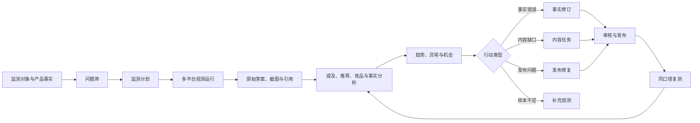
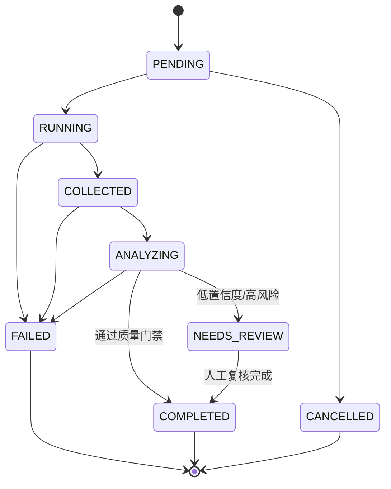

# PartSignal GEO 监测核心版产品需求文档（PRD）

| 项目 | 内容 |
|---|---|
| 文档版本 | V1.0 |
| 文档状态 | 产品评审稿 |
| 编制日期 | 2026-10-01 |
| 产品形态 | 公司内部单租户系统 |
| 核心定位 | 电子元器件与国产替代业务的 GEO 情报与运营平台 |
| 关联系统 | PartSignal 产品事实、内容生产、审核、发布、GEO 观测与审计模块 |

---

## 1. 文档目的

本文定义 PartSignal GEO 监测核心版的产品目标、用户需求、页面结构、功能范围、领域实体、观测流程、指标口径、权限边界、非功能要求和验收标准，用于指导产品评审、交互设计、数据库设计、接口设计、研发拆解和上线验收。

本版本不推翻 PartSignal 现有的产品事实、内容生成、人工审核、人工发布登记和 GEO 人工观测能力，而是在其基础上补齐：

1. GEO 监测对象与竞品管理；
2. 问题库和问题变体；
3. 多平台、可调度、可重复的观测任务；
4. 原始答案、引用和截图证据；
5. 品牌、产品、竞品、推荐和事实准确性分析；
6. 可审计指标、趋势、异常和机会；
7. 从监测异常到事实、内容、发布和复测的运营闭环。

---

## 2. 产品定义

### 2.1 产品定位

PartSignal 是面向电子元器件与国产替代业务的内部 GEO 情报与运营平台，用于持续监测主流 AI 平台如何发现、描述、引用、比较和推荐公司产品，并把异常与机会转化为事实修正、内容建设、渠道发布和复测任务。

产品核心表述：

> 监测 AI 如何认识公司的产品，并持续改善这种认识。

### 2.2 核心业务闭环



### 2.3 产品原则

1. **证据优先**：任何指标和结论都必须能回到原始问题、答案、引用、截图和采集环境。
2. **权威事实优先**：事实准确性判断只使用经过批准的产品事实版本，不使用当前可编辑草稿。
3. **监测与分析分离**：采集原始结果与后续机器分析、人工修正分别保存。
4. **人工可复核**：机器判断可以触发人工复核，但不得覆盖原始答案或证据。
5. **口径可解释**：不默认提供不可拆解的统一 GEO 总分；所有比率必须展示分子、分母和样本量。
6. **同口径可比较**：不同采集方式、地区、语言、登录状态或问题版本的结果不得静默混合。
7. **运营可闭环**：异常必须能够转化为明确任务，并通过后续观测验证变化。
8. **不承诺因果**：系统展示优化动作前后的相关变化，不把一次内容发布直接解释为指标变化的唯一原因。

---

## 3. 背景与现状

### 3.1 已有能力

PartSignal 已经具备以下业务基础：

- 产品和不可变事实版本；
- 事实分级与审核；
- 多平台内容任务和内容版本；
- AI/人工首稿、修订和审核；
- 人工发布工作、首次核验和只读发布成果；
- 发布后问题和修复任务；
- 人工 GEO 文章搜索观测；
- 文件证据、账号权限和审计记录。

### 3.2 当前缺口

当前 GEO 能力主要依赖人工站外搜索和逐篇登记，尚不能系统回答：

- 某产品在多个 AI 平台上的自然可见率、推荐率和稳定性；
- 同一问题下公司产品与竞品的声量差异；
- AI 实际引用了哪些域名和页面；
- 哪些错误产品声明在重复出现；
- 某个问题、平台或产品的指标是否正在下降；
- 已完成的内容或发布动作是否伴随持续变化；
- 监测结果是否具备足够样本和可比条件。

### 3.3 核心版要解决的问题

核心版必须让公司能够持续回答：

1. 公司品牌和产品有没有被 AI 提及；
2. 是否在非点名问题中自然出现；
3. 是否被明确推荐，推荐位置如何；
4. 哪些竞品同时出现或表现更好；
5. AI 引用了哪些自有或第三方信源；
6. 产品参数、替代关系和应用边界是否准确；
7. 哪些问题、平台或产品存在覆盖缺口；
8. 应创建什么事实、内容、发布或复测任务；
9. 采取行动后，同口径结果是否发生持续变化。

---

## 4. 产品目标与非目标

### 4.1 产品目标

| 编号 | 目标 |
|---|---|
| G1 | 建立可持续运行的多平台 GEO 观测能力，而不是一次性检测工具。 |
| G2 | 保存完整原始证据，使任何指标、异常和人工结论都可追溯。 |
| G3 | 在品牌、产品型号、参考型号和竞品层级进行可见度与推荐比较。 |
| G4 | 对产品参数、替代关系、封装、认证、应用边界等关键声明进行事实核验。 |
| G5 | 将监测异常转化为 PartSignal 现有事实、内容、发布和修复工作流。 |
| G6 | 通过重复观测和同口径复测，验证优化动作前后的变化。 |
| G7 | 为市场、产品、内容和管理人员提供统一、可解释的内部 GEO 情报。 |

### 4.2 非目标

核心版不包含：

- SaaS 多租户、套餐、计费和客户门户；
- 代理商白标和外部匿名分享；
- 大规模跨平台自动发布；
- 对所有 AI 平台无授权的自动化采集；
- 完整传统 SEO 套件；
- 销售额、收入或 ROI 的自动因果归因；
- 不透明的统一 GEO 总分；
- 自动修改权威事实、自动批准内容或自动关闭风险；
- 保证某产品在 AI 中获得固定排名或推荐。

---

## 5. 用户与权限

### 5.1 用户角色

系统继续沿用现有账号类型，不为核心版新增复杂角色系统。

| 账号类型 | 业务用户 | 主要能力 |
|---|---|---|
| ADMIN | 系统管理员、GEO 负责人 | 配置监测平台、采集方式、竞品、规则、阈值和计划；拥有工程师全部能力。 |
| ENGINEER | GEO 运营、市场、产品、FAE、内容人员 | 管理问题库、执行观测、人工复核、查看洞察、处理机会和创建业务任务。 |

### 5.2 典型用户需求

| 用户 | 需要回答的问题 |
|---|---|
| GEO 运营 | 哪些问题、平台和产品表现下降？需要做什么？ |
| 产品/FAE | AI 对产品参数和替代边界的描述是否正确？ |
| 内容运营 | 哪些问题缺少内容，应该在哪些渠道补充？ |
| 市场负责人 | 公司与竞品的可见率、推荐率和引用份额如何变化？ |
| 管理层 | 重点产品是否得到覆盖，异常是否得到处理，行动后是否改善？ |
| 管理员 | 监测计划是否正常运行，平台、凭据、浏览器会话和预算是否可控？ |

---

## 6. 核心版范围

### 6.1 P0 必须交付

1. 公司品牌、产品、竞品、参考型号和别名的监测登记；
2. 问题主题、问题变体、意图、点名属性、语言、地区和优先级；
3. GEO 观测平台与采集方式配置；
4. 手动、定时和立即执行的监测计划；
5. 同问题重复采样；
6. 批次、单次运行和重试记录；
7. 原始答案、截图、引用、采集环境和分析版本；
8. 品牌/产品/竞品提及和推荐判断；
9. URL、域名和来源类型分析；
10. 关键产品声明准确性评估；
11. 可见率、推荐率、首位推荐率、SOV、引用和准确性指标；
12. 监测总览、运行中心、观测详情和洞察页面；
13. 规则驱动的告警与机会；
14. 从机会创建内容任务、事实修订入口、发布修复或补充观测；
15. 周报/打印报告和 CSV 导出；
16. 权限、审计、敏感配置保护和数据质量提示。

### 6.2 P1 后续增强

- query fan-out 搜索词采集；
- 官网 robots、sitemap、schema、llms.txt 等 GEO 技术体检；
- AI crawler 日志分析；
- 自动建议问题库；
- 多语言和多地区的大规模矩阵运行；
- 统计显著性和对照实验；
- AI 引荐流量和外部 BI 数据；
- MCP/开放 API；
- 高级自定义报告和管理层订阅推送。

### 6.3 首发采集策略

产品层必须支持三种采集模式：

| 模式 | 说明 | 核心版要求 |
|---|---|---|
| MANUAL | 人工在目标平台提问并登记答案、截图和引用 | 必须支持，作为全部平台的保底方式 |
| API | 通过经批准的模型或搜索 API 批量运行 | 必须支持至少两类自动化观测面 |
| BROWSER | 通过真实产品界面采集可见答案和引用 | 适配器接口必须具备；首发至少完成一个合规批准的平台试点，或明确处于受控试运行状态 |

任何浏览器自动化必须经过公司合规确认，并只使用已获授权的账号、会话和网络环境。未获批准的平台只能使用人工观测。

---

## 7. 核心业务概念

| 概念 | 定义 |
|---|---|
| 监测对象 | 公司品牌、公司产品、竞品品牌、竞品产品或参考型号。 |
| 问题主题 | 用户真实意图的稳定语义对象，例如“某进口型号有哪些国产替代”。 |
| 问题变体 | 同一主题下实际发送给 AI 平台的具体问法。 |
| GEO 平台/观测面 | 被监测的 AI 产品或回答界面，例如豆包、DeepSeek、元宝、ChatGPT。 |
| 采集方式 | MANUAL、API 或 BROWSER。 |
| 监测计划 | 问题、产品、平台、重复次数、时间表和预算的组合配置。 |
| 观测批次 | 某个计划在某次计划时间或手动触发时形成的一组运行。 |
| 观测运行 | 一个问题变体 × 一个观测面 × 一次重复采样。 |
| 原始答案快照 | 不可变的实际问题、回答、截图、引用和采集环境。 |
| 分析结果 | 从原始答案中提取的提及、推荐、排名、引用和事实判断。 |
| 人工复核 | 对机器分析进行确认或修正的追加式记录。 |
| 有效结果 | 机器分析通过质量门禁，或已经完成人工复核的结果。 |
| 机会 | 根据明确规则从观测结果中生成的可行动事项。 |
| 复测 | 在行动完成后，使用相同或明确等价的观测条件重新运行。 |

### 7.1 GEO 平台与内容发布平台必须分离

`GeoEngineSurface` 表示被监测的 AI 产品或回答界面；现有 `PlatformProfile` 表示内容发布平台。二者不能共用实体或状态，以避免把“豆包/DeepSeek 观测面”和“知乎/行业网站发布平台”混为同一概念。

---

## 8. 信息架构与页面结构

### 8.1 导航结构

```text
GEO 监测
├─ 总览
├─ 问题库
├─ 监测计划
├─ 运行中心
├─ 观测记录
├─ 分析洞察
├─ 机会与告警
└─ 报告

配置中心（管理员）
├─ GEO 平台与采集方式
├─ 竞品与别名
└─ GEO 规则与阈值
```

### 8.2 页面清单

| 页面 | 建议路由 | 主要目标 |
|---|---|---|
| GEO 总览 | `/geo` | 查看重点指标、趋势、异常、数据质量和待处理事项。 |
| 问题库 | `/geo/topics` | 管理问题主题、变体、意图、优先级和适用对象。 |
| 监测计划 | `/geo/plans` | 配置问题 × 平台 × 重复次数 × 时间表。 |
| 批次列表 | `/geo/runs` | 查看运行状态、进度、失败、成本和历史。 |
| 批次详情 | `/geo/runs/{batchId}` | 查看问题与平台矩阵、单次运行、失败和重试。 |
| 观测详情 | `/geo/observations/{runId}` | 查看原始答案、引用、截图、提及、推荐和事实判断。 |
| 分析洞察 | `/geo/insights` | 按产品、平台、问题、竞品、引用和准确性分析。 |
| 机会与告警 | `/geo/opportunities` | 处理异常、创建任务、跟踪状态和复测。 |
| 报告 | `/geo/reports` | 生成内部周报、筛选报告、打印/PDF 和 CSV。 |
| GEO 平台配置 | `/configuration/geo-surfaces` | 管理观测面、采集方式、凭据、会话和能力。 |
| 竞品与别名 | `/configuration/geo-entities` | 管理竞品、参考型号、别名和自有域名。 |
| 规则与阈值 | `/configuration/geo-rules` | 管理异常规则、样本门槛和告警阈值。 |

---

## 9. 页面需求

## 9.1 GEO 总览

### 目标

让用户在一个页面判断“当前表现如何、哪里发生变化、哪里需要处理、数据是否可信”。

### 全局筛选

- 时间范围；
- 公司产品；
- 问题主题/标签；
- GEO 平台；
- 采集方式；
- 语言和地区；
- 点名问题/非点名问题；
- 是否只看人工复核结果。

所有筛选保存在 URL，并同时作用于卡片、图表、排行和异常列表。

### 页面内容

1. **运行覆盖卡片**
   - 计划运行数；
   - 已完成数；
   - 成功率；
   - 待人工复核数；
   - 数据质量异常数。

2. **核心指标卡片**
   - 非点名自然可见率；
   - 推荐率；
   - 首位推荐率；
   - 竞品声量份额；
   - 自有信源覆盖率；
   - 事实准确率；
   - 严重错误运行率。

3. **趋势图**
   - 可见率、推荐率、准确率；
   - 分子、分母和样本量 Tooltip；
   - 当前周期与紧邻等长前周期比较。

4. **平台 × 产品矩阵**
   - 单元格显示可见率或推荐率；
   - 样本不足时显示“样本不足”，不得显示为 0。

5. **竞品比较**
   - 我方与受监测竞品的提及 SOV 和推荐 SOV；
   - 支持按产品和问题筛选。

6. **引用信源**
   - 自有域名、竞品域名、行业媒体、论坛、经销商和其他来源；
   - 显示引用次数、覆盖运行数和变化。

7. **高优先级异常与机会**
   - 严重事实错误；
   - 可见率下降；
   - 竞品突增；
   - 重要问题长期未覆盖；
   - 监测失败或样本不足。

8. **数据质量区域**
   - 失败运行；
   - 无原始证据；
   - 采集环境变化；
   - 分析版本混用；
   - 未完成复核。

### 关键要求

- 所有指标均可点击进入对应运行明细；
- 不显示无来源的“提升建议”；
- 不把 API 和真实产品界面结果静默合并；
- 不把点名问题和非点名问题默认合并。

---

## 9.2 问题库

### 列表字段

- 标准问题；
- 意图类型；
- 点名属性；
- 关联产品；
- 参考型号；
- 用户角色；
- 语言/地区；
- 优先级；
- 问题变体数；
- 活跃计划数；
- 最近运行时间；
- 当前状态。

### 问题主题字段

| 字段 | 说明 |
|---|---|
| canonical_question | 稳定标准问题 |
| intent_type | BRAND、PRODUCT、REPLACEMENT、COMPARISON、APPLICATION、TROUBLESHOOTING、PURCHASE |
| naming_mode | UNBRANDED、BRANDED、MIXED |
| persona | 研发、采购、FAE、学生、终端客户等 |
| language | 问题语言 |
| region | 目标地区 |
| priority | P0、P1、P2 |
| product_ids | 关联公司产品 |
| reference_entity_ids | 参考型号或竞品 |
| tags | 产品线、行业、专项等标签 |
| is_active | 是否可进入新监测计划 |
| revision | 乐观锁修订号 |

### 问题变体

GEO-201 / R1 冻结实际文本、BRANDED/UNBRANDED、语言、地区、CORE/STANDARD/EXPLORATORY 优先级及 revision；复用 QueryTopic。首次运行引用后只能停用，不能修改语义、删除或重新启用；新语义创建新变体，运行快照保持不可变。CRUD/工作区和真实运行接入分别属于后续任务。

每个主题至少一个变体。变体字段包括：

- 实际问题文本；
- 是否点名公司/产品；
- 语言；
- 变体标签；
- 启用状态；
- 创建来源：人工、导入或未来 AI 建议。

### 变体策略

监测计划可选择：

- `FIXED`：固定使用指定变体；
- `ALL`：全部变体分别运行；
- `ROTATE`：每个批次按确定性顺序选择一个变体。

同一批次的重复采样必须使用同一个变体，以确保稳定性指标可解释。

### 功能要求

- 新增、编辑、停用和受约束删除；
- CSV 导入与导出；
- 重复问题提示；
- 显示历史引用阻断；
- 问题或变体更新后不得改写历史运行快照。

---

## 9.3 监测计划

### 计划字段

| 字段 | 说明 |
|---|---|
| name | 计划名称 |
| product_ids | 监测产品范围 |
| topic_ids | 问题主题范围 |
| geo_surface_ids | 观测平台范围 |
| variant_policy | FIXED、ALL、ROTATE |
| repetitions | 同一问题和平台的重复采样次数，默认 3 |
| schedule_type | MANUAL、DAILY、WEEKLY、CRON |
| schedule | 运行时间或 Cron 表达式 |
| business_timezone | 业务时区，默认 Asia/Shanghai |
| collection_mode_policy | 使用平台默认方式或显式选择方式 |
| max_cost_per_batch | API 调用批次预算上限 |
| max_concurrency | 批次并发限制 |
| review_policy | 全量复核、风险复核或抽样复核 |
| is_enabled | 是否允许定时触发 |
| revision | 修订号 |

### 创建/编辑交互

系统必须在保存前展示：

- 本批次预计问题数；
- 平台数；
- 重复次数；
- 总运行数；
- 预计需要人工补录的运行数；
- 可估算的 API 成本区间；
- 未配置、未登录或不可用的平台；
- 可能导致不可比较的环境差异。

计算公式：

```text
预计运行数 = 实际问题变体数 × 平台数 × 重复次数
```

### 主要操作

- 保存；
- 启用/停用；
- 立即运行；
- 复制计划；
- 查看历史；
- 查看下次运行时间；
- 预览运行矩阵。

### 约束

- 同一个计划在同一计划时间只创建一个批次；
- 计划更新只影响未来批次；
- 批次必须冻结计划修订、问题变体、平台配置和分析规则版本；
- 超过预算上限时，未执行运行停止为 `BUDGET_BLOCKED`，不得静默继续消费。

---

## 9.4 运行中心

### 批次列表字段

- 批次 ID；
- 计划名称；
- 触发方式；
- 计划修订；
- 开始/结束时间；
- 总运行数；
- 完成/失败/取消/待人工数量；
- 已产生费用；
- 当前状态；
- 操作人或调度来源。

### 批次状态

```text
PLANNED
QUEUED
RUNNING
PARTIAL
COMPLETED
FAILED
CANCELLED
BUDGET_BLOCKED
```

- 所有运行完成且无失败：`COMPLETED`；
- 同时存在完成和失败/取消：`PARTIAL`；
- 所有可执行运行失败：`FAILED`；
- 用户取消仍保留已完成结果。

### 批次详情

使用“问题 × 平台”矩阵展示：

- 每个重复采样的状态；
- 提及、推荐和引用摘要；
- 运行耗时；
- 错误码；
- 是否需要人工复核；
- 是否存在严重事实错误。

### 运行状态

```text
PENDING
RUNNING
COLLECTED
ANALYZING
NEEDS_REVIEW
COMPLETED
FAILED
CANCELLED
BUDGET_BLOCKED
```

### 主要操作

- 取消尚未开始的运行；
- 对失败运行显式重试；
- 打开人工补录；
- 打开观测详情；
- 对满足条件的批次重新分析；
- 导出运行清单。

### 重试规则

- 重试必须创建新 attempt，不覆盖旧运行；
- 原运行保留错误、请求快照和已产生费用；
- 新 attempt 默认复用原始问题、平台、环境和分析版本；
- 用户显式改变条件时必须创建新批次，不得伪装为同一运行重试。

---

## 9.5 观测详情

### 页面结构

#### A. 运行上下文

- 问题主题；
- 实际问题文本；
- 目标产品；
- GEO 平台；
- 采集方式；
- 平台/模型版本；
- 语言、地区和登录状态；
- 是否发生联网搜索；
- 运行时间和耗时；
- 批次、重复序号和 attempt；
- 采集适配器版本；
- 分析规则和分析模型版本。

#### B. 原始证据

- 原始回答文本；
- 页面截图或上传证据；
- 原始引用列表；
- 可选原始 HTML/结构化响应；
- 原始搜索扩展词（平台可提供时）；
- 原始证据哈希。

原始证据一旦保存不可修改。人工补录的答案同样作为不可变原始快照保存。

#### C. 实体提及

- 公司品牌；
- 公司产品；
- 竞品品牌；
- 竞品产品；
- 参考型号；
- 首次出现位置；
- 上下文摘录；
- 检测方式和置信度。

#### D. 推荐与排序

- 是否属于推荐型回答；
- 是否推荐我方；
- 推荐产品列表；
- 我方位置；
- 推荐理由摘录；
- 是否存在明确负面结论。

#### E. 引用分析

- URL；
- 规范化域名；
- 引用位置；
- 来源类型；
- 自有/竞品/第三方；
- 是否关联现有 `PublishedArticle`；
- 页面标题和可访问性状态（未来增强）。

#### F. 事实准确性

按声明展示：

- 原文声明；
- 声明类型；
- 对应产品和事实版本；
- 判断：ACCURATE、PARTIAL、INCORRECT、UNVERIFIABLE、NOT_APPLICABLE；
- 严重程度；
- 依据事实片段；
- 机器置信度；
- 人工复核结果。

声明类型至少包括：

```text
PARAMETER
REPLACEMENT
PACKAGE
TEMPERATURE
CERTIFICATION
LIFECYCLE_STATUS
APPLICATION
BRAND_OWNERSHIP
OTHER
```

#### G. 人工复核

- 确认机器结果；
- 修正提及、推荐、引用分类或事实结论；
- 填写复核说明；
- 标记需要事实修订、内容任务或补充观测。

人工复核必须追加记录，不修改原始机器分析；有效结果由“最新已提交人工复核优先，否则使用机器分析”投影得到。

---

## 9.6 分析洞察

### 标签页

1. **总体表现**
2. **产品表现**
3. **平台表现**
4. **问题覆盖**
5. **竞品分析**
6. **引用与信源**
7. **事实准确性**
8. **稳定性与数据质量**

### 共同要求

- 使用同一套 URL 筛选；
- 每个指标显示分子、分母和样本量；
- 可下钻到运行；
- 分母为 0 时返回 `NULL`，界面显示“无可用样本”；
- 当前周期和前周期样本不足时不得给出上升/下降结论；
- 采集方式或环境不一致时显示可比性警告；
- 允许单独查看机器结果与人工有效结果，但默认使用有效结果。

### 产品表现

按公司产品展示：

- 非点名可见率；
- 推荐率；
- 首位推荐率；
- 平均推荐位置；
- 自有信源覆盖率；
- 准确声明率；
- 严重错误运行率；
- 关联问题覆盖；
- 开放机会数。

### 竞品分析

- 我方和竞品提及 SOV；
- 推荐 SOV；
- 平均推荐位置；
- 同现率；
- 竞品高频来源域名；
- 竞品获得推荐而我方未出现的问题；
- 变化最大的竞品。

### 引用与信源

- URL 和域名排行；
- 来源类型分布；
- 自有、竞品和第三方引用份额；
- 引用覆盖的问题和平台；
- 已发布内容是否被引用；
- 新增、消失和持续引用来源。

### 事实准确性

- 准确、部分准确、错误和不可判断声明数量；
- 严重错误类型分布；
- 重复出现的错误声明；
- 关联产品、平台和问题；
- 是否已有事实/内容任务处理。

---

## 9.7 机会与告警

### 机会类型

```text
VISIBILITY_DROP
RECOMMENDATION_DROP
COMPETITOR_SURGE
TOPIC_COVERAGE_GAP
OWN_CITATION_LOST
CRITICAL_FACT_ERROR
REPEATED_FACT_ERROR
UNSTABLE_RESULT
DATA_QUALITY_PROBLEM
RUN_FAILURE
```

### 状态

```text
OPEN
ACKNOWLEDGED
IN_PROGRESS
RESOLVED
DISMISSED
```

### 字段

- 类型和严重程度；
- 标题和确定性说明；
- 关联产品、问题、平台和周期；
- 触发值、阈值、分子和分母；
- 关联运行和证据；
- 创建时间；
- 负责人；
- 当前状态；
- 关联任务；
- 复测批次；
- 解决说明。

### 默认规则

默认阈值均可由管理员调整：

| 规则 | 默认触发条件 |
|---|---|
| 可见率下降 | 当前与前周期均至少 3 个有效运行，下降不少于 10 个百分点 |
| 推荐率下降 | 当前与前周期均至少 3 个推荐适用运行，下降不少于 10 个百分点 |
| 竞品突增 | 竞品推荐 SOV 上升不少于 15 个百分点，且当前样本不少于 3 |
| 问题覆盖缺口 | 同问题至少 3 个有效非点名运行，连续 0 次提及我方 |
| 自有引用丢失 | 前周期至少 2 次自有引用，当前周期至少 3 个可引用运行且为 0 |
| 严重事实错误 | 任意有效运行出现 CRITICAL 或 HIGH 的 `INCORRECT` 声明 |
| 重复事实错误 | 同一规范化错误声明在 30 天内出现至少 2 次 |
| 结果不稳定 | 同问题、平台、变体至少 3 次重复采样，提及稳定性低于 67% |
| 数据质量问题 | 原始证据缺失、环境变化或分析失败导致指标不可用 |

### 任务转化

机会可以创建：

1. **事实修订入口**：打开对应产品事实工作区并携带错误声明和证据；
2. **内容任务**：预填产品、问题主题和机会来源，由用户选择已批准事实和内容发布平台；
3. **发布修复**：关联已有 `PublishedArticle` 或开放 `PublishedContentIssue`；
4. **补充观测**：基于相同条件创建新的监测批次；
5. **仅确认/忽略**：必须填写原因。

任务完成不得自动关闭机会。机会只有在以下条件之一满足后才能进入 `RESOLVED`：

- 用户显式解决并填写依据；
- 关联复测达到规则定义的恢复条件并由用户确认。

### 去重

相同 `rule_code + product/topic + surface + period` 只能有一个开放机会；新的证据追加到现有机会，不重复创建列表噪音。

---

## 9.8 报告

### 报告类型

- GEO 周报；
- 产品专项报告；
- 平台专项报告；
- 竞品专项报告；
- 事实风险报告；
- 优化前后复测报告。

### 周报结构

1. 筛选范围和生成时间；
2. 本周期运行与数据质量；
3. 核心指标及前周期变化；
4. 产品和平台矩阵；
5. 竞品变化；
6. 主要引用来源；
7. 严重事实错误；
8. 新增、处理中和已解决机会；
9. 方法说明、分母和限制。

### 输出方式

- 浏览器打印/另存 PDF；
- CSV 明细导出；
- 核心版不提供匿名公开链接。

---

## 10. 领域实体

## 10.1 复用现有实体

| 现有实体 | 在 GEO 核心版中的作用 |
|---|---|
| Product | 公司产品的权威业务身份 |
| FactVersion | 事实准确性判断的唯一批准事实来源 |
| QueryTopic | 问题主题；扩展意图、点名属性、角色和地区等字段 |
| ContentTask | 从机会创建内容优化任务 |
| PublishedArticle | 判断自有发布内容是否被引用，并支持发布后复测 |
| PublishedContentIssue | 处理已发布页面异常 |
| FileRecord | 保存截图、导出附件和采集证据 |
| User | 操作者和复核人 |
| AuditLog | 保存关键配置和处理动作 |
| GeoObservation | 保留现有人工文章搜索与历史观测，不直接删除或改写 |

## 10.2 新增实体

### `GeoSubject`

统一表示可被答案识别和比较的监测对象。GEO-101 公共合同见 [OpenAPI](../../../contracts/openapi.yaml)，详细持久化、规范化和删除边界见 [根数据库合同](../../../contracts/database.md) 的 GEO Catalog 章节；合同交付不代表运行时能力已实现。

```yaml
id: uuid
subject_type: OWN_BRAND | OWN_PRODUCT | COMPETITOR_BRAND | COMPETITOR_PRODUCT | REFERENCE_PART
product_id: uuid | null
parent_subject_id: uuid | null
canonical_name: string
# OWN_PRODUCT 的 canonical_name/display_name 从当前 Product 投影，不在 GEO 保存
is_active: boolean
revision: integer
created_at: datetime
updated_at: datetime
```

- OWN_PRODUCT 必须引用现有 Product，最多一个活动身份，不复制品牌、类别、型号或事实正文；可维护监测用途说明、别名和域名。
- 品牌与 REFERENCE_PART 无父级；OWN_PRODUCT 可无父级或指向 OWN_BRAND；COMPETITOR_PRODUCT 可无父级或指向 COMPETITOR_BRAND。
- 当前类型/Product 绑定不可改；有业务历史引用后只能停用、不能物理删除。当前别名/域名修改只影响未来快照。

### `GeoSubjectAlias`

```yaml
id: uuid
subject_id: uuid
alias: string
normalized_alias: string
alias_kind: NAME | PART_NUMBER | ABBREVIATION | LEGACY
language_code: string | null
is_active: boolean
```

- 同一 Subject 的规范化别名唯一，包括停用条目；跨 Subject 可登记同名歧义候选，但不得无条件匹配多个对象或静默任选一个。
- 歧义匹配必须要求人工复核；GEO-101 只冻结该边界，不实现匹配/复核。
- 子命令使用父 Subject expected_revision；每次分析保存完整当时字典及父 revision，之后修改字典不覆盖历史。

### `GeoSubjectDomain`

保存用于引用分类的精确 IDNA hostname 和 OWNED/OFFICIAL/DISTRIBUTOR/OTHER 配置关系；不执行网络请求或验证域名所有权。跨 Subject 相同 hostname 保留歧义。当前命令仅创建/删除，is_active 恒 true，使用父 Subject revision。

### `GeoEngineSurface` / `GeoCollectionProfile`

GEO-203 / R1 建立数据契约，权威字段与模式见 [OpenAPI](../../../contracts/openapi.yaml) 和 [数据库合同](../../../contracts/database.md#geo-enginesurface--collectionprofile-合同geo-203--r1)。观测面与采集配置分别建模；模式、模型引用和语言/地区由 Profile 拥有，不在 Surface 维护第二份派生配置。

- Surface：name/slug、`surface_kind`（CONSUMER_UI/MODEL_API/SEARCH_API/MANUAL_SITE）、受控 provider_brand、可空 website_url、合规状态 NOT_REVIEWED/APPROVED/REJECTED/SUSPENDED、闭合 capabilities、is_active/revision 和创建追溯。
- capabilities 六项布尔：answer_text（必须 true）、citations、web_search_signal、model_version、usage、cost；能力不表示某次回答已实际搜索或引用。
- Profile：Surface 身份、name、MANUAL/API/BROWSER、adapter_key、AI channel/model 可空成对引用、language_code/region_code、login_state、web_search_policy、非敏感 settings、is_active、测试状态/时间、revision 和创建追溯。
- MANUAL 的 adapter_key=manual；MANUAL/BROWSER 两个 AI 引用均为空，login_state 为 ANONYMOUS/AUTHENTICATED。API 为 NOT_APPLICABLE，模型必须属于同一 channel，或两引用均空保留明确 API adapter 配置。具体注册与运行资格由 GEO-204 判定，空引用不会触发自动回退。
- settings 仅含模式专属的布尔/数值参数，拒绝任意扩展键；不接受或返回密钥、Cookie、Header、浏览器会话或资料路径。
- 新 Surface/Profile 默认停用，Profile 默认 UNTESTED；配置合法不代表可以执行。GEO-203 不提供管理/连接测试接口、页面或 Collector。

秘密字段、API Key 和浏览器会话使用既有加密边界或未来专用受保护存储，不进入 Profile、普通响应、日志、审计详情或运行快照。

### `GeoPromptVariant`

扩展 `QueryTopic` 的实际问题文本；历史运行绑定不可变文本快照。

### `GeoMonitoringPlan`

拥有计划配置和 revision。多对多关联问题主题、产品和观测面。

### `GeoObservationBatch` / `GeoObservationRun`

GEO-301 / R2 的字段名与安全边界以 [根 OpenAPI](../../../contracts/openapi.yaml) 的 `GeoObservationBatchOut` / `GeoObservationRunOut` 和 [根数据库合同](../../../contracts/database.md#geo-batch--run-合同geo-301--r2) 为权威，替换早期概念草稿中的 snapshot/context_snapshot、parent_run_id、completed_at 等占位命名。

- Batch：`plan_id`、`trigger_type`、`scheduled_for/schedule_identity`、不可变 `plan_snapshot/rule_snapshot`、`requested_run_count`、基线/机会/创建追溯、可重建 `status/revision/started_at/finished_at`。
- Run：`batch_id`、稳定 prompt/profile ID、`repeat_index/run_cell_key`、`attempt_no/previous_attempt_id`、不可变 `input_snapshot`、状态/revision、外部调用阶段、lease/dispatch、闭合阶段/错误、费用/用量与生命周期时间。
- 输入 snapshot version1 冻结实际 prompt/topic、Profile/Surface、Subject/alias/domain、规则 revision 和显式数据分级；不含凭据或事实正文。费用未知保持 null，不补零。
- `requested_run_count` 是初始逻辑 cell 数；追加失败 attempt 不增加采样单元，原 Run 终态不可改。Batch 使用每 cell 最新 attempt 重建状态，缓存可因显式 retry 再投影。
- 本任务仅组件/数据库模型；没有创建、取消、重试、manual entry 或执行 HTTP 能力，现有 Plan run-now 仍为 501。

### `GeoAnswerSnapshot`

```yaml
run_id: uuid
answer_text: text
answer_hash: string
raw_payload_location: string | null
screenshot_file_id: uuid | null
searched_web: boolean | null
provider_request_id: string | null
adapter_version: string
captured_at: datetime
```

原始答案快照不可更新。需要补充证据时追加新的证据关系，不覆盖原始内容。

### `GeoCitation`

```yaml
id: uuid
run_id: uuid
url: string
normalized_url: string
domain: string
position: integer | null
source_category: OWNED | COMPETITOR | INDUSTRY_MEDIA | FORUM | DISTRIBUTOR | SOCIAL | SEARCH_PROVIDER | OTHER
subject_id: uuid | null
published_article_id: uuid | null
```

### `GeoEntityMention`

```yaml
id: uuid
run_id: uuid
subject_id: uuid
mentioned: boolean
first_position: integer | null
excerpt: text | null
detection_method: RULE | MODEL | HUMAN
confidence: decimal | null
analysis_revision: string
```

### `GeoRecommendation`

```yaml
id: uuid
run_id: uuid
subject_id: uuid
recommended: boolean
rank: integer | null
reason_excerpt: text | null
sentiment: POSITIVE | NEUTRAL | NEGATIVE | MIXED | null
analysis_revision: string
```

### `GeoClaimAssessment`

```yaml
id: uuid
run_id: uuid
subject_id: uuid
fact_version_id: uuid | null
claim_text: text
claim_type: enum
assessment: ACCURATE | PARTIAL | INCORRECT | UNVERIFIABLE | NOT_APPLICABLE
severity: CRITICAL | HIGH | MEDIUM | LOW
fact_excerpt: text | null
analysis_method: MODEL | HUMAN
confidence: decimal | null
analysis_revision: string
```

### `GeoRunReview`

追加式人工复核记录，保存修正前后、复核说明、复核人和时间。原始机器结果不更新。

### `GeoOpportunity`

保存规则触发、证据、任务关联、处理状态和复测结果。

---

## 11. 观测流程

## 11.1 完整流程



## 11.2 批次生成

1. 调度器或用户触发计划；
2. 系统读取计划当前 revision；
3. 展开问题变体、观测面和重复次数；
4. 创建唯一批次；
5. 为每个组合创建一条 `GeoObservationRun`；
6. 冻结问题文本、平台 ID、采集方式、环境、别名字典和分析版本；
7. 批次后续不受当前配置变化影响。

## 11.3 采集

### API

- 使用经批准的渠道和模型；
- 记录实际模型、搜索能力、请求 ID、耗时和费用；
- 不把 API 结果标记为真实消费者界面结果。

### BROWSER

- 使用受控浏览器会话；
- 记录账号配置 ID、地区、语言、浏览器/适配器版本和是否临时会话；
- 保存可见回答、引用和截图；
- 页面结构变化时明确失败，不使用空白结果替代。

### MANUAL

- 用户选择运行后录入实际答案；
- 必须上传截图或其他证据；
- 必须记录平台、时间、语言、地区、登录状态和实际问题；
- 手工补录同样进入统一分析和复核流程。

## 11.4 分析

顺序如下：

1. URL 和引用解析；
2. 域名分类；
3. 规则型别名识别；
4. 产品、品牌和竞品实体归一化；
5. 推荐与排名分析；
6. 关键声明提取；
7. 与批准 `FactVersion` 对比；
8. 置信度和数据质量判断；
9. 高风险或低置信度结果进入人工复核。

### 分析原则

- URL、域名和明确别名优先使用确定性规则；
- 语义推荐、情绪和声明提取可以使用经批准的分析模型；
- 分析模型的 Prompt、模型、参数和版本必须可追溯；
- 分析失败不影响原始答案保存；
- 重新分析创建新 revision，不覆盖旧分析；
- 指标默认使用最新有效 revision。

## 11.5 人工复核门禁

以下情况必须进入 `NEEDS_REVIEW`：

- 关键声明被判定为 `INCORRECT` 且严重程度为 CRITICAL/HIGH；
- 一个别名可能对应多个产品；
- 推荐顺序无法可靠判断；
- 回答截断、截图缺失或引用解析异常；
- 机器分析置信度低于管理员阈值；
- 采集环境发生未预期变化；
- 用户将计划配置为全量人工复核。

## 11.6 指标聚合和机会生成

批次或周期读模型只使用有效运行：

- `COMPLETED`；
- 原始答案存在；
- 指标所需分析字段完整；
- 未被人工标记为无效样本；
- 满足对应指标的适用范围。

聚合完成后，系统执行确定性规则并生成或更新机会。

## 11.7 行动与复测

1. 用户从机会创建事实、内容、发布修复或补充观测；
2. 任务保存来源机会和触发证据；
3. 行动完成后，用户创建 `RETEST` 批次；
4. 复测默认复用原问题变体、观测面、地区、语言、采集方式和重复次数；
5. 系统展示基线与复测变化，但不自动宣布因果；
6. 用户确认恢复后解决机会。

---

## 12. 指标定义

## 12.1 共同口径

### 有效运行

```text
eligible_run =
  status = COMPLETED
  AND answer_snapshot exists
  AND metric-required analysis is complete
  AND run is not manually invalidated
  AND run matches current filters
```

### 适用运行

部分指标只适用于特定问题意图：

- 推荐类指标：REPLACEMENT、COMPARISON、PRODUCT、APPLICATION、PURCHASE；
- 自然可见指标：`naming_mode = UNBRANDED`；
- 品牌声誉指标：`naming_mode = BRANDED`；
- 引用指标：存在引用能力且本次回答实际产生引用或联网搜索；
- 准确性指标：存在可判断声明。

### 空分母

- 分母为 0 时指标值为 `NULL`；
- 页面显示“无可用样本”，不得显示 0%；
- 样本低于管理员配置的最小门槛时显示“样本不足”，不得触发趋势告警。

## 12.2 核心指标

| 指标 | 公式 | 说明 |
|---|---|---|
| 非点名自然可见率 | 非点名有效运行中提及我方目标实体的运行数 ÷ 非点名有效运行数 | 衡量未点名公司时是否自然出现 |
| 品牌回答覆盖率 | 点名有效运行中对目标品牌/产品有实质回答的运行数 ÷ 点名有效运行数 | 与自然可见率分开 |
| 产品提及率 | 提及指定公司产品的有效运行数 ÷ 该产品相关有效运行数 | 产品级指标 |
| 推荐率 | 明确推荐我方目标实体的推荐适用运行数 ÷ 推荐适用有效运行数 | 未出现也计入分母 |
| 首位推荐率 | 我方目标实体排名第 1 的推荐适用运行数 ÷ 推荐适用有效运行数 | 无排序结果不计入分子 |
| 平均推荐位置 | 我方被列入有序推荐列表时的 rank 总和 ÷ 我方被排序的运行数 | 同时显示“被排序覆盖数” |
| 提及 SOV | 我方实体提及 presence 数 ÷ 我方与受监测竞品实体提及 presence 总数 | 每个实体每次运行最多计 1 次 |
| 推荐 SOV | 我方实体推荐 presence 数 ÷ 我方与受监测竞品实体推荐 presence 总数 | 每个实体每次运行最多计 1 次 |
| 自有信源覆盖率 | 至少引用一个自有域名的有效引用运行数 ÷ 有效引用运行数 | 衡量自有内容进入引用集合的覆盖 |
| 自有引用份额 | 自有域名引用条目数 ÷ 全部引用条目数 | 同一 URL 的重复引用按标准化规则去重后计数 |
| 准确声明率 | ACCURATE 声明数 ÷ 可判断声明数 | 可判断 = ACCURATE + PARTIAL + INCORRECT |
| 部分准确率 | PARTIAL 声明数 ÷ 可判断声明数 | 单独显示，不并入准确 |
| 错误声明率 | INCORRECT 声明数 ÷ 可判断声明数 | 声明级指标 |
| 严重错误运行率 | 至少一个 CRITICAL/HIGH INCORRECT 声明的运行数 ÷ 有效运行数 | 运行级风险指标 |
| 问题监测覆盖率 | 当前周期至少有一个有效运行的问题主题数 ÷ 计划应监测的问题主题数 | 衡量是否完成计划 |
| 正向问题覆盖率 | 达到管理员可见率阈值的问题主题数 ÷ 有有效运行的问题主题数 | 阈值必须在报告中展示 |
| 运行成功率 | COMPLETED 运行数 ÷ 实际创建运行数 | CANCELLED、FAILED 等计入分母 |
| 证据完整率 | 具备规定原始答案和证据的完成运行数 ÷ 完成运行数 | 不同采集方式可配置不同证据要求 |

## 12.3 稳定性指标

### 提及稳定性

针对同一批次内相同问题变体、平台和环境的重复采样：

```text
mention_stability = max(提及次数, 未提及次数) / 有效重复运行数
```

示例：3 次运行中 2 次提及、1 次未提及，稳定性为 66.7%。

### 推荐稳定性

```text
recommendation_stability = max(推荐次数, 未推荐次数) / 推荐适用有效重复运行数
```

### 引用域名稳定性（增强显示）

可使用重复运行之间引用域名集合的平均 Jaccard 相似度。核心版可作为次级指标，不作为默认告警唯一依据。

## 12.4 趋势比较

- 当前周期与紧邻等长前周期比较；
- 两个周期均必须满足最小样本门槛；
- 返回当前/前期分子、分母、值和变化百分点；
- 变化使用百分点，不使用模糊的“增长百分比”；
- 环境、采集方式或问题版本变化时显示不可直接比较。

## 12.5 现有人工文章搜索指标

现有人工文章搜索仍保持文章关系级口径：发现率、提及率和结果准确率。不得与新的 AI 回答运行级指标共用同名数据库字段或相同分母。

在页面上可以统一导航和筛选，但必须明确标注：

- `AI 回答运行指标`；
- `人工文章搜索指标`；
- `历史模型观测指标`。

---

## 13. 任务闭环要求

### 13.1 事实错误

- 机会详情展示错误声明、回答上下文、事实版本和证据；
- 用户打开产品事实工作区时保留来源机会 ID；
- 新事实版本审批后，机会仍保持处理中；
- 必须通过复测或人工确认解决。

### 13.2 内容缺口

创建 `ContentTask` 时：

- 预填产品和问题主题；
- 用户选择当前有效批准事实版本；
- 用户选择内容发布平台，而不是 GEO 观测面；
- 保存来源机会快照；
- 内容生成、审核和发布继续沿用现有流程。

### 13.3 已发布内容问题

当引用 URL 对应现有 `PublishedArticle` 且出现页面不可用、引用丢失或内容冲突时，可创建或关联 `PublishedContentIssue`。

### 13.4 复测

复测必须显示与基线的条件差异。若用户改变问题文本、平台、地区、采集方式或重复次数，系统必须标记为“近似复测”，不能标记为严格同口径复测。

---

## 14. 权限、审计与安全

## 14.1 权限

| 能力 | ADMIN | ENGINEER |
|---|---:|---:|
| 查看总览、运行、观测、洞察和报告 | 是 | 是 |
| 管理问题库 | 是 | 是 |
| 创建和运行监测计划 | 是 | 是 |
| 人工补录和复核 | 是 | 是 |
| 处理机会和创建业务任务 | 是 | 是 |
| 管理 GEO 平台、凭据和浏览器会话 | 是 | 否 |
| 管理竞品主数据和别名冲突 | 是 | 否或受限编辑 |
| 管理规则与阈值 | 是 | 否 |
| 重新分析历史数据 | 是 | 否，除非显式授权 |

## 14.2 审计

至少记录：

- GEO 平台配置、凭据和会话状态变更；
- 竞品、别名和域名配置变更；
- 监测计划创建、更新、启停和删除；
- 批次手动执行、取消和重试；
- 人工补录和人工复核；
- 规则与阈值变更；
- 机会确认、忽略、解决和任务转化；
- 重新分析和历史无效化；
- 报告导出。

审计不得保存 API Key、Cookie、浏览器存储、完整系统 Prompt 或其他敏感值。

## 14.3 数据安全

- 只有批准为 `PUBLIC` 的产品事实可以发送给第三方分析模型；
- 非公开事实只能使用经批准的内部模型或人工核验；
- 原始答案和截图按内部资料管理；
- 浏览器会话与普通对象存储分离，使用更严格权限；
- API Key、Cookie 和敏感 Header 加密保存且永不回显；
- 采集适配器不得记录完整凭据；
- 导出报告不得包含敏感运行配置；
- 数据保留期限由管理员配置，删除必须保留受约束审计或删除墓碑。

## 14.4 合规

- 每个 BROWSER 观测面必须维护合规状态；
- `REJECTED` / `SUSPENDED` 观测面不能启动自动采集；
- `NOT_REVIEWED` 必须完成批准，只有 `APPROVED` 可以进入 BROWSER 自动采集资格校验；GEO-203 仅实现合规数据，不实现该运行门禁；
- 人工观测不规避平台访问控制；
- 账号和网络资源必须由公司授权。

---

## 15. 非功能要求

### 15.1 可追溯性

任意汇总指标必须能够下钻到：

```text
指标
→ 分子/分母运行集合
→ 单次运行
→ 原始问题和环境
→ 原始答案/截图/引用
→ 机器分析 revision
→ 人工复核记录
```

### 15.2 一致性

- 原始答案、批次快照和已提交人工复核不可变；
- 配置更新不改写历史；
- 计划调度具备幂等键；
- 失败重试创建新 attempt；
- 指标公式由服务端唯一拥有，前端不得重新计算业务口径。

### 15.3 可用性

- 计划调度失败必须显式告警；
- 单个平台故障不得阻断其他平台运行；
- 批次允许部分成功；
- 原始采集成功但分析失败时可重新分析，不重新消费采集成本；
- 适配器页面变化必须返回明确错误码。

### 15.4 性能基线

在至少 100,000 条观测运行的测试数据下：

- 列表和详情接口 P95 不高于 2 秒；
- 30 天常用洞察接口 P95 不高于 3 秒；
- 批次状态更新可在 10 秒内反映到页面；
- 大型导出使用异步任务或流式输出，不阻塞普通请求。

实际容量目标可在技术评审中按公司产品、问题和运行频率调整。

### 15.5 可观测性

至少提供：

- 调度延迟；
- 待执行运行数量和最老等待时间；
- 各平台成功率和耗时；
- 适配器失败类型；
- 分析失败率；
- 待人工复核数量；
- API 调用费用；
- 浏览器会话失效；
- 机会生成数量和处理时长。

---

## 16. 验收标准

## 16.1 监测对象与问题库

| 编号 | 验收条件 |
|---|---|
| AC-SUB-01 | 可以把现有 `Product` 登记为 OWN_PRODUCT，并维护不改写产品事实的监测别名。 |
| AC-SUB-02 | 可以创建竞品品牌、竞品产品和参考型号，并建立父子关系。 |
| AC-SUB-03 | 同对象规范化别名冲突阻止保存；跨对象同名保留歧义候选，匹配时必须人工复核，不会静默任选对象。 |
| AC-TOPIC-01 | 问题主题可以配置意图、点名属性、产品、参考型号、语言、地区、角色、标签和优先级。 |
| AC-TOPIC-02 | 一个主题至少有一个启用变体；历史运行保存实际问题文本，不受后续编辑影响。 |
| AC-TOPIC-03 | 点名和非点名问题在列表、指标和报告中可分别筛选。 |

## 16.2 监测计划与批次

| 编号 | 验收条件 |
|---|---|
| AC-PLAN-01 | 创建包含 10 个实际变体、3 个平台、3 次重复的计划时，预览准确显示 90 个运行。 |
| AC-PLAN-02 | 保存计划前展示不可用平台、预计运行数和可估算成本。 |
| AC-PLAN-03 | 同一计划时间不会重复创建两个批次。 |
| AC-PLAN-04 | 计划更新后，已创建批次继续使用原 plan revision 和快照。 |
| AC-PLAN-05 | 达到批次预算上限时，剩余 API 运行进入 `BUDGET_BLOCKED`，不继续调用。 |
| AC-BATCH-01 | 批次支持 COMPLETED、PARTIAL、FAILED、CANCELLED 和 BUDGET_BLOCKED，并能解释每种状态。 |
| AC-BATCH-02 | 单个平台失败不影响其他平台完成。 |

## 16.3 原始证据和运行

| 编号 | 验收条件 |
|---|---|
| AC-RUN-01 | 每个完成运行可以查看实际问题、平台、采集方式、语言、地区、时间、重复序号和适配器版本。 |
| AC-RUN-02 | 完成运行至少保存原始回答文本；BROWSER/MANUAL 按配置要求保存截图。 |
| AC-RUN-03 | 引用 URL、域名和顺序可以从观测详情追溯。 |
| AC-RUN-04 | 原始答案提交后不可修改；补充信息通过追加记录实现。 |
| AC-RUN-05 | 重试失败运行会创建 attempt + 1，旧运行仍可查看且不被覆盖。 |
| AC-RUN-06 | 改变问题、平台、地区或采集方式时必须创建新批次，而不是普通重试。 |

## 16.4 分析与人工复核

| 编号 | 验收条件 |
|---|---|
| AC-ANA-01 | 系统能区分公司品牌、公司产品、竞品品牌、竞品产品和参考型号。 |
| AC-ANA-02 | 同一运行中每个实体的提及、推荐、排名和证据摘录可查看。 |
| AC-ANA-03 | 引用域名可以分类为自有、竞品、行业媒体、论坛、经销商等。 |
| AC-ANA-04 | 事实判断绑定批准 `FactVersion`，不得使用未批准事实草稿。 |
| AC-ANA-05 | CRITICAL/HIGH 错误声明默认进入人工复核。 |
| AC-ANA-06 | 人工修正创建 `GeoRunReview`，原机器分析保持可见。 |
| AC-ANA-07 | 重新分析创建新 revision，历史 revision 仍可追溯。 |

## 16.5 指标与洞察

| 编号 | 验收条件 |
|---|---|
| AC-METRIC-01 | 每个比率均返回值、分子、分母和样本量。 |
| AC-METRIC-02 | 分母为 0 时返回 NULL，页面显示“无可用样本”。 |
| AC-METRIC-03 | 点名和非点名问题不会默认混算自然可见率。 |
| AC-METRIC-04 | API、BROWSER 和 MANUAL 结果默认分组或显示混合警告。 |
| AC-METRIC-05 | 任意图表数值可以下钻到组成该数值的运行列表。 |
| AC-METRIC-06 | 同一测试数据集下，服务端指标与按定义人工复算完全一致。 |
| AC-METRIC-07 | 当前和前周期任一方样本不足时不产生趋势告警。 |
| AC-STABLE-01 | 同问题、平台和变体的 3 次重复采样可计算提及稳定性和推荐稳定性。 |

## 16.6 机会与闭环

| 编号 | 验收条件 |
|---|---|
| AC-OPP-01 | 规则触发后，机会保存触发值、阈值、分子、分母和来源运行。 |
| AC-OPP-02 | 相同去重键不会重复创建多个开放机会，新证据追加到现有机会。 |
| AC-OPP-03 | 可以从机会创建内容任务，并保留产品、问题和来源证据。 |
| AC-OPP-04 | 可以从事实错误机会打开对应产品事实修订入口。 |
| AC-OPP-05 | 任务完成不会自动解决机会。 |
| AC-RETEST-01 | 可以从机会创建严格同口径复测批次。 |
| AC-RETEST-02 | 复测条件变化时，系统明确标记为近似复测。 |
| AC-RETEST-03 | 报告同时展示基线和复测的分子、分母、环境和变化，不宣称自动因果。 |

## 16.7 权限、安全和审计

| 编号 | 验收条件 |
|---|---|
| AC-SEC-01 | ENGINEER 无法读取或修改 GEO 平台 API Key、Cookie 或浏览器会话。 |
| AC-SEC-02 | 普通 API 响应、日志、审计、导出和运行快照中无法恢复敏感凭据。 |
| AC-SEC-03 | BLOCKED 平台不能启动 BROWSER/API 自动运行。 |
| AC-SEC-04 | 发送给第三方分析模型的事实版本必须为 PUBLIC；否则明确阻止。 |
| AC-AUDIT-01 | 平台配置、计划变更、人工复核、机会处理和报告导出产生受控审计。 |
| AC-AUDIT-02 | 审计记录不保存原始凭据和浏览器会话内容。 |

## 16.8 报告

| 编号 | 验收条件 |
|---|---|
| AC-REPORT-01 | 报告复用同一筛选和指标服务，不在前端建立第二套公式。 |
| AC-REPORT-02 | 报告包含时间范围、平台、产品、采集方式、样本量和方法说明。 |
| AC-REPORT-03 | 无数据时显示真实不可用原因，不生成空白成功报告。 |
| AC-REPORT-04 | CSV 明细中的记录可以通过 ID 回到系统观测详情。 |

---

## 17. 上线判定

核心版只有在以下条件全部满足后才可视为“公司可用的 GEO 监测平台”：

1. 至少两个自动化观测面可稳定运行，且全部目标平台均可使用人工保底；
2. 至少一个经合规批准的真实产品界面采集试点可用，或明确标记为受控试运行；
3. 定时计划可持续运行并形成完整批次和单次运行历史；
4. 每个汇总指标都能回到原始答案、引用和截图；
5. 公司产品与竞品可以在同一问题和平台下比较；
6. 严重事实错误能够进入人工复核和事实修订闭环；
7. 内容缺口能够创建现有 PartSignal 内容任务；
8. 发布后可以按相同条件复测；
9. 报告展示分子、分母、样本、环境和限制；
10. 敏感凭据、浏览器会话和非公开事实满足安全要求。

---

## 18. 建议研发拆分

### Epic A：监测主数据

- GeoSubject、Alias、Domain；
- QueryTopic 扩展和 PromptVariant；
- 竞品与参考型号页面。

### Epic B：平台与计划

- GeoEngineSurface；
- 采集方式配置；
- MonitoringPlan；
- 运行预览、预算和调度。

### Epic C：运行与证据

- ObservationBatch/Run；
- MANUAL/API/BROWSER adapter 接口；
- AnswerSnapshot、截图和 Citation；
- 运行中心和观测详情。

### Epic D：分析与复核

- 别名匹配；
- 提及、推荐和排名；
- 引用分类；
- ClaimAssessment；
- 人工复核和分析 revision。

### Epic E：指标与洞察

- 服务端指标口径；
- 总览；
- 产品、平台、问题、竞品和信源洞察；
- 数据质量和下钻。

### Epic F：机会与闭环

- 规则引擎；
- Opportunity；
- ContentTask/事实修订/发布问题集成；
- 复测和效果对比。

### Epic G：报告、安全与运维

- 周报和导出；
- 权限和审计；
- 凭据/会话保护；
- 指标、队列和费用监控。

---

## 19. 产品评审需确认的决策项

以下内容不阻塞 PRD 主体，但应在进入详细设计前确认：

1. 首发自动化观测平台名单；
2. 哪些平台允许 BROWSER 自动采集；
3. 首批重点产品和问题规模；
4. 默认运行频率和重复次数；
5. API 调用预算上限；
6. 事实分析使用第三方模型还是内部模型；
7. 浏览器会话的存储与运维方式；
8. 原始回答、截图和运行记录的保留期限；
9. 默认异常阈值是否按本 PRD 建议值启用；
10. 竞品产品数据由谁维护、多久复核一次。

---

## 20. 最终产品定义

> PartSignal 是面向电子元器件与国产替代业务的内部 GEO 情报与运营平台。系统持续监测主流 AI 平台对公司品牌、产品型号和替代关系的发现、提及、推荐、引用与事实准确性，将竞争差距和认知风险转化为可审核的事实、内容、渠道和发布任务，并通过重复观测验证优化效果。
