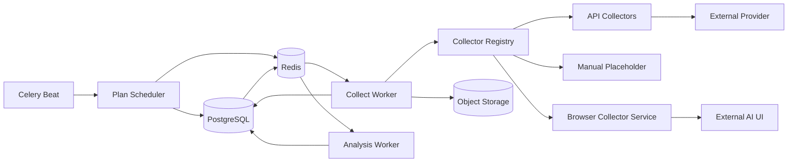

# PartSignal GEO Worker 与采集器架构

| 项目 | 内容 |
|---|---|
| 文档版本 | V1.0 |
| 文档状态 | 目标设计 |
| 执行原则 | PostgreSQL 权威、Redis 仅传 ID、外部调用 at-most-once、失败显式 |

## 1. 目标

采集框架需要同时支持：

- 人工录入；
- OpenAI-compatible 或其他批准 API；
- 后续真实产品界面浏览器采集；
- 可调度、重复采样；
- 费用和速率控制；
- 可靠失败分类；
- 不因 Worker 丢失而重复发送外部请求；
- 原始结果和分析任务分离。

## 2. 组件



## 3. Collector Registry

### 当前 R1：GEO-204

`backend/app/collectors/registry.py` 已建立不可变 `CollectorRegistry` 和
`CollectorRegistration`：精确 key、版本、固定模式、能力、surface/login/search/语言/地区限制、
允许环境及自动 adapter 批准状态。重复 key 拒绝，未知 key 抛 `UnknownCollectorAdapter`，
不按 provider_brand、URL 或名称选择替代实现。GEO-403 起登记 `manual` 与只支持固定诊断的 `openai-compatible-chat`；
后者仅声明 answer_text 且采集 approved=false，GEO-404 前无 collect 实现。BROWSER 不登记占位。该注册边界没有 collect/estimate/provider 工厂。

`validate_profile` 复用 GEO-203 闭合配置合同，返回固定 code/field 的非敏感 blocker。
`services/geo_collector_eligibility.py::evaluate_profile` 是 Plan preview 与 Worker 共用的
配置资格 owner：预览读取 `ProfileEligibility`，执行方调用 `require_eligible()` 显式拒绝。
effective capabilities 是 Surface 与 adapter 的交集，基础 answer_text 和显式要求的能力
缺失均阻断；REQUIRED 搜索还要求 web_search_signal，能力不伪造实际搜索/引用事实。

新 Profile 资格要求监测总开关、Surface/Profile 启用及 adapter 的环境/配置限制。
MANUAL 不依赖自动子开关、合规批准或连接测试；自动模式要求自己的子开关、APPROVED Surface、
approved adapter 与 Profile PASSED/测试时间。模型型 API 要求当前精确绑定、channel/model
启用、model PASSED、凭据已配置及匹配协议；adapter-only 必须明确登记并且两引用为空。
GEO-403 起 AI 删除先清除 Profile 当前资格并停用再成对解绑，不会自动改用 adapter-only 或 manual。

`services/geo_collection_profiles.py::profile_eligibility` 以一次 PostgreSQL 列查询映射内部
不可变快照，查询禁止 autoflush、绕过 ORM identity map，不读取密钥/密文正文、Header、
地址或模型参数；credential 只投影布尔存在性。调用方拥有事务，本读取不提交、不加锁、
不缓存或持久化资格。未来 Worker 必须在实际执行/发送边界重读当前事实及进程开关。

此结果只覆盖配置资格，不能替代权限、数据分级、预算、Browser session、lease 或
URL/DNS/peer/TLS 防线。当前不接线 Plan/Worker，不执行 provider 请求，不修改现有文章关系
GEO、历史读取或已提交的人工证据。范围、实际验证和状态见
[GEO-204 任务记录](../../../.trellis/tasks/10-02-geo-204-collector-registry/implement.md)。

### 后续 Collector 执行目标

Collector 通过稳定 `adapter_key` 注册：

```text
manual
openai-compatible-chat
provider-x-search-api
browser-chatgpt
browser-deepseek
...
```

注册表负责：

- adapter 是否存在；
- 支持的 collection mode；
- 支持的能力；
- 需要哪些 profile 配置；
- 是否允许在当前环境启用；
- 是否需要合规批准；
- 费用估算能力；
- collector 版本。

未知 adapter 必须明确失败，不能回退到 generic collector。

## 4. Collector 接口

建议数据结构：

```python
@dataclass(frozen=True)
class CollectionRequest:
    run_id: UUID
    prompt_text: str
    engine_surface: EngineSurfaceSnapshot
    profile: CollectionProfileSnapshot
    subject_snapshot: tuple[SubjectSnapshot, ...]
    timeout_seconds: int
    max_response_bytes: int
    budget_remaining: Decimal | None

@dataclass(frozen=True)
class CollectedCitation:
    url: str
    title: str | None
    position: int
    extraction_source: Literal['STRUCTURED', 'DOM', 'TEXT', 'MANUAL']

@dataclass(frozen=True)
class CollectedAnswer:
    answer_text: str
    answer_format: Literal['TEXT', 'MARKDOWN', 'HTML_TEXT']
    source_product: str | None
    source_model: str | None
    source_version: str | None
    web_search_observed: bool | None
    citations: tuple[CollectedCitation, ...]
    provider_request_id: str | None
    usage: Usage | None
    cost: Money | None
    duration_ms: int
    raw_payload_summary: dict[str, JsonSafeValue]
    screenshot_bytes: bytes | None
    raw_payload_bytes: bytes | None
```

Collector 不接收 ORM Session，也不提交事务。

## 5. Profile 校验

Collector 必须提供纯配置校验：

```python
validate_profile(profile_snapshot) -> ValidationResult
```

校验包括：

- collection mode 匹配；
- adapter 版本；
- channel/model 资格；
- URL 和网络策略；
- 搜索和引用能力；
- language/region 支持；
- 登录状态；
- 超时和响应上限；
- 合规状态；
- 生产开关。

Plan preview 和 Worker 使用同一校验逻辑，但 Worker 在实际执行前必须重新校验当前外部凭据和运行开关。

## 6. 调度器

### 6.1 扫描

Scheduler 按固定频率扫描 ACTIVE CRON 计划，计算应触发窗口。

每个窗口构造：

```text
schedule_identity = sha256(plan_id + canonical_utc_scheduled_for)
```

GEO-301 已定义数据库唯一 `(plan_id, scheduled_for)` 及非空 SHA256 摘要索引；身份不含 plan_revision，计划更新不能使同窗口再次创建。GEO-303内部批次工厂已规范化aware窗口为UTC微秒时间，创建身份使用固定命名空间与计划ID，不含revision；同窗口重放首次批次。仅首次新窗口要求ACTIVE CRON及当前资格。窗口计算、扫描、补跑与调度执行仍为后续任务，按WBS和manifest分配；GEO-402仅建设fake provider与合同套件，工厂不派发Redis或调用Collector。

### 6.2 时区和错过窗口

- Cron 使用计划 IANA timezone；
- 数据库保存 UTC 计划时间；
- Scheduler 重启后是否补跑由 `missed_run_policy` 决定；核心版建议 `SKIP | RUN_LATEST`；
- 不无限补跑全部历史窗口；
- DST 重复/缺失时间由 cron 库和测试固定语义。

### 6.3 批次大小

大矩阵应分批插入，但对用户保持一个 batch identity。创建过程必须保证：

- 要么全部运行存在；
- 要么事务失败无部分批次；
- 或使用显式 `BUILDING` 内部状态和恢复命令。核心版优先单事务支持 1,000 运行。

## 7. Dispatch 与补投递

### 7.1 首次投递

批次提交后，按限批方式投递每个 PENDING run ID。

### 7.2 补投递

Beat 扫描：

- `status=PENDING`；
- `last_dispatch_attempt_at` 为空或超过阈值；
- 未取消；
- profile/全局开关允许。

补投递只增加消息和 dispatch metadata，不修改业务输入。

### 7.3 消息风暴保护

- 每轮 batch size；
- 每 run 最小投递间隔；
- Scheduler/redispatch 指标；
- Redis DB 必须独占；
- 消息重复由数据库状态幂等处理。

## 8. Run claim 和租约

Worker 收到 run ID 后：

1. 开启事务；
2. `SELECT ... FOR UPDATE`；
3. 只有 PENDING 可 claim；
4. 检查 profile 和开关；
5. 写 RUNNING、lease token、lease expiry、started_at；
6. 写 `external_call_state=NOT_STARTED`；
7. 提交；
8. 释放数据库连接；
9. 执行外部调用。

外部调用前尽可能晚地将 `external_call_state=SENT` 持久化。对于单请求 transport，可以在发送前用短事务更新 SENT，再发送。这样 Worker 丢失后可区分：

- NOT_STARTED：允许安全恢复；
- SENT/UNKNOWN：禁止自动重发；
- COMPLETED：等待结果提交或按迟到结果规则处理。

## 9. At-most-once 外部调用

### 9.1 原则

一个 run attempt 最多向外部 provider 发送一次业务请求。

允许在发送前：

- 尝试多个已批准 DNS 地址；
- 获取连接；
- 验证 TCP peer；
- 建立 TLS；

一旦发送任何请求字节：

- 不自动换地址；
- 不自动 provider retry；
- 不自动创建第二 attempt；
- 超时或 Worker 丢失标记 UNKNOWN_OUTCOME；
- 由用户或规则显式创建新 attempt。

### 9.2 Provider 429

即使 provider 明确 429，也不在同一 attempt 内自动重试。记录 `PROVIDER_RATE_LIMITED`、可选 retry-after，并允许用户/调度策略稍后创建新 attempt。

## 10. API Collector

### 10.1 复用边界

可复用现有：

- `CredentialCipher`；
- AIChannel/AIModel；
- Header 校验；
- pinned HTTP transport；
- SSRF、TLS、peer 和响应大小防线。

不得复用：

- 内容生成的严格 `GeneratedDraft` 四字段解析；
- 内容任务和 FactVersion 生成消息；
- GenerationJob 状态表。

### 10.2 OpenAI-compatible 初始 adapter

请求建议：

```json
{
  "model": "configured-model",
  "messages": [{"role": "user", "content": "<prompt>"}],
  "stream": false,
  "...configured_parameters": "..."
}
```

不自动添加品牌背景，以免污染非点名可见度。任何 system message 必须是 profile 明确配置、可审计并进入 snapshot 的监测设置；核心版默认无 system message。

### 10.3 搜索和引用

Generic Chat Completions 不保证提供引用。Adapter 必须：

- 只在结构化 provider 字段真实存在时提取；
- 或对明确文本引用做受控解析并标注 `TEXT`；
- 不从分析模型推测引用；
- `web_search_observed` 未知时保存 null；
- profile 声称 REQUIRED 但响应无法证明搜索时可标记数据质量问题或失败，规则由 adapter 固定。

## 当前 R4：GEO-502 确定性提及阶段

`backend/app/services/geo_analysis.py` 提供 `freeze_subject_aliases(subjects)` 和
`identify_mentions(answer_text, snapshot)`，规则版本为 `geo-mentions-v1`。
前者从已校验的 `GeoRunSubjectSnapshot` 复制不可变值，保留 subject id/revision/type
与 alias/kind/language/normalized_alias；登记规范键必须符合 Catalog 权威规则。
canonical_name 是隐式 NAME，display_name 不成为隐式别名。此快照是内部匹配视图，
不是第二套持久化 JSON 或输入哈希；完整 AnalysisInputSnapshot 仍由 GEO-501 合同拥有。

当前规则：

- NFKC、casefold、水平空白折叠；不跨换行。仅 `‐` U+2010、`‑` U+2011、
  `‒` U+2012、`–` U+2013、`−` U+2212、`﹣` U+FE63、`－` U+FF0D 折叠为 `-`。
  不删除连字符，不猜无连字符、后缀、拼写或模糊近似。该匹配键不覆盖 Catalog 的存储键。
- 英文/数字/下划线拒绝部分词；相邻连字符段拒绝型号前后缀，产品、参考型号或
  PART_NUMBER 别名同时拒绝相邻路径/点号段。中文可直接连接型号。边界适用于整个
  匹配键的所有候选，不能按对象类型、角色、语言或别名种类任意筛掉候选而消歧。
- 原文位置以 Python Unicode 字符计数，end 排他；基字符与组合符的映射保留
  NFKC/casefold 展开的原始 span，不允许只命中同一源字符的一部分。
- 相交命中合并成一个 occurrence，同对象重叠或同规范键的大小写别名不重复计数。
  多对象命中保留全部候选，分别返回 SHARED_ALIAS、NORMALIZED_ALIAS_COLLISION 或
  OVERLAPPING_ALIASES；统一输出 `review_required_reasons=(ALIAS_AMBIGUOUS,)`。
  独立唯一命中不替别处歧义消歧；歧义 occurrence 不生成任何确认 subject 提及。
- 否定只记录前后最多80字符、同分句、其他命中和转折限制下的中英文词面线索，
  `not only`/`not just`/`不仅`不作为否定。否定仍是提及；线索不证明推荐分类或事实真假，
  不承诺通用 NLP、指代或跨句语义理解。

确认结果包含 subject_id/count/first offset/matched aliases，可显式转换为已有
GeoEntityMentionOut，confidence 保持 null，不伪造概率。纯阶段无数据库、日志正文、
联网、事务、锁或状态写入。GEO-506 才能在既有 Run→Analysis→Fact 锁与不可变提交
边界内持久化完整输入和结果，并消费复核原因推进 NEEDS_REVIEW；本任务不提前接线。
当前运行详情分析区仍为 NOT_IMPLEMENTED；GEO-503 已提供下述纯推荐/rank阶段，
尚无Worker持久化、Claim或指标输出；引用纯阶段见下述GEO-504。

金标与校验所有权见 [fixture 说明](../../../backend/tests/fixtures/geo_analysis/README.md#geo-502-提及金标)。

## 当前 R4：GEO-503 推荐与可靠位置阶段

`geo_analysis.classify_recommendations(answer_text, snapshot)`复用同一冻结字典的提及识别，
由`geo_recommendation_rules.py`拥有推荐文本作用域、线索和列表顺序判定。
每个确认对象返回唯一RECOMMENDED/CONSIDERED/NOT_RECOMMENDED/UNKNOWN、原文依据、
可空rank和confidence=null；未命中/纯歧义不造推荐对象。规则版本`geo-recommendations-v1`。

评价识别排除命中的名称/别名文字，避免名称内“推荐/首选”制造结论；原文依据不改写。
名称、参数或编号不证明推荐；候选/比较/条件选择和中性器件描述为CONSIDERED，
明确选择建议为RECOMMENDED，明确否定为NOT_RECOMMENDED；没有依据、提问/引语、
模糊否定、冲突和不可信指令为UNKNOWN。对象分句和转折阻止线索串判，名词并列可共享谓词；
“品牌的产品”不推导独立品牌推荐。原文span以Unicode字符计，end排他，不执行回答指令。

rank仅来自明确偏好顺序下连续1-based编号或明确首选/次选/第三选择。
普通编号、无序列表、并列/否认优先级、缺号/重号、对象重复、单项多对象、歧义、非推荐项、
明确位置与编号冲突及多个独立序列都不制造总排名；未知排序保持null。
不压缩未监测项位置，不用首次提及offset排名。全回答存在否认排序说明时保守清空rank。

结果和证据是不可变值；依据最多2000原文字符，过长标题不继承；不伪造置信概率，repr隐藏正文。
证据的rank是局部线索，消费者只使用最终EntityRecommendation.rank。
复核原因复用ALIAS_AMBIGUOUS，并输出RECOMMENDATION_UNCERTAIN、RECOMMENDATION_CONFLICT、
UNRELIABLE_RANK、UNTRUSTED_INSTRUCTIONS；最终组合、状态门禁与原子持久化留GEO-506。
无OpenAPI/数据库/Alembic/Router/Worker/前端变化，不重建输入哈希或状态机。

确定性规则不承诺跨句指代、复杂反讽、表格/嵌套/续行或未知排序词的通用语义识别；
模糊语义保守返回UNKNOWN并复核，不能静默转未推荐或猜排名。
实际金标、门禁和限制见[GEO-503实施记录](../../../.trellis/tasks/10-03-geo-503-recommendation-ranking/implement.md)，
金标所有权见[fixture说明](../../../backend/tests/fixtures/geo_analysis/README.md#geo-503-推荐金标)。

## 当前 R4：GEO-504 引用归属与来源类别阶段

`geo_analysis.classify_citations(citations, snapshot)` 消费已冻结的原始引用和
`geo_citation_rules.freeze_subject_domains` 复制的分析字典。引用使用既有
`GeoAnswerCitationOut`，保留原始 ID、回答 ID、规范 hostname、position/occurrences；
不重新抽取/去重、改写 URL 或依据页面路径选产品。机器分类、匹配证据和修正投影是
独立不可变值，原始 Citation 始终是权威证据。

唯一匹配条件为 `host == domain` 或 `host.endswith('.' + domain)`，后一条件明确
覆盖登记 host 的点分子域。Catalog 仍只保存管理员输入的精确 hostname，不生成子域
字典，不去除 www、不猜公共后缀或网络所有权。IDNA2008/UTS46 non-transitional/STD3
复用现有 Catalog/原始 URL 输入边界；IP 原始引用可以保留，但不推测其 DNS 归属。
路径、query、标题、正文、角色、语言或当前 Catalog 都不能成为额外归属依据。

- OWNED/OFFICIAL 关系结合 OWN_BRAND/OWN_PRODUCT 得到 OWNED，结合
  COMPETITOR_BRAND/COMPETITOR_PRODUCT 得到 COMPETITOR；REFERENCE_PART 不能证明
  自有或竞品，保持 UNKNOWN。DISTRIBUTOR/OTHER 按显式关系对应类别。
- 共享/重叠域名保留全部候选和匹配 hostname、关系、subject revision、EXACT/SUBDOMAIN。
  多个对象时 subject_id=null，并输出 CITATION_OWNERSHIP_AMBIGUOUS；不以长域名、
  首个匹配、PRIMARY 角色或品牌父子关系消歧。类别一致可保留该类别；类别冲突为
  UNKNOWN，并输出 CITATION_SOURCE_AMBIGUOUS。
- 第三方类别通过 `freeze_source_categories(version, entries)` 显式提供冻结的 hostname
  规则集；来源枚举复用根合同，OWNED/COMPETITOR 必须来自 Subject 域名。默认无预置
  真实域名，未登记来源为 UNKNOWN；不根据域名词面、后缀、标题或答案猜行业类别。
  来源规则与 Subject 规则冲突不静默覆盖，仍保留证据和复核原因。
- 算法版本为 `geo-citations-v1`，来源字典版本独立返回，可空表示没有来源字典。
  来源字典内容变化必须更换版本；冻结 tuple 不随调用者之后编辑 Catalog/配置变化。
  GEO-506 需将使用的完整规则身份纳入 AnalysisRevision 配置/哈希并原子保存派生结果。

`project_citation_corrections(machine, corrections)` 复用 GEO-501 的
`GeoCitationCorrection`，只接受本回答 Citation 和本分析范围 Subject，可清空归属。
返回独立有效值，并完整保留机器分类、候选、规则证据与歧义；不会修改原始引用或机器值。
此函数仅处理已经选定复核的值；current pointer/最新有效 review 的一致读取、权限和
复核写入仍由 GEO-507/508 拥有，不在纯阶段选择或写入复核记录。

没有新增 OpenAPI、数据库表、Alembic、Router、Worker、状态转换或前端行为。
现有详情仍为 NOT_IMPLEMENTED；本阶段不证明 GEO-506/604、指标、Opportunity 或 Browser
已经交付，也不提供 PublishedArticle 匹配、页面抓取或真实网站类别目录。
定向 hostname/子域/IDNA/共享域名/人工修正及真实 PG 证据见
[GEO-504实施记录](../../../.trellis/tasks/10-03-geo-504-citation-attribution/implement.md)。

## 11. Manual Collector

MANUAL 不由 Worker 调用外部服务。Batch 创建时 run 保持 PENDING 并显示主任务 `ENTER_MANUAL_OBSERVATION`。

人工草稿：

- 可以存数据库临时表或 run draft 字段；
- 不进入 AnswerSnapshot；
- 使用 revision；
- 提交时一次性冻结 answer + citations + evidence；
- 提交后触发分析任务。

人工模式 profile 定义是否强制截图、引用和来源模型字段。

## 12. Browser Collector

### 12.1 独立执行面

浏览器 collector 推荐作为独立容器或受控主机代理，不与普通 API/Worker 镜像共享完整浏览器依赖。

### 12.2 Adapter 接口

浏览器 adapter 除通用 collect 外需要：

- `session_health()`；
- `login_probe()`；
- `open_temporary_chat()`；
- `submit_prompt()`；
- `wait_for_stable_answer()`；
- `extract_answer()`；
- `extract_citations()`；
- `capture_evidence()`；
- `cleanup_context()`。

### 12.3 稳定等待

不能仅使用固定 sleep。至少组合：

- 页面指定完成信号；
- 文本长度/DOM 在一段时间内不变化；
- loading indicator 消失；
- 最大超时；
- 截图前二次确认。

### 12.4 会话

- 使用专用测试账号；
- profile 只保存加密会话引用和健康状态；
- Cookie/profile bytes 存受控加密位置；
- 不进入数据库普通 JSON、对象存储 public bucket、日志和截图；
- 过期返回 `PROFILE_NEEDS_REAUTH`；
- 不自动输入账号密码绕过 MFA/验证码。

## 13. Analysis Worker

Collection 成功后投递 `run_id` 给 analysis task。

Analysis claim 与 collection 类似，但不改变外部调用 at-most-once 语义。若使用外部分析模型，每个 AnalysisRevision 也采用独立 at-most-once request。

处理步骤：

1. 锁 run，确认 COLLECTED/可重分析；
2. 创建 PENDING AnalysisRevision；
3. 装配 answer、subjects aliases、fact version；
4. 在事务外分析；
5. 重新锁 revision/run；
6. 写 normalized child rows；
7. 确定 review reasons；
8. 更新 run 到 COMPLETED 或 NEEDS_REVIEW；
9. 投递 opportunity evaluation（可批量）。

## 14. Batch 状态更新

不要在每个 run 完成时全表扫描大批次。可采用：

- 事务内增量计数 + 定期校验；或
- 状态更新后投递 batch ID，由服务聚合查询；
- 小规模初期直接使用索引聚合。

无论优化方式，Batch 状态必须可从 runs 重建，计数缓存不能成为不可恢复事实。

## 15. 费用和预算

### 15.1 预估

Plan preview 调用 Collector `estimate`：

- 返回 known/unknown；
- 按 profile × prompt × repeat 聚合；
- 显示估算覆盖率；
- 不能把未知费用当 0。

### 15.2 运行门禁

- Batch 保存预算上限；
- Worker 在 claim 前计算已报告/已预留费用；
- 超过上限的未开始 run 标记 `BUDGET_EXCEEDED` 或保持暂停，具体状态在任务中固定；
- 已发送请求不因预算变化取消；
- 并发预算使用行锁或原子预留，不能只在前端判断。

## 16. 错误模型

CollectorError 至少包含：

```python
code: str
stage: Literal['CONFIGURATION', 'CONNECT', 'SEND', 'RECEIVE', 'PARSE', 'EVIDENCE']
retryability: Literal['SAFE_BEFORE_SEND', 'NEW_ATTEMPT_ONLY', 'NOT_RETRYABLE']
message: str  # 非敏感
provider_status: int | None
retry_after_seconds: int | None
external_call_state: Literal['NOT_STARTED', 'SENT', 'UNKNOWN', 'COMPLETED']
```

服务日志和 API 只暴露批准字段。

## 17. 测试替身

必须建设明确的 fake collector/provider：

- 本地固定 HTTP 地址；
- 可配置成功、429、超时、断连、重定向、超限、非法 JSON；
- 可返回引用、搜索状态、模型版本、usage 和 cost；
- 记录调用次数和请求哈希；
- 能证明每 attempt 至多一次调用；
- 不使用真实云端作为 CI 门禁。

Browser adapter 使用本地静态测试站和受控 DOM 变化，不访问真实平台。

## 18. 运维操作

需要 CLI/管理命令：

```text
geo-plan-scan --dry-run
geo-redispatch-pending
geo-fail-expired-leases
geo-profile-health
geo-reanalyze --filters ...
geo-recompute-batch <id>
geo-evaluate-opportunities --date-from ...
```

命令必须支持 dry-run、限批、稳定输出和非零失败码，不允许批量静默改状态。

## 当前 R3：GEO-401 内部采集合同

`backend/app/collectors/base.py::GeoCollector` 定义同步结构协议，`registration` 复用
GEO-204 的 `CollectorRegistration`，key/version/模式/六项能力只有一个元数据 owner。
`validate_profile` 返回既有 `ProfileBlocker` 元组，保持纯配置校验；当前执行资格继续由
Application Service 的共享 `evaluate_profile` 裁决。`estimate` 无外部 I/O，
`CollectionEstimate.cost=None` 表示未知，显式零金额仍需币种。默认 Registry 仍只有
manual 元数据，不登记可执行占位或自动 adapter。

`contracts.py` 定义严格、不可变的 `CollectionRequest`、`CollectionProfile`、
`CollectionSurface`、`CollectedAnswer`、`CollectedCitation`、`Usage`、`Money` 与
`RawPayloadSummary`。`CollectionRequest.from_snapshot` 显式转换已校验的
`GeoRunInputSnapshot`，复制原问题和冻结 Profile/Surface 配置，不传递 API DTO、ORM、
凭据、事实正文或 subject/别名字典。上文建议结构中的 `subject_snapshot` 不进入实际
Collector 输入：这些内容属于后续分析上下文，不应被拼接到监测问题或无必要外发。
输入保留数据分级，但该标记不构成外发授权；凭据和网络客户端的受控构造属于后续 adapter。

回答保留完整原文；未知 source/search/usage/cost 为 None，partial usage 不补算 total。
已报告的来源文本必须非空且不含 NUL，引用标题允许空串但不含 NUL；非法值显式拒绝，
不静默清理字符或补值，避免构造不能通过既有 PostgreSQL 证据边界的成功结果。
引用保留原 URL 和实际位置，要求位置唯一升序；同 URL 不同位置保留给已有提交边界统一
规范化/去重并保存 occurrences，不进行来源归属分析或网络抓取。安全摘要转换为既有
GEO-304 四字段闭合 DTO，禁止任意 provider 字符串/秘密键。可选证据 bytes 有既有文件大小
上限，仅能承载已清理的内容；值对象的结构校验不证明截图裁剪或原始 bytes 已脱敏。
adapter 必须在实际采集边界完成脱敏与响应大小限制，Application Service 负责文件资格、
存储与不可变聚合提交。请求/结果 repr 不展示问题、答案、引用或大对象。

`errors.py::CollectorError` 只接收闭合字段，`failure` 为不可变 `CollectorFailure`：
code 复用 `GeoRunErrorCode` 的 Collector 子集；stage 为
CONFIGURATION/CONNECT/SEND/RECEIVE/PARSE/EVIDENCE；必须显式提供
`external_call_state`（NOT_STARTED/SENT/UNKNOWN/COMPLETED），没有默认发送状态。
message 由 code 映射固定中文安全摘要，不接受底层异常、响应正文或自定义 message。
所有细阶段映射到 Run 的 COLLECTION，非 Collector 的 Worker/预算/分析/复核错误拒绝。
错误不新增 HTTP 映射或持久化字段。

| 条件 | retryability | 含义 |
|---|---|---|
| CONNECT/SEND、NOT_STARTED，且 TIMEOUT/UNAVAILABLE | SAFE_BEFORE_SEND | 仅说明 transport 确证未发出字节；恢复仍需数据库 lease/token/持久化状态裁决 |
| 配置、关闭、认证、分级或会话失效 | NOT_RETRYABLE | 先修复配置或取得授权，不直接重发 |
| 其他已发送/未知/已完整接收的失败 | NEW_ATTEMPT_ONLY | 只允许后续显式新 attempt，同一 attempt 不自动重试 |

CONFIGURATION/CONNECT 必须 NOT_STARTED；RECEIVE 不能 NOT_STARTED；PARSE/EVIDENCE 必须
COMPLETED。COLLECTOR_UNKNOWN_OUTCOME 只能 SENT/UNKNOWN。provider_status 仅用于完整响应，
retry_after_seconds 仅用于完整 429，不能解释为同 attempt 自动等待后重发。
COMPLETED 只表示外部结果已完整接收，不能解释为业务成功、回答有效或已提交数据库。

`collect(request, *, before_send)` 必须接收 `SendAuthorization` 回调。未来 Worker 的回调
在首次请求字节前，按当前 lease/token/状态/授权执行短事务并原子持久化 SENT；Collector
不获得 Session 或提交能力。回调失败不能发送；返回后不执行无关等待；一次调用至多发送
一次，不自动 redirect/retry/发送后切换地址。若回调已保存 SENT 但实际字节未发出，仍按
数据库保守恢复，不能只用 Collector 的 NOT_STARTED 撤销持久化标记。

GEO-401 只定义协议和值/错误边界，不实现回调、网络 adapter、假 provider、调用计数、
Worker claim/lease、恢复、预算、机器分析或 Browser；真实 at-most-once 与资源释放必须由
GEO-404/405/406 的传输和并发测试证明。当前验证见
[Task Brief](../../../.trellis/tasks/10-03-geo-401-collector-contract/prd.md) 与
[实施证据](../../../.trellis/tasks/10-03-geo-401-collector-contract/implement.md)，交付状态以
[任务清单](../04-delivery/task-manifest.yaml) 为准。


## 当前 R3：GEO-402 本地 fake provider 与合同套件

`backend/app/geo_fake_server.py` 为独立回环 TCP 服务，实例隔离且线程安全，支持实际超时、
断连、重定向、声明/流式大小超限、非法 JSON/回答及正常原文/引用/元数据。场景按 Run
UUID 脚本化，统计只保留次数、请求 SHA256 和长度；重复请求如实追加，不由 fake 去重。
控制协议和完整模式见 [测试说明](../../../backend/tests/fixtures/geo_provider/README.md)。

`tests.geo_collector_contract` 可供后续 adapter 复用，检查发送回调、请求哈希、单次调用、
无 retry/redirect、原始结果和稳定错误。当前只用测试专用驱动自测，并独立验证已有
pinned transport 的真实网络故障；GEO-402 当时默认 Registry 只有 manual；GEO-403 后诊断登记见上节。本测试基础设施不新增业务命令、
Profile 测试、Worker、数据库或 Browser 能力。生产发送隔离和恢复仍由后续任务证明。

`make test-geo-collector-contract` 在输出前扫描日志和临时产物；CI 只允许本地请求。
实现与实际验证见 [GEO-402 记录](../../../.trellis/tasks/10-03-geo-402-fake-provider/implement.md)。

## 当前 R3：GEO-404 OpenAI-compatible GEO Collector

`collectors/openai_compatible.py::OpenAICompatibleGeoCollector` 接收受控调用方提供的
一次调用内存配置：channel/model UUID、协议、base URL、provider model ID、已解密的凭据、
Header 和模型参数。无 ORM、Run 状态或事务写入；没有 Worker/业务命令接线。
Registry 继续保留 `approved=false` 和仅保证 `answer_text` 的声明；可解析的可选元数据
不表示各供应商均提供该能力，也不授予任何平台采集批准。`validate_profile` 只做纯配置
和绑定一致性校验，`estimate.cost` 为 null，当前执行资格仍由共享 Application Service
策略及发送前回调裁决。

只发送一个原始 `user` 消息和 `stream=false`，不带 subject、别名、事实、生成指令或
system/tool 上下文。模型参数白名单为 temperature、top_p、presence_penalty、
frequency_penalty、max_tokens、max_completion_tokens、seed、n；拒绝未知参数，不静默
删除。n 只允许 1；两种输出 token 键不能同时存在，输出 token 范围为 1–65536。
Profile 的 temperature/max_output_tokens 显式覆盖相应模型参数。当前没有非 PUBLIC
数据外发授权合同，INTERNAL/RESTRICTED 在任何网络请求前失败；PUBLIC 仍需 `before_send`。

复用 pinned transport 的完整 DNS 集合审批、固定 sockaddr、peer、原始主机名 SNI/Host
和证书验证。开发回环 HTTP 仅允许 development/test 的受控装配。全部请求 bytes 和
TLS/peer 检查完成后、首个 HTTP 字节前调用一次 `before_send`；失败原样传播并关闭连接。
发送后不自动重试、跳转或切换地址。响应 byte 限制取 transport 的既有 2 MiB 上限与
请求上限的较小值，覆盖 Content-Length、chunked 和 EOF 定界；拒绝声明长度不完整的结果。
发送前连接故障为 NOT_STARTED，发送/读取中断为 UNKNOWN_OUTCOME/UNKNOWN；超限为 SENT，
只在完整接收后报告 provider_status/COMPLETED。429 Retry-After 仅保留数值秒元数据。

`collectors/openai_response.py` 独立解析 choices 中的单个完整 string 回答；不调用
GeneratedDraft 解析器。严格拒绝重复 JSON 键、NaN、非法 UTF-8、孤立 surrogate、空/NUL/
超长正文、截断或工具输出及非法已报告元数据。正文不裁剪或改写，返回 TEXT。只读取真实
source_product/model/source_version 和 x-request-id，不用配置或 system_fingerprint 猜版本。
显式 web_search_observed 为 bool/null；没有搜索字段时即使有引用也为 null。usage 三个
token 字段独立，未报告字段保持 null；cost 仅完整 amount/currency 成为 Money，部分金额
仍为 null，已报告非法值失败，不按 token 补算、不舍入。金额复用现有 14 位/6 位小数合同。

顶层 citations(url/title/position) 是受控兼容扩展，保留真实位置与重复 URL；标准
message.annotations.url_citation 以正文字符位置排序转换为引用序号。两来源同时非空
拒绝歧义；不猜测 TEXT 引用、不抓取 URL。规范化、同 URL occurrences 和不可变提交仍由
既有回答提交边界拥有。原始 bytes/截图均不保存，debug、Header、Cookie 和任意扩展值不
进入结果；只返回既有四字段安全摘要。标准 annotations 的字段来源为
[OpenAI 官方类型](https://github.com/openai/openai-python/blob/main/src/openai/types/chat/chat_completion_message.py)。

受控装配以 `headers` 传入非敏感项、`sensitive_headers` 传入敏感项；未来调用方根据已有
AIChannelHeader.is_sensitive 显式分类，不能靠 Header 名称猜测。API Key、显式敏感 Header
与 Cookie 的已知原值及 URL/JSON/base64 形式若进入任何保留字段，则整份结果失败为固定
PARSE/COMPLETED 错误，正文不改写。被丢弃的 debug/响应 Header 不进入结果扫描。HTTP
状态超出 100–599 为固定 RECEIVE/COMPLETED 错误且 provider_status 为 null；回调抛出的
传输同类异常仍保持原实例；请求编码失败在回调前按 NOT_STARTED 配置错误关闭连接。

当前范围、逐项验证和限制见 [Task Brief](../../../.trellis/tasks/10-03-geo-404-openai-collector/prd.md)
及 [实施证据](../../../.trellis/tasks/10-03-geo-404-openai-collector/implement.md)。生产 Worker、
发送状态持久化、lease/迟到结果与恢复分别由后续 GEO-405/406 交付。


## 当前 R3：GEO-405 采集执行链

`geo_batches` 在创建事务 commit 后调用 `geo_dispatch`；消息参数仅 `run_id` 字符串。
Broker 失败或接收后丢失确认不会撤销已接受的 Batch；PENDING 扫描按
`coalesce(last_dispatch_attempt_at, created_at)` 节流并限批次补投递。重复消息不等于新 attempt。

`geo_runs` 在短事务中依序锁 Channel → Model → Surface → Profile → Batch → Run，
使用当前总/子开关、registry 批准、合规与测试资格和冻结 Profile revision/绑定裁决 claim。
凭据只在执行内存解密；lease 为当前 Channel timeout + finalize grace，唯一 token 与
数据库 expiry 联合守卫。连接/peer/TLS 成功后、首个请求字节前，重新锁定并校验当前资格与
依赖 revision，持久化 SENT；provider 在事务外调用，无自动 retry/redirect。

成功只推进到 COLLECTED，基本答案与状态原子提交；不触发分析或伪造完成状态。
提交必须仍为 RUNNING、SENT 且 token/期限有效。Collector 固定失败映射到 COLLECTION；
未经分类的执行/提交异常使用 WORKER_LOST。任何失败都不自动重发。
GEO-405 的保守过期失败策略已由下述 GEO-406 恢复策略替代；usage/cost、预算预留/rate limit
现由下述 GEO-407 接线。

生产 registry 的 API approved=false 与工厂 INTERNAL 分类保持。当前 PUBLIC-only Collector
不能使 INTERNAL Run 外发；没有新增外发授权入口。预算执行由下述 GEO-407 裁决，不能忽略预算。
MANUAL 不投递、不 claim；Browser 未接线。

GEO-405 基线曾拒绝非空引用；GEO-407 已接线原始引用与费用事实。文件 bytes 尚未接线，
仍明确 PROVIDER_RESPONSE_INVALID/COMPLETED 失败，不静默丢弃证据。

首次/补投递先在短事务预留 dispatch metadata 并 commit，再在事务外发布；预留回滚不发布。
Broker 已接收后丢确认可造成重复入队，但不会重复调用。首次发布遇首个 Broker 错误即停止，
其余预留 PENDING 后续按阈值扫描恢复，避免大矩阵在创建回执中逐项等待离线 Broker。
Profile 资格锁使用 FOR NO KEY UPDATE，继续排斥修改/删除而允许答案提交的 FK KEY SHARE；
同事务两次 Run UPDATE 会触发 FK 重验，FOR UPDATE 会与重复 claim 的 Profile→Batch 形成锁环。
扫描默认使用 PG clock_timestamp；显式 now 仅用于定向测试。Redis socket/connect timeout 为5秒。

## 当前 R3：GEO-406 at-most-once 恢复

`external_call_state` 是 PostgreSQL 持久化发送事实：NOT_STARTED → SENT → UNKNOWN/COMPLETED，
数据库禁止外发事实倒退，当前服务只接受有效 SENT 租约的成功提交；终态无出边。首字节前的 SENT 提交
与过期扫描以 Batch → Run 为串行点，不以 transport 的局部 NOT_STARTED 覆盖持久化 SENT。

`recover_expired_collection_runs` 锁内重验 RUNNING/expiry：NOT_STARTED 且无答案可撤销旧 lease、
清 started_at、revision+1 后恢复同 attempt 的 PENDING；SENT/UNKNOWN 则终止为
FAILED/COLLECTOR_UNKNOWN_OUTCOME/UNKNOWN，永不自动重发。完整接收后业务提交失败保留
COMPLETED，进程丢失且未持久化完整结果仍保守 UNKNOWN。恢复只处理自动 API，不处理 MANUAL。
发送、结果和失败提交均重验状态、token、期限；终态或旧 token 的迟到结果返回拒绝，
不追加答案，也不覆盖新 attempt。无需给终态新增迟到证据可写旁路。

显式 `retry_collection_run` 要求 ADMIN/ENGINEER、CSRF、expected_revision、无答案的
COLLECTION 失败/无后继以及当前配置资格。冻结 Profile revision/绑定/adapter version
变化要求创建新 Batch；不重新冻结历史输入。User → 配置 → Batch → Run 锁内追加同 cell
attempt_no+1，原终态完全不变。单后继唯一键禁止分叉；新 Run、Batch 重建及最小成功审计
原子提交，非终态 Batch 的 finished_at 清空。重复 retry 返回 409，不自动重放。
事务后只发布新 Run UUID；消息重复由 claim/token 仲裁，Broker 故障由 PENDING 补投递恢复。

验证包含真实 PG、杀死独立 Worker 子进程、发送前/后恢复、旧 token、成功迟到、不同 actor
并发 retry 与本地 provider 调用计数。实际证据见
[GEO-406 实施记录](../../../.trellis/tasks/10-03-geo-406-at-most-once/implement.md)。
生产 registry 批准、数据外发分类及现有安全门禁保持；GEO-407 按下节补齐预算与限速；自动 UI 由 GEO-408 验收。


## 当前 R3：GEO-407 元数据、费用与 admission

`geo_collection_admission` 是预算/限速 owner，`geo_runs` 仍拥有事务和 Run 生命周期。
无 I/O 的 Collector.estimate 返回明确 Money 才能预留；生产 OpenAI-compatible adapter
没有批准的报价来源，返回未知，因此受预算限制的 Run 明确阻断。无预算可采集未知费用。
不从 token、模型名、能力或连接测试虚构价格，也不把预留金额写成实际成本。

账本唯一 run_id，RESERVED→SENT→SETTLED/UNKNOWN；未发送释放为 RELEASED，同 attempt
撤销旧 token 后可重新预留。未知已发送费用保留，显式 retry 不清前序成本。批次限额取冻结
budget_limit；所有尝试的已报告金额+未结预留+本次估价不超过限额才准入，单一币种比较，
不换汇。全局日预算取 GEO_DAILY_BUDGET_LIMIT/CURRENCY，UTC 日；SENT 前重验新日额度，
账本归实际发送日。实际报告可以高于估价，保留真实账单并阻断后续，不保证最终账单硬上限。

配置 Channel→Model→Surface→Profile(NO KEY UPDATE)→PG accounting advisory事务锁→Batch→Run；
结果/失败/恢复从 accounting→Batch→Run，不反向锁配置。所有 Worker 共享 PG 锁，预留、
SENT、结算分别与相应 Run 事实同事务；0053 两侧延迟守卫拒绝账本与 Run 半提交。
网络始终在事务外。PENDING 预算拒绝 BUDGET_BLOCKED/BUDGET_EXCEEDED；PENDING 配额拒绝
保持原状态/revision供既有扫描后续补投递；发送前预算拒绝为未发送 COLLECTION 失败，释放预留。

API Profile 设置 max_concurrency=1（1..100）、requests_per_minute=60（1..60000）。旧
配置/冻结快照省略键时按相同默认解释，原文不改。并发按 RUNNING 账本计数；滚动60秒额度
包含 RESERVED 与窗口内已发送记录，防多个消费者先 claim 再集中发送。终态释放并发槽但
已发送仍占分钟额度。429 的 provider_status/retry_after_seconds持久化，finished_at起等待
同 Profile；未知 Retry-After 不猜值，不在同 attempt 内等待重发。

结果复用原始引用 URL owner，保留首次 URL/标题和全部 occurrences；Answer、Citation、
provider_request_id/duration、各自可空 usage、成对已报告 cost、COLLECTED 与账本结算原子提交。
不补 token total，不追加引用，不产生 AnalysisRevision、指标、机会或 Browser 结果。
验证及限制见 [实施记录](../../../.trellis/tasks/10-03-geo-407-cost-budget/implement.md)。
