# PartSignal GEO 业务流程与状态机

| 项目 | 内容 |
|---|---|
| 文档版本 | V1.0 |
| 文档状态 | 目标设计 |
| 规则 | 状态由服务端应用服务唯一拥有，前端只消费 typed stage/action |

## 1. 监测计划流程

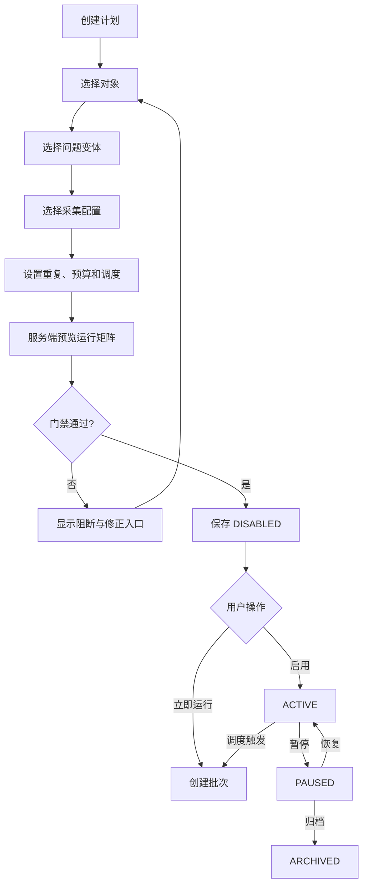

### 1.1 Plan 状态机

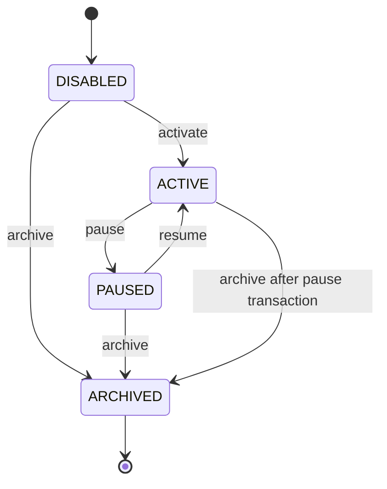

| 状态 | 主任务 | 可用动作 |
|---|---|---|
| DISABLED | 完成配置或启动 | UPDATE, PREVIEW, ACTIVATE, RUN_NOW, DELETE_IF_UNUSED |
| ACTIVE | 查看运行健康 | VIEW_RUNTIME, RUN_NOW, PAUSE, CREATE_REVISION |
| PAUSED | 恢复或归档 | UPDATE, PREVIEW, RESUME, RUN_NOW, ARCHIVE |
| ARCHIVED | 查看历史 | VIEW_HISTORY, COPY |

### 1.2 GEO-208 当前交付边界

上表与流程图描述最终运行能力。GEO-208保留四态和合法转换；GEO-303已实现run-now与临时批次的原子创建；R1页面尚无运行交互，available_actions没有RUN_NOW，run_entry明确UI_NOT_IMPLEMENTED。首次手工创建要求计划非ARCHIVED、revision匹配及当前资格；ACTIVE/PAUSED/DISABLED可手工创建，不改变计划状态。已有批次历史禁止删除计划。创建/复制都是DISABLED；结构完整且资源存在即可保存DISABLED/PAUSED，preview阻断保留给修复；ACTIVATE/RESUME只在当前无阻断时投影，命令仍锁内重新裁决。ACTIVE实际修改复用同一资格规则，状态保持ACTIVE、revision+1；同值配置（含集合重排）不改变revision/时间/审计。活动配置UPDATE由CREATE_REVISION动作表达，不创建第二套历史配置表。

当前资源动作：非归档有PREVIEW/COPY/ARCHIVE；DISABLED有UPDATE、无批次历史时DELETE及合格时ACTIVATE；ACTIVE有PAUSE/CREATE_REVISION；PAUSED有UPDATE及合格时RESUME；ARCHIVED仅COPY。workflow_stage与primary_task由服务端typed投影，VIEW_RUNTIME/VIEW_HISTORY不代表尚未实施的运行/历史API已经可用。ACTIVE归档同事务内先暂停后归档，仅一次版本和一条审计，无可见中间态。非法或重复转换409，归档写入409 GEO_PLAN_ARCHIVED。GEO-303已冻结Batch输入并创建QUEUED/PENDING初态；派发、执行与运行读模型留后续任务。

## 2. 批次创建流程

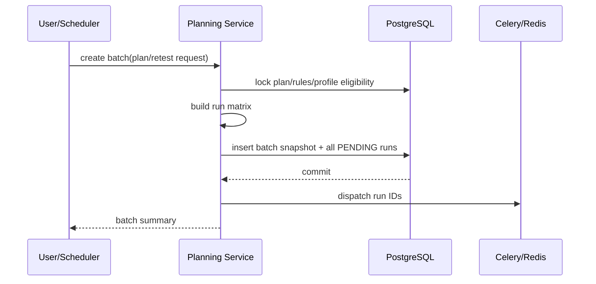

### 2.1 原子边界

- 计划资格检查、批次快照和全部运行记录在一个数据库事务中；
- 队列投递发生在提交之后；
- 投递失败不回滚业务记录，由补投递扫描处理；
- Redis 消息只携带 `run_id`；
- `requested_run_count` 与初始 attempt1 的逻辑 cell 数必须一致；创建在同一事务提交，追加 attempt 不扩张根矩阵。

## 3. Batch 状态机

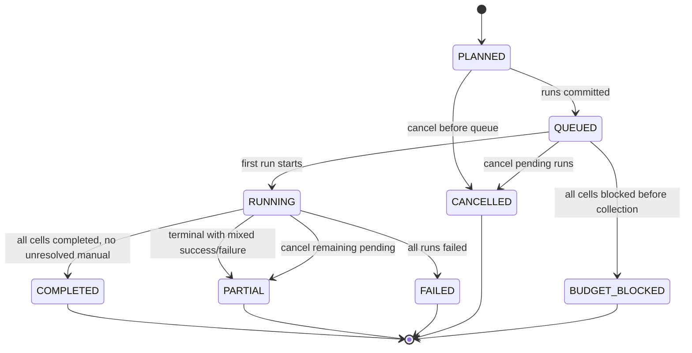

批次状态从每个 cell 的最新 attempt 确定性投影，不允许用户任意设置；保存值仅缓存，显式 retry 可重新投影，原终态 Run 不变。COMPLETED 是全部 cell 成功，PARTIAL 为成功与失败/取消/预算混合；无成功时按预算阻断、失败或全取消分类，存在非终态优先处理。GEO-302 已实现下述纯策略和独立动作组件，GEO-301 定义数据库最终防线；创建和执行接线仍由后续任务负责。

### 3.1 GEO-302 确定性投影

输入必须是同一 Batch 的完整 cell/attempt 集合，不能使用分页结果或历史最佳答案。已提交矩阵的初始 attempt1 数必须等于 `requested_run_count`，每个 cell 取最大 `attempt_no`；缺 cell、缺初始 attempt、重复编号或选中的最新 attempt 仍有后继均明确失败。`has_successor` 必须来自数据库存在性事实，不能只在输入子集内计算。未提交准备态只允许初始 PENDING，投影 PLANNED；已提交空集不是成功。

| 按顺序判断最新 attempts | Batch status |
|---|---|
| 全部 PENDING | QUEUED |
| 存在非终态，包含 NEEDS_REVIEW | RUNNING |
| 全部 COMPLETED | COMPLETED |
| 至少一个 COMPLETED，与其他终态混合 | PARTIAL |
| 无成功且至少一个 BUDGET_BLOCKED | BUDGET_BLOCKED |
| 无成功、无预算阻断且至少一个 FAILED | FAILED |
| 全部 CANCELLED | CANCELLED |

Batch CANCEL 仅当存在可取消的最新 Run、actor 活动且命令已接线时出现，只作用于 PENDING，保留已开始与终态 Run。Batch 无整体 RETRY 动作；重试定位具体失败 Run。人工录入优先成为主任务，其次是可重试失败处理，再是终态结果查看或执行进度。各 cell 的当前采集资格独立提供，不能共用一个 Profile 资格布尔值。

## 4. Run 状态机

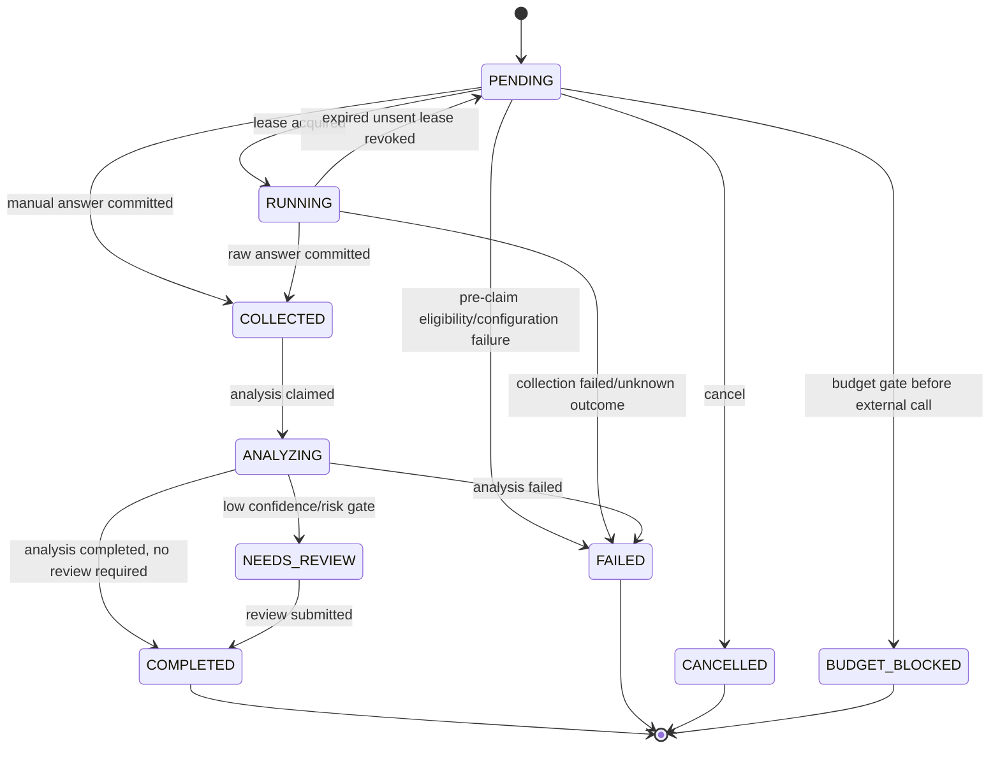

### 4.1 状态语义

| 状态 | 含义 |
|---|---|
| PENDING | 数据库存在，外部采集尚未开始 |
| RUNNING | Worker 获得租约，可能即将或已经发生外部调用 |
| COLLECTED | 原始答案和证据已原子保存 |
| ANALYZING | 分析任务持有租约 |
| NEEDS_REVIEW | 原始答案和分析存在，但需人工复核后进入业务指标 |
| COMPLETED | 已有可用于当前口径的成功分析/复核 |
| FAILED | 该尝试失败，保存稳定错误码和阶段 |
| CANCELLED | 外部调用开始前被取消 |
| BUDGET_BLOCKED | 外部调用前被预算门禁阻断，保存阶段和 BUDGET_EXCEEDED |

### 4.2 重试规则

- PENDING 消息丢失：允许补投递同一 run ID；
- RUNNING 租约过期且未确认外部调用：只有在持久化阶段标记证明“未发送”时才允许回到 PENDING；
- 外部请求已发送或状态未知：原 run 标记 FAILED/UNKNOWN_OUTCOME；
- 采集阶段 FAILED/BUDGET_BLOCKED 的用户重试：创建同 Batch/cell 的 `attempt_no + 1` 新 run，完整复制原输入，前序不存在即拒绝，唯一后继阻止分叉；分析阶段失败只重跑 AnalysisRevision；
- 原尝试不修改、不删除；
- 迟到结果必须检查当前状态和 lease token，不能覆盖终态。

### 4.3 GEO-302 策略与动作边界

`geo_run_policy` 是合法边和 retry/cancel 资格的唯一纯策略。人工模式只能从 PENDING 原子提交答案到 COLLECTED，不经过 RUNNING/预算外发门禁；自动模式必须先 RUNNING，成功提交必须有原始答案且 `external_call_state=COMPLETED`。采集后推进必须保有答案。PENDING 资格/配置失败可进入 FAILED，允许保存明确的采集错误。

RUNNING→PENDING 必须同时满足自动模式、没有答案、NOT_STARTED、租约过期和旧 token 已撤销；调用服务在锁内提供带时区的时间与撤销证据。SENT/UNKNOWN 不允许该恢复边。四种终态没有任何出边，包括同态转换；非法边统一 409 `INVALID_STATE_TRANSITION`。

取消资格仅为 PENDING、NOT_STARTED 且无答案；守卫失败为 409 `GEO_RUN_ALREADY_STARTED`。采集重试仅为 FAILED/BUDGET_BLOCKED、COLLECTION、无答案且无后继；已有后继优先返回 409 `GEO_RUN_HAS_SUCCESSOR`，其他情况为 409 `GEO_RUN_NOT_RETRYABLE`。retry 资格不修改前序状态，分析/复核失败不投影采集 RETRY。

独立 `GeoRunWorkflowProjection` / `GeoBatchWorkflowProjection` 的 stage、primary_task、available_actions 全部 required 且为闭合 enum，前端不能从 status 补算动作。ADMIN/ENGINEER 的业务执行权限一致；停用 actor 无动作。人工录入与 RETRY 还要求当前采集资格，CANCEL 保留安全停止能力。真实命令接线能力必须显式提供；未实现的命令传 false，不能展示可执行假入口。读投影不是写授权，后续命令须在同一事务、最新数据库事实和锁内重新裁决。RunState 在转换判断时包含本次原子提交拟写入的答案/外发完成事实；调用服务仍负责原子写入、错误字段、lease、revision 与审计，本任务不执行这些写操作。

## 5. 人工采集流程

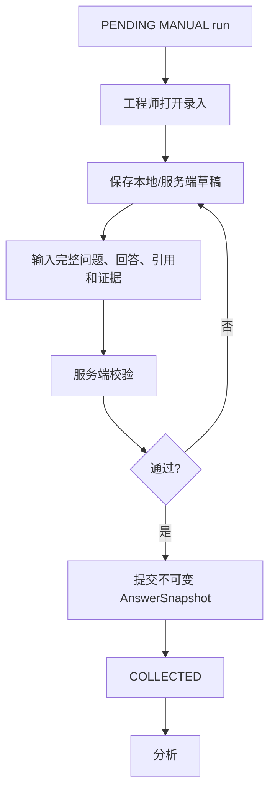

人工草稿只属于 MANUAL 模式，并应有独立 `draft_revision` 或临时编辑上下文。正式提交后不得再次编辑；错误通过新尝试或复核修正分析，不修改证据。

## 6. API 采集流程

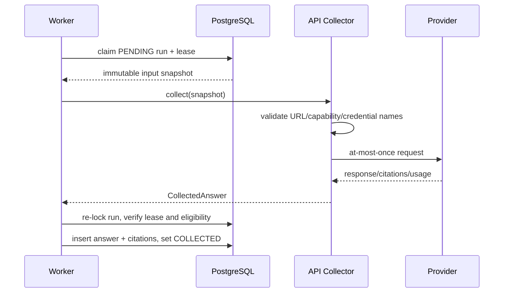

失败分类至少包括：

- `COLLECTOR_CONFIGURATION_INVALID`
- `COLLECTOR_DISABLED`
- `PROVIDER_AUTH_FAILED`
- `PROVIDER_RATE_LIMITED`
- `PROVIDER_TIMEOUT`
- `PROVIDER_UNAVAILABLE`
- `PROVIDER_RESPONSE_INVALID`
- `PROVIDER_RESPONSE_TOO_LARGE`
- `COLLECTOR_UNKNOWN_OUTCOME`
- `DATA_CLASSIFICATION_FORBIDDEN`

## 7. 浏览器采集流程

浏览器采集只能在 ADR-005 的试点门禁后启用。

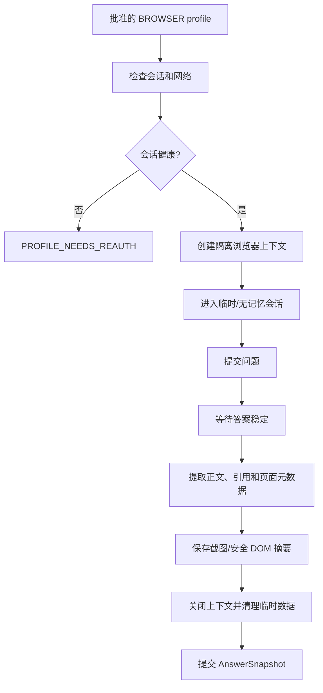

关键规则：

- 不绕过验证码、访问控制或平台安全限制；
- 不在 CI 访问真实第三方平台；
- Cookie、localStorage 和登录资料不进入日志、审计或 answer snapshot；
- 使用独立运行账号和最小权限；
- 适配器必须有 kill switch；
- 平台 DOM 变化导致提取不确定时明确失败，不保存空成功。

## 8. 分析流程

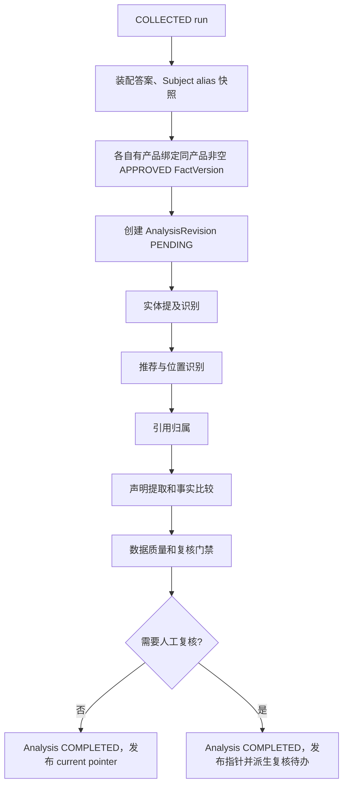

### 8.1 分析复跑

- 分析规则、alias 或事实版本变化后可以显式重跑；
- 重跑创建新 AnalysisRevision，不倒退采集 Run；GEO-501 已限定 current pointer+revision 的独立发布，不放行其他终态采集字段；
- 当前成功分析只从显式 pointer 读取，有效复核只在该 analysis 内按服务端 created_at DESC,id DESC 选择；指标查询属于后续任务；
- 报告必须记录实际使用的 revision；
- 大规模重分析需要批次、限速和独立运维入口，不允许请求线程同步扫描全部历史。

## 9. 人工复核流程

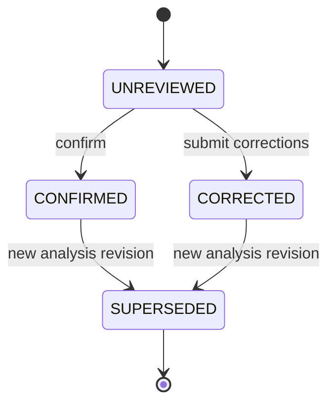

此图是有效性投影，不在 geo_run_reviews 保存可变 SUPERSEDED 状态；新成功 pointer 发布后旧记录只作历史。GEO-501 只定义追加数据合同，分析执行与复核命令分别由后续任务接入。

需要复核的典型条件：

- 推荐判断置信度低；
- 同一别名命中多个对象；
- 声明涉及关键替代关系或安全边界；
- 严重错误候选；
- 回答格式异常；
- 引用解析与文本不一致；
- 分析器版本发生重大变化。

## 10. 指标生成流程

```text
选择筛选与时间窗口
→ 查询候选运行
→ 应用可比性维度
→ 应用 MetricEligibility
→ 选择当前有效分析/复核
→ 计算分子、分母和样本状态
→ 生成趋势、SOV、引用、风险和数据质量
→ 返回明细下钻 token/filters
```

不把汇总指标保存为可编辑业务表。性能需要时可增加可重建物化视图，但原始运行和分析仍是唯一事实源。

## 11. 机会状态机

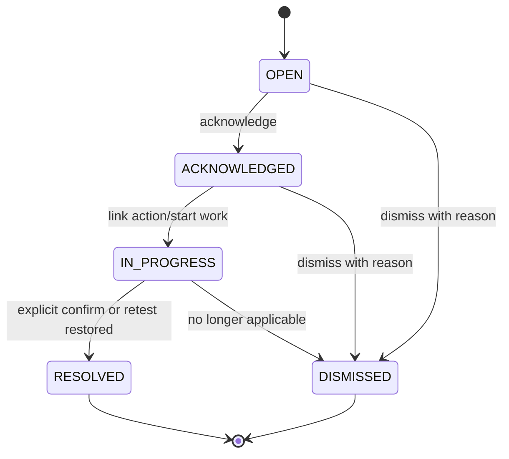

### 11.1 机会触发流程

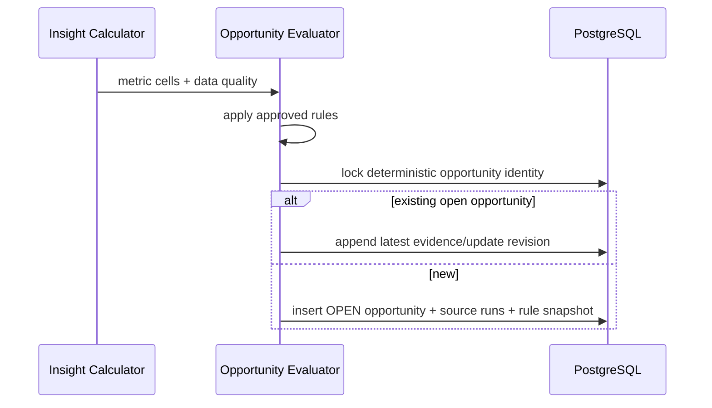

### 11.2 机会行动

| 机会类型 | 建议动作 |
|---|---|
| CRITICAL_FACT_ERROR | 打开产品事实工作区并创建修订 |
| TOPIC_COVERAGE_GAP | 创建普通内容任务 |
| OWN_CITATION_LOST | 检查发布成果或创建修复任务 |
| COMPETITOR_SURGE | 创建竞品比较或渠道内容任务 |
| VISIBILITY_DROP | 先补充观测，再决定内容行动 |
| DATA_QUALITY_PROBLEM | 修复计划/profile/采集器，不创建内容 |
| RUN_FAILURE | 运行治理和重新尝试 |

## 12. 复测流程

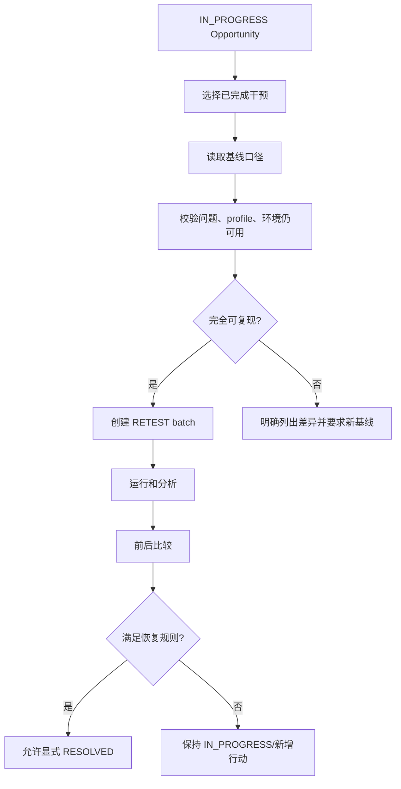

严格同口径至少包括：

- 相同问题变体版本；
- 相同观测面和采集方式；
- 相同语言、地区和登录状态；
- 相同重复次数或明确归一；
- 相同指标资格规则；
- 可识别的模型/产品版本差异。

模型版本或平台产品不可控变化必须在比较中显式展示。

## 13. 调度与暂停

- Scheduler 只为 ACTIVE 计划创建批次；
- 同一计划同一调度窗口必须有幂等 identity；
- 计划暂停后不再创建新批次，不取消已存在批次；
- 全局 kill switch 可以阻止 API/BROWSER 新外部调用，但保留人工录入和只读能力；
- 运维停止 Scheduler 不得修改数据库运行状态；
- 恢复后通过数据库扫描补投递 PENDING run。


### GEO-506 已接线边界

首次分析由应用服务 claim COLLECTED→ANALYZING；机器分析成功后按已有复核原因进入
COMPLETED/NEEDS_REVIEW，失败为FAILED/ANALYSIS并保留原始回答。重新分析追加revision、
成功推进current pointer，失败保留旧pointer，不倒退Run采集状态；这适用于首次已失败但有答案的Run。
相同input hash的待执行/成功revision复用，失败只能显式重跑。数据库 lease、派发恢复与原子提交见
[Worker当前实现](../03-technical/05-worker-and-collector-architecture.md#当前-r4geo-506-analysis-worker)。
GEO-507的复核/current读投影仍未接线；本任务不改变指标资格或加入机会状态。
