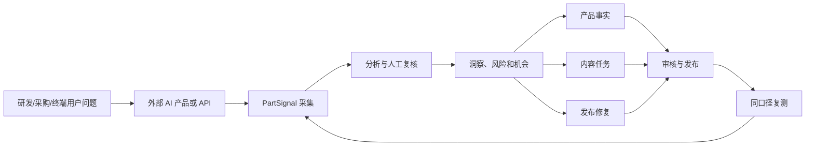
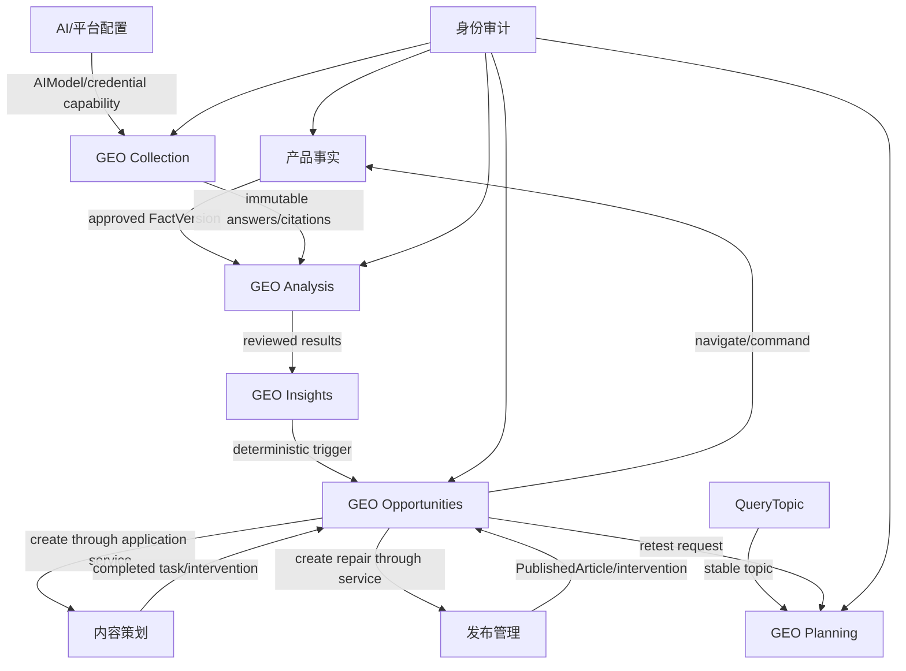

# PartSignal GEO 业务架构

| 项目 | 内容 |
|---|---|
| 文档版本 | V1.0 |
| 文档状态 | 目标设计 |
| 架构风格 | 现有模块化单体内扩展新的 GEO 监测能力 |
| 核心价值流 | 监测 → 分析 → 机会 → 行动 → 复测 |

## 1. 业务上下文

PartSignal 处于公司产品事实、内容运营、渠道发布和 GEO 情报之间。它既不是公开搜索引擎，也不是外部 AI 平台的控制面。系统的职责是：

1. 管理公司内部认可的产品事实；
2. 设计真实用户可能提出的问题；
3. 在批准的 AI 观测面上收集回答；
4. 保留原始证据并分析品牌、产品、竞品、引用和事实；
5. 将异常转化为内部行动；
6. 在相同口径下复测并积累长期数据。



当前核心采集策略由[ADR-006](../05-decisions/ADR-006-defer-browser-collection-and-adopt-manual-first-core.md)批准：MANUAL 回答级观测是正式入口，员工按[人工观测 SOP](./05-manual-geo-observation-sop.md)执行并录入真实证据；已有 API 保留，Browser 为 post-core 自动化扩展。核心在 R6 后直接进入 R8，不等待真实界面 Adapter；以下三模式领域设计保留。

## 2. 核心能力地图

| 能力 ID | 能力 | 业务结果 |
|---|---|---|
| CAP-GEO-01 | 监测对象与别名 | 同一品牌、型号和竞品的不同写法能够稳定归一 |
| CAP-GEO-02 | 问题主题与变体 | 用户意图与实际提问文本分离，支持点名/非点名、多语言和地区 |
| CAP-GEO-03 | AI 观测面与采集配置 | 明确在哪里、以什么方式、什么环境进行观测 |
| CAP-GEO-04 | 监测计划与运行预览 | 可组合问题、平台、对象、重复次数、预算和调度 |
| CAP-GEO-05 | 统一批次与运行 | 人工、API、浏览器结果进入一致、可追溯的运行模型 |
| CAP-GEO-06 | 原始证据 | 保存问题、回答、截图、引用、环境和原始载荷摘要 |
| CAP-GEO-07 | 实体与推荐分析 | 识别自有产品、竞品、推荐结论和位置 |
| CAP-GEO-08 | 引用与信源分析 | 识别 URL、域名、来源类别和自有/竞品归属 |
| CAP-GEO-09 | 声明准确性 | 对参数、封装、认证、用途和替代关系进行核验 |
| CAP-GEO-10 | 人工复核 | 人工确认或修正机器结果，并保留追加式历史 |
| CAP-GEO-11 | 指标与洞察 | 提供可解释、可比较、可下钻的指标和趋势 |
| CAP-GEO-12 | 机会与告警 | 将确定性异常转化为可处理业务对象 |
| CAP-GEO-13 | 行动链接 | 关联事实修订、内容任务、发布修复和补充观测 |
| CAP-GEO-14 | 同口径复测 | 冻结基线并比较干预前后相关变化 |
| CAP-GEO-15 | 报告与导出 | 对内部管理和专项分析提供可追溯输出 |
| CAP-GEO-16 | 运行治理 | 控制费用、失败、重试、调度、合规和数据质量 |

## 3. 价值流

### 3.1 监测设计价值流

```text
选择重点产品/参考型号
→ 建立监测对象和竞品
→ 建立问题主题和变体
→ 配置观测面和采集环境
→ 设计计划和重复采样
→ 预览运行矩阵、费用和阻断
→ 启用计划
```

结果：公司对“监测什么、为什么监测、在哪里监测、运行多少次”有明确资产，而不是临时搜索。

### 3.2 观测价值流

```text
计划触发或立即运行
→ 冻结批次快照
→ 创建单次运行
→ 采集回答和引用
→ 保存证据
→ 执行分析
→ 必要时人工复核
→ 进入合格指标数据集
```

结果：每个数字都有完整来源，失败和不确定结果不会被隐藏。

### 3.3 优化价值流

```text
趋势/错误/竞品差距触发机会
→ 人工确认问题
→ 选择事实、内容、发布或补测行动
→ 在现有 PartSignal 工作流中执行
→ 形成干预记录
→ 创建同口径复测
→ 对比基线和复测
→ 解决、继续处理或驳回机会
```

结果：GEO 不再是报告系统，而是与公司内容和产品工作流连接的运营系统。

## 4. 业务域与所有权

### 4.1 现有业务域

| 业务域 | 继续拥有的数据和规则 |
|---|---|
| 产品事实 | `Product`、事实工作区、`FactVersion`、事实审核 |
| 内容策划/生产 | `ContentTask`、`GenerationJob`、`ContentVersion`、内容审核 |
| 平台与 AI 配置 | 内容发布平台、Prompt、AIChannel、AIModel、凭据 |
| 发布管理 | 平台账号、PublicationWork、PublishedArticle、发布后问题 |
| 文章关系 GEO | 现有人工文章搜索观测和洞察 |
| 身份审计 | 用户、会话、权限、审计日志 |

### 4.2 新增 GEO 监测子域

| 子域 | 责任 | 不拥有的内容 |
|---|---|---|
| GEO Catalog | 监测对象、别名、域名、观测面、采集配置 | 产品事实正文、AI 凭据明文 |
| GEO Planning | 问题变体、计划、矩阵预览、调度配置 | 实际运行状态 |
| GEO Collection | 批次、运行、输入快照、原始答案、引用和证据 | 指标公式、内容任务状态 |
| GEO Analysis | 分析版本、提及、推荐、声明评估、人工复核 | 原始回答修改、事实审批 |
| GEO Insights | 服务端指标、趋势、SOV、引用和数据质量读模型 | 第二份可写指标事实 |
| GEO Opportunities | 规则、机会、行动链接、复测关系 | 直接修改其他域聚合 |

## 5. 上下文映射



### 5.1 协作规则

- GEO Analysis 只读取已批准 `FactVersion`，不得修改事实；
- GEO Opportunities 通过现有应用服务创建内容/修复任务，不直接写其他模块表；
- GEO Collection 可引用现有 AIChannel/AIModel，但不复用内容生成严格四字段输出协议；
- GEO Insights 从当前权威运行、分析版本和人工复核计算，不允许前端二次计算；
- 文章关系 GEO 与回答级 GEO 共享导航、产品和问题，但保持不同事实模型和指标分母；
- 所有跨域关联使用稳定 UUID 和明确快照，不根据名称或当前配置猜测历史。

## 6. 业务参与者与责任

| 活动 | ADMIN | ENGINEER | 外部 AI 平台 | Scheduler/Worker |
|---|---:|---:|---:|---:|
| 配置监测对象和竞品 | A/R | C | - | - |
| 管理问题主题和变体 | A | R | - | - |
| 配置观测面和采集方式 | A/R | C | C | - |
| 创建监测计划 | A | R | - | - |
| 触发立即运行 | A | R | - | C |
| 自动采集 | C | C | R（返回结果） | A/R |
| 人工录入观测 | A | R | - | - |
| 机器分析 | C | C | C（可选分析服务） | A/R |
| 人工复核 | A | R | - | - |
| 查看指标和报告 | A/R | R | - | - |
| 配置规则和阈值 | A/R | C | - | - |
| 处理机会和创建任务 | A | R | - | - |
| 解决/驳回机会 | A | R | - | - |
| 合规批准浏览器采集 | A | C | C | - |

A=最终负责，R=执行，C=参与/提供信息。

## 7. 关键业务不变量

### 7.1 监测与输入

1. 单次运行只能属于一个批次；
2. 批次必须冻结问题、对象、采集配置、规则和计划摘要；
3. 已创建运行的输入不随计划或配置修改；
4. 同一批次内 `(prompt_variant, collection_profile, repeat_index)` 唯一；
5. 非点名和点名问题必须显式标记，不能运行后猜测；
6. API/BROWSER 采集开始发送外部请求后不得自动再次调用同一运行。

### 7.2 原始证据

1. 原始问题、回答、引用和截图不可原地修改；
2. 人工录入完成前可保存草稿，提交后冻结；
3. 引用必须来自实际回答或界面，不允许分析器虚构；
4. 原始 payload 只保存批准字段或受控对象存储，不保存凭据和浏览器 Cookie；
5. 失败运行不得伪装为无提及或无推荐。

### 7.3 分析与复核

1. 每次机器分析形成新的 `AnalysisRevision`；
2. 当前有效分析由服务端唯一指针或确定性最新版本选择；
3. 人工复核是追加式记录，不能修改原始答案；
4. 声明核验必须绑定同产品的已批准事实版本；
5. 无足够事实时结论为 `UNJUDGEABLE`，不得自动判定错误或正确；
6. 推荐必须有明确语义依据，名称列举不自动等于推荐。

### 7.4 指标与机会

1. 分母为零时返回 `NULL`；
2. 失败、取消和未完成运行不进入业务指标分母；
3. 人工、API、浏览器默认不混合；
4. 不同问题版本、语言、地区和登录状态默认不可比；
5. 样本不足时可以展示结果，不得触发趋势型机会；
6. 机会保存触发时规则、值、阈值和来源快照；
7. 任务完成不自动解决机会；
8. 复测必须明确基线和口径，不按相似文本自动匹配。

## 8. 业务事件

以下事件是模块间协作或审计的重要节点：

| 事件 | 产生方 | 消费方/用途 |
|---|---|---|
| `geo.subject.created` | Catalog | 审计、计划选项 |
| `geo.plan.activated` | Planning | Scheduler |
| `geo.batch.created` | Planning/Opportunity | Collection |
| `geo.run.collected` | Collection | Analysis |
| `geo.run.failed` | Collection | 运行中心、告警 |
| `geo.analysis.completed` | Analysis | Insights、Opportunity |
| `geo.review.completed` | Analysis | Insights、Opportunity |
| `geo.opportunity.opened` | Opportunity | 工作台、审计 |
| `geo.opportunity.action_linked` | Opportunity | 内容/事实/发布导航 |
| `geo.retest.created` | Opportunity/Planning | Collection |
| `geo.opportunity.resolved` | Opportunity | 报告、审计 |

初期这些事件可以是同一数据库事务中的应用服务协调，不要求引入事件总线。

上表使用领域事件名称；持久化审计沿用仓库现有 `geo_opportunity.*` 命名（opened/acknowledged/action_linked/resolved），复测为 `geo.retest.created`。GEO-707 补首次真正创建的 opened 同事务审计；评估重放或追加证据不会重复 opened。审计只保存标识、revision、状态等最小安全事实，不复制业务正文和处理原因；不引入事件总线或历史回填。

## 9. 报告与决策层级

| 层级 | 决策问题 | 主要视图 |
|---|---|---|
| 运行级 | 这次回答发生了什么 | 运行详情 |
| 问题级 | 哪些问题能/不能发现和推荐产品 | 问题覆盖 |
| 产品级 | 该产品在各平台表现如何 | 产品矩阵/专项报告 |
| 平台级 | 哪个 AI 观测面表现和稳定性如何 | 平台表现 |
| 竞品级 | 公司与竞品的声量和信源差距 | SOV/竞品报告 |
| 风险级 | 哪些错误可能影响采购或工程判断 | 事实风险 |
| 行动级 | 哪些异常已处理，复测结果如何 | 机会与复测 |
| 运营级 | 计划、费用、失败和数据质量是否健康 | 运行健康报告 |

## 10. 能力成熟路径

| 成熟度 | 特征 |
|---|---|
| L0 临时人工搜索 | 搜索结果散落在截图和表格中，无法稳定比较 |
| L1 结构化人工监测 | 人工结果进入统一批次和运行模型，证据可追溯 |
| L2 自动 API 监测 | 可调度、重复采样、失败可恢复，形成持续数据 |
| L3 分析与复核 | 提及、推荐、引用和事实结论可机器分析和人工修正 |
| L4 运营闭环 | 异常形成任务并通过严格复测验证变化 |
| L5 多观测面与因果实验 | 浏览器、API、地区和对照实验形成更高可信度判断 |
