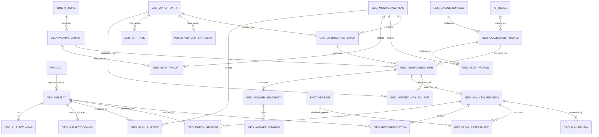

# PartSignal GEO 领域模型

| 项目 | 内容 |
|---|---|
| 文档版本 | V1.0 |
| 文档状态 | 目标设计 |
| 建模原则 | 复用现有聚合、原始证据不可变、配置与运行快照分离、分析可版本化 |

## 1. 模型总览



## 2. 复用现有实体

### 2.1 Product

继续作为公司产品的权威身份。GEO 不复制产品型号、品牌和类别；`OWN_PRODUCT` 类型监测对象必须绑定一个 `Product`。

### 2.2 FactVersion

继续作为声明准确性核验的权威事实。分析器只绑定：

- 同产品；
- 非空；
- `APPROVED`；
- 在需要第三方外发分析时满足数据分级门禁。

当前可编辑事实工作区不能作为历史回答的核验依据。

### 2.3 QueryTopic

继续表示规范用户问题和意图。新增 `GeoPromptVariant` 表示实际运行文本，避免把所有语言、地区和措辞复制为独立主题。

### 2.4 ContentTask / PublishedArticle / PublishedContentIssue

作为机会的行动目标和干预结果，不把 GEO 机会字段塞入这些现有实体。关联由 `GeoOpportunity` 保存稳定 ID 和快照。

### 2.5 GeoObservation

保留现有文章关系观测。回答级观测使用新的 `GeoObservationRun`，原因：

- 一次完整回答可涉及多个品牌、产品和竞品；
- 自动运行需要任务状态、租约和尝试；
- 原始答案、分析版本和人工复核的生命周期不同；
- 现有逐篇关系指标不能与回答级指标共享分母。

## 3. 新增聚合

## 3.1 GeoSubject 聚合

### 目的

统一表示监测身份，不替代产品事实或旧参考型号子图。

### 类型

```text
OWN_BRAND
OWN_PRODUCT
COMPETITOR_BRAND
COMPETITOR_PRODUCT
REFERENCE_PART
```

### 关键字段

- `id`
- `subject_type`
- `product_id`（仅 `OWN_PRODUCT` 必填）
- `parent_subject_id`（品牌与产品父子关系）
- `canonical_name/display_name`（OWN_PRODUCT 为当前 Product 的只读投影，不在 Catalog 持久化）
- `description`
- `is_active`
- `revision`
- `created_by/created_at/updated_at`

### 子实体

- `GeoSubjectAlias`
- `GeoSubjectDomain`

### 不变量

1. 一个 `Product` 最多对应一个活动 `OWN_PRODUCT` subject；
2. `OWN_PRODUCT.product_id` 必填，其他类型必须为空；
3. 品牌和 REFERENCE_PART 无父级；OWN_PRODUCT 可指向 OWN_BRAND，COMPETITOR_PRODUCT 可指向 COMPETITOR_BRAND，二者父级均可空；
4. 别名在同一 subject 内按规范化值唯一；
5. 域名必须是无协议、路径、端口和通配符的规范 IDNA 主机名；
6. 有历史运行引用时只能停用，不能删除；
7. subject 停用不改写历史分析；
8. Alias/Domain 共享父 Subject revision，当前字典变更与父版本递增同事务，历史消费者保存完整字典快照；
9. Product 型号、品牌、类别及事实正文不在 OWN_PRODUCT 复制；描述仅表达监测用途；
10. 跨对象别名/域名重复保留为歧义候选，分析必须显式复核而不是任意选择。

GEO-101 已冻结公共与数据库合同，仍待人工 review；详见 [OpenAPI](../../../contracts/openapi.yaml) 的 GeoSubject components/CONTRACT_ONLY 扩展和 [数据库合同](../../../contracts/database.md) 的 GEO Catalog 章节。完整父子、唯一、规范化、revision 和删除定义以这两份根合同为权威；当前尚无 Catalog runtime，后续任务不得依据草案复制 OWN_PRODUCT 名称。

## 3.2 GeoPromptVariant 聚合

### 目的

将规范问题主题与实际运行文本分离。

### 关键字段

- `id`
- `query_topic_id`
- `prompt_text`
- `mention_mode`：`BRANDED | UNBRANDED`
- `language_code`
- `region_code`
- `priority`：`CORE | STANDARD | EXPLORATORY`
- `is_active`
- `revision`
- `created_by/created_at/updated_at`

### 不变量

1. `prompt_text` 去除首尾空白后非空；
2. 语言和地区必须显式保存，不能从文本猜测后静默改写；
3. 点名属性由创建者明确选择；
4. 同一主题下完全相同的规范文本、语言、地区和点名属性唯一；
5. GEO-201 / R1 按执行要求收紧：首次运行引用后冻结语义，只能停用；新语义创建新变体，历史仍保存快照；
6. 内部 `first_referenced_at` 不可清除/改写，有历史运行时不可删除或重新启用。

## 3.3 GeoEngineSurface / GeoCollectionProfile 聚合

GEO-203 / R1 的数据契约已实现，字段、命名约束和 revision 以 [根 OpenAPI](../../../contracts/openapi.yaml) 与 [数据库合同](../../../contracts/database.md#geo-enginesurface--collectionprofile-合同geo-203--r1) 为权威。运行资格与命令分别由 GEO-204、GEO-205 实施。

### GeoEngineSurface

表示业务可识别的 AI 产品或 API 表面，例如“豆包 Web”“DeepSeek Web”“OpenAI-compatible API”。拥有 name/slug、surface_kind（CONSUMER_UI/MODEL_API/SEARCH_API/MANUAL_SITE）、受控 provider_brand、无认证信息/query/fragment 的可空 website_url、compliance_status（NOT_REVIEWED/APPROVED/REJECTED/SUSPENDED）、六项闭合 capabilities、is_active/revision 与创建追溯。first_referenced_at 是不可逆内部首次引用锁存；未来运行保存当时配置快照，不覆盖历史。

### GeoCollectionProfile

表示采集配置，结构合法不表示当前可运行。拥有 engine_surface_id/name、collection_mode（MANUAL/API/BROWSER）、adapter_key、ai_channel_id/ai_model_id、language_code/region_code、login_state、web_search_policy、非敏感 settings、is_active、last_test_status/last_tested_at、revision 与创建追溯。配置身份、Surface 归属和模式不可更改；切换模式建立新 Profile。

### 不变量

1. API 的模型引用必须成对、属于同一 channel；两空仅表示 adapter-only 配置或既有模型被删除。明确 API adapter 的注册/批准资格由 GEO-204 判定，不猜测、不自动回退。
2. MANUAL adapter 固定 manual，MANUAL/BROWSER 两个 AI 引用均空；其 login_state 为 ANONYMOUS/AUTHENTICATED，API 为 NOT_APPLICABLE。
3. BROWSER 运行必须有批准 adapter 和 APPROVED 合规状态；GEO-203 只存结构，Registry/运行门禁由后续任务拥有。
4. 新 Surface/Profile 默认停用、Profile UNTESTED；UNTESTED 无测试时间，PASSED/FAILED 必须有时间。AI model/channel 删除保留 Profile，成对 SET NULL 不伪造配置 revision、测试或审计事实；后续资格必须重读引用，不把保留的 PASSED 当作运行许可。
5. 能力标识只描述可观测能力，不虚构某次运行真的发生搜索或引用；更新当前配置不覆盖未来批次快照。
6. settings 按模式闭合、仅布尔/数值；凭据、Cookie、Header 和浏览器资料不进入持久化 Profile 或公共响应。

## 3.4 GeoMonitoringPlan 聚合

GEO-206 / R1 已实现配置数据组件、四表 ORM 和 `0047_geo_monitoring_plans`，已人工接受 done；字段与数据库防线以 [根 OpenAPI](../../../contracts/openapi.yaml) 和 [数据库合同](../../../contracts/database.md#geo-monitoringplan-合同geo-206--r1) 为权威。角色独立于 Subject 类型，配置至少一个 PRIMARY、prompt、profile；repeat 为 1..10、默认 3，revision 初始 0，rule_set_revision 默认 1。Cron 与 IANA 时区经输入边界校验，预算有限且非负或未设置。关系唯一且阻止删除资源，归档配置及关系只读；配置引用不设置历史首次运行标记。下面描述最终业务能力；GEO-207 实现资源活动/矩阵检查，GEO-208 已接线命令资格，不生成批次或保存运行状态。

GEO-207 已新增内部 RunMatrixBuilder 与只读预览，按明确问题变体、采集配置和重复次数计算请求数量，停用或缺失资源返回阻断；估价 coverage 和 unknown/null 语义见 [API设计](../03-technical/03-api-contract-design.md#62-geomonitoringplanpreview)。GEO-208 已接线Plan命令/API，创建/复制为DISABLED、实际变更revision+1、归档只读；暂停/禁用可保存可修复阻断，ACTIVE修改及启用/恢复重新检查资格。当前无Batch/Run创建；预览不授予执行资格。

### 目的

保存可变计划配置并生成不可变批次快照。

### 关键字段

- `id/name/description`
- `status`：`DISABLED | ACTIVE | PAUSED | ARCHIVED`
- `repeat_count`
- `schedule_kind`：`MANUAL_ONLY | CRON`
- `cron_expression/timezone`
- `budget_limit`
- `rule_set_revision`
- `revision`
- `created_by/updated_by/created_at/updated_at`

### 关系

- `GeoPlanSubject`
- `GeoPlanPrompt`
- `GeoPlanProfile`

### 不变量

1. 至少一个监测对象、一个活动问题变体和一个活动采集配置；
2. `repeat_count` 在受控范围内；
3. ACTIVE 计划修改必须使用 revision；
4. 计划更新不改变已创建批次；
5. 矩阵预览由服务端按当前资格计算；
6. 计划启用前必须通过能力、合规、预算和数据分级门禁；
7. 归档计划不可再次启用，只能复制为新计划。

## 3.5 GeoObservationBatch 聚合

GEO-301 / R2 字段/状态/快照与命名约束以 [根数据库合同](../../../contracts/database.md#geo-batch--run-合同geo-301--r2) 和根 OpenAPI 为权威；本阶段只有数据模型，没有运行命令。

### 目的

表示一次冻结的监测执行。

### 关键字段

- `id`
- `plan_id`（可空，支持立即运行和复测）
- `trigger_type`：`SCHEDULED | MANUAL | RETEST`
- `status`
- `plan_snapshot`
- `rule_snapshot`
- `requested_run_count`
- `created_by`
- `started_at/finished_at/created_at`
- `source_opportunity_id`（复测时）
- `baseline_batch_id`（复测时）

### 不变量

1. 创建时原子冻结全部运行输入；
2. `requested_run_count` 等于初始 attempt1 逻辑 cell 数；追加 attempt 不改变该数；
3. 批次状态是每 cell 最新 attempt 的可重建缓存；retry 可再次投影，旧 attempt 终态保留；
4. 取消只影响尚未开始的运行；
5. 批次不能修改问题、profile 或重复次数；
6. RETEST 必须保存基线和机会身份。

## 3.6 GeoObservationRun 聚合

### 目的

表示一次独立观测和它的执行状态。

### 关键字段

- `id/batch_id`
- `prompt_variant_id/collection_profile_id`
- `repeat_index`
- `run_cell_key/attempt_no/previous_attempt_id`
- `status/revision/external_call_state`
- `input_snapshot`
- `lease_token/lease_expires_at`
- `dispatch_attempt_count/last_dispatch_attempt_at`
- `error_stage/error_code/error_summary`
- `provider_request_id`
- `duration_ms/cost_amount/token_usage`
- `started_at/collected_at/finished_at/created_at`

### 不变量

1. 批次内运行单元唯一；
2. 队列消息只携带运行 ID；
3. 外部请求开始后失败不得在同一 run 自动重发；
4. 采集阶段 FAILED/BUDGET_BLOCKED 的显式重试创建同 cell、同输入、连续 attempt，且前序仅一个后继；分析失败重跑 AnalysisRevision；
5. 原 run 终态不可变；
6. 收集成功必须关联一个 `GeoAnswerSnapshot`；
7. FAILED/CANCELLED 不进入业务指标分母；
8. 迟到结果不能覆盖已提交终态。

## 3.7 GeoAnswerSnapshot 聚合

### 目的

保存原始回答和采集证据。

### 关键字段

- `run_id`
- `prompt_text`
- `answer_text`
- `answer_format`
- `answer_sha256`（完整 UTF-8 原文的数据库生成 SHA-256）
- `citation_count`（同事务完整原始引用集合）
- `source_product/model/version`
- `web_search_observed`
- `raw_payload_summary`
- `raw_payload_file_id`（可选）
- `screenshot_file_id`（可选）
- `collected_at`

### 子实体

- `GeoAnswerCitation`

### 不变量

1. 每个成功采集 run 最多一个 answer snapshot；
2. 回答、原始引用和证据关系提交后不可 UPDATE/DELETE 或追加；
3. 引用必须按回答实际顺序保存；
4. MANUAL 提交必须满足模式配置的证据要求；
5. 原始 payload 不保存 API Key、Cookie、Authorization 和敏感 Header；
6. answer 为空时不能标记 `COLLECTED`。

GEO-304 已实现该不可变存储边界（0050），不提供 manual-submit。Citation 保存规范 URL、首次实际位置和全部 occurrences；分类/Subject/Article 匹配归后续 AnalysisRevision，依据 Accepted ADR-003。文件引用 RESTRICT 且接入现有 FileRecord 资格、真实 HEAD 和 GC；raw summary v1 是仅四个字段的闭合结构，不接收供应商任意正文或凭据。

GEO-901仅清理无已提交回答的终态人工临时草稿和到期无引用文件；PENDING编辑、正式Answer关系与原始引用不改。低敏删除墓碑由保留service维护，全部业务历史/指标元数据和仍被引用的证据长期保留，精确范围见[数据库合同](../../../contracts/database.md#geo-901-数据保留与临时材料清理r8)。

## 3.8 GeoAnalysisRevision 聚合

### 目的

对一个回答形成可重跑、可追溯的机器分析。

### 关键字段

- `run_id`
- `revision`
- `status`
- `analyzer_type/version`
- `answer_snapshot_id`
- `input_sha256` 与闭合 `input_snapshot`
- 多产品 `GeoAnalysisFactVersion` 绑定集合
- `confidence_summary`
- `review_required_reasons`
- `created_at/finished_at`

### 子实体

- `GeoEntityMention`
- `GeoRecommendation`
- `GeoClaimAssessment`

### 不变量

1. revision 单调递增且不可修改；
2. 输入哈希覆盖原始答案、对象/别名/域名、每产品事实版本、分析器/模型/提示/参数和规则版本；
3. 分析失败不删除原始回答；
4. 当前有效分析只由 Run.current_analysis_revision_id 决定；只能发布更高的本 Run 最新成功 revision，失败不清空指针；
5. 新分析不会删除旧分析和人工复核；
6. 每个已有同产品非空 APPROVED 事实的自有产品必须冻结强引用；无权威事实的 claim 只能 UNJUDGEABLE；
7. PENDING 输入从创建起不可变，只允许一次终结；终态和子结果不可 UPDATE/DELETE。

## 3.9 GeoRunReview 聚合

### 目的

保存人工复核结果，解决机器识别的不确定性。

### 关键字段

- `run_id`
- `analysis_revision_id`
- `decision`：`CONFIRMED | CORRECTED`
- `correction_payload`
- `comment`
- `reviewer_id/created_at`

### 不变量

1. 复核记录追加保存；
2. CORRECTED 必须有非空原因和结构化修正；
3. 当前有效复核限指针对应分析，按服务端 created_at DESC,id DESC 选择；
4. 复核不能修改回答或引用；
5. 新成功指针发布后旧复核只作历史；复核 INSERT 必须绑定当前成功分析，不可原地迁移。

GEO-501 / R4 精确字段、生命周期、强引用和选择规则见 [根数据库合同](../../../contracts/database.md#geo-analysisrevision--子结果--runreview-合同geo-501--r4)；没有接入分析/复核 API、Worker 或指标。

## 3.10 GeoOpportunity 聚合

### 目的

保存确定性异常、处理动作和复测。

### 关键字段

- `rule_code`
- `priority`
- `status`：`OPEN | ACKNOWLEDGED | IN_PROGRESS | RESOLVED | DISMISSED`
- `subject_id/query_topic_id/prompt_variant_id/profile_id`
- `trigger_snapshot`
- `source_period`
- `created_at/acknowledged_at/resolved_at`
- `resolution_code/resolution_comment`
- `linked_content_task_id`
- `linked_publication_issue_id`
- `linked_fact_product_id`
- `retest_batch_id`
- `revision`

### 关系

- `GeoOpportunitySource` 保存来源运行或分析；
- 可链接一个或多个行动，但核心版至少支持主要行动；
- 可链接基线和复测批次。

### 不变量

1. 触发时保存规则和指标快照；
2. 同一规则、对象和窗口的开放机会按确定性 identity 去重；
3. 关联任务完成不自动解决；
4. RESOLVED/DISMISSED 必须有原因；
5. 复测结果不满足恢复条件时不能自动 RESOLVED；
6. 机会关闭后保留证据和任务关系。

## 4. 领域服务

以下规则不适合属于单个实体：

| 服务 | 责任 |
|---|---|
| RunMatrixBuilder | 根据计划资格构造运行矩阵和预览 |
| BatchFactory | 冻结计划、对象、问题、profile 和规则快照 |
| CollectorEligibility | 校验采集模式、合规、凭据、数据分级和能力 |
| AnalysisInputAssembler | 装配答案、alias snapshot、事实版本和分析配置 |
| MetricEligibility | 判断运行是否可进入特定指标分母 |
| InsightCalculator | 计算趋势、SOV、引用和数据质量 |
| OpportunityEvaluator | 使用已批准规则生成或更新机会 |
| RetestPlanner | 从机会和基线构造严格同口径复测 |

## 5. 不可变性和删除

| 对象 | 可修改窗口 | 历史后的规则 |
|---|---|---|
| Subject | 未被运行引用前可删除 | 被引用后只停用；别名修改只影响未来分析快照 |
| Prompt Variant | 未被批次引用前可删除 | 被引用后只停用；修改影响未来运行 |
| Collection Profile | 可按 revision 更新 | 历史运行使用快照；被引用后不物理删除 |
| Plan | 按 revision 更新 | 批次不随计划变化；归档只读 |
| Batch | 创建事务内生成 | 创建后输入不可修改，可取消未开始运行 |
| Run | PENDING 可取消 | RUNNING 后只状态推进；终态不可改 |
| Answer Snapshot | MANUAL 草稿阶段 | 提交后不可修改 |
| Analysis Revision | 无原地修改 | 重跑产生新 revision |
| Review | 无原地修改 | 修正产生新 review |
| Opportunity | 按状态和 revision 更新 | 触发快照和来源不可修改 |

物理删除只允许通过明确业务命令，并且必须检查历史、任务和审计引用。核心监测历史默认采用归档和保留策略，不建设通用级联删除。

## 6. 当前读模型

为了避免页面跨接口 join，定义以下服务端读模型：

- `GeoSubjectWorkspace`
- `GeoQuestionWorkspace`
- `GeoMonitoringPlanDetail`
- `GeoRunListPage`
- `GeoRunDetail`
- `GeoOverview`
- `GeoInsights`
- `GeoOpportunityDetail`
- `GeoReportPreview`

读模型不是第二份持久化状态，不得包含可以独立修改的业务字段。
