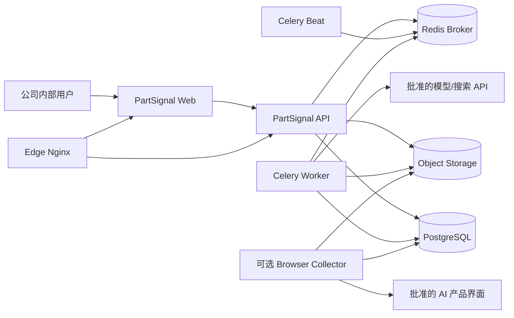
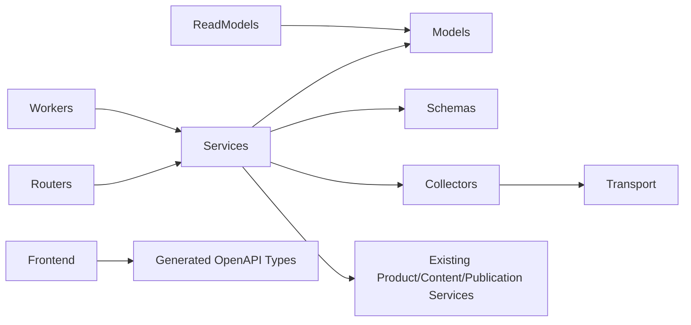

# PartSignal GEO 技术架构

| 项目 | 内容 |
|---|---|
| 文档版本 | V1.0 |
| 文档状态 | 目标设计 |
| 架构策略 | 在现有模块化单体内纵向扩展，不拆微服务，不引入第二业务数据库 |

## 1. 当前技术基线

GEO 核心版继续使用现有技术栈：

| 层 | 技术 |
|---|---|
| 前端 | React、TypeScript、Vite、TanStack Router、TanStack Query、Tailwind CSS、shadcn/ui、Base UI |
| 后端 | Python 3.12、FastAPI、Pydantic、SQLAlchemy、Alembic |
| 业务数据库 | PostgreSQL 16 |
| 异步任务 | Celery、Redis Broker、Celery Beat |
| 文件 | 开发对象存储适配器、生产阿里云 OSS |
| 部署 | Docker Compose、Nginx、现有双 VPS/WireGuard 入口 |
| 契约 | `contracts/openapi.yaml`、`contracts/database.md`、前端生成类型 |
| 质量 | Ruff、Mypy、Pytest、Vitest、Testing Library、Playwright |

## 2. 架构决策摘要

1. 保持模块化单体；
2. PostgreSQL 继续作为业务状态唯一来源；
3. Redis 只传递任务 ID，不保存监测业务正文；
4. 原始大对象和截图进入对象存储，元数据和哈希进入 PostgreSQL；
5. 采集、分析、人工复核分离；
6. 现有人工文章观测保留，新回答级观测使用独立运行模型；
7. MANUAL 回答级观测是核心正式采集方式，保留已有 API；Browser 为 post-core 可选扩展，恢复须满足[ADR-006](../05-decisions/ADR-006-defer-browser-collection-and-adopt-manual-first-core.md)及平台/试点安全门禁；
8. 指标从原始运行与当前有效分析计算，不维护可写的第二份指标事实；
9. 复杂页面由服务端读模型提供，不在浏览器 join；
10. 所有公共接口继续契约优先。

## 3. C4 系统上下文



## 4. 容器与部署组件

### 4.1 核心版初期

不增加常驻服务，复用：

- `api`
- `worker`
- `scheduler`
- `frontend`
- `postgres`
- `redis`

API 采集和分析任务运行于现有 Worker，但通过任务名称、路由配置和指标区分。

### 4.2 浏览器试点

Browser 目标设计及已完成 GEO-801～803 保留；804～807 延期，R7 不阻断 R8 核心发布。核心生产保持 GEO_BROWSER_COLLECTION_ENABLED=false，不启用 geo-browser 服务、会话挂载或能力凭据，且无生产会话，由 GEO-904/906 实测。

浏览器采集不得直接塞入普通 API 容器。恢复试点后使用受 profile 控制的独立服务：

```text
browser-collector
```

它应具备：

- 独立镜像和依赖；
- 独立资源限制；
- 独立 egress 和代理配置；
- 只读取运行 ID 和受控会话引用；
- 不读取数据库中的无关业务数据；
- 全局 kill switch；
- 生产 profile 默认关闭。

## 5. 后端模块划分

目标物理结构建议：

```text
backend/app/
├─ models/
│  ├─ geo_catalog.py
│  ├─ geo_monitoring.py
│  ├─ geo_analysis.py
│  └─ geo_opportunities.py
├─ schemas/
│  ├─ geo_catalog.py
│  ├─ geo_monitoring.py
│  ├─ geo_analysis.py
│  ├─ geo_insights.py
│  └─ geo_opportunities.py
├─ routers/
│  ├─ geo_catalog.py
│  ├─ geo_monitoring.py
│  ├─ geo_insights.py
│  └─ geo_opportunities.py
├─ services/
│  ├─ geo_subjects.py
│  ├─ geo_prompt_variants.py
│  ├─ geo_collection_profiles.py
│  ├─ geo_plans.py
│  ├─ geo_batches.py
│  ├─ geo_runs.py
│  ├─ geo_manual_collection.py
│  ├─ geo_analysis.py
│  ├─ geo_reviews.py
│  ├─ geo_metrics.py
│  ├─ geo_opportunities.py
│  └─ geo_retests.py
├─ collectors/
│  ├─ base.py
│  ├─ manual.py
│  ├─ openai_compatible.py
│  └─ browser/              # 后续阶段
└─ worker.py
```

这是目标结构，不要求一个任务一次创建全部文件。拆分原则：

- Router：HTTP、认证依赖、响应投影、错误映射；
- Application Service：事务、行锁、状态转换、跨实体协调、审计；
- Collector：外部采集协议与解析；
- Metric/Read Service：一致读、批量查询、公式和投影；
- ORM/Schema：按稳定领域归属，不维护全局兼容重导出。

## 6. 模块依赖方向



禁止：

- Collector 直接提交业务事务；
- Router 直接修改 ORM；
- GEO Opportunity 直接写 ContentTask/Publication 表；
- 前端重建状态机；
- Redis 作为运行状态权威；
- 通过对象名称猜测历史关系。

## 7. 同步请求架构

### 7.1 CRUD 和配置

用户操作 → Router → 权限/CSRF → Application Service → PostgreSQL 事务 → Pydantic 投影。

### 7.2 复杂详情和洞察

使用独立 read service：

- 在一个 `REPEATABLE READ` 请求内获取一致快照；
- 批量加载关联对象；
- 查询数不随行数线性增长；
- 服务端应用公式和资格；
- 返回 typed filter options 和不可用原因；
- 不持久化第二份业务状态。

## 8. 异步执行架构

### 8.1 任务类型

```text
partsignal.geo_collect_run
partsignal.geo_analyze_run
partsignal.geo_evaluate_opportunities
partsignal.geo_recompute_batch_status
partsignal.geo_cleanup_artifacts
```

### 8.2 消息原则

Celery 参数只包含稳定 ID，例如：

```json
{"run_id": "uuid"}
```

所有问题、答案、配置、凭据和规则重新从 PostgreSQL/受控密钥边界读取。

### 8.3 数据库权威

Worker 每一步都必须：

1. 锁定目标；
2. 校验状态；
3. 校验 lease/token；
4. 加载不可变快照；
5. 在外部调用前提交必要的运行状态；
6. 外部调用后重新锁定并确认仍可提交；
7. 原子写入结果和状态。

## 9. 采集架构

Collector 使用明确接口，而不是在业务服务中写 provider 条件分支。

```python
class GeoCollector(Protocol):
    @property
    def registration(self) -> CollectorRegistration: ...

    def validate_profile(self, profile: CollectionProfileSnapshot) -> tuple[ProfileBlocker, ...]: ...
    def estimate(self, request: CollectionRequest) -> CollectionEstimate: ...
    def collect(self, request: CollectionRequest, *, before_send: SendAuthorization) -> CollectedAnswer: ...
```

GEO-401 已建立上述内部同步协议和值对象；能力、key/version 复用 Registry 的唯一元数据。
详细字段、稳定错误、发送前回调及当前实现限制见
[Worker/Collector 的 GEO-401 章节](./05-worker-and-collector-architecture.md#当前-r3geo-401-内部采集合同)。
协议不持有 ORM Session，不新增公共 HTTP 或数据库合同；网络 adapter/Worker 仍属后续任务。


`CollectedAnswer` 只包含：

- 回答正文；
- 来源产品/模型标识；
- 搜索是否实际发生；
- 引用；
- 安全原始载荷摘要；
- provider request ID；
- 用量、费用和耗时；
- 可选证据文件内容/引用。

Collector 不生成业务指标和机会。

## 10. 分析架构

分析采用可组合阶段：

```text
Normalize Answer
→ Subject Matching
→ Recommendation Classification
→ Citation Ownership
→ Claim Extraction
→ Fact Assessment
→ Review Gate
```

### 10.1 初始实现策略

- 名称和别名匹配优先使用确定性算法；
- URL/域名归属使用确定性规则；
- 推荐和声明可使用规则 + 可替换分析器；
- 外部分析模型不是原始事实源；
- 分析器输出必须严格 Schema 校验；
- 分析器版本和输入哈希进入 AnalysisRevision；
- 不在失败时自动退回“全部未提及/无错误”。

### 10.2 外部分析模型

如使用现有 AIChannel：

- 使用独立 `analysis` job/adapter，不复用内容生成四字段响应；
- 只有批准的数据可出站；
- 凭据不进入快照；
- 请求至多发送一次；
- 结果必须可人工复核；
- 生产可以配置 `deterministic-only` 分析模式。

## 11. 指标架构

核心指标通过 SQL 和服务端计算：

- 先选择合格运行；
- 再解析当前分析/复核；
- 聚合分子、分母、排除原因；
- 返回趋势和明细下钻过滤器。

性能阶段可使用：

- 组合索引；
- PostgreSQL 物化视图；
- 定时可重建汇总表。

但任何缓存必须：

- 可从原始运行重建；
- 标注生成时间和输入水位；
- 不是写命令的权威；
- 与当前公式版本绑定。

## 12. 与现有 AI 配置的关系

API 监测可绑定现有 `AIChannel` 和 `AIModel`，复用：

- 凭据加密；
- Header 管理；
- 公网 HTTPS/SSRF 防护；
- 模型启停和连接测试；
- 脱敏审计。

但必须新增能力检查：

- 该模型是否允许用于 GEO 监测；
- 是否支持 web search/引用；
- 引用和搜索状态是否可结构化读取；
- 费用和 token 能否报告；
- profile 是否经过管理员批准。

内容生成可用不等于监测采集可用。

## 13. 前端集成

前端继续遵循：

- API 类型只来自 OpenAPI 生成物；
- query key 由 `shared/api/queryKeys.ts` 或对应唯一 owner 管理；
- 服务端返回 `workflow_stage`、`primary_task` 和 `available_actions`；
- URL 保存筛选和选中资源；
- 复杂详情只调用单一 read model；
- 指标不在前端计算；
- 运行状态通过受控轮询刷新；
- 图表必须有明细和可访问表格。

## 14. 功能开关

GEO-004 / R0 已实现以下部署配置及 Settings 校验，当前交付状态为 review：

```text
GEO_MONITORING_ENABLED
GEO_API_COLLECTION_ENABLED
GEO_BROWSER_COLLECTION_ENABLED
GEO_OPPORTUNITY_EVALUATION_ENABLED
```

R0 四项在所有环境均默认 `false`；任一子开关开启必须显式开启 `GEO_MONITORING_ENABLED`，否则进程启动失败。API、BROWSER、OPPORTUNITY 子开关独立，开关本身不触发新任务或外部调用。现有人工文章观测、洞察及优化命令不受这些新开关影响。部署与旧 runtime 省略规则见 [配置权威说明](../../production-configuration.md)。

后续能力实施时必须遵循：

- 关闭写能力不影响历史读取；
- 关闭 API/BROWSER 后 PENDING run 由 Worker 明确失败或暂停，不能伪装成功；
- API、Worker、Scheduler 必须读取同一配置；
- 开关不是权限替代品；
- 开关变化不是热重载，需记录部署版本。

## 15. 可观察性

至少输出以下低敏感指标：

- batch/run 各状态数量；
- oldest pending/run lease age；
- collector 成功率和稳定错误码；
- profile/provider 延迟；
- 分析成功率和 NEEDS_REVIEW 数；
- opportunity evaluator 延迟；
- Scheduler 最近成功创建时间；
- 每日 API 调用数、报告费用和费用覆盖率；
- 对象存储证据写入失败；
- 浏览器会话失效数量。

日志只包含 ID、状态、阶段、错误码、耗时和非敏感 provider metadata。

## 16. 性能目标

核心版初始目标：

- 列表接口 P95 < 500 ms（常规内部数据量）；
- 详情接口查询数固定，不随引用/声明行数 N+1；
- 洞察常用 30 天窗口 P95 < 2 s；
- 单批次支持至少 1,000 个运行记录；
- Scheduler 创建批次使用限批和幂等，不阻塞 API；
- Worker 支持通过并发配置水平扩展；
- 大截图和 raw payload 不进入 JSON API 正文；
- 报告和 CSV 使用流式响应或异步生成，避免内存聚合全部数据。

具体性能验收在 `07-testing-and-quality.md` 中定义。

## 17. 不引入的技术

核心版不默认引入：

- 微服务和分布式事务；
- Kafka/RabbitMQ；
- MongoDB/Elasticsearch；
- 向量数据库；
- 新的身份系统；
- 通用工作流引擎；
- 由前端持有的指标缓存或状态机；
- 自动浏览器农场。

如后续确有瓶颈，必须通过 ADR 和证据引入。
