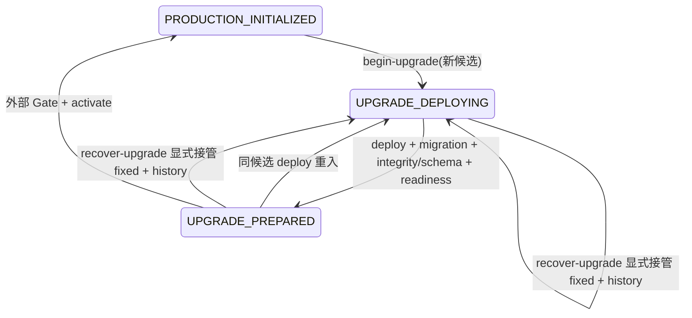

# 状态机设计与测试计划（实施前）

## 根因与现状

prepare-production-data.py 是唯一状态 owner；deploy.sh 在迁移前 begin-upgrade，失败保留 UPGRADE_DEPLOYING。begin_upgrade 对 DEPLOYING/PREPARED 仅 require_candidate；rollback 只接受 PRODUCTION_INITIALIZED。修正版不等于既有不可变候选，因此旧规则正确拒绝，却没有显式接管入口。

## 方案比较

| 方案 | 状态/数据处理 | 优点 | 实质约束与成本 |
| --- | --- | --- | --- |
| 受控前向修复（选择） | failed → fixed 的显式 CAS 接管；phase=UPGRADE_DEPLOYING，追加历史；数据原地保留 | 不恢复或抛弃业务数据，复用现有 deploy/activation | 只接受同 schema_head、两份完整归档迁移树逐文件一致；全服务停止，新镜像先验证 |
| 维护窗口内显式 abort/recover | 独立 ABORTING/RECOVERING 阶段，恢复升级前一致性备份和外部服务状态 | 可恢复不兼容迁移/旧 artifact | 当前 upgrade 无升级前备份绑定；需数据取舍、备份点后写入/外发对账、恢复授权及更多状态；不能简单把 previous_candidate 标 initialized |

选择前向方案最小闭环；跨 schema/修改迁移/缺归档/不静默/未知结果均 fail closed。非目标：clean-init 修复、schema downgrade、生产备份恢复、发布或静默换镜像。

## 状态转换

恢复要求 recovery_id、approval_ref、失败 release_id/manifest sha、新 manifest、失败 manifest 和两份 archive。旧 manifest 仅按 state 已冻结 sha 认证（旧 checkout tracked files 可以不同）；新 manifest 继续走完整 consumer、tracked files 和 image ID/RepoDigest。验证 archive sha，拒绝重复/别名/链接迁移成员；同 backend/alembic/ 全树及 alembic.ini 且当前 maintained migration tree 与新归档一致。旧失败及修正版镜像还须以无网络、无挂载、只读的短生命周期探针证明 /app 内完整迁移树与归档一致；执行 image ID，不能只证明源码。新 release 和至少一个 image ID 必须变化，不能回到 previous_candidate。无需新 manifest 格式或消费豁免。

维护锁覆盖验证和原子持久化。ensure_services_stopped 核对项目、其他运行容器数据挂载；仅接受明确 stopped，不能忽略 Docker 故障。保存 old/new 全候选、approval_ref/recovery_id 和迁移树 digest，previous_candidate 保留。完全相同重复命令在仍 DEPLOYING 时返回原回执，字段冲突/旧失败身份/已 prepared 或 initialized 拒绝；再次 artifact 失败须新的显式恢复身份。中断在写前保持旧候选，原子写后固定新候选，不能形成解绑窗口。

recovery deploy 在 mark-upgrade-prepared 内先重新验证本地镜像，再用权威 Compose、--pull never/--no-deps 的候选 backend 做既有只读 preflight-integrity，并读取真实 alembic_version，必须恰好 manifest schema_head。失败仍 DEPLOYING。activation 不能绕过既有 bootstrap attempt 状态。

run-locked 对 SIGINT/SIGTERM 转发整个子进程组并等待退出，必要时有限期限 SIGKILL，锁持续到子进程结束；不因父进程退出留下推进状态的 orphan。信号不推进 phase，不自动启动/停止远端 Nginx。

## 目标测试与反例

1. 旧版本 initialized → 部署进入 deploying → 迁移提交后/start/readiness 失败，普通新 candidate 和 rollback 均拒绝（实施前先记录 red）。
2. 同 candidate 环境修正可重入；fixed candidate 显式接管成功，完整成功才 prepared/initialized；fixed 再失败仍 deploying。
3. wrong failed ID/sha、同镜像、previous candidate、wrong env/new manifest、tracked hash、image ID/RepoDigest、schema head、归档 hash、迁移变化/本地漂移、链接/重复迁移成员拒绝且 state/data 不变。
4. wrong phase、running project、跨 project 活动数据 mount、并发锁持有、Docker 检查失败拒绝。
5. 原子 write 前/后中断，重复回执及冲突，prepared/initialized 后旧命令拒绝。
6. 向 run-locked 父进程发 SIGTERM：子孙收到信号且退出前锁仍占用，退出后锁可取，状态不得 initialized。
7. 真实隔离 Compose+PostgreSQL16：独立 project/owned volume/随机库，真实 migration artifact 失败与 fixed 服务启动，业务哨兵摘要和历史不变；真实 Docker identity/stop/mount 检查；SIGTERM 清理资源。

使用本地 targeted unittest/Compose harness，不运行无关全仓 verify。不得用 mock 冒充真实业务迁移；本地 Compose 故障 fixture 与权威 Production config/既有 deploy mock 测试分别报告。独立只读复核覆盖身份、持久状态、迁移保证和 signal 生命周期。

迁移镜像证明明确拒绝 Alembic 树中的 `.pyc/.pyo`，并拒绝两个冻结镜像、runtime 和宿主机环境中的非空 `PYTHONPYCACHEPREFIX`，防止树外 unchecked-hash 缓存改变实际 DDL；隔离探针仍读取原始环境键，不能因 `python -I` 忽略配置而漏检。禁写缓存不等于禁止读取缓存。canonical backend/Dockerfile 在 runtime/test 的 uv sync 后仅清理迁移缓存；历史含缓存镜像保持安全停止，不覆盖旧镜像。真实错误 unchecked-hash 缓存反例由 `test-upgrade-image-cache.py` 验证。

首次 initialized→upgrade 在迁移之前由状态所有者验证 runtime/host 与冻结镜像默认环境不指定非空 PYTHONPYCACHEPREFIX，原子记录与完整 candidate 绑定的 DEFAULT_PYTHON_CACHE_V1 执行策略。恢复必须验证失败执行的既有策略；仅当前配置正常不足以证明历史。历史缺失、unknown 或候选错配均拒绝，不能在同候选重入或恢复时补造历史证明；保留 maintenance，另行设计显式备份 abort/recover。成功恢复绑定新策略，回执保留旧策略。历史 runtime 清除反例已用真实 Docker loader 与接管前状态测试验证。

upgrade 镜像交付顺序：verify-upgrade-entry 通过完整 manifest consumer 并只读判定 phase/candidate → Compose config → registry pull（local不pull）→ frozen image ID/RepoDigest验证 → begin-upgrade 原子证明cache policy与绑定candidate → run/up。入场判定与begin共用状态所有者规则；错误manifest/另一候选在pull前拒绝，registry未缓存镜像不能要求先inspect；pull/identity/policy失败均不开始首次upgrade。clean-init时序保持原合同。
