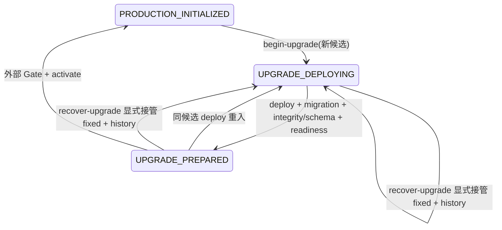

# 状态机设计与测试计划（实施前）

## 根因与现状

prepare-production-data.py 是唯一状态 owner；deploy.sh 在迁移前 begin-upgrade，失败保留 UPGRADE_DEPLOYING。begin_upgrade 对 DEPLOYING/PREPARED 仅 require_candidate；rollback 只接受 PRODUCTION_INITIALIZED。修正版不等于既有不可变候选，因此旧规则正确拒绝，却没有显式接管入口。

## 方案比较

| 方案 | 状态/数据处理 | 优点 | 实质约束与成本 |
| --- | --- | --- | --- |
| 受控前向修复（选择） | failed → fixed 的显式 CAS 接管；phase=UPGRADE_DEPLOYING，追加历史；数据原地保留 | 不恢复或抛弃业务数据，复用现有 deploy/activation | 只接受同 schema_head、两份完整归档迁移树逐文件一致；全服务停止，新镜像先验证 |
| 维护窗口内显式 abort/recover | 独立 ABORTING/RECOVERING 阶段，恢复升级前一致性备份和外部服务状态 | 可恢复不兼容迁移/旧 artifact | 当前 upgrade 无升级前备份绑定；需数据取舍、备份点后写入/外发对账、恢复授权及更多状态；不能简单把 previous_candidate 标 initialized |

选择前向方案最小闭环；跨 schema/修改迁移/缺归档/不静默/未知结果均 fail closed。非目标：clean-init 修复、schema downgrade、生产备份恢复、发布或静默换镜像。

## 状态转换

恢复要求 recovery_id、approval_ref、失败 release_id/manifest sha、新 manifest、失败 manifest 和两份 archive。旧 manifest 仅按 state 已冻结 sha 认证（旧 checkout tracked files 可以不同）；新 manifest 继续走完整 consumer、tracked files 和 image ID/RepoDigest。验证 archive sha，拒绝重复/别名/链接迁移成员；同 backend/alembic/ 全树及 alembic.ini 且当前 maintained migration tree 与新归档一致。旧失败及修正版镜像还须以无网络、无挂载、只读的短生命周期探针证明 /app 内完整迁移树与归档一致；执行 image ID，不能只证明源码。新 release 和至少一个 image ID 必须变化，不能回到 previous_candidate。无需新 manifest 格式或消费豁免。

维护锁覆盖验证和原子持久化。ensure_services_stopped 核对项目、其他运行容器数据挂载；仅接受明确 stopped，不能忽略 Docker 故障。保存 old/new 全候选、approval_ref/recovery_id 和迁移树 digest，previous_candidate 保留。完全相同重复命令在仍 DEPLOYING 时返回原回执，字段冲突/旧失败身份/已 prepared 或 initialized 拒绝；再次 artifact 失败须新的显式恢复身份。中断在写前保持旧候选，原子写后固定新候选，不能形成解绑窗口。

recovery deploy 在 mark-upgrade-prepared 内先重新验证本地镜像，再用权威 Compose、--pull never/--no-deps 的候选 backend 做既有只读 preflight-integrity，并读取真实 alembic_version，必须恰好 manifest schema_head。失败仍 DEPLOYING。activation 不能绕过既有 bootstrap attempt 状态。

run-locked 对 SIGINT/SIGTERM 转发整个子进程组并等待退出，必要时有限期限 SIGKILL，锁持续到子进程结束；不因父进程退出留下推进状态的 orphan。信号不推进 phase，不自动启动/停止远端 Nginx。

## 目标测试与反例

1. 旧版本 initialized → 部署进入 deploying → 迁移提交后/start/readiness 失败，普通新 candidate 和 rollback 均拒绝（实施前先记录 red）。
2. 同 candidate 环境修正可重入；fixed candidate 显式接管成功，完整成功才 prepared/initialized；fixed 再失败仍 deploying。
3. wrong failed ID/sha、同镜像、previous candidate、wrong env/new manifest、tracked hash、image ID/RepoDigest、schema head、归档 hash、迁移变化/本地漂移、链接/重复迁移成员拒绝且 state/data 不变。
4. wrong phase、running project、跨 project 活动数据 mount、并发锁持有、Docker 检查失败拒绝。
5. 原子 write 前/后中断，重复回执及冲突，prepared/initialized 后旧命令拒绝。
6. 向 run-locked 父进程发 SIGTERM：子孙收到信号且退出前锁仍占用，退出后锁可取，状态不得 initialized。
7. 真实隔离 Compose+PostgreSQL16：独立 project/owned volume/随机库，真实 migration artifact 失败与 fixed 服务启动，业务哨兵摘要和历史不变；真实 Docker identity/stop/mount 检查；SIGTERM 清理资源。

使用本地 targeted unittest/Compose harness，不运行无关全仓 verify。不得用 mock 冒充真实业务迁移；本地 Compose 故障 fixture 与权威 Production config/既有 deploy mock 测试分别报告。独立只读复核覆盖身份、持久状态、迁移保证和 signal 生命周期。

迁移镜像证明明确拒绝 Alembic 树中的 `.pyc/.pyo`，并拒绝两个冻结镜像、runtime 和宿主机环境中的非空 `PYTHONPYCACHEPREFIX`，防止树外 unchecked-hash 缓存改变实际 DDL；隔离探针仍读取原始环境键，不能因 `python -I` 忽略配置而漏检。禁写缓存不等于禁止读取缓存。canonical backend/Dockerfile 在 runtime/test 的 uv sync 后仅清理迁移缓存；历史含缓存镜像保持安全停止，不覆盖旧镜像。真实错误 unchecked-hash 缓存反例由 `test-upgrade-image-cache.py` 验证。

首次 initialized→upgrade 在迁移之前由状态所有者验证 runtime/host 与冻结镜像默认环境不指定非空 PYTHONPYCACHEPREFIX，原子记录与完整 candidate 绑定的 DEFAULT_PYTHON_CACHE_V1 执行策略。恢复必须验证失败执行的既有策略；仅当前配置正常不足以证明历史。历史缺失、unknown 或候选错配均拒绝，不能在同候选重入或恢复时补造历史证明；保留 maintenance，另行设计显式备份 abort/recover。成功恢复绑定新策略，回执保留旧策略。历史 runtime 清除反例已用真实 Docker loader 与接管前状态测试验证。

upgrade 镜像交付顺序：verify-upgrade-entry 通过完整 manifest consumer 并只读判定 phase/candidate → Compose config → registry pull（local不pull）→ frozen image ID/RepoDigest验证 → begin-upgrade 原子证明cache policy与绑定candidate → run/up。入场判定与begin共用状态所有者规则；错误manifest/另一候选在pull前拒绝，registry未缓存镜像不能要求先inspect；pull/identity/policy失败均不开始首次upgrade。clean-init时序保持原合同。

## 2026-10-06 独立 Review 后的合同修正（当前设计）

固定 8162f580 的 CHANGES_REQUESTED 指出：原 Alembic 树不是实际迁移运行时闭包；正式 recover 入口未使用 signal supervisor；phase 不能证明失败。用户明确要求直接修复并保持严格失败恢复语义。以下覆盖上文仅迁移树/无需新 manifest 字段的旧设计。

Migration Runtime Fingerprint 使用 MIGRATION_RUNTIME_V1，唯一无状态 owner 为 production_migration_runtime.py。源码闭包由共同静态 import 选择器处理 archive、checkout、image；包含配置、db、冻结元数据、models及传递 helper。未知动态加载及链接显式拒绝。镜像不启动、不执行Python，使用静态rootfs export测量Python、完整依赖（含缓存）、共享库、实际base文件与执行配置；/app缓存全部拒绝。允许非迁移应用源码或Cmd修正，不允许Entrypoint、工作目录、闭包或环境变化。指纹在manifest中认证，首次begin-upgrade在迁移前原子冻结；历史缺失不补造。

runtime.env 在首次升级与恢复的部署边界沿用既有 runtime 字段白名单，禁止额外 PATH/PYTHONPATH/LD_PRELOAD 等加载输入覆盖镜像。业务配置修正仍由既有生产输入/应用预检拥有，不把包含密钥的 runtime 内容放入低敏回执。

每次 begin-upgrade 建立独立 RUNNING attempt。deploy.sh 的明确非零退出路径调用状态 owner 记录完整不可变failure fact；重入使旧failure不可消费。PREPARED后的问题通过独立批准声明记录，标识声明来源而非虚构exit；FAILED prepared attempt不能激活。recover要求 failure_id、匹配当前attempt/candidate的终态失败和未消费记录，回执嵌入完整record与runtime；原子切换仍不 initialized、不改DB。

正式 recover-upgrade 无继承锁FD时自动run-locked self-wrap，内层验证FD。真实入口测试在阻塞docker ps时只向父PID发SIGTERM，观察子孙不可执行前锁不可取、退出后可取且state字节不变。Compose旧自定义Entrypoint故障fixture不再满足等价runtime，改为仅修改app.cli/app.main artifact，在真实migration提交后失败；完整固定项目和资源仍精确隔离清理。

验收采用真实缺失failure反例red→green、runtime/source/cache负例、状态冻结与重放、真实入口signal、Compose/PG16历史摘要及既有production manifest消费者自检。当前生产现场、真实备份/外部Gate/registry、精确新commit远端CI不因这些本地结果自动通过。

## 2026-10-06 完整闭包复核后的目标修正

静态 AST 无法证明任意依赖或 startup/cache 不会反向加载应用 artifact；固定源码 hash 或增加 loader 黑名单也不足。最终改为独立冻结 migration image：首次候选默认与 backend 相同，修复候选明确保留旧 migration image 身份；Compose migrate 只用此镜像，API/CLI/integrity/readiness 用修复 backend。manifest 单列 migration reference/ID/RepoDigest；首次迁移前冻结完整 migration image fingerprint，恢复比较两端该完整程序，不能用当前证明补造历史。

完整指纹包含 migration image 全部 rootfs 路径、文件内容/权限/归属/链接、Python 源码及缓存 mtime 和执行配置；Alembic tree 单独用于认证两份 source archive 与当前 checkout。应用模块、外部 loader、依赖、Python、基础系统及字节码均位于同一个冻结程序内，即使依赖动态加载 app，也会加载原 migration image 中相同的 app 文件。恢复 backend 的模型/配置/CLI/main 修正不改变该迁移程序。未知 migration image、指纹变化、schema/Alembic变化仍拒绝。移除对任意 Python 静态闭包完整性的承诺与临时精确源码 allowlist。

最终配置信任边界：允许的 runtime.env 键由已纳入 manifest tracked allowlist 的 check-production-inputs.py 静态声明拥有；模板只提供 required/default，不得通过新增 PATH/LD_PRELOAD 等字段改变授权集合。包含既有合法可选 GEO_DAILY_BUDGET_LIMIT。该决策避免把未认证模板变成迁移加载输入的权限所有者，变更生产配置键须同步脚本合同、模板及应用Settings。
