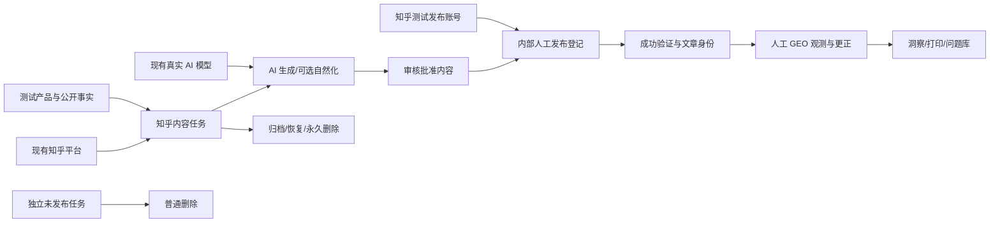

# 生产环境全业务流程验收设计

## 1. 边界

本任务是生产形态公网环境上的临时交互式验收，不修改产品代码、契约、数据库或部署配置。唯一写入来自管理员通过真实 UI 发出的正常业务命令；只读运维动作可用于安全取得登录上下文，但不能替代页面操作或直接查看业务表。

公网环境不会运行仓库本地 Playwright Test Runner 的 Mock Provider 流程。现有 E2E 仅用于确认业务顺序、页面入口和预期状态，实际证据全部来自独立命名的 `playwright-cli` 会话。

## 2. 会话、身份与敏感信息

- 会话名固定为 `prod-business-acceptance`，所有 CLI 命令显式携带 `-s=prod-business-acceptance`。
- 登录前不抓取包含密码值的 DOM 快照或截图；密码只保存在当前命令进程的临时变量中，不写文件、不输出。
- 不保存浏览器 storage state；结束时退出登录、关闭会话并用 `playwright-cli list --all --json` 验证。
- 运行标识使用北京时间戳加短随机后缀，例如 `PS-E2E-20260806-<suffix>`。所有测试实体名称、备注和搜索词都携带该标识。
- 既有 `.playwright-cli/` 文件不属于本任务；本任务只记录新产物路径，不做目录级清理。

## 3. 测试数据拓扑

核心链复用现有知乎平台和一个已有、凭据完整的真实 AI 渠道/模型，不读取或替换密钥。平台管理与 Prompt 管理另建隔离测试记录，避免改写知乎现有名称、域名、Prompt 或类型。

## 4. 页面测试矩阵

| 页面/路由 | 主要验收动作 | 写入与恢复 |
|---|---|---|
| 登录 `/login`、工作台 `/` | 登录、指标加载、导航、主题代表性切换、控制台检查 | 主题恢复原值 |
| 改密 `/change-password` | 专用工程师首次登录强制改密 | 最后停用并删除测试用户 |
| 产品 `/products`、`/products/:id` | 新建、搜索、编辑事实、提交与批准版本、详情/版本切换 | 核心任务永久删除后尝试按契约清理事实和产品 |
| 内容任务 `/tasks`、`/tasks/:id` | 新建核心任务与普通删除任务、筛选、详情、生成入口、状态轮询 | 普通删除一个；核心任务最后永久删除 |
| 内容编辑 `/content/:id` | 查看追溯、编辑/保存、提交审核、批准；条件允许时自然化 | 随核心任务永久删除 |
| 发布 `/publications` | 建立发布工作、选择知乎测试账号、登记模拟标题/URL/时间、验证通过 | 随核心任务永久删除；账号单独清理 |
| 观测 `/observations`、更正路由 | 创建人工文章搜索观测、关联测试文章、查看详情、创建一次更正 | 随核心任务永久删除；若契约保留则报告 |
| 洞察/打印/问题库 | 带核心产品筛选查看指标、图表、打印视图和问题列表 | 只读 |
| 业务设置 `/settings` | 创建/查看/编辑知乎测试发布账号 | 核心链结束后删除 |
| 用户 `/users` | 创建工程师、重置/首次改密、权限隔离、停用、删除 | 完整清理 |
| 审计 `/audit` | 搜索并查看关键动作详情、检查敏感值不回显 | 只读；永久删除后按墓碑契约复核 |
| 平台类型/平台 | 专用测试类型与平台的创建、编辑、筛选、引用冲突及最终删除 | 删除专用记录，不改现有知乎 |
| Prompt `/configuration/prompts` | 专用平台 Prompt 创建、编辑、绑定、预览入口可用、删除/自动解绑 | 删除专用 Prompt 与平台；全局自然化 Prompt 只读 |
| AI 渠道/详情 | 列表/筛选、详情、请求配置脱敏、使用统计、模型连接测试、停用后显式启用；在无活动作业时短暂停用/启用渠道 | 恢复渠道和模型的初始启用状态；不改 Key/Header/base URL |

“所有页面”按当前 `App.tsx` 的路由集合验收；不存在测试实体或权限前置时，动态路由通过本次实体进入。穷举每个字段、每个异常组合和像素级视觉对比不属于本任务。

## 5. 核心状态流

1. 记录知乎平台、候选 AI 渠道/模型、全局自然化 Prompt 的只读初态。
2. 创建测试用户、隔离的平台类型/平台/Prompt、知乎发布账号和产品事实。
3. 批准事实后创建两个内容任务：一个立即用于普通删除，一个进入完整闭环。
4. 对核心任务调用真实 AI；只等待服务端终态，不用刷新竞速或候选字段猜测成功。
5. 生成成功后完成编辑、审核批准；只有页面明确提供自然化动作且全局 Prompt 已配置时才执行自然化，否则记录为条件性未执行，不创建永久配置。
6. 在发布管理内模拟人工知乎发布：登记带唯一标识的测试 URL，执行首次验证为通过，使任务完成。
7. 创建人工 GEO 观测并更正一次，检查洞察、打印和问题库。
8. 验证完成任务普通删除门禁、归档、恢复、再次归档、预览和固定文本永久删除。
9. 清理其余测试记录并恢复既有渠道/模型/主题初态。

## 6. 失败、停止与恢复

- 登录失败、线上版本不含目标删除功能、核心页面出现应用级控制台错误、真实模型无可用候选、生成失败或状态长时间不进入终态时，停止依赖链路并记录准确阻断点。
- 不为继续测试而创建新渠道、替换现有 API Key、修改敏感 Header、放宽 SSRF 策略或操作服务器数据库。
- 渠道/模型状态变化后优先恢复；即使后续业务失败，也先执行恢复和会话关闭。
- 删除或恢复返回 revision 冲突时重新读取页面最新状态后只重试一次；再次失败即报告，不绕过并发控制。
- 永久删除前核对唯一标识、产品、知乎平台和登记 URL，确保目标是本次核心测试任务。永久删除不可回滚，预览范围异常时停止。
- 第三方知乎页面从未创建，因此无外部清理动作；报告明确“站内模拟成功”，不得表述为真实知乎发布或真实外部搜索结果。

## 7. 报告

在任务目录生成 `report.md`，包含环境与运行标识、页面矩阵结果、核心状态时间线、删除预览与清理结果、控制台/网络异常、AI 调用结果与费用风险、失败/阻断/未执行项。证据只记录页面标题、状态、测试实体短标识和不敏感截图/快照路径。
