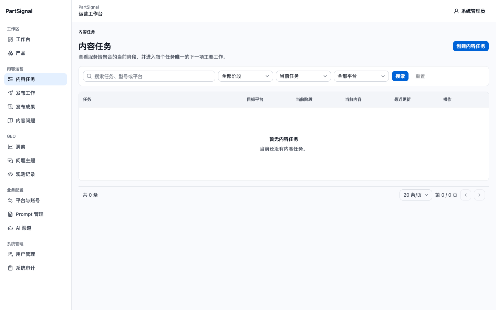
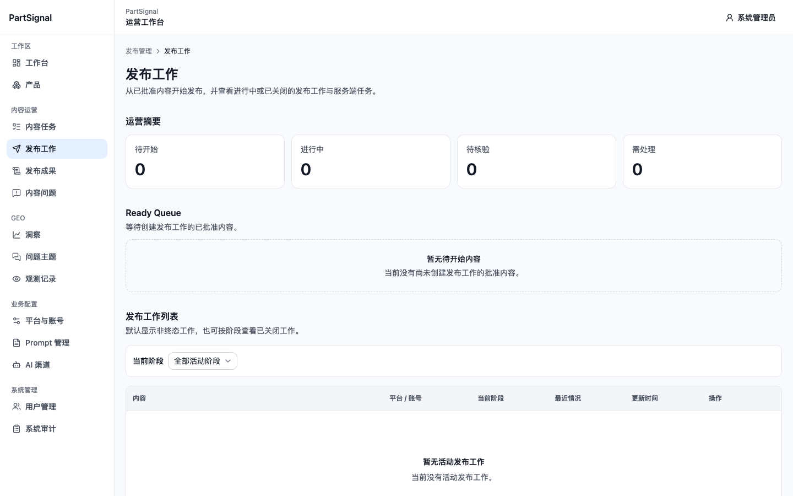
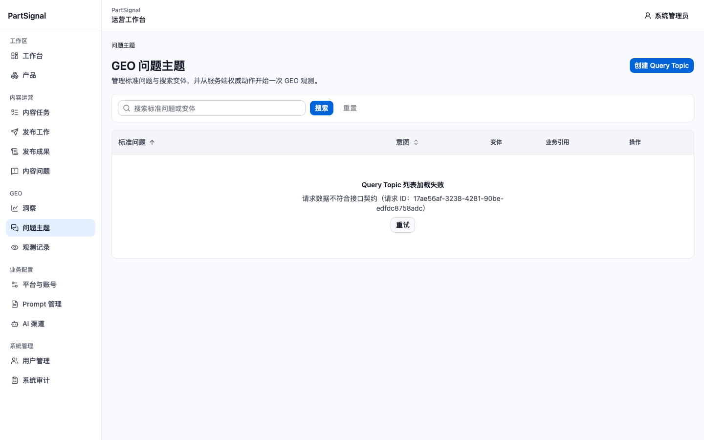
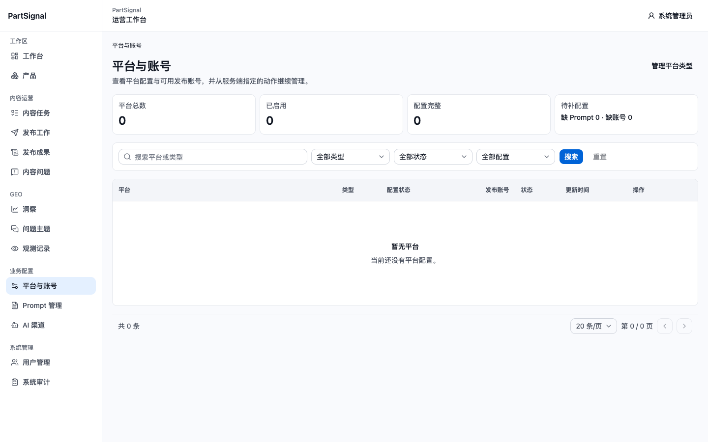
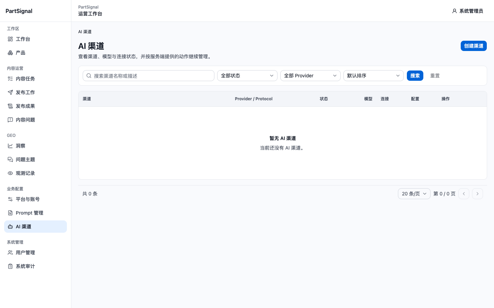
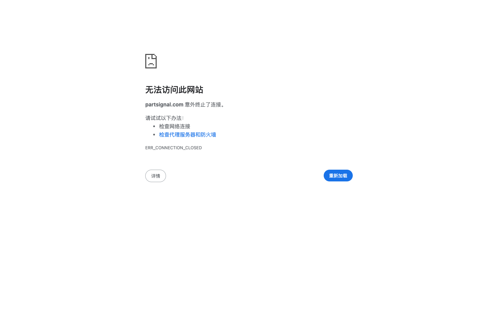

# V2 波次 2 已认证续跑验收报告

## 结论

本 run 结果为 `BLOCKED`，不是完整通过。获授权的第二个独立 Chromium 会话在权威目标 `https://geo.962850.xyz` 完成了一次 ADMIN 登录，并从 `/content/tasks` 继续覆盖内容任务、发布、GEO 与设置页；准备进入 `/system/users` 时，执行命令误用了非任务目标 `https://partsignal.com/system/users`，Chromium 返回该非目标域名的 `ERR_CONNECTION_CLOSED`。本任务会话随后被关闭，因此系统管理页、移动端和键盘检查未完成。该中断属于测试执行错误，不是目标环境故障或产品缺陷。

收口复核确认权威目标仍可用：`https://geo.962850.xyz/`、`/api/health/live`、`/api/health/ready` 均返回 200，页面标题仍为 `PartSignal Frontend V2`。不过已授权的一次重新登录和独立会话已经使用并关闭，波次 2 尚未完成，所以本轮没有再次开会话或登录，也没有进入波次 3。

本轮确认一个高严重度线上功能缺陷：`/geo/topics` 页面请求 `GET /api/v1/query-topics/list-items?sort=QUESTION_ASC&page=1&page_size=20` 返回 HTTP 422，页面显示“Query Topic 列表加载失败 / 请求数据不符合接口契约”。该缺陷使 Query Topic 列表不可用，并直接阻断对应的波次 3 可回滚业务流程。

## 运行身份与边界

- Run ID：`20260830-192848-v2-auth-resume`
- 执行时间：2026-08-30 19:28–19:36（Asia/Shanghai）
- 权威目标：`https://geo.962850.xyz`
- 浏览器：项目 `playwright-cli` 独立 Chromium 会话 `v2-auth-resume-192848`
- 视口：已完成部分为 1440×900；375×900 因执行 URL 漂移后当前已授权会话被关闭而 `NOT_RUN`
- 认证：用户明确授权后仅登录一次；脱敏 `/api/v1/auth/me` 结果为 HTTP 200、`accountType=ADMIN`、`mustChangePassword=false`
- 写入边界：除获授权的 `POST /api/v1/auth/login` 外，没有执行业务 `POST/PUT/PATCH/DELETE`
- 启动前与收口后：均确认没有遗留本任务浏览器；收口后 `browsers=[]`、`servers=[]`
- 环境口径：收口时权威目标首页与两个 `/api/health/*` 合同端点均为 200，页面标题与 V2 基线一致；结合当前任务已冻结的 `.env.staging`、`partsignal-staging`、fake OSS 与 release 材料，没有观察到身份漂移。但这些证据仍不能独立证明当前公网实例对应那份 Staging release，未形成 R10 要求的当前运行态正面 Staging 证据。波次 3 同时受波次 2 未完成、认证会话已关闭和 Staging 正面门禁不足约束

## 编号执行步骤

1. `PASS` — 在 1440×900 打开登录页，检查稳定表单状态，确认截图中没有密码或认证信息。
2. `PASS` — 使用不回显输入完成一次 ADMIN 登录；`POST /api/v1/auth/login` 返回 200，App Shell 显示系统管理员，未触发强制改密。
3. `PASS` — 脱敏读取 `/api/v1/auth/me`：HTTP 200、`ADMIN`、`mustChangePassword=false`；未保存 Cookie、Token、CSRF 或请求头。
4. `PASS` — `/content/tasks` canonical 化为 `?archiveStatus=ACTIVE&page=1&pageSize=20`，空列表正常渲染；搜索 `TEST-W2-NOT-FOUND` 后出现匹配空态，重置后查询参数和初始空态恢复，交互仅触发 GET。
5. `PASS` — `/publishing/work`、`/publishing/articles`、`/publishing/issues` 可达，空列表、计数、筛选与分页框架正常，无页面级横向溢出。
6. `PASS` — `/geo/insights` 与 `/geo/observations` 可达，当前无数据状态正常，无页面级横向溢出。
7. `FAIL` — `/geo/topics` 列表请求返回 HTTP 422，页面进入接口契约错误态；由于目标随后中断，未完成页面内“重试”按钮的第二次复现。
8. `PASS` — `/settings/platforms`、`/settings/platforms/types`、`/settings/prompts`、`/settings/ai` 可达，空列表和主要入口正常，无页面级横向溢出。
9. `BLOCKED` — 准备进入 `/system/users` 时执行命令误用了非任务域名 `partsignal.com`，Chromium 转为 `chrome-error://chromewebdata/` 并显示 `ERR_CONNECTION_CLOSED`；这张错误页不能作为权威目标环境证据。
10. `PASS` — 纠正域名后以匿名 `curl` 复核权威目标：主页、`/api/health/live`、`/api/health/ready` 均为 200，live 为 `ok`，ready 的 PostgreSQL 与 Redis 均为 `ok`。
11. `NOT_RUN` — direct reload/history、账户菜单键盘恢复、375×900 移动导航、移动系统审计与触控目标测量因环境中断未执行。
12. `BLOCKED` — 当前公开证据没有观察到身份漂移，但未形成 R10 要求的正面 Staging 证明；同时波次 2 尚未完成且已授权认证会话已经关闭。没有创建 TEST registry，没有生成 TEST 对象，也没有执行任何业务写入或清理。
13. `PASS` — 精确关闭会话 `v2-auth-resume-192848`，会话清单确认 `browsers=[]`、`servers=[]`；未使用 `close-all` 或 `kill-all`。

## 缺陷

### P1-002：Query Topic 列表接口返回 422，核心页面不可用

- 严重度：P1 / High
- 页面：`/geo/topics?sort=QUESTION_ASC&page=1&pageSize=20`
- 最短复现：ADMIN 登录后通过侧栏进入“问题主题”，或直接打开上述 canonical URL。
- 预期：返回 Query Topic 列表或合法空态，并允许查看、筛选及创建测试主题。
- 实际：页面显示“Query Topic 列表加载失败”和“请求数据不符合接口契约”；`GET /api/v1/query-topics/list-items?sort=QUESTION_ASC&page=1&page_size=20` 返回 HTTP 422。
- 当前请求标识：`17ae56af-3238-4281-90be-edfdc8758adc`
- 影响：Query Topic 列表与后续业务操作不可用；波次 3 的 Query Topic 创建/编辑/删除流程被直接阻断。
- 证据：`screenshots/04-geo-topics-1440.png`

### EXEC-BLOCK-001：系统页面导航误用非任务域名，导致本轮续跑提前收口

- 分类：测试执行阻断，不是产品缺陷
- 触发位置：从权威目标 `/settings/ai` 准备导航到 `/system/users` 时，命令错误使用 `https://partsignal.com/system/users`
- 非目标浏览器结果：`ERR_CONNECTION_CLOSED`；随后对同一非目标域名的独立 curl 在 TLS 阶段失败并返回 HTTP 000
- 权威目标复核：`https://geo.962850.xyz/`、`/api/health/live`、`/api/health/ready` 均为 200
- 影响：当前已授权会话被关闭，系统管理页、移动端和键盘/焦点补充检查未完成；既有目标页面证据仍有效，但不能把非目标错误页归因为目标环境。
- 证据：`screenshots/07-nontarget-domain-error-1440.png`

## 页面结果矩阵

| 页面/能力 | 结果 | 说明 |
| --- | --- | --- |
| 登录、认证守卫、`/auth/me` | `PASS` | ADMIN，未强制改密 |
| `/content/tasks` | `PASS` | 空态、搜索、重置与 canonical 查询通过 |
| `/publishing/work` | `PASS` | 空态与计数通过 |
| `/publishing/articles` | `PASS` | 空态通过 |
| `/publishing/issues` | `PASS` | 空态通过 |
| `/geo/insights` | `PASS` | 空态通过 |
| `/geo/topics` | `FAIL` | 列表 GET 返回 422 |
| `/geo/observations` | `PASS` | 空态通过 |
| `/settings/platforms` | `PASS` | 空态、筛选框架与平台类型入口通过 |
| `/settings/platforms/types` | `PASS` | 空态与新建入口可见，未进入写入流 |
| `/settings/prompts` | `PASS` | 空态与新建入口可见，未进入写入流 |
| `/settings/ai` | `PASS` | 空态与创建入口可见，未进入写入流 |
| `/system/users` | `NOT_RUN` | 执行 URL 漂移到非任务域名，权威目标页未加载 |
| `/system/audit` | `NOT_RUN` | 当前已授权会话随后关闭 |
| 真实详情 | `NOT_APPLICABLE` | 已完成列表均为空，没有从 UI 发现可安全使用的真实 ID |
| 375×900 与移动 Sheet | `NOT_RUN` | 当前已授权会话提前收口 |
| 波次 3 TEST 流程 | `BLOCKED` | R10 正面 Staging 证据不足，且波次 2 未完成、认证会话已关闭；零业务写入 |

## 当前运行截图

### 内容任务列表

### 发布工作列表

### Query Topic 422 错误态

### 平台与账号

### AI 渠道

### 非任务域名连接关闭（仅用于记录执行错误）

## UI/UX 与可访问性观察

- 已完成的 1440×900 页面中，侧栏、标题、筛选区、表格空态和分页区层级清晰，没有观察到页面级横向溢出。
- `/geo/topics` 的错误态包含问题摘要、重试入口和请求标识，诊断信息可见；但核心列表完全不可用，属于功能阻断。
- 由于 375×900、键盘焦点恢复、移动 Sheet 和触控目标测量未执行，本报告不宣称响应式、键盘无障碍或 WCAG 合规。
- 截图只证明捕获时的可见状态，不能替代语义树、全键盘路径、辅助技术或完整跨浏览器验证。

## 网络与数据安全

- 获授权的认证写请求仅为一次 `POST /api/v1/auth/login`，返回 200。
- 本轮完成的搜索、重置、路由与列表行为均未触发业务 mutation；未执行创建、编辑、状态迁移、删除、上传、发布、AI test/discovery、生成或永久删除。
- 报告和截图不包含密码、Cookie、Token、CSRF、Authorization、敏感 Header 或请求 body。
- 系统用户和审计页没有在权威目标稳定加载，因此没有保存可能包含个人信息的页面截图。

## 剩余风险

- `/geo/topics` 需要在环境恢复后复现并追踪前后端分页/排序参数合同，当前请求已显示 `page_size` 与页面 URL 的 `pageSize` 转换路径值得优先核查。
- `/system/users`、`/system/audit`、详情、direct reload/history、账户菜单、375×900、移动 Sheet 和键盘/焦点仍缺当前运行证据。
- 后续必须明确使用权威目标 `https://geo.962850.xyz`，先完成波次 2 剩余检查，再在同一受控认证 context 中获取可把公网实例与 Staging release 直接关联的正面证据，重做波次 3 写入前门禁。
