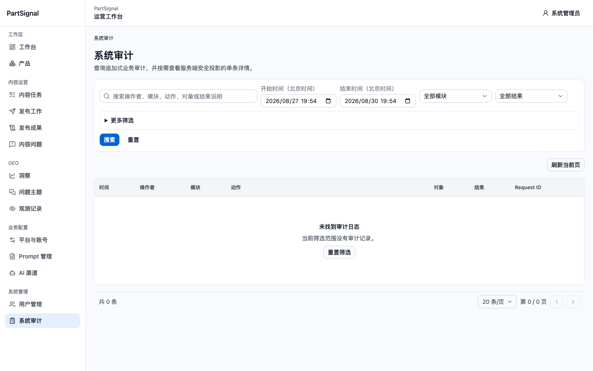
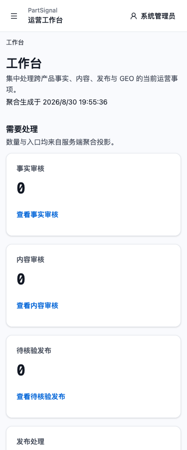
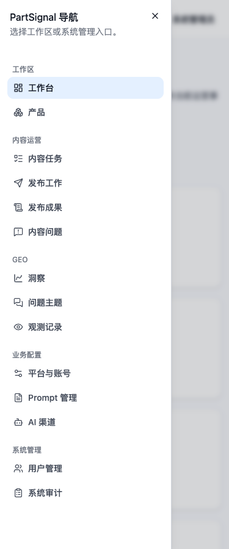
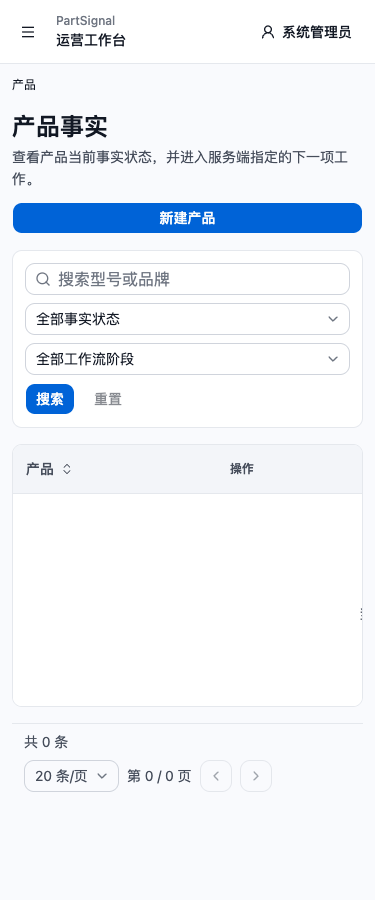
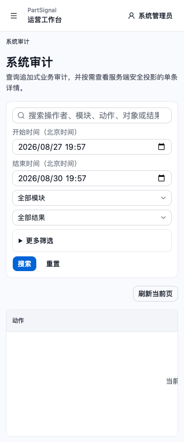
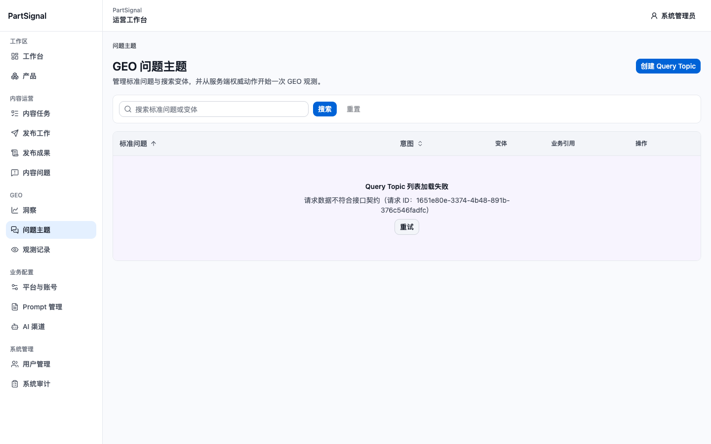

# V2 波次 2 最终补测报告

## 结论

波次 2 已在权威目标 `https://geo.962850.xyz` 补测完成，整体结论为 `FAIL`：核心已认证路由、桌面系统管理页、代表性 Reload/Back/Forward、账户菜单、375×900 工作台/产品/系统审计和移动导航均获得当前运行证据；但确认一个 P1 功能缺陷和两个 P2 移动端 UX/可访问性问题。没有发现认证绕过、敏感信息泄露或登录以外的业务 mutation。

波次 3 在本次浏览器 run 收口时因缺少运行态直接关联证据而为 `BLOCKED`，且没有执行任何业务写入。2026-08-30 20:12:24（Asia/Shanghai），经用户另行授权的 `ssh hostdzire` 只读核验已把公网域名、当前启用的 Staging Nginx upstream、运行中 frontend 容器、Compose project、release、image ID 与 source commit 直接关联，R10 Staging 正面门禁后续转为 `PASS`；波次 2 的 `FAIL` 结论和三个缺陷不变，波次 3 尚未开始。

## 运行身份与边界

- Run ID：`20260830-195237-v2-auth-final`
- 执行时间：2026-08-30 19:52:37–19:59:40（Asia/Shanghai）
- 权威目标：`https://geo.962850.xyz`
- 浏览器：项目 `playwright-cli` 独立 Chromium 会话 `v2-auth-final-195237`
- 视口：1440×900、375×900
- 认证：本次用户授权后仅登录一次；`/api/v1/auth/me` 为 HTTP 200、`accountType=ADMIN`、`mustChangePassword=false`
- 写入边界：除获授权的 `POST /api/v1/auth/login` 外，没有执行创建、更新、删除、发布、上传、生成或其他业务 mutation
- 详情边界：产品、内容、发布、GEO 与审计列表没有可安全选择的真实详情记录，因此详情检查为 `NOT_APPLICABLE`，没有猜测或枚举 ID
- 收口：精确关闭本任务会话，`browsers=[]`、`servers=[]`；未使用 `close-all` 或 `kill-all`

## 编号执行步骤

1. `PASS` — 权威目标首页、`/api/health/live`、`/api/health/ready` 均为 200；页面标题为 `PartSignal Frontend V2`，PostgreSQL 与 Redis 均为 `ok`。
2. `PASS` — 1440×900 登录一次成功，进入 canonical `/`；ADMIN 角色和非强制改密状态得到脱敏字段证据。
3. `PASS` — `/system/users` canonical 化为 `?status=ENABLED&page=1&pageSize=20`，显示 2 个启用账号；搜索 `TEST-W2-NOT-FOUND` 进入合法空态，重置后恢复 2 行，交互仅触发 GET。未保存用户列表截图。
4. `PASS` — `/system/audit` 默认查询最近三天，当前 0 条；筛选区、空态、分页和“刷新当前页”正常，页面级无横向溢出。
5. `PASS` — `/system/audit` Reload 后保持稳定；Back 返回 `/system/users`，Forward 返回 `/system/audit`，没有循环、空白或跨域跳转。
6. `PASS` — 桌面账户菜单可打开，显示“修改密码”和“退出登录”；按 Escape 后菜单关闭并把焦点恢复到“系统管理员”按钮，未选择任何菜单项。
7. `PASS` — 375×900 工作台没有页面级横向溢出，聚合卡片按单列重排；移动主导航 Sheet 可打开，所有一级入口可见，Escape 动画结束后关闭并恢复到导航按钮。
8. `PASS` — 375×900 `/products` 没有页面级横向溢出；筛选区、局部表格滚动和分页可达。
9. `FAIL` — 375×900 `/system/audit` 虽没有页面级横向溢出，但空态单元格仍按 832px 表格宽度居中；初始 349px 滚动区域只显示被截断的一小段提示，用户必须横向滚动才能读懂空态。
10. `FAIL` — 375×900 `/products` 的导航、账户按钮、新建入口、输入框、下拉框、搜索/重置和分页按钮高度多为 28–32px，低于项目约定的约 44px 触控目标；这是匿名登录页 P2-001 在已认证页面的扩展证据。
11. `FAIL` — `/geo/topics` 首次加载和点击一次“重试”后，`GET /api/v1/query-topics/list-items?sort=QUESTION_ASC&page=1&page_size=20` 均返回 422；新请求标识为 `1651e80e-3374-4b48-891b-376c546fadfc`。
12. `PASS` — 可观察 console 仅包含上述两次已归因的 Query Topic 422；当前页面请求清单只有认证相关 GET 与两次 Query Topic GET，没有业务 mutation。
13. `NOT_RUN` — 当前 CLI 没有为本轮提供可独立汇总的 `pageerror`、`requestfailed` 和 `securitypolicyviolation` 事件列表；不能由 console 结果推导这些类别全部通过。公网 CSP 响应头存在，但没有执行事件级 Trusted Types/CSP 变体注入。
14. `PASS（后续门禁核验）` — 本次浏览器 run 收口时，公网响应本身缺少 environment/release/build 标记；随后经明确授权执行只读服务器核验，已建立 `geo.962850.xyz → partsignal-staging.conf → partsignal_staging_frontend:19080 → partsignal-staging/frontend 容器 → mvp-20260830-133651-a663bcce image/current/source` 的直接证据链。波次 3 仍未开始。
15. `PASS` — 会话 `v2-auth-final-195237` 已精确关闭；没有 logout、storage state、TEST registry、TEST 对象或清理残留。

## 缺陷

### P1-002：Query Topic 列表接口持续返回 422

- 严重度：P1 / High
- 页面：`/geo/topics?sort=QUESTION_ASC&page=1&pageSize=20`
- 预期：显示 Query Topic 列表或合法空态。
- 实际：首次加载和点击“重试”后均显示“Query Topic 列表加载失败 / 请求数据不符合接口契约”。
- 请求：`GET /api/v1/query-topics/list-items?sort=QUESTION_ASC&page=1&page_size=20` → 422
- 当前请求标识：`1651e80e-3374-4b48-891b-376c546fadfc`
- 影响：问题主题列表不可用；Staging 门禁后续已经通过，但该缺陷仍阻断波次 3 的 Query Topic 创建、编辑和删除分支，其他满足独立清理条件的候选流程不受此接口直接阻断。
- 证据：`screenshots/06-geo-topics-retry-1440.png`

### P2-001：移动端交互目标普遍低于 44px

- 严重度：P2 / Medium
- 页面：375×900 `/products`，并与匿名登录页此前证据同根因。
- 实测样本：主导航按钮 32×32、账户按钮高 32、新建产品高 32、搜索框/下拉框高 32、搜索/重置高 32、分页按钮 32×32、列排序按钮高 28。
- 影响：触控命中容错偏低，尤其影响手指操作和运动能力受限用户。
- 建议：在移动断点把可交互外框或命中区域统一提升到至少约 44px；隐藏的原生输入不计入缺陷样本。
- 证据：`screenshots/04-products-375.png`

### P2-003：移动系统审计空态在横向表格中偏出初始视口

- 严重度：P2 / Medium
- 页面：375×900 `/system/audit`
- 实测：局部滚动容器 `clientWidth=349`、`scrollWidth=832`、初始 `scrollLeft=0`；空态 `td` 仍为 832px、`colSpan=7`，提示内容按完整表格居中。
- 实际：初始视口几乎看不到“未找到审计日志 / 当前筛选范围没有审计记录”，只在右侧露出一小段文字。
- 影响：用户可能误判表格为空白或渲染失败，不知道需要横向滚动。
- 建议：移动端让空态相对可见滚动容器居中，或改为表格外独立空态；不要继承桌面表格最小宽度。
- 证据：`screenshots/05-system-audit-375.png`

## 当前运行截图

### 桌面系统审计

### 移动工作台

### 移动主导航

### 移动产品列表

### 移动系统审计空态

### Query Topic 重试后 422

## UI/UX 与可访问性结论

- 桌面 App Shell、系统管理页、面包屑、筛选、空态与分页层级清晰，代表性路由历史和菜单焦点恢复正常。
- 移动导航完整、工作台单列重排合理，页面根节点没有横向溢出；宽表格采用局部滚动边界。
- P2-001 是触控目标风险，不代表所有控件都不可用；P2-003 是局部空态布局问题，不等同于页面级溢出。
- 当前证据包括 DOM、键盘行为、几何测量和截图，但没有真实屏幕阅读器、200% 浏览器缩放、Firefox/WebKit 或真实移动设备证据，因此不宣称完整 WCAG 合规。
- `pageerror`、`requestfailed`、`securitypolicyviolation` 的独立事件级汇总未运行，不能把 console 检查扩展解释为全部运行时错误类别通过。

## Staging 门禁

本次浏览器 run 收口时，公网响应本身没有环境名、release ID、source commit 或 build ID，因此当时只能判为 `BLOCKED`。2026-08-30 20:12:24（Asia/Shanghai），用户明确授权使用 `ssh hostdzire` 进行严格限定的只读核验；结果如下：

- `current` 指向 release `mvp-20260830-133651-a663bcce`，source commit 为 `a663bcce9fd49da9c5aea7f257372fc318447234`。
- 唯一运行中的 `partsignal-staging/frontend` 容器使用 `partsignal-frontend:mvp-20260830-133651-a663bcce`，image ID 为 `sha256:c0826f2a31e30d160252c1385e6b2b14d3fcfc58ec49692b0202cb45533dca1e`，Compose working dir/config 均属于同一 release。
- 当前启用的 `partsignal-staging.conf` 把 `geo.962850.xyz` 的应用流量代理到 `partsignal_staging_frontend → 127.0.0.1:19080`；该端口与上述唯一 frontend 容器的 loopback binding 一致。
- 同期公网首页、live、ready 均为 HTTP 200，标题仍为 `PartSignal Frontend V2`。

因此 R10 Staging 正面门禁后续状态为 `PASS`。核验没有读取或输出 `.env`、环境变量、凭据、Cookie、Token、证书私钥、请求头或其他秘密，也没有 reload、restart、写文件、容器变更或部署动作。完整证据见 `.trellis/tasks/08-30-v2-live-readonly-acceptance/research/staging-runtime-identity-gate.md`；这不代表波次 3 业务流程已经执行或通过。

## 数据安全与清理

- 密码未写入报告、截图、命令参数、storage state 或持久化 CLI 文件；CLI 临时目录扫描未发现持久化密码值。
- 未保存用户管理页截图，避免不必要地持久化内部账号信息。
- 收口审计发现两份自动生成的临时 YML 快照含内部用户名和账户菜单文本，已按精确文件名永久删除；复扫 `/tmp/v2-auth-final-195237-cli-artifacts` 后没有内部账号标识残留。
- 未打开创建、编辑、删除、禁用、重置密码、导出、发布或其他写入对话框。
- 本任务会话已关闭，认证态随临时 context 丢弃；没有点击 logout。
