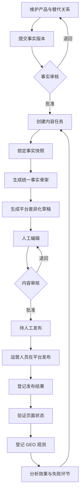
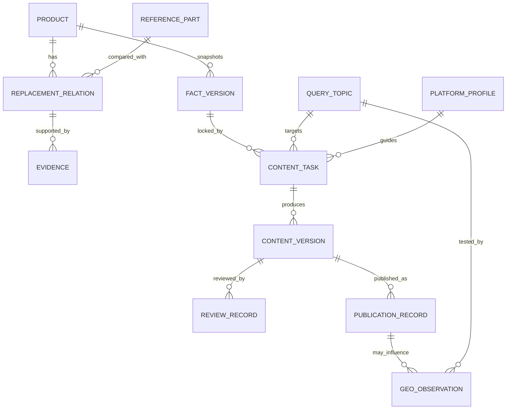
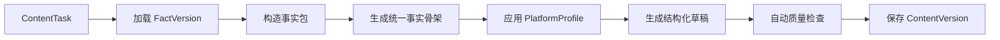
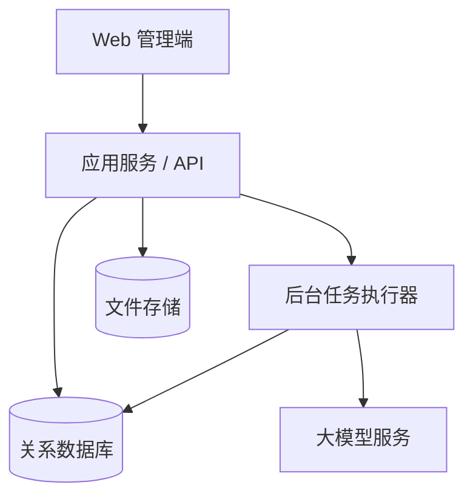

# 多平台 GEO 内容运营系统方案设计

> 文档版本：V1.0
> 编制日期：2026-07-10
> 当前阶段：MVP 方案设计
> 关联文档：[GEO 项目会话归档](./GEO项目会话归档.md)
> 技术文档：[GEO 系统前后端技术与部署方案](./GEO系统前后端技术与部署方案.md)

## 1. 文档目的

本文定义面向电子元器件国产替代业务的多平台 GEO 内容运营系统，包括业务目标、范围、核心规则、领域模型、系统架构、业务流程、数据结构、页面设计、质量控制、效果监测、实施计划和验收标准。

本文用于指导产品原型、数据库设计、接口设计和后续开发。未在本文确认的外部平台接口、模型能力和自动发布策略，不应在第一阶段被默认实现。

## 2. 方案摘要

系统采用“**权威事实库 + AI 差异化生成 + 人工审核 + 人工发布登记 + GEO 效果闭环**”的模式。

第一阶段不开发跨平台一键发布。运营人员在系统中完成内容生成和审核后，人工发布到目标网站，再登记最终文章 URL、平台审核状态和运营信息。系统随后记录文章收录、AI 检索、产品提及、引用、准确性及业务转化。

系统使用模块化单体架构，不采用微服务。产品事实、内容版本、发布记录和 GEO 观测分别拥有独立生命周期，并通过明确 ID 关联。未来接入官方 API 或 CDP 自动发布时，只增加发布适配器，不改变内容审核、发布记录和效果监测模型。

## 3. 背景与业务问题

公司需要推广电子元器件国产替代产品。当用户在豆包、DeepSeek、Grok 等具备联网搜索能力的 AI 产品中查询进口型号的国产替代、兼容料号、参数对比或替换方案时，希望公司的产品能够被准确检索、提及或引用。

当前主要问题包括：

- 产品参数、替代结论和证据可能分散在多个文件或人员手中。
- 不同平台需要不同的文章角度，人工重复编写成本高。
- 多平台文章容易出现参数、型号和替代边界不一致。
- 发布后的平台地址、审核状态和内容版本缺少统一登记。
- 只统计发文数量，无法判断是否被 AI 检索、采信或正确引用。
- 过早开发跨平台自动发布会引入大量页面适配和维护成本。

## 4. 业务目标与非目标

### 4.1 业务目标

1. 建立电子元器件产品和替代关系的唯一权威事实源。
2. 基于同一事实版本生成适合官网、行业媒体、论坛、问答和 B2B 平台的差异化内容。
3. 保证 AI 生成内容可人工修改、审核、追溯和回滚到历史版本。
4. 管理人工发布过程，准确记录内容版本、平台、账号和最终 URL。
5. 建立从目标问题到发布内容，再到模型提及、引用和业务转化的闭环。
6. 用真实运营数据决定未来应自动化的平台和流程。

### 4.2 第一阶段非目标

- 不实现 Playwright、DrissionPage 或其他 CDP 跨平台自动发布。
- 不实现通用的页面选择器配置语言。
- 不自动绕过登录、验证码、平台审核或其他访问控制。
- 不自动生成缺少事实依据的参数或替代结论。
- 不自动发布未经人工审核的内容。
- 不建设微服务、消息总线、复杂规则引擎或插件平台。
- 不在第一版自动化调用所有目标模型进行大规模监测。
- 不以文章数量、关键词密度或单次模型回答作为唯一效果指标。

## 5. 设计原则与核心不变量

### 5.1 设计原则

- **事实优先**：AI 负责表达，不负责创造产品事实。
- **一个事实源**：产品参数和替代关系只能由产品事实模块维护。
- **先统一、后差异化**：先锁定统一事实快照，再生成平台版本。
- **人工把关**：所有外发内容必须经过明确审核。
- **版本可追溯**：发布记录必须指向具体内容版本和事实版本。
- **发布方式解耦**：人工发布和未来自动发布共用同一发布结果模型。
- **闭环度量**：发布不是终点，必须继续记录收录、采信、准确性和转化。
- **小步实施**：先验证 5～10 个重点产品和少量平台，再扩大范围。

### 5.2 不可破坏的业务不变量

1. 只有状态为“已批准”的事实版本才能用于生成正式内容。
2. 每个内容版本必须绑定一个不可变的事实版本快照。
3. 事实版本更新后，历史内容不得被静默改写。
4. AI 生成结果只能创建草稿，不能直接成为已批准版本。
5. 只有已批准的内容版本才能进入待发布状态。
6. 每条发布记录必须绑定唯一的内容版本。
7. 已发布文章的 URL、平台和内容版本必须保留历史，不允许被新版本覆盖。
8. GEO 观测结果按测试时间追加记录，不覆盖历史观测。
9. 替代等级必须有明确证据；缺少依据时不得自动提升等级。
10. 系统不得支持虚构权威、伪造数据、虚假交叉背书或隐藏替代风险。

## 6. 用户角色与权限

第一阶段采用简单的基于角色的权限控制，不设计复杂的自定义权限系统。

| 角色 | 主要职责 | 关键权限 |
|---|---|---|
| 系统管理员 | 用户、基础配置和平台配置 | 全局管理，不默认参与内容批准 |
| 产品资料维护者 | 维护产品参数、证据和替代关系 | 新建事实草稿、提交事实审核 |
| 产品审核者 | 审核事实版本和替代等级 | 批准或退回事实版本 |
| 内容运营 | 创建任务、生成和编辑文章、登记发布 | 编辑内容，不得批准自己的内容 |
| 内容审核者 | 审核文章事实和宣传表达 | 批准或退回内容版本 |
| 数据分析者 | 登记和分析 GEO 观测结果 | 读取内容和发布记录，维护观测数据 |

MVP 可以允许一名员工拥有多个角色，但系统必须记录每次提交、审核、发布登记和观测操作的实际操作者。

## 7. 总体业务流程



### 7.1 事实维护流程

1. 产品资料维护者创建或更新公司产品、进口参考型号和替代关系。
2. 为关键参数和替代结论关联数据手册、测试报告或应用案例。
3. 系统生成新的事实版本草稿。
4. 产品审核者核对参数、测试条件、证据和替代等级。
5. 审核通过后，事实版本变为不可变的已批准快照。
6. 后续修改必须创建新版本，不允许直接修改已批准版本。

### 7.2 内容生成流程

1. 内容运营创建内容任务，选择目标问题、产品、平台、受众、内容角度和转化目标。
2. 系统选择指定的已批准事实版本并锁定为任务事实快照。
3. 系统构造事实包，只包含已批准的参数、证据、替代边界和允许使用的宣传表达。
4. AI 先生成统一事实骨架，再根据平台规则生成差异化草稿。
5. 系统保存模型、提示模板版本、生成参数和原始输出。
6. 内容运营人工编辑，形成新的内容版本。
7. 内容审核者审核事实准确性、表达合规性和平台适配性。

### 7.3 人工发布流程

1. 已批准内容进入“待人工发布”列表。
2. 系统展示目标平台、栏目地址、标题、正文、标签、图片和官网权威页链接。
3. 运营人员复制或导出内容，在目标平台人工发布。
4. 发布后打开登记对话框，填写最终文章 URL、发布账号、时间和平台状态。
5. 系统建立 `PublicationRecord`，绑定实际发布的内容版本。
6. 运营人员或分析人员验证最终页面能否公开访问，登记验证结果。

### 7.4 GEO 观测流程

1. 从目标问题库选择问题及其变体。
2. 在指定模型中使用新会话进行测试。
3. 登记测试时间、模型、提示词、引用来源和回答摘要。
4. 标记公司产品是否被提及、是否被推荐、参数是否准确。
5. 关联可能产生影响的发布记录。
6. 根据失败环节创建新的内容任务或修改建议，而不是直接覆盖历史文章。

## 8. 领域模型

### 8.1 领域划分

系统划分为六个业务模块：

1. **产品事实**：拥有产品、参数、替代关系、证据和事实版本。
2. **内容策划**：拥有目标问题、平台策略和内容任务。
3. **内容生产**：拥有事实骨架、AI 草稿、人工版本和审核记录。
4. **发布登记**：拥有平台、账号、发布计划和发布结果。
5. **GEO 观测**：拥有测试问题、模型测试结果和效果指标。
6. **身份审计**：拥有用户、角色和关键操作日志。

模块之间只能通过明确的 ID 和应用服务交互，不直接修改其他模块的数据。

### 8.2 核心实体

| 实体 | 中文含义 | 责任 |
|---|---|---|
| `Product` | 公司产品 | 保存稳定的型号身份和基础分类 |
| `ReferencePart` | 被替代或对比的参考型号 | 保存外部型号身份和制造商信息 |
| `ReplacementRelation` | 替代关系 | 描述两个型号的替代等级和边界 |
| `Evidence` | 证据 | 指向数据手册、测试报告或应用案例 |
| `FactVersion` | 事实版本 | 冻结一次已审核的产品和替代事实 |
| `QueryTopic` | 目标问题 | 保存用户问题、意图分类和关键词变体 |
| `PlatformProfile` | 平台规则 | 保存平台内容约束和发布栏目 |
| `ContentTask` | 内容任务 | 定义为哪个问题、产品和平台生产内容 |
| `ContentVersion` | 内容版本 | 保存 AI 草稿或人工编辑后的具体版本 |
| `ReviewRecord` | 审核记录 | 保存审核结论、意见和审核人 |
| `PublicationRecord` | 发布记录 | 保存某内容版本在某平台的发布结果 |
| `GeoObservation` | GEO 观测 | 保存一次模型测试及其结果 |
| `AuditLog` | 审计日志 | 保存关键业务操作和变更摘要 |

### 8.3 实体关系



### 8.4 关键对象定义

#### `FactVersion`

`FactVersion` 是生成内容时的权威快照，而不是产品表当前值的简单引用。建议保存：

- 产品身份和分类快照。
- 参数值、单位、典型值或限值类型。
- 参数测试条件。
- 参考型号参数快照。
- 替代等级、适用条件和排除场景。
- 关联证据及证据版本。
- 已批准宣传表达和禁用表达。
- 创建人、审核人、批准时间和版本号。

已批准的 `FactVersion` 不允许更新，只能新建后续版本。

#### `ContentTask`

建议包含：

```yaml
query_topic_id: q_op2280_domestic_replacement
product_id: product_xxx
fact_version_id: fact_xxx_v3
platform_profile_id: platform_forum_a
target_audience: 模拟电路工程师
content_angle: 参数对比与替换注意事项
conversion_goal: 查看数据手册或申请样品
desired_format: 工程问答
desired_length: 1200-1800 字
canonical_url: https://company.example/alternatives/op2280
```

#### `ContentVersion`

建议保存：

- 所属任务。
- 版本号和来源类型：AI 生成、人工编辑或基于旧版本修改。
- 标题、摘要、正文、标签和建议图片。
- 使用的事实 ID 和证据 ID。
- 模型、提示模板版本和生成时间。
- 创建人、变更说明和内容哈希。
- 审核状态。

发布后的内容版本不得直接编辑。需要修改时创建新版本并重新审核。

#### `PublicationRecord`

建议保存：

- 目标平台和栏目地址。
- 实际发布账号。
- 绑定的内容版本。
- 实际标题和最终文章 URL。
- 发布方式：人工、官方 API、浏览器自动化。
- 发布时间和登记时间。
- 平台状态：审核中、已发布、被拒绝或已下线。
- 页面验证状态和最后验证时间。
- 原创或转载属性。
- 备注、截图或证明材料。

`PublicationRecord` 是人工发布和未来自动发布的共同边界。未来增加自动发布时不得新建第二套发布结果模型。

#### `GeoObservation`

建议保存：

- 目标问题和实际提示词。
- 模型产品、模型版本或可见产品名称。
- 测试时间和测试人员。
- 是否启用联网搜索。
- 回答摘要和引用 URL 列表。
- 公司产品是否被提及、推荐或排序靠前。
- 参数和替代结论是否准确。
- 错误信息和人工评价。
- 关联的发布记录。

同一问题应保留不同时间、不同模型和不同表述下的全部观测，不只保存最新结果。

## 9. 生命周期与状态设计

不使用一个字段承载“生成、审核、发布、平台审核、效果验证”全部状态。事实、内容和发布分别维护生命周期，减少无效状态组合。

### 9.1 事实版本状态

```text
DRAFT → PENDING_REVIEW → APPROVED → RETIRED
                     ↘ CHANGES_REQUESTED
```

- `APPROVED` 后不可修改。
- `RETIRED` 表示不再用于新任务，但历史内容仍可追溯。

### 9.2 内容版本状态

```text
DRAFT → PENDING_REVIEW → APPROVED → SUPERSEDED
                     ↘ CHANGES_REQUESTED
```

- AI 输出固定为 `DRAFT`。
- `APPROVED` 后才能创建发布记录。
- 新版本批准后，旧版本可以标记为 `SUPERSEDED`，但历史发布关系保留。

### 9.3 发布记录状态

```text
PENDING_MANUAL_PUBLISH
→ PLATFORM_REVIEW
→ PUBLISHED
→ VERIFIED

异常：REJECTED / REMOVED / VERIFICATION_FAILED
```

- `PUBLISHED` 表示运营人员已登记最终 URL。
- `VERIFIED` 表示系统或人工确认页面公开可访问且关键内容正确。
- 平台拒绝和内容下线不能删除记录，只能更新状态并记录原因。

### 9.4 内容任务状态

内容任务只保存宏观进度：

```text
OPEN → COMPLETED
   ↘ CANCELLED
```

具体进度通过事实版本、内容版本和发布记录推导，避免维护重复状态。

## 10. AI 内容生成设计

### 10.1 生成流水线



### 10.2 事实包

事实包由系统从已批准事实版本构造，至少包含：

- 公司产品和参考型号身份。
- 允许使用的参数、单位和测试条件。
- 已批准的替代等级。
- 适用场景和排除场景。
- 证据名称、版本和引用地址。
- 官网权威页地址。
- 允许使用和禁止使用的宣传表达。

事实包是生成输入，不允许模型读取数据库中的未批准草稿或任意历史字段。

### 10.3 平台配置

`PlatformProfile` 建议保存业务约束，不保存页面自动化选择器：

- 平台名称和内容类型。
- 目标读者。
- 标题长度建议。
- 正文长度和结构建议。
- 支持的格式：Markdown、纯文本或富文本。
- 是否允许外链、表格、联系方式和品牌露出。
- 建议语气、内容角度和 CTA。
- 平台禁用表达和运营注意事项。
- 可选栏目及栏目地址。

平台规则发生变化时创建配置版本，已经生成的内容继续保留当时使用的配置版本。

### 10.4 提示模板

提示模板分为三层：

1. **全局事实规则**：禁止编造、不得扩大替代等级、缺少依据时明确提示。
2. **平台表达规则**：平台格式、读者、语气和内容结构。
3. **任务输入**：目标问题、产品、角度、长度和转化目标。

提示模板必须版本化。每个 AI 内容版本保存实际使用的模板版本和模型信息，便于定位生成质量变化。

### 10.5 模型输出结构

模型应返回结构化结果，而不是只有一段自由文本：

```json
{
  "title": "OP2280 国产替代选型：XXX 参数与替换注意事项",
  "summary": "直接回答目标问题的摘要",
  "body": "完整文章正文",
  "tags": ["OP2280", "国产替代", "运放"],
  "usedFactIds": ["fact_voltage_range", "fact_package"],
  "usedEvidenceIds": ["evidence_datasheet_v3"],
  "reviewWarnings": ["汽车应用需要额外认证信息"]
}
```

`usedFactIds` 和 `usedEvidenceIds` 用于辅助人工审核，不代表系统可以完全依赖模型自报。关键参数仍需由系统检查正文中的数字、单位和型号。

### 10.6 自动质量检查

MVP 只实现可确定的检查，不建设复杂规则引擎：

- 型号拼写检查。
- 正文数字和单位与事实包的一致性检查。
- 禁用表达检查。
- 必要替代边界是否缺失。
- 标题、摘要和正文是否为空。
- 标题和正文长度是否符合平台建议。
- 官网权威页和证据链接是否有效填写。
- 内容是否与同一任务的其他平台版本高度重复。

检查失败时应返回明确问题，由人工修改；不得用默认值或模糊表达掩盖缺失事实。

## 11. 审核设计

### 11.1 审核维度

| 维度 | 审核内容 |
|---|---|
| 事实准确性 | 型号、参数、单位、测试条件和数据来源 |
| 替代安全性 | 替代等级、适用条件和排除场景 |
| 内容质量 | 是否直接回答目标问题，结构是否清晰 |
| 平台适配 | 标题、格式、语气、长度和外链策略 |
| 宣传合规 | 是否存在绝对化、虚构权威或误导表达 |
| 转化设计 | CTA 是否清晰且不过度干扰技术内容 |

### 11.2 审核操作

审核者可以：

- 批准当前版本。
- 退回并填写具体修改意见。
- 查看本版本使用的事实和证据。
- 对比 AI 原始版本与人工修改版本。
- 查看同一任务的其他平台版本，检查事实是否一致。

审核记录不可删除。重新提交后创建新的审核记录，不覆盖上一次意见。

## 12. 人工发布与发布登记

### 12.1 待发布工作台

待发布工作台按平台和账号展示已批准内容，提供：

- 目标平台和栏目地址。
- 文章标题、正文、标签和图片。
- 官网权威页地址。
- 一键复制标题、正文或完整发布包。
- 内容版本和审核信息。
- 打开平台发布页。
- 登记发布结果。

这里的“一键复制”只复制已审核内容，不执行外部发布操作。

### 12.2 发布登记对话框

| 字段 | 必填 | 说明 |
|---|---|---|
| 平台 | 是 | 默认来自内容任务 |
| 栏目或论坛地址 | 是 | 发布目标版块地址 |
| 内容版本 | 是 | 自动锁定，不允许改为未批准版本 |
| 发布账号 | 是 | 选择已登记的运营账号标识 |
| 实际文章标题 | 是 | 允许记录发布时的人工微调 |
| 最终文章 URL | 视状态 | 已发布时必须填写 |
| 平台状态 | 是 | 审核中、已发布、被拒绝等 |
| 发布时间 | 是 | 默认当前时间，可调整 |
| 原创或转载 | 否 | 记录平台内容属性 |
| 备注 | 否 | 审核原因、平台限制或人工修改说明 |
| 截图或证明材料 | 否 | 保存平台审核和发布证据 |

如果运营人员在平台上修改了正文，而不只是标题或排版，应先回到系统创建新的内容版本并审核，再登记发布。这样可以保证系统保存的版本与实际外发内容一致。

### 12.3 发布验证

登记最终 URL 后执行以下验证：

- URL 格式和域名是否属于目标平台。
- 页面是否公开可访问。
- 页面标题是否与登记标题一致。
- 页面正文是否包含产品型号和必要替代边界。
- 页面是否仍处于平台审核或登录可见状态。
- 最后验证时间和验证人。

第一阶段可以人工验证。后续如果自动验证稳定，再增加只读网页检查任务。

## 13. GEO 监测与分析

### 13.1 目标问题库

目标问题分为：

- 品牌词。
- 公司产品型号词。
- 参考型号与国产替代词。
- `Pin-to-Pin`、兼容、参数对比等决策词。
- 应用场景词。
- 替换故障和排障词。

每个 `QueryTopic` 保存一个标准问题和多个自然语言变体。测试时应轮换问题表述，避免只针对固定提示词优化。

### 13.2 单次观测字段

| 字段 | 说明 |
|---|---|
| 目标问题 | 关联问题库 |
| 实际提示词 | 本次使用的完整问题 |
| 模型产品 | 豆包、DeepSeek、Grok 等 |
| 测试时间 | 记录变化趋势 |
| 联网状态 | 是否明确启用联网搜索 |
| 引用来源 | 模型展示的 URL 列表 |
| 产品提及 | 是否出现公司产品 |
| 推荐状态 | 未推荐、候选、明确推荐 |
| 参数准确性 | 准确、部分准确、错误、无法判断 |
| 回答摘要 | 保存关键结论，不要求复制完整回答 |
| 关联发布记录 | 可能影响本次结果的外部文章 |
| 人工备注 | 记录错误、竞争产品和失败原因 |

### 13.3 核心指标

在指定时间窗口和有效测试样本内计算：

```text
产品提及率 = 提及公司产品的测试数 / 有效测试总数
产品推荐率 = 推荐公司产品的测试数 / 有效测试总数
引用率 = 引用公司官网或外部内容的测试数 / 有效测试总数
参数准确率 = 参数判断准确的测试数 / 可判断测试数
官网引用占比 = 引用官网的测试数 / 出现公司相关引用的测试数
```

不设置未经验证的统一“GEO 总分”。第一阶段分别展示原始指标，运营一段时间后再判断是否需要组合评分。

### 13.4 失败诊断

| 观测现象 | 判断 | 后续动作 |
|---|---|---|
| 页面未被搜索结果发现 | 收录或渠道问题 | 检查页面可访问性、标题、站内链接和平台选择 |
| 页面出现但未被模型采用 | 相关性或证据不足 | 增强直接答案、参数依据和替代边界 |
| 产品被提及但未推荐 | 替代结论不足 | 补充验证条件、应用案例和工程证据 |
| 产品被推荐但参数错误 | 信息冲突 | 查找冲突页面并统一事实表达 |
| 单次命中但不稳定 | 样本不足或过拟合 | 扩充问题变体并跨周期复测 |

系统可以根据诊断创建优化任务，但不得自动修改已发布文章或已批准事实。

## 14. 系统架构

### 14.1 架构选择

第一阶段采用模块化单体：



选择理由：

- 当前团队、流量和边界尚未证明需要微服务。
- 核心业务事务需要在事实、内容版本和审核记录之间保持一致。
- 模块化单体便于快速迭代，也能通过模块接口保持清晰边界。
- AI 生成耗时较长，可以使用同一项目中的后台任务执行器，不需要单独拆服务。

### 14.2 模块边界

```text
modules/
├── product-facts       产品、参数、证据和事实版本
├── content-planning    目标问题、平台规则和内容任务
├── content-production  AI 生成、内容版本和质量检查
├── review              事实审核和内容审核
├── publication         人工发布登记和页面验证
├── geo-observation     模型测试与效果指标
├── identity            用户、角色和权限
└── audit               关键操作日志
```

目录仅表达职责边界，实际项目应遵循选定技术栈的约定。不要为每个实体额外创建无业务价值的多层包装。

### 14.3 依赖方向

- 领域规则不得依赖具体大模型 SDK、Web 框架或数据库实现。
- AI 模型通过 `ContentGenerator` 端口接入。
- 文件存储通过 `EvidenceStorage` 端口接入。
- 未来自动发布通过 `Publisher` 端口接入。
- 平台发布适配器只能读取已批准内容并创建标准 `PublicationRecord`。
- GEO 观测只读取事实、内容和发布信息，不反向修改这些历史数据。

建议边界接口：

```ts
interface ContentGenerator {
  generate(input: GenerationInput): Promise<GeneratedDraft>;
}

interface PublicationService {
  recordManualPublication(input: ManualPublicationInput): Promise<PublicationRecord>;
}

interface Publisher {
  publish(input: ApprovedPublicationInput): Promise<PublicationResult>;
}
```

MVP 实现前两个能力；`Publisher` 只作为未来扩展边界记录在设计中，不需要提前实现框架、注册中心或插件系统。

### 14.4 数据存储

- 关系数据库：保存产品、事实版本、任务、内容版本、审核、发布和观测数据。
- 对象存储：保存数据手册、测试报告、截图和图片。
- 数据库全文检索：MVP 用于型号和文章搜索，不引入 Elasticsearch。
- 后台任务：处理 AI 生成和可能耗时的文件解析。
- Redis：只作为 Celery 消息代理和短期任务协调设施，不作为核心业务数据源；第一阶段不额外建设业务缓存层。

## 15. 建议数据表

以下为逻辑表，不限定具体数据库命名规范。

| 表 | 核心字段 |
|---|---|
| `products` | `id`, `part_number`, `brand`, `category`, `status` |
| `reference_parts` | `id`, `part_number`, `manufacturer`, `category` |
| `replacement_relations` | `id`, `product_id`, `reference_part_id`, `replacement_level`, `conditions` |
| `evidences` | `id`, `type`, `title`, `source_url`, `file_id`, `version`, `status` |
| `fact_versions` | `id`, `product_id`, `version`, `snapshot_json`, `status`, `approved_by` |
| `query_topics` | `id`, `canonical_question`, `intent_type`, `variants_json`, `status` |
| `platform_profiles` | `id`, `name`, `rules_json`, `version`, `status` |
| `content_tasks` | `id`, `product_id`, `fact_version_id`, `query_topic_id`, `platform_profile_id`, `status` |
| `content_versions` | `id`, `task_id`, `version`, `title`, `body`, `fact_refs_json`, `status`, `content_hash` |
| `review_records` | `id`, `target_type`, `target_id`, `decision`, `comments`, `reviewer_id` |
| `publication_records` | `id`, `content_version_id`, `platform_profile_id`, `account_id`, `url`, `status` |
| `geo_observations` | `id`, `query_topic_id`, `model_name`, `prompt`, `result_json`, `tested_at` |
| `audit_logs` | `id`, `actor_id`, `action`, `target_type`, `target_id`, `change_summary` |

设计约束：

- 参数详情优先采用结构化子表；`snapshot_json` 只用于冻结事实版本，不作为日常编辑的唯一数据源。
- 关键状态使用明确枚举，不使用自由文本。
- 文章正文需要保留原始格式和渲染格式时，应明确各自责任，不在多个字段中重复维护可变正文。
- 文件只在对象存储保存一份，数据库保存文件元数据和引用关系。
- 所有业务表使用稳定 ID、创建时间和最后修改时间。

## 16. 应用接口

以下接口表达业务能力，不是最终 URL 清单。

### 16.1 产品事实

- 创建或更新产品草稿。
- 添加参考型号和替代关系。
- 添加证据并关联参数或替代结论。
- 创建事实版本。
- 提交、批准、退回或停用事实版本。

### 16.2 内容生产

- 创建内容任务。
- 基于事实版本生成平台草稿。
- 保存人工编辑版本。
- 提交内容审核。
- 批准或退回内容版本。
- 导出或复制发布包。

### 16.3 发布登记

- 创建待人工发布记录。
- 登记平台审核中状态。
- 登记最终 URL 和发布时间。
- 更新平台拒绝或内容下线状态。
- 验证已发布页面。

### 16.4 GEO 观测

- 维护目标问题和问题变体。
- 新建一次模型观测。
- 关联引用 URL 和发布记录。
- 查询按模型、问题、产品和时间统计的指标。

所有写操作在服务端再次校验权限和状态，不依赖前端隐藏按钮保证业务规则。

## 17. 页面与交互设计

### 17.1 信息架构

```text
工作台
产品事实
├── 公司产品
├── 参考型号
├── 替代关系
└── 事实版本审核
内容运营
├── 目标问题库
├── 内容任务
├── 内容编辑器
└── 内容审核
发布管理
├── 待人工发布
└── 发布记录
GEO 监测
├── 测试登记
├── 引用来源
└── 效果分析
系统设置
├── 平台配置
├── 用户与角色
└── 审计日志
```

### 17.2 工作台

工作台优先展示需要行动的信息：

- 待审核的事实版本。
- 待审核的内容版本。
- 待人工发布内容。
- 平台审核中或验证失败的发布记录。
- 最近 GEO 观测中的参数错误。
- 重点产品在当前周期的提及率和引用率。

不以累计文章数量作为首页核心指标。

### 17.3 内容编辑器

编辑器建议采用三栏或可切换布局：

- 左侧：目标问题、平台规则和内容任务。
- 中间：标题、摘要和正文编辑。
- 右侧：事实、证据、替代边界和质量警告。

应支持查看 AI 原始版本与当前版本差异，并明确显示当前绑定的事实版本。

### 17.4 发布工作台

每个待发布条目展示：

- 平台和栏目。
- 内容版本及审核人。
- 标题和正文预览。
- 复制标题、正文、标签和完整发布包。
- 打开目标发布页面。
- 登记发布结果。

## 18. 安全、合规与审计

### 18.1 内容安全

- 未批准事实不得进入正式生成输入。
- 外发内容必须经过人工审核。
- 对绝对化宣传、虚构权威、未验证认证和无依据替代结论进行提示或阻止。
- 富文本入库和渲染时进行 HTML 清理，防止脚本注入。
- 外部 URL 进行协议和域名校验，避免登记危险链接。

### 18.2 数据安全

- 明确哪些产品资料允许发送给第三方大模型。
- 未公开的测试报告或客户信息必须经过授权后才能进入生成上下文。
- 模型 API 密钥、对象存储凭据和未来平台账号凭据不得写入代码或普通日志。
- 文件下载和查看遵循角色权限。

### 18.3 审计要求

以下操作必须记录操作者、时间、对象和结果：

- 事实版本提交、批准、退回和停用。
- 内容生成、人工修改、提交审核和批准。
- 发布登记、URL 变更、拒绝和下线。
- GEO 观测创建和人工准确性判断。
- 用户角色和关键系统配置变更。

审计日志保存变更摘要，不保存模型 API 密钥、平台 Cookie 或其他敏感值。

## 19. 异常处理

系统应让错误明确暴露，不使用静默默认值掩盖问题。

| 场景 | 处理方式 |
|---|---|
| 事实版本缺少必要参数 | 阻止生成并列出缺失字段 |
| 模型返回格式错误 | 标记生成任务失败，保存非敏感错误摘要，允许人工重试 |
| 模型生成未知参数 | 质量检查失败，禁止提交审核前忽略警告 |
| 审核期间事实版本被停用 | 阻止批准，要求选择新的事实版本重新生成或复核 |
| 发布 URL 与平台不匹配 | 阻止登记为已发布 |
| 平台文章被删除 | 更新为 `REMOVED`，保留历史记录 |
| GEO 观测无法判断准确性 | 记录“无法判断”，不计入准确率分母 |

不得通过自动补零、猜测单位、模糊型号兼容或吞掉模型错误来让流程表面成功。

## 20. 测试与质量保障

### 20.1 单元测试

重点覆盖业务不变量：

- 未批准事实不能生成正式草稿。
- 内容版本必须绑定事实版本。
- 未批准内容不能创建已发布记录。
- 已批准事实和内容不能被原地修改。
- 替代等级没有证据时不能升级。
- 发布记录必须绑定明确内容版本。

### 20.2 集成测试

- 事实版本创建、审核和冻结。
- AI 生成任务、结构化输出解析和失败处理。
- 内容版本、审核记录和发布登记事务一致性。
- 文件上传、权限校验和对象存储引用。
- GEO 观测保存和指标计算。

### 20.3 端到端测试

至少覆盖以下主流程：

```text
录入产品事实
→ 批准事实版本
→ 创建论坛内容任务
→ 生成并编辑文章
→ 审核通过
→ 人工发布登记
→ 页面验证
→ 登记模型观测
→ 查看效果指标
```

### 20.4 AI 质量评估集

选择第一批重点产品，建立固定评估样本：

- 每个产品至少包含替代问答、参数对比和应用场景三类任务。
- 保存期望出现的事实和禁止出现的结论。
- 模型或提示模板升级前后使用相同样本比较。
- 自动检查只评估确定性事实，表达质量由人工抽样判断。

## 21. MVP 范围与实施计划

### 21.1 MVP 范围

建议选择：

- 5～10 个商业价值较高的产品或替代关系。
- 2～3 种平台类型，不要求自动接入平台。
- 30～50 个目标问题及其变体。
- 少量明确的产品资料维护者、内容运营和审核人员。

MVP 功能：

1. 产品、参考型号和替代关系管理。
2. 证据上传和事实版本审核。
3. 目标问题和平台规则管理。
4. 内容任务、AI 生成、人工编辑和版本管理。
5. 内容审核和审核记录。
6. 待人工发布工作台、复制发布包和发布登记。
7. GEO 人工观测登记和基础指标。
8. 角色权限和关键操作审计。

### 21.2 实施顺序

#### 阶段一：事实基础

- 明确第一批产品和替代等级标准。
- 统一参数字段、单位、测试条件和证据格式。
- 实现产品事实、证据和事实版本审核。

#### 阶段二：内容闭环

- 实现问题库、平台配置和内容任务。
- 接入一个大模型，完成事实包和差异化生成。
- 实现编辑、版本和内容审核。

#### 阶段三：人工发布闭环

- 实现待发布工作台、内容复制和发布登记。
- 实现最终 URL、平台状态和页面验证记录。

#### 阶段四：效果闭环

- 实现 GEO 观测登记。
- 展示提及率、推荐率、引用率和参数准确率。
- 根据运营结果调整问题、内容和渠道。

#### 阶段五：自动化评估

- 统计各平台人工发布次数、耗时、失败率和维护风险。
- 优先评估官方 API。
- 只有在收益明确时才为个别平台开发 CDP 适配器。

## 22. MVP 验收标准

系统达到以下条件才算完成第一阶段：

1. 可以为重点产品建立带证据的已批准事实版本。
2. 已批准事实版本不可被原地修改，历史版本可查询。
3. 可以针对同一产品和问题生成至少两种平台差异化草稿。
4. 生成内容能够追溯到事实版本、模型和提示模板版本。
5. 人工可以编辑、提交审核、退回和批准内容。
6. 未批准内容无法进入待发布列表。
7. 运营人员可以复制发布包并登记最终文章 URL。
8. 发布记录能够准确绑定内容版本、平台、账号和状态。
9. 可以登记一次模型测试的提及、推荐、引用和准确性结果。
10. 可以按产品、问题、模型和时间查看基础指标。
11. 关键事实、审核和发布操作均有审计记录。
12. 完整主流程有自动化测试或明确的可重复验收脚本。

## 23. 运营验证指标

系统上线后的试运行应同时验证效率和业务效果。

### 23.1 运营效率

- 单篇差异化文章从任务创建到审核通过的平均时间。
- AI 草稿需要人工修改的比例和修改量。
- 单个平台人工发布平均耗时。
- 平台审核通过率和内容下线率。
- 因事实错误被退回的文章比例。

### 23.2 GEO 效果

- 产品提及率。
- 产品推荐率。
- 公司官网和外部文章引用率。
- 参数准确率。
- 重点问题的跨周期稳定性。
- 数据手册下载、样品申请和询价转化。

只有当自动发布能够显著减少高频、稳定平台的人工耗时，且不会明显提高失败和账号风险时，才进入开发计划。

## 24. 风险与控制措施

| 风险 | 影响 | 控制措施 |
|---|---|---|
| 产品参数来源不统一 | 多平台文章互相冲突 | 事实版本唯一、证据审核、历史冻结 |
| AI 编造或扩大结论 | 工程和品牌风险 | 事实包限制、自动检查、人工审核 |
| 内容同质化 | 平台效果差或被视为低质内容 | 平台角度配置、重复度检查、人工改写 |
| 平台规则变化 | 内容审核失败 | 版本化平台规则、人工发布反馈 |
| 只看单次模型结果 | 错误判断 GEO 成效 | 多问题、多模型、多周期观测 |
| 已发布内容与系统版本不一致 | 无法追溯 | 发布前锁定版本，实质修改需重新审核 |
| 过早自动化 | 项目复杂度和维护成本失控 | MVP 人工发布，用运营数据决定自动化 |
| 敏感资料发送给外部模型 | 数据泄露 | 资料分级、生成前授权、最小化上下文 |

## 25. 未来自动发布扩展

自动发布不是当前 MVP 的组成部分。未来满足以下条件后再进入设计：

- 平台发布频率足够高。
- 人工发布耗时可量化且明显。
- 页面结构或官方 API 相对稳定。
- 平台规则允许相关自动化方式。
- 账号风险和失败恢复方案明确。
- 自动发布维护成本低于节省的人力成本。

扩展时遵循：

```text
已批准 ContentVersion
→ Publisher 平台适配器
→ 平台发布
→ 返回 PublicationResult
→ 创建或更新标准 PublicationRecord
→ 沿用现有页面验证和 GEO 观测流程
```

如果采用 CDP：

- 使用独立自动化浏览器 Profile。
- CDP 端口只允许本机访问。
- 每个平台实现独立适配器。
- 使用确定性 DOM 定位，不依赖固定坐标。
- 发布操作具备幂等性，避免重试产生重复文章。
- 必须获取最终 URL 并验证实际页面。
- 失败时记录非敏感日志和页面截图。

不设计所谓“配置几个选择器即可适配所有平台”的通用发布器，除非后续实际平台流程证明存在稳定的共享结构。

## 26. 待确认决策

进入原型或开发前，需要业务方确认：

1. 第一批产品、参考型号和商业优先级。
2. 替代等级的正式定义和批准责任人。
3. 产品数据、数据手册和测试报告的现有来源。
4. 第一批目标平台、栏目、账号和内容规则。
5. 内容运营与内容审核是否允许为同一人。
6. 可发送给第三方大模型的数据范围。
7. 首选大模型及预算、并发和数据保留要求。
8. 系统技术栈、部署环境、用户规模和权限接入方式。
9. GEO 测试频率、目标模型和首个试运行周期。
10. 样品申请、询价和下载转化数据能否回传系统。

## 27. 最终设计结论

第一阶段最重要的不是提高自动发文速度，而是验证以下闭环是否成立：

```text
真实且统一的产品事实
→ 有差异的高质量平台内容
→ 可追溯的人工审核和发布
→ 可重复的模型观测
→ 能指导下一轮内容和渠道决策的数据
```

方案通过不可变事实版本、内容版本、标准发布记录和追加式 GEO 观测建立四个清晰的数据所有者。该结构既能支持当前人工发布，也为未来按平台逐步增加自动发布保留了稳定边界，同时避免在业务价值尚未验证前引入跨平台 RPA 的复杂度。
