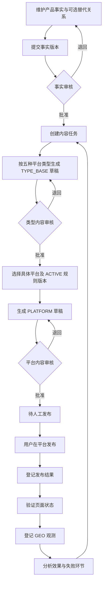
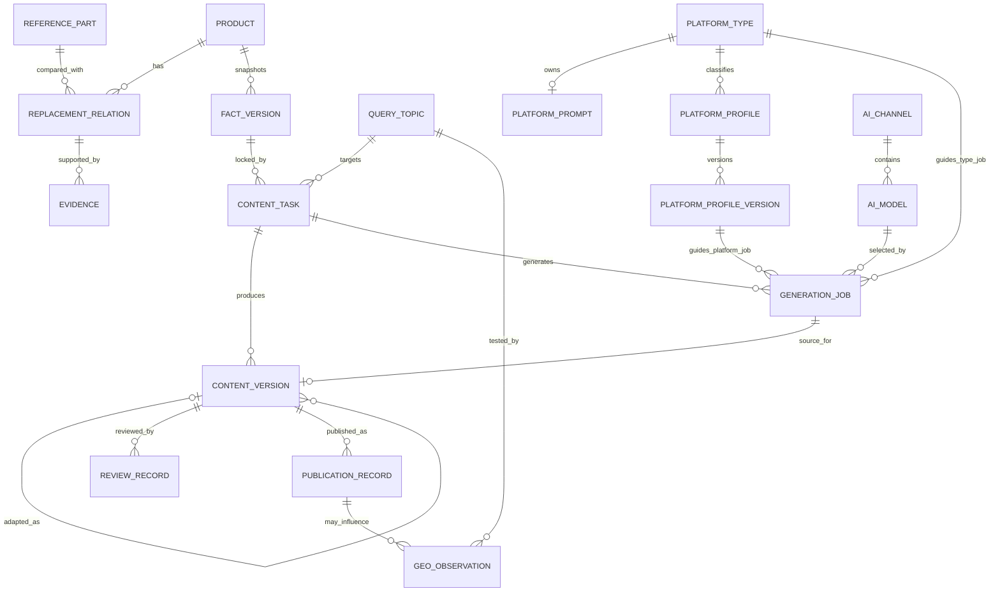
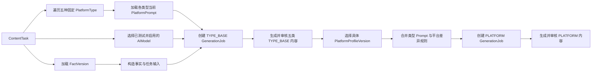
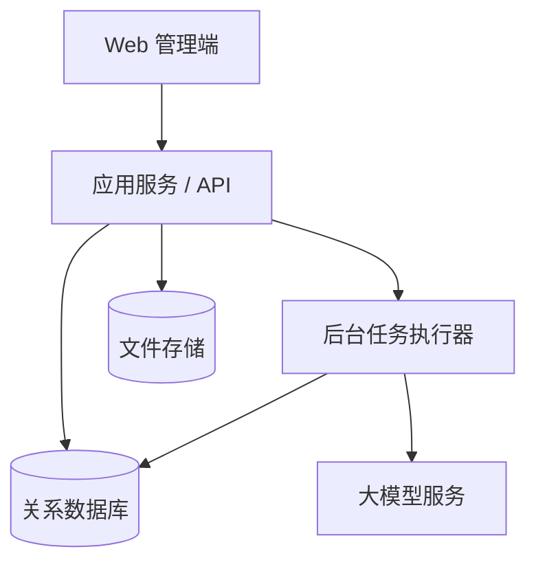

# 多平台 GEO 内容运营系统方案设计

> 文档版本：V1.3
> 编制日期：2026-07-13
> 当前阶段：MVP 已实现，产品事实与两级平台规则模型待按本版调整
> 关联文档：[GEO 项目会话归档](./GEO项目会话归档.md)
> 技术文档：[GEO 系统前后端技术与部署方案](./GEO系统前后端技术与部署方案.md)

## 1. 文档目的

本文定义面向电子元器件产品推广与国产替代业务的多平台 GEO 内容运营系统，包括业务目标、范围、核心规则、领域模型、系统架构、业务流程、数据结构、页面设计、质量控制、效果监测、实施计划和验收标准。

本文用于指导产品原型、数据库设计、接口设计和后续开发。未在本文确认的外部平台接口、模型能力和自动发布策略，不应在第一阶段被默认实现。

## 2. 方案摘要

系统采用“**权威事实库 + AI 差异化生成 + 人工审核 + 人工发布登记 + GEO 效果闭环**”的模式。

第一阶段不开发跨平台一键发布。普通用户在系统中完成产品资料维护、内容生成和人工审核后，将内容发布到目标网站，再登记最终文章 URL、平台审核状态和运营信息。系统随后记录文章收录、AI 检索、产品提及、引用、准确性及业务转化。

系统使用模块化单体架构，不采用微服务。产品事实、内容版本、发布记录和 GEO 观测分别拥有独立生命周期，并通过明确 ID 关联。未来接入官方 API 或 CDP 自动发布时，只增加发布适配器，不改变内容审核、发布记录和效果监测模型。

### 2.1 2026-07-11 会话决策与实现状态

本次会话先完成配置中心与真实 AI 生成能力，工作提交为 `d22d401`；随后完成账号精简与自助改密入口，工作提交为 `cebb0d0`。两个任务均已归档，契约检查、后端单元测试、PostgreSQL 迁移测试、前端测试、镜像构建和完整浏览器 E2E 均已通过。

已实现的产品边界：

- 首期只支持 OpenAI-compatible Chat Completions。`base_url` 是包含版本前缀的 API 根地址，例如 `https://example.com/v1`；模型发现固定调用 `GET {base_url}/models`，测试和生成固定调用 `POST {base_url}/chat/completions`，不支持 OpenAI Responses API，也不自动尝试其他路径。
- 管理员维护渠道 `base_url`、加密 API Key、渠道统一自定义 Header 和渠道下多个模型；“获取模型”只是便捷发现功能，`/models` 未实现或返回失败时仍可手工填写 `model_id`。
- 模型自定义参数支持按“参数名 + 任意 JSON 值”增删改查并原样发送，避免假定所有 OpenAI-compatible 服务支持同一参数集合；`model`、`messages`、`stream` 由系统保留。
- 渠道和模型默认停用。“获取模型”只验证 `/models` 可访问，不能代替生成测试；完整测试只在具体模型上执行，使用固定非业务 system/user message，携带该模型自定义参数，并复用正式生成的严格四字段 JSON 解析。至少一个模型测试成功后渠道才允许启用，每个模型仍必须分别测试成功才能启用。
- 连接、凭据、Header、`model_id` 或参数变化会使相关模型测试状态失效并要求重新测试。
- API Key 与敏感 Header 使用数据库密文、环境主密钥和永不回显策略；作业快照只保存普通 Header 与敏感 Header 名称，执行和重试只读取这些名称的当前敏感值。
- 每个平台类型最多一份普通 Markdown `system_prompt`。管理员可以原地覆盖或物理删除当前 Prompt；普通用户只读查看，历史含义由生成作业快照保留，不建设 Prompt 版本系统或模板语法。
- 电子工程师维护任务级可编辑 Markdown `user_prompt`，填写产品描述、参数、特性和对比等专业资料；服务端同时附加任务绑定的已批准事实和任务要求。
- 每次生成选择并锁定一个模型，作业保存完整不可变输入快照；重试复用原模型、参数、Prompt、用户输入和事实快照，只读取渠道当前凭据。
- 模型只返回严格四字段 JSON：`title`、`summary`、`body_markdown`、`tags`。代码块、附加字段、缺失字段或非法 JSON 均失败，不提取、修复或补值，也不再接收模型自报事实/证据 ID。
- AI 输出只创建 Markdown 草稿；电子工程师可以单人生成、编辑、提交并批准自己的事实和内容，所有状态转换和权限仍由服务端校验并记录审计。
- 身份模型只有 `ADMIN` 和 `ENGINEER`。管理员拥有工程师能力并额外管理用户、平台类型、Prompt、渠道和模型；长期账号使用启用/停用，不建设自定义角色系统。

账号精简任务已实现并归档至 `.trellis/tasks/archive/2026-07/07-11-user-cleanup/`：

- 旧版六个初始化账号只保留 `admin` 与 `content_editor`，一次性物理删除 `product_editor`、`product_reviewer`、`content_reviewer`、`analyst`。
- 任一目标账号存在业务或审计引用时，清理事务整体中止并明确报告，不改写历史归属、不级联删除业务数据。
- 空数据库使用独立的 `PARTSIGNAL_SEED_ADMIN_PASSWORD` 与 `PARTSIGNAL_SEED_ENGINEER_PASSWORD` 创建两个账号；新建 `content_editor` 首次登录必须改密。
- 既有 `content_editor` 保留当前密码，只设置 `must_change_password=true`；管理员可在密码遗失时设置临时密码。
- 工作台顶部已增加“修改密码”入口，用户管理默认隐藏停用账号但可显式查看；未新增长期物理删除用户 API。

### 2.2 2026-07-13 产品事实与平台模型调整

本节是后续实现必须遵循的目标设计，优先于本文中对既有 MVP 行为的描述。当前代码仍以“任务创建时选择具体平台”为主流程，尚未完成以下结构调整：

- 产品事实覆盖产品参数、特性、认证、应用范围、测试结果和证据；替代关系只是可选事实，不是创建产品或内容任务的前提。
- 平台类型固定为公司官网、行业媒体、工程论坛、问答平台和 B2B 平台五种，不允许管理员新增或删除类型。
- `PlatformPrompt` 提供平台类型级内容基线；知乎、电子发烧友等具体平台官网使用 `PlatformProfile` 表示，并通过不可变的 `PlatformProfileVersion` 保存平台级差异规则。
- 一个内容任务默认生成五种平台类型的 `TYPE_BASE` 草稿。选择具体平台后，系统基于已批准的同类型草稿和该平台的有效规则版本生成 `PLATFORM` 草稿，并重新审核后才能发布。
- Prompt、平台规则或模型配置变化只影响后续生成作业；`GenerationJob.input_snapshot` 始终冻结实际使用的完整 system/user message、两级平台规则、事实、模型和参数。

本次调整改变内容任务、生成作业和内容版本的公开数据契约，实施时需要单独设计迁移，不得直接把既有具体平台任务猜测转换为五类任务。

## 3. 背景与业务问题

公司需要推广电子元器件国产替代产品。当用户在豆包、DeepSeek、Grok 等具备联网搜索能力的 AI 产品中查询进口型号的国产替代、兼容料号、参数对比或替换方案时，希望公司的产品能够被准确检索、提及或引用。

国产替代是重要推广场景，但不是唯一场景。系统还应支持产品介绍、参数解析、选型指南、应用方案、工程排障、案例和供货信息等内容；没有替代关系的产品也必须能够建立事实版本和内容任务。

当前主要问题包括：

- 产品参数、替代结论和证据可能分散在多个文件或人员手中。
- 不同平台需要不同的文章角度，人工重复编写成本高。
- 多平台文章容易出现参数、型号和替代边界不一致。
- 发布后的平台地址、审核状态和内容版本缺少统一登记。
- 只统计发文数量，无法判断是否被 AI 检索、采信或正确引用。
- 过早开发跨平台自动发布会引入大量页面适配和维护成本。

## 4. 业务目标与非目标

### 4.1 业务目标

1. 建立电子元器件产品事实的唯一权威来源，替代关系作为可选事实纳入审核和追溯。
2. 基于同一事实版本默认生成公司官网、行业媒体、工程论坛、问答平台和 B2B 平台五类差异化内容。
3. 保证 AI 生成内容可人工修改、审核、追溯和回滚到历史版本。
4. 管理人工发布过程，准确记录内容版本、平台、账号和最终 URL。
5. 建立从目标问题到发布内容，再到模型提及、引用和业务转化的闭环。
6. 用真实运营数据决定未来应自动化的平台和流程。

### 4.2 第一阶段非目标

- 不实现 Playwright、DrissionPage 或其他 CDP 跨平台自动发布。
- 不实现通用的页面选择器配置语言。
- 不自动绕过登录、验证码、平台审核或其他访问控制。
- 不自动生成缺少事实依据的参数或替代结论。
- 不自动发布未经人工审核的内容。
- 不建设微服务、消息总线、复杂规则引擎或插件平台。
- 不在第一版自动化调用所有目标模型进行大规模监测。
- 不以文章数量、关键词密度或单次模型回答作为唯一效果指标。

## 5. 设计原则与核心不变量

### 5.1 设计原则

- **事实优先**：AI 负责表达，不负责创造产品事实。
- **一个事实源**：产品参数、特性、认证、应用、测试结论和可选替代关系只能由产品事实模块维护。
- **先统一、后差异化**：先锁定统一事实快照，再生成平台版本。
- **两级平台规则**：平台类型 Prompt 提供内容基线，具体平台规则版本补充知乎、电子发烧友等平台差异。
- **人工把关**：所有外发内容必须经过明确审核。
- **版本可追溯**：发布记录必须指向具体内容版本和事实版本。
- **发布方式解耦**：人工发布和未来自动发布共用同一发布结果模型。
- **闭环度量**：发布不是终点，必须继续记录收录、采信、准确性和转化。
- **小步实施**：先验证 5～10 个重点产品和少量平台，再扩大范围。

### 5.2 不可破坏的业务不变量

1. 只有状态为“已批准”的事实版本才能用于生成正式内容。
2. 每个内容版本必须绑定一个不可变的事实版本快照。
3. 事实版本更新后，历史内容不得被静默改写。
4. AI 生成结果只能创建草稿，不能直接成为已批准版本。
5. 只有已批准的内容版本才能进入待发布状态。
6. 每条发布记录必须绑定唯一的内容版本。
7. 已发布文章的 URL、平台和内容版本必须保留历史，不允许被新版本覆盖。
8. GEO 观测结果按测试时间追加记录，不覆盖历史观测。
9. 替代等级必须有明确证据；缺少依据时不得自动提升等级。
10. 系统不得支持虚构权威、伪造数据、虚假交叉背书或隐藏替代风险。
11. 每次生成必须保存不可变的 `GenerationJob.input_snapshot`，冻结平台 Prompt、用户输入、已批准事实、模型和参数；历史生成记录不得随当前配置更新而改变。
12. Markdown 是内容的唯一可编辑正文源，不并行维护可独立编辑的 HTML 或编辑器 JSON。
13. 平台类型固定为五种；具体平台必须归属于其中一种，且所属类型在产生任务或发布引用后不可直接变更。
14. `TYPE_BASE` 内容不能发布；只有使用明确 `PlatformProfileVersion` 生成并批准的 `PLATFORM` 内容才能创建发布记录。

## 6. 用户类型与流程权限

第一阶段不按产品维护、产品审核、内容运营、内容审核和数据分析等工作环节划分长期角色。这些名称只描述流程中的操作，不代表不同用户类型；同一个普通用户可以完成完整业务流程。

| 用户类型 | 主要职责 | 关键权限 |
|---|---|---|
| 普通用户 | 电子工程师及其他业务人员 | 维护和确认产品事实、查看平台 Prompt、选择模型、生成和编辑内容、审核定稿、登记发布及 GEO 观测 |
| 系统管理员 | 系统维护人员 | 拥有普通用户的业务能力，并额外管理固定平台类型 Prompt、具体平台与规则版本、用户、AI 渠道、Header、模型和系统安全配置 |

普通用户能否执行某个动作由对象当前状态决定，而不是由岗位角色决定。例如只有待审核版本可以批准，只有已批准内容可以进入待发布状态。MVP 允许同一用户创建、编辑并批准同一事实或内容版本；审核是必须显式执行并留痕的质量检查节点，不是强制换人的职责分离。

系统只保存 `ADMIN` / `ENGINEER` 账号类型和启停状态，不建设角色表、权限配置界面或自定义权限引擎。所有写操作都必须记录实际操作者，并在服务端同时校验账号状态、管理员能力和业务状态转换。普通用户可以只读查看五种平台类型 Prompt 和具体平台规则，但不能修改，也不能管理渠道和模型。

### 6.1 初始账号与密码治理

空数据库初始化时只创建两个账号：

- `admin`：`ADMIN`，初始密码来自 `PARTSIGNAL_SEED_ADMIN_PASSWORD`。
- `content_editor`：`ENGINEER`，初始密码来自独立的 `PARTSIGNAL_SEED_ENGINEER_PASSWORD`，首次登录必须修改密码。

初始化命令必须幂等，重复部署不得覆盖任何既有密码。所有登录用户都能从顶部账号区域进入自助改密，修改时必须验证当前密码并撤销其他会话；管理员只能通过该流程修改自己的密码。管理员可以新增用户、设置其他用户的临时密码并启停账号，长期用户不提供物理删除。

开发遗留的 `product_editor`、`product_reviewer`、`content_reviewer` 和 `analyst` 只通过一次性迁移物理删除。任一账号存在业务或审计引用时，迁移整体回滚并报告引用，不改写归属或级联删除数据。

## 7. 总体业务流程



### 7.1 事实维护流程

1. 普通用户创建或更新公司产品事实，并按需维护参考型号和替代关系。
2. 为关键参数、特性、认证、应用结论、测试结论和可选替代结论关联数据手册、测试报告或应用案例。
3. 系统生成新的事实版本草稿。
4. 普通用户核对参数、测试条件、证据，以及存在替代关系时的替代等级，并显式执行批准或退回操作；系统不以审核人与创建人是否相同作为阻断条件。
5. 审核通过后，事实版本变为不可变的已批准快照。
6. 后续修改必须创建新版本，不允许直接修改已批准版本。

### 7.2 内容生成流程

1. 普通用户创建内容任务，选择目标问题和产品；任务不绑定具体平台，系统默认包含五种固定平台类型。
2. 用户维护产品描述、参数、特性、应用边界和可选产品对比等专业 Markdown 输入，任务绑定的已批准事实继续作为只读权威来源。
3. 系统分别加载五种平台类型的当前 `PlatformPrompt`，用户选择模型后创建五个 `TYPE_BASE` 生成作业和草稿。
4. 创建 `GenerationJob` 时冻结渠道非敏感信息、模型参数、最终 system/user message、事实、任务要求和平台类型 Prompt；缺失 token 用量保持为空，不估算、不补零。
5. 用户编辑并审核五类 Markdown 草稿。单个平台类型生成失败不回滚其他类型，但五类均有已批准版本后任务才完成类型级生产。
6. 用户在某一类型下选择知乎、电子发烧友等具体平台。系统要求存在 `ACTIVE` 的 `PlatformProfileVersion`，并基于同类型已批准 `TYPE_BASE` 内容生成 `PLATFORM` 草稿。
7. 平台级作业在快照中额外冻结具体平台官网和平台规则版本；用户编辑并重新审核后，平台级内容才能进入待发布列表。

### 7.3 人工发布流程

1. 已批准且范围为 `PLATFORM` 的内容进入“待人工发布”列表；`TYPE_BASE` 内容不得直接发布。
2. 系统展示目标平台、栏目地址、标题、正文、标签、图片和官网权威页链接。
3. 普通用户复制或导出内容，在目标平台人工发布。
4. 发布后打开登记对话框，填写最终文章 URL、发布账号、时间和平台状态。
5. 系统建立 `PublicationRecord`，绑定实际发布的内容版本。
6. 普通用户验证最终页面能否公开访问，登记验证结果。

### 7.4 GEO 观测流程

1. 从目标问题库选择问题及其变体。
2. 在指定模型中使用新会话进行测试。
3. 登记测试时间、模型、提示词、引用来源和回答摘要。
4. 标记公司产品是否被提及、是否被推荐、参数是否准确。
5. 关联可能产生影响的发布记录。
6. 根据失败环节创建新的内容任务或修改建议，而不是直接覆盖历史文章。

## 8. 领域模型

### 8.1 领域划分

系统划分为七个业务模块：

1. **产品事实**：拥有产品、参数、替代关系、证据和事实版本。
2. **内容策划**：拥有目标问题、平台策略和内容任务。
3. **AI 与平台配置**：拥有平台类型、当前 Prompt、渠道、Header 和模型配置。
4. **内容生产**：拥有生成作业、AI 草稿、Markdown 人工版本和审核记录。
5. **发布登记**：拥有平台、账号、发布计划和发布结果。
6. **GEO 观测**：拥有测试问题、模型测试结果和效果指标。
7. **身份审计**：拥有用户、管理员标识和关键操作日志。

模块之间只能通过明确的 ID 和应用服务交互，不直接修改其他模块的数据。

### 8.2 核心实体

| 实体 | 中文含义 | 责任 |
|---|---|---|
| `Product` | 公司产品 | 保存稳定的型号身份和基础分类 |
| `ReferencePart` | 被替代或对比的参考型号 | 保存外部型号身份和制造商信息 |
| `ReplacementRelation` | 可选替代关系 | 描述两个型号的替代等级和边界，不作为产品事实成立的前提 |
| `Evidence` | 证据 | 指向数据手册、测试报告或应用案例 |
| `FactVersion` | 事实版本 | 冻结一次已审核的产品事实及可选替代事实 |
| `QueryTopic` | 目标问题 | 保存用户问题、意图分类和关键词变体 |
| `PlatformProfile` | 具体平台 | 保存知乎、电子发烧友等平台官网身份及所属固定类型 |
| `PlatformProfileVersion` | 平台规则版本 | 不可变地保存具体平台的内容约束和发布栏目 |
| `PlatformType` | 平台类型 | 固定表示公司官网、行业媒体、工程论坛、问答平台和 B2B 平台 |
| `PlatformPrompt` | 平台 Prompt | 保存某平台类型当前唯一的 Markdown `system_prompt` |
| `AIChannel` | AI 渠道 | 保存 OpenAI-compatible 根地址、加密凭据、超时和渠道 Header |
| `AIModel` | AI 模型 | 保存渠道下的 `model_id`、自定义参数、测试和启停状态 |
| `ContentTask` | 内容任务 | 定义为哪个问题和产品生产五类差异化内容 |
| `GenerationJob` | 生成作业 | 冻结类型级或具体平台级生成的完整非敏感输入并保存执行状态和指标 |
| `ContentVersion` | 内容版本 | 保存 `TYPE_BASE` 或 `PLATFORM` 范围的 AI 草稿和人工编辑版本 |
| `ReviewRecord` | 审核记录 | 保存审核结论、意见和审核人 |
| `PublicationRecord` | 发布记录 | 保存某内容版本在某平台的发布结果 |
| `GeoObservation` | GEO 观测 | 保存一次模型测试及其结果 |
| `AuditLog` | 审计日志 | 保存关键业务操作和变更摘要 |

### 8.3 实体关系



### 8.4 关键对象定义

#### `FactVersion`

`FactVersion` 是生成内容时的权威快照，而不是产品表当前值的简单引用。建议保存：

- 产品身份和分类快照。
- 参数值、单位、典型值或限值类型。
- 参数测试条件。
- 参考型号参数快照（如有）。
- 替代等级、适用条件和排除场景（如有替代关系）。
- 关联证据及证据版本。
- 已批准宣传表达和禁用表达。
- 创建人、审核人、批准时间和版本号。

已批准的 `FactVersion` 不允许更新，只能新建后续版本。

#### `ContentTask`

建议包含：

```yaml
query_topic_id: q_product_xxx_application
product_id: product_xxx
fact_version_id: fact_xxx_v3
target_audience: 模拟电路工程师
content_angle: 参数解析与应用建议
conversion_goal: 查看数据手册或申请样品
user_prompt_markdown: |
  介绍产品参数、特性、应用边界和验证建议；
  仅在已批准事实包含替代关系时说明对比与替换边界。
canonical_url: https://company.example/products/product-xxx
```

`user_prompt_markdown` 是电子工程师针对该任务持续编辑的专业输入，可以直接包含产品描述、参数、特性、应用边界和产品对比。系统不要求用户理解模板变量，也不要求从事实 ID 列表中逐项勾选。任务绑定的已批准事实由服务端自动追加为只读事实块；固定契约声明批准事实优先，其他专业陈述由电子工程师在生成后人工审核。

`ContentTask` 不绑定具体平台，后续可以继续修改任务级 `user_prompt_markdown`。每次类型级或平台级生成都单独选择一个已启用模型；`GenerationJob.input_snapshot` 才是某次实际模型调用上下文的权威记录，不能用任务、Prompt、平台规则或模型配置后来更新的当前值解释历史内容。

#### `PlatformType`、`PlatformPrompt` 与 `PlatformProfile`

`PlatformType` 是固定枚举式配置，只允许以下五条系统记录：

| 类型 Slug | 平台类型 | 默认内容形式 |
|---|---|---|
| `company-website` | 公司官网 | 完整参数、对比表、证据和替换边界 |
| `industry-media` | 行业媒体 | 行业背景、选型方法、应用案例 |
| `engineering-forum` | 工程论坛 | 工程问题、实测过程、排障经验 |
| `qa-platform` | 问答平台 | 直接答案、判断依据、注意事项 |
| `b2b-platform` | B2B 平台 | 型号参数、供货信息、询价入口 |

每个平台类型最多拥有一条当前 `PlatformPrompt`，正文就是一份普通 Markdown 文档，不支持变量、循环、条件或 Prompt 编排。建议保存：

- 平台类型名称和唯一 `slug`。
- 当前唯一 `template_markdown`、修订号、维护人和维护时间。
- 具体平台到平台类型的归类关系。

管理员可以覆盖当前 Prompt，但不得新增或删除平台类型。Prompt 保存后立即影响新的类型级作业，不保存配置版本历史；普通用户只读查看完整 Markdown。配置修改不影响既有生成，因为 `GenerationJob.input_snapshot` 保存当时最终拼接的 system message。

`PlatformProfile` 表示固定类型下的具体平台官网，例如知乎或电子发烧友，保存名称、Slug、官网、允许域名和所属类型。`PlatformProfileVersion` 保存标题长度、正文结构、链接、表格、标签、品牌露出、联系方式、禁用表达、栏目及发布地址等平台级规则。规则版本使用 `DRAFT → ACTIVE → RETIRED` 生命周期；`ACTIVE` 后不可编辑，每个具体平台同时只能有一个 `ACTIVE` 版本。

具体平台产生任务、内容或发布引用后不得直接变更所属类型。平台规则更新必须创建新版本，不自动迁移旧作业或改写历史内容；停用具体平台不影响历史版本和发布记录。

#### `AIChannel` 与 `AIModel`

`AIChannel` 是唯一外部调用连接边界，保存名称、`base_url`、API Key 密文、10～600 秒超时、启停状态和渠道统一 Header。`base_url` 必须是包含版本前缀的 API 根地址，例如 `https://example.com/v1`。Header 名称大小写不敏感且唯一，`Authorization`、`Host`、`Content-Length`、`Connection` 和 `Transfer-Encoding` 不允许覆盖；普通 Header 可以回显，敏感 Header 只返回是否已配置。

一个渠道拥有多个 `AIModel`。模型保存显示名、供应商 `model_id`、自定义 JSON 参数、测试状态和启停状态。自定义参数按唯一参数名维护，值可以是 JSON 字符串、数字、布尔、数组或对象，并按原名原值发送；`model`、`messages`、`stream` 由系统拥有，不能作为自定义参数。管理员可以对参数增删改查，不使用一套固定参数表猜测供应商能力。

“获取模型”调用 `GET {base_url}/models`，只提供远端 ID 发现，不自动落库，也不代表 Chat Completions 可用；接口缺失或失败时管理员始终可以手工填写 `model_id`。完整“测试连接”只在具体模型上执行，调用 `POST {base_url}/chat/completions`，使用固定非业务 system/user message，携带模型自定义参数，并通过与正式生成相同的严格四字段 JSON 校验。至少一个模型测试成功后渠道才允许启用；每个模型仍需自身测试成功才能启用。

首期协议面只包含上述两个固定路径，不支持 OpenAI Responses API，不探测 `/responses`、无版本路径或其他兼容端点。渠道连接、API Key 或 Header 变化会停用渠道并使全部子模型回到未测试；模型 ID 或参数变化只使对应模型失效。

#### `GenerationJob`

每次调用模型创建一条不可变生成记录，至少保存：

- 内容任务、生成范围、渠道与模型引用、平台类型和事实版本。
- `PLATFORM` 作业额外保存来源 `TYPE_BASE` 内容版本、具体平台及 `PlatformProfileVersion`。
- 渠道非敏感信息、普通 Header、敏感 Header 名称和模型参数。
- 最终 system message、工程师 `user_prompt`、已批准事实、任务要求和最终 user message。
- 适配器名称、固定契约版本、执行状态和非敏感错误摘要。
- 供应商请求 ID、本地耗时和可空 token 用量。
- 发起用户和由本次生成创建的内容版本。

重试创建新作业并完整复制原 `input_snapshot`，只读取渠道当前 API Key 和快照所列敏感 Header 的当前值。配置行已删除、停用或快照所需敏感 Header 不再存在时显式失败，不切换模型、Prompt 或开发生成器。

#### `ContentVersion`

建议保存：

- 所属任务。
- 版本范围：平台类型级 `TYPE_BASE` 或具体平台级 `PLATFORM`。
- `PLATFORM` 版本绑定来源 `TYPE_BASE` 版本和实际使用的平台规则版本。
- 版本号和来源类型：AI 生成、人工编辑或基于旧版本修改。
- 标题、摘要、Markdown 正文、标签和建议图片。
- 绑定的事实版本和来源生成作业；AI 草稿通过作业快照追溯模型、Prompt 和用户输入。
- 创建人、变更说明和内容哈希。
- 审核状态。

模型不返回或自报 `used_fact_ids`、`used_evidence_ids`、`required_disclosure_ids`。Markdown 是内容唯一可编辑正文源；系统可以按目标平台临时渲染为 HTML 或纯文本，但不得保存另一份可独立编辑的正文。发布后的内容版本不得直接编辑，需要修改时创建新版本并重新审核。

#### `PublicationRecord`

建议保存：

- 目标平台和栏目地址。
- 实际发布账号。
- 绑定的内容版本。
- 实际标题和最终文章 URL。
- 发布方式：人工、官方 API、浏览器自动化。
- 发布时间和登记时间。
- 平台状态：审核中、已发布、被拒绝或已下线。
- 页面验证状态和最后验证时间。
- 原创或转载属性。
- 备注、截图或证明材料。

`PublicationRecord` 是人工发布和未来自动发布的共同边界。未来增加自动发布时不得新建第二套发布结果模型。

#### `GeoObservation`

建议保存：

- 目标问题和实际提示词。
- 模型产品、模型版本或可见产品名称。
- 测试时间和测试人员。
- 是否启用联网搜索。
- 回答摘要和引用 URL 列表。
- 公司产品是否被提及、推荐或排序靠前。
- 参数和替代结论是否准确。
- 错误信息和人工评价。
- 关联的发布记录。

同一问题应保留不同时间、不同模型和不同表述下的全部观测，不只保存最新结果。

## 9. 生命周期与状态设计

不使用一个字段承载“生成、审核、发布、平台审核、效果验证”全部状态。事实、内容和发布分别维护生命周期，减少无效状态组合。

### 9.1 事实版本状态

```text
DRAFT → PENDING_REVIEW → APPROVED → RETIRED
                     ↘ CHANGES_REQUESTED
```

- `APPROVED` 后不可修改。
- `RETIRED` 表示不再用于新任务，但历史内容仍可追溯。

### 9.2 内容版本状态

```text
DRAFT → PENDING_REVIEW → APPROVED → SUPERSEDED
                     ↘ CHANGES_REQUESTED → PENDING_REVIEW
```

- AI 输出固定为 `DRAFT`。
- 只有范围为 `PLATFORM` 的 `APPROVED` 内容才能创建发布记录。
- 新版本批准后，旧版本可以标记为 `SUPERSEDED`，但历史发布关系保留。

### 9.3 发布记录状态

```text
PENDING_MANUAL_PUBLISH
→ PLATFORM_REVIEW
→ PUBLISHED
→ VERIFIED

异常：REJECTED / REMOVED / VERIFICATION_FAILED
```

- `PUBLISHED` 表示普通用户已登记最终 URL。
- `VERIFIED` 表示系统或人工确认页面公开可访问且关键内容正确。
- 平台拒绝和内容下线不能删除记录，只能更新状态并记录原因。
- 发布账号必须属于平台级内容锁定的具体平台；前端只展示匹配账号，服务端和 PostgreSQL 共同拒绝错绑。

### 9.4 内容任务状态

内容任务只保存宏观进度：

```text
OPEN -- 五类 TYPE_BASE 均批准 --> TYPE_READY
OPEN / TYPE_READY → CANCELLED
TYPE_READY -- 首条关联发布 VERIFIED --> COMPLETED
```

`TYPE_READY` 表示五种平台类型均已有批准版本，但尚不代表已适配或发布任何具体平台。`COMPLETED` 记录任务曾完成至少一个具体平台的发布闭环，是不可回退的历史终态。任务存在待人工发布、平台审核中或已发布记录时不能取消；五种类型和各具体平台的进度通过生成作业、内容版本和发布记录推导，不维护重复状态。

## 10. AI 内容生成设计

### 10.1 生成流水线



### 10.2 用户输入

用户输入由服务端构造，包含工程师可编辑的任务级 `user_prompt_markdown`、系统自动附加的已批准事实和任务要求。工程师输入可以直接包含本次文章需要突出的产品描述、参数、特性、应用边界和产品对比。

产品事实部分按任务实际拥有的数据包含：

- 公司产品身份，以及存在替代或对比场景时的参考型号身份。
- 允许使用的参数、单位和测试条件。
- 已批准的特性、认证、应用范围和测试结论。
- 存在替代关系时的替代等级、适用条件和排除场景。
- 官网权威页地址。
- 允许使用和禁止使用的宣传表达。

云端模型只接收允许的文本事实值，不接收证据文件、附件、私有源文档、对象存储地址或访问凭据。任务要求可以包含目标问题、目标受众、内容角度、期望长度、转化目标和权威页地址。

服务端使用明确白名单组装 user message，不允许模型读取未批准事实草稿或任意历史字段。生成请求只提交 `ai_model_id`；平台、Prompt、事实和任务草稿全部由服务端权威解析。

### 10.3 平台配置

`PlatformProfile` 表示具体平台官网，保存平台名称、Slug、所属固定类型、官网和允许域名；`PlatformProfileVersion` 保存业务约束，不保存页面自动化选择器：

- 目标读者。
- 标题长度建议。
- 正文长度和结构建议。
- 支持的格式：Markdown、纯文本或富文本。
- 是否允许外链、表格、联系方式和品牌露出。
- 建议语气、内容角度和 CTA。
- 平台禁用表达和运营注意事项。
- 可选栏目及栏目地址。

具体平台必须归属于一个固定 `PlatformType`。平台规则使用不可变版本约束标题、正文长度、外链、表格、联系方式、语气和禁用表达；平台类型拥有当前唯一的 Prompt Markdown。具体平台一旦被生成作业或发布记录引用便不得重新归类，避免历史规则和平台类型失真。

### 10.4 平台 Prompt

平台 Prompt 由管理员维护，用于规定五种平台类型的生成基线。例如问答平台使用直接回答结构，工程论坛使用问题、实测和排障结构，行业媒体使用行业背景、选型方法和应用案例结构。每个平台类型最多一份 Prompt，正文是一篇可全选、复制、粘贴和修改的普通 Markdown，不需要理解模板语法。

平台 Prompt 主要定义：

- 身份和任务目标，例如以电子工程师身份回答技术选型问题。
- 内容类型、目标读者、语气、结构和 Markdown 格式要求。
- 平台表达约束，包括标题、外链、品牌露出、CTA 和禁用表达。

禁止编造、批准事实优先和严格四字段输出属于固定安全契约，不放入管理员可编辑 Markdown，避免误删平台文字时破坏系统边界。

固定、版本化且不可编辑的安全契约负责事实优先、禁止使用输入外产品事实和严格输出 Schema；管理员编辑的 Markdown 只负责平台内容指令。管理员保存时原地覆盖当前 Prompt，也可以物理删除；普通用户只读查看，不能编辑或选择历史版本。作业保存最终 system message，因此 Prompt 即时生效与历史追溯不冲突。

生成 `PLATFORM` 内容时，服务端以来源 `TYPE_BASE` 作业实际使用的类型 Prompt 为基线，再应用所选 `PlatformProfileVersion` 的完整差异规则。平台规则只允许覆盖已定义字段，未知字段拒绝保存；规则版本必须属于相同平台类型，不一致时阻止生成，不自动套用其他版本。平台规则和最终有效 system message均写入新作业快照。

平台类型规则不得要求模型补充事实版本中不存在的信息。公司官网的对比表和替换边界、工程论坛的实测过程、行业媒体的应用案例，仅在已批准事实或工程师输入包含相应依据时生成；否则调整内容结构，不得编造或把替代关系作为所有产品推广任务的前提。

### 10.5 模型输出结构

模型应返回结构化结果，Markdown 正文作为其中的明确字段，不直接返回一段无法可靠解析的自由文本：

```json
{
  "title": "OP2280 国产替代选型：XXX 参数与替换注意事项",
  "summary": "直接回答目标问题的摘要",
  "body_markdown": "# OP2280 国产替代选型\n\n完整 Markdown 正文",
  "tags": ["OP2280", "国产替代", "运放"]
}
```

`body_markdown` 是后续人工编辑和版本管理的唯一正文源。标题、摘要和标签作为发布辅助字段单独保存；HTML 或纯文本只在预览、复制或发布时由 Markdown 派生，不作为第二份可编辑正文。

`choices[0].message.content` 必须能直接解析为只含上述四个非空字段的 JSON 对象。系统不剥离代码块、不截取正文、不修复 JSON，也不从其他字段补值。关键数字只能来自已批准事实或该次作业锁定的工程师输入；其他技术陈述由电子工程师人工核对。解析失败时 `GenerationJob` 标记失败并保留非敏感错误摘要，不创建伪成功草稿。

### 10.6 自动质量检查

MVP 只实现可确定的检查，不建设复杂规则引擎：

- 型号拼写检查。
- 正文数字和单位与已批准事实版本的一致性检查。
- 禁用表达检查。
- 必要替代边界是否缺失。
- 标题、摘要和 `body_markdown` 是否为空且 Markdown 结构是否有效。
- 标题和正文长度是否符合平台建议。
- 官网权威页和证据链接是否有效填写。
- 内容是否与同一任务的其他平台版本高度重复。

检查失败时应返回明确问题，由人工修改；不得用默认值或模糊表达掩盖缺失事实。

## 11. 审核设计

### 11.1 审核维度

| 维度 | 审核内容 |
|---|---|
| 事实准确性 | 型号、参数、单位、测试条件和数据来源 |
| 替代安全性 | 替代等级、适用条件和排除场景 |
| 内容质量 | 是否直接回答目标问题，结构是否清晰 |
| 平台适配 | 标题、格式、语气、长度和外链策略 |
| 宣传合规 | 是否存在绝对化、虚构权威或误导表达 |
| 转化设计 | CTA 是否清晰且不过度干扰技术内容 |

### 11.2 审核操作

普通用户可以：

- 批准当前版本。
- 退回并填写具体修改意见。
- 查看本版本使用的事实和证据。
- 对比 AI 原始版本与人工修改版本。
- 查看同一任务的其他平台版本，检查事实是否一致。

审核是内容进入待发布状态前必须完成的流程动作，不要求由另一账号执行。创建人可以审核自己的内容，但批准必须显式确认并生成 `ReviewRecord`；系统不得因操作者相同而跳过审核记录。事实与内容的退回意见去除空白后必须非空，提交和批准意见可选。审核记录不可删除，退回后重新提交会追加新记录，不覆盖上一次意见。

审核页面从单一服务端上下文读取当前不可变正文、版本差异、阻断和非阻断质量问题、任务锁定事实版本、关键参数、测试条件、替代等级、成立/排除边界、绑定证据状态及完整审核时间线。该上下文不能用当前可编辑事实工作区或后来创建的事实版本补缺；阻断质量问题始终由服务端禁止批准。

## 12. 人工发布与发布登记

### 12.1 待发布工作台

待发布工作台按平台和账号展示已批准内容，提供：

- 目标平台和栏目地址。
- 文章标题、正文、标签和图片。
- 官网权威页地址。
- 一键复制标题、正文或完整发布包。
- 内容版本和审核信息。
- 打开平台发布页。
- 登记发布结果。

这里的“一键复制”只复制已审核内容，不执行外部发布操作。

### 12.2 发布登记对话框

| 字段 | 必填 | 说明 |
|---|---|---|
| 平台 | 是 | 默认来自内容任务 |
| 栏目或论坛地址 | 是 | 发布目标版块地址 |
| 内容版本 | 是 | 自动锁定，不允许改为未批准版本 |
| 发布账号 | 是 | 选择已登记的运营账号标识 |
| 实际文章标题 | 是 | 允许记录发布时的人工微调 |
| 最终文章 URL | 视状态 | 已发布时必须填写 |
| 平台状态 | 是 | 审核中、已发布、被拒绝等 |
| 发布时间 | 是 | 默认当前时间，可调整 |
| 原创或转载 | 否 | 记录平台内容属性 |
| 备注 | 否 | 审核原因、平台限制或人工修改说明 |
| 截图或证明材料 | 否 | 保存平台审核和发布证据 |

如果用户在平台上修改了正文，而不只是标题或排版，应先回到系统创建新的内容版本并审核，再登记发布。这样可以保证系统保存的版本与实际外发内容一致。

### 12.3 发布验证

登记最终 URL 后执行以下验证：

- URL 格式和域名是否属于目标平台。
- 页面是否公开可访问。
- 页面标题是否与登记标题一致。
- 页面正文是否包含产品型号和必要替代边界。
- 页面是否仍处于平台审核或登录可见状态。
- 最后验证时间和验证人。

第一阶段可以人工验证。后续如果自动验证稳定，再增加只读网页检查任务。

### 12.4 发布异常与修复任务

发布从 `VERIFIED` 或 `PUBLISHED` 进入 `REMOVED`、`VERIFICATION_FAILED` 时，不回退已经完成的内容任务，而是幂等创建唯一 `OPEN PublicationAttention`。异常详情保留原发布、原任务、触发状态和完整审计；只有普通用户填写非空处置说明并显式执行解决命令后才能进入 `RESOLVED`。

创建修复任务与解决异常是两个独立操作。修复任务固定继承原产品、目标问题和平台；普通用户必须从同产品当前 `APPROVED` 事实版本和原平台当前 `ACTIVE` 规则版本中重新选择，并查看与原版本的字段化差异。目标受众、内容角度、转化目标、格式、长度和 `canonical_url` 从原任务预填但可以编辑。创建修复任务只建立来源关联，不自动关闭异常待办。

## 13. GEO 监测与分析

### 13.1 目标问题库

目标问题分为：

- 品牌词。
- 公司产品型号词。
- 参考型号与国产替代词。
- `Pin-to-Pin`、兼容、参数对比等决策词。
- 应用场景词。
- 替换故障和排障词。

每个 `QueryTopic` 保存一个标准问题和多个自然语言变体。测试时应轮换问题表述，避免只针对固定提示词优化。

### 13.2 单次观测字段

| 字段 | 说明 |
|---|---|
| 目标问题 | 关联问题库 |
| 实际提示词 | 本次使用的完整问题 |
| 模型产品 | 豆包、DeepSeek、Grok 等 |
| 测试时间 | 记录变化趋势 |
| 联网状态 | 是否明确启用联网搜索 |
| 引用来源 | 模型展示的 URL 列表 |
| 产品提及 | 是否出现公司产品 |
| 推荐状态 | 未推荐、候选、明确推荐 |
| 参数准确性 | 准确、部分准确、错误、无法判断 |
| 回答摘要 | 保存关键结论，不要求复制完整回答 |
| 关联发布记录 | 可能影响本次结果的外部文章 |
| 人工备注 | 记录错误、竞争产品和失败原因 |

### 13.3 核心指标

在指定时间窗口和有效测试样本内计算：

```text
产品提及率 = 提及公司产品的测试数 / 有效测试总数
产品推荐率 = 推荐公司产品的测试数 / 有效测试总数
引用率 = 引用公司官网或外部内容的测试数 / 有效测试总数
参数准确率 = 参数判断准确的测试数 / 可判断测试数
官网引用占比 = 引用官网的测试数 / 出现公司相关引用的测试数
```

不设置未经验证的统一“GEO 总分”。第一阶段分别展示原始指标，运营一段时间后再判断是否需要组合评分。

### 13.4 失败诊断

| 观测现象 | 判断 | 后续动作 |
|---|---|---|
| 页面未被搜索结果发现 | 收录或渠道问题 | 检查页面可访问性、标题、站内链接和平台选择 |
| 页面出现但未被模型采用 | 相关性或证据不足 | 增强直接答案、参数依据和替代边界 |
| 产品被提及但未推荐 | 替代结论不足 | 补充验证条件、应用案例和工程证据 |
| 产品被推荐但参数错误 | 信息冲突 | 查找冲突页面并统一事实表达 |
| 单次命中但不稳定 | 样本不足或过拟合 | 扩充问题变体并跨周期复测 |

系统可以根据诊断创建优化任务，但不得自动修改已发布文章或已批准事实。

## 14. 系统架构

### 14.1 架构选择

第一阶段采用模块化单体：



选择理由：

- 当前团队、流量和边界尚未证明需要微服务。
- 核心业务事务需要在事实、内容版本和审核记录之间保持一致。
- 模块化单体便于快速迭代，也能通过模块接口保持清晰边界。
- AI 生成耗时较长，可以使用同一项目中的后台任务执行器，不需要单独拆服务。

### 14.2 模块边界

```text
modules/
├── product-facts       产品、参数、证据和事实版本
├── content-planning    目标问题、具体平台规则和内容任务
├── configuration       固定平台类型、类型 Prompt、AI 渠道、Header 和模型
├── content-production  生成作业、内容版本和质量检查
├── review              事实审核和内容审核
├── publication         人工发布登记和页面验证
├── geo-observation     模型测试与效果指标
├── identity            用户、账号状态和管理员能力
└── audit               关键操作日志
```

目录仅表达职责边界，实际项目应遵循选定技术栈的约定。不要为每个实体额外创建无业务价值的多层包装。

### 14.3 依赖方向

- 领域规则不得依赖具体大模型 SDK、Web 框架或数据库实现。
- 生产 AI 调用由聚焦的 `OpenAICompatibleClient` 承担，只支持 `/models` 和非流式 `/chat/completions`；确定性 `ContentGenerator` 仅用于本地单元测试和明确开发场景。
- 文件存储通过 `EvidenceStorage` 端口接入。
- 未来自动发布通过 `Publisher` 端口接入。
- 平台发布适配器只能读取已批准内容并创建标准 `PublicationRecord`。
- GEO 观测只读取事实、内容和发布信息，不反向修改这些历史数据。

建议边界接口：

```ts
interface ContentGenerator {
  generate(input: GenerationInput): Promise<GeneratedDraft>;
}

interface PublicationService {
  recordManualPublication(input: ManualPublicationInput): Promise<PublicationRecord>;
}

interface Publisher {
  publish(input: ApprovedPublicationInput): Promise<PublicationResult>;
}
```

MVP 实现前两个能力；`Publisher` 只作为未来扩展边界记录在设计中，不需要提前实现框架、注册中心或插件系统。

### 14.4 数据存储

- 关系数据库：保存产品、事实版本、任务、内容版本、审核、发布和观测数据。
- 对象存储：保存数据手册、测试报告、截图和图片。
- 数据库全文检索：MVP 用于型号和文章搜索，不引入 Elasticsearch。
- 后台任务：处理 AI 生成和可能耗时的文件解析。
- Redis：只作为 Celery 消息代理和短期任务协调设施，不作为核心业务数据源；第一阶段不额外建设业务缓存层。

## 15. 建议数据表

以下为逻辑表，不限定具体数据库命名规范。

| 表 | 核心字段 |
|---|---|
| `users` | `id`, `username`, `display_name`, `account_type`, `is_active`, `must_change_password`, `revision` |
| `products` | `id`, `part_number`, `brand`, `category`, `status` |
| `reference_parts` | `id`, `part_number`, `manufacturer`, `category` |
| `replacement_relations` | `id`, `product_id`, `reference_part_id`, `replacement_level`, `conditions` |
| `evidences` | `id`, `type`, `title`, `source_url`, `file_id`, `version`, `status` |
| `fact_versions` | `id`, `product_id`, `version`, `snapshot_json`, `status`, `approved_by` |
| `query_topics` | `id`, `canonical_question`, `intent_type`, `variants_json`, `status` |
| `platform_types` | `id`, `name`, `slug`, `revision`, `created_by` |
| `platform_prompts` | `platform_type_id`, `template_markdown`, `revision`, `updated_by` |
| `platform_profiles` | `id`, `platform_type_id`, `name`, `slug`, `official_url`, `allowed_domains`, `revision` |
| `platform_profile_versions` | `id`, `platform_profile_id`, `version`, `status`, `rules`, `revision` |
| `ai_channels` | `id`, `name`, `base_url`, `api_key_ciphertext`, `timeout_seconds`, `is_enabled`, `revision` |
| `ai_channel_headers` | `id`, `channel_id`, `name`, `normalized_name`, `is_sensitive`, `plain_value` 或 `encrypted_value` |
| `ai_models` | `id`, `channel_id`, `display_name`, `model_id`, `request_parameters`, `test_status`, `is_enabled`, `revision` |
| `content_tasks` | `id`, `product_id`, `fact_version_id`, `query_topic_id`, `user_prompt_markdown`, `status` |
| `generation_jobs` | `id`, `task_id`, `scope`, `platform_type_id`, `platform_profile_version_id`, `source_content_version_id`, `ai_channel_id`, `ai_model_id`, `input_snapshot`, `status`, `provider_request_id`, `response_duration_ms`, token 用量, `created_by` |
| `content_versions` | `id`, `task_id`, `source_job_id`, `scope`, `source_version_id`, `version`, `title`, `summary`, `body_markdown`, `tags`, `status`, `content_hash` |
| `review_records` | `id`, `target_type`, `target_id`, `decision`, `comments`, `reviewer_id` |
| `publication_records` | `id`, `content_version_id`, `platform_profile_id`, `account_id`, `url`, `status` |
| `geo_observations` | `id`, `query_topic_id`, `model_name`, `prompt`, `result_json`, `tested_at` |
| `audit_logs` | `id`, `actor_id`, `action`, `target_type`, `target_id`, `change_summary` |

设计约束：

- 参数详情优先采用结构化子表；`snapshot_json` 只用于冻结事实版本，不作为日常编辑的唯一数据源。
- 关键状态使用明确枚举，不使用自由文本。
- `platform_prompts` 保存当前配置并允许管理员覆盖或删除；`generation_jobs.input_snapshot` 创建后不可修改，是 Prompt、模型和输入的历史权威。
- `platform_types` 只能保存五个固定 Slug；不得通过普通管理接口创建或删除类型。
- `TYPE_BASE` 作业必须引用平台类型且不得引用具体平台；`PLATFORM` 作业必须引用已批准的同类型来源内容和一个 `ACTIVE` 平台规则版本。
- 发布记录只能绑定 `PLATFORM` 内容版本，且具体平台必须与该版本生成作业使用的平台规则所属平台一致。
- `body_markdown` 是文章唯一可编辑正文；HTML 和纯文本是按需派生结果，不在多个字段中重复维护可变正文。
- 文件只在对象存储保存一份，数据库保存文件元数据和引用关系。
- 所有业务表使用稳定 ID、创建时间和最后修改时间。

## 16. 应用接口

以下接口表达业务能力，不是最终 URL 清单。

### 16.1 产品事实

- 创建或更新产品草稿。
- 按需添加参考型号和替代关系。
- 添加证据并关联参数、特性、认证、应用、测试或替代结论。
- 创建事实版本。
- 提交、批准、退回或停用事实版本。

### 16.2 内容生产

- 创建内容任务。
- 普通用户保存任务级 Markdown `user_prompt`，只读查看五种平台类型当前完整 Prompt。
- 管理员维护五种固定平台类型的当前 Prompt、具体平台及其不可变规则版本、AI 渠道、渠道 Header 和模型。
- 管理员发现或手工添加模型，完成严格连接测试并启停渠道和模型。
- 普通用户选择一个已启用模型，基于事实版本、工程师输入和五种当前平台 Prompt 创建五个 `TYPE_BASE` 生成作业。
- 普通用户选择具体平台及 `ACTIVE` 规则版本，基于已批准的同类型内容创建 `PLATFORM` 生成作业。
- 查询不可变生成作业、完整非敏感输入快照和调用指标。
- 保存人工编辑版本。
- 提交内容审核。
- 批准或退回内容版本。
- 导出或复制发布包。

### 16.3 发布登记

- 仅基于已批准的 `PLATFORM` 内容创建待人工发布记录。
- 登记平台审核中状态。
- 登记最终 URL 和发布时间。
- 更新平台拒绝或内容下线状态。
- 验证已发布页面。

### 16.4 GEO 观测

- 维护目标问题和问题变体。
- 新建一次模型观测。
- 关联引用 URL 和发布记录。
- 查询按模型、问题、产品和时间统计的指标。

所有写操作在服务端再次校验账号状态、管理员能力和业务状态，不依赖前端隐藏按钮保证业务规则。Prompt、具体平台规则与 AI 配置写接口只允许管理员访问；普通用户可以读取任务所用 Prompt 和平台规则，但不能修改。

## 17. 页面与交互设计

### 17.1 信息架构

```text
工作台
产品事实
├── 公司产品
├── 参考型号
├── 替代关系
└── 事实版本审核
内容生产
├── 目标问题库
├── 内容任务
├── 内容编辑器
└── 内容审核
发布管理
├── 待人工发布
└── 发布记录
GEO 监测
├── 测试登记
├── 引用来源
└── 效果分析
系统设置
├── 固定平台类型与 Prompt
├── 具体平台与规则版本
├── AI 渠道与模型
├── 用户管理
└── 审计日志
```

### 17.2 工作台

工作台优先展示需要行动的信息：

- 待审核的事实版本。
- 待审核的内容版本。
- 待人工发布内容。
- 平台审核中或验证失败的发布记录。
- 最近 GEO 观测中的参数错误。
- 重点产品在当前周期的提及率和引用率。

不以累计文章数量作为首页核心指标。

### 17.3 内容编辑器

编辑器建议采用三栏或可切换布局：

- 左侧：目标问题、五种平台类型、各类型只读 Prompt、具体平台、规则版本、模型选择、工程师输入和内容任务。
- 中间：标题、摘要和 Markdown 正文编辑。
- 右侧：产品事实、证据、可选替代边界、两级规则、生成输入快照和质量警告。

应支持在五种 `TYPE_BASE` 版本及其具体平台 `PLATFORM` 版本之间切换，查看 AI 原始版本与当前版本差异，并明确显示当前绑定的事实版本、平台类型 Prompt、具体平台规则版本、完整 system/user message 快照、渠道、模型和参数。普通用户只能查看 Prompt 和平台规则，不能修改。

“系统设置”仅对管理员显示并由服务端限制访问；普通用户通过内容任务页面查看五种类型 Prompt，并在类型内容批准后选择已配置的具体平台，不进入配置页面。

### 17.4 发布工作台

每个待发布条目展示：

- 平台和栏目。
- 内容版本及审核人。
- 标题和正文预览。
- 复制标题、正文、标签和完整发布包。
- 打开目标发布页面。
- 登记发布结果。

## 18. 安全、合规与审计

### 18.1 内容安全

- 未批准事实不得进入正式生成输入。
- 外发内容必须经过人工审核。
- 对绝对化宣传、虚构权威、未验证认证和无依据替代结论进行提示或阻止。
- Markdown 渲染为 HTML 时进行清理，防止脚本注入；渲染结果不作为可编辑正文入库。
- 外部 URL 进行协议和域名校验，避免登记危险链接。

### 18.2 数据安全

- 明确哪些产品资料允许发送给第三方大模型。
- 未公开的测试报告或客户信息必须经过授权后才能进入生成上下文。
- 模型 API Key 和敏感 Header 使用 AES-256-GCM 加密保存，主密钥由 Base64 编码的 32 字节 `AI_CREDENTIAL_ENCRYPTION_KEY` 注入；响应、日志、审计和作业快照永不回显明文。
- 生产 AI 渠道只允许公网 HTTPS。每次请求单次解析完整 A/AAAA，只连接批准地址并在发送敏感 Header 前校验实际 peer；SNI、证书身份和 Host 保留原 hostname，禁止重定向、超限响应和发送后换址。本机 HTTP 只允许开发或测试环境显式开启，基础设施仍需配置出站防火墙。
- Prompt 保存同时记录完整生成输入的数据分级、分类人和时间；只有任务与绑定事实快照的全部 Evidence 均明确为 `PUBLIC` 时才允许第三方模型调用，历史任务不得自动补为 PUBLIC。
- 对象存储凭据和未来平台账号凭据不得写入代码或普通日志。
- 文件下载和查看遵循账号状态、资料授权范围和审计要求，不依赖岗位角色名称。

### 18.3 审计要求

以下操作必须记录操作者、时间、对象和结果：

- 事实版本提交、批准、退回和停用。
- 内容生成、人工修改、提交审核和批准。
- 发布登记、URL 变更、拒绝和下线。
- GEO 观测创建和人工准确性判断。
- 平台 Prompt 覆盖、具体平台及规则版本创建/启停，AI 渠道、Header、模型测试及启停。
- 用户账号、管理员标识和关键系统配置变更。

审计日志保存变更摘要，不保存 `system_prompt` 正文、模型 API 密钥、平台 Cookie 或其他敏感值。

## 19. 异常处理

系统应让错误明确暴露，不使用静默默认值掩盖问题。

| 场景 | 处理方式 |
|---|---|
| 事实版本缺少必要参数 | 阻止生成并列出缺失字段 |
| 普通用户尝试写入 `system_prompt` | 拒绝请求；普通用户只读查看，写接口仅限管理员 |
| `/models` 未实现或返回失败 | 允许管理员手工填写 `model_id`；不得把发现失败误判为模型测试结果 |
| 渠道或模型未测试、未启用或已删除 | 阻止生成，不自动切换模型或开发生成器 |
| 渠道 URL 解析到私网、回环或发生重定向 | 生产环境拒绝请求；开发环境只允许显式启用的本机 HTTP |
| 模型返回格式错误 | 标记生成任务失败，保存非敏感错误摘要，允许人工重试 |
| 模型生成未知参数 | 质量检查失败，禁止提交审核前忽略警告 |
| 审核期间事实版本被停用 | 阻止批准，要求选择新的事实版本重新生成或复核 |
| 任一固定平台类型缺少当前 Prompt | 该类型生成失败并明确列出，不回滚其他类型作业 |
| 具体平台缺少 `ACTIVE` 规则版本 | 阻止生成 `PLATFORM` 内容，要求管理员先启用规则版本 |
| 具体平台规则与来源类型不一致 | 阻止生成，不自动套用其他平台或规则版本 |
| 发布 URL 与平台不匹配 | 阻止登记为已发布 |
| 平台文章被删除 | 更新为 `REMOVED`，保留历史记录 |
| GEO 观测无法判断准确性 | 记录“无法判断”，不计入准确率分母 |

不得通过自动补零、猜测单位、模糊型号兼容或吞掉模型错误来让流程表面成功。

## 20. 测试与质量保障

### 20.1 单元测试

重点覆盖业务不变量：

- 未批准事实不能生成正式草稿。
- 内容版本必须绑定事实版本。
- 未批准内容或 `TYPE_BASE` 内容不能创建发布记录。
- 已批准事实和内容不能被原地修改。
- 替代等级没有证据时不能升级。
- 发布记录必须绑定明确内容版本。
- 普通用户可以查看但不能创建、覆盖或删除平台 Prompt。
- 当前 Prompt 可以被管理员覆盖，但历史生成作业快照不能被原地修改。
- API Key 和敏感 Header 只保存密文并永不回显。
- 配置变化会使模型测试状态失效，未测试模型不能启用。
- 创建人与审核人为同一用户时仍可完成审核，并生成完整审核记录。
- 内容版本只能维护一份 `body_markdown` 可编辑正文。
- 平台类型只能是五个固定值，具体平台规则必须与所属类型一致。
- 平台规则更新后，历史生成作业的有效规则和输入快照不得变化。

### 20.2 集成测试

- 事实版本创建、审核和冻结。
- 五种平台类型初始化、平台 Prompt 覆盖、具体平台规则版本生命周期、普通用户只读查看和管理员权限校验。
- AI 渠道模型发现、手工模型、严格测试门禁和配置失效。
- AI 生成作业、完整输入快照、严格四字段 JSON 解析、超时和重试边界。
- 内容版本、审核记录和发布登记事务一致性。
- 文件上传、权限校验和对象存储引用。
- GEO 观测保存和指标计算。

### 20.3 端到端测试

至少覆盖以下主流程：

```text
管理员配置五种平台类型 Prompt、具体平台规则、渠道 Header 和模型
→ 模型严格测试通过并启用
→ 录入产品事实
→ 批准事实版本
→ 创建内容任务并填写工程师输入
→ 生成、编辑并审核五类 TYPE_BASE 文章
→ 选择具体平台和 ACTIVE 规则版本
→ 生成、编辑并审核 PLATFORM 文章
→ 人工发布登记
→ 页面验证
→ 登记模型观测
→ 查看效果指标
```

### 20.4 AI 质量评估集

选择第一批重点产品，建立固定评估样本：

- 每个产品至少包含参数解析和应用场景任务；仅对具有已批准替代关系的产品增加替代问答与对比任务。
- 保存期望出现的事实和禁止出现的结论。
- 模型或平台 Prompt 调整前后使用相同样本比较。
- 自动检查只评估确定性事实，表达质量由人工抽样判断。

## 21. MVP 范围与实施计划

### 21.1 MVP 范围

建议选择：

- 5～10 个商业价值较高的产品，其中替代关系按实际推广场景选配。
- 5 种固定平台类型，并在需要发布的类型下维护少量具体平台及规则版本。
- 30～50 个目标问题及其变体。
- 初始一个普通工程师账号和一个系统管理员，后续由管理员按需新增。

MVP 功能：

1. 产品事实管理，以及按需维护参考型号和替代关系。
2. 证据上传和事实版本审核。
3. 目标问题、五种固定平台类型、类型 Prompt、具体平台和不可变规则版本管理。
4. 默认五类内容任务、平台级适配、生成输入快照、AI 生成、Markdown 人工编辑和版本管理。
5. 内容审核和审核记录。
6. 待人工发布工作台、复制发布包和发布登记。
7. GEO 人工观测登记和基础指标。
8. 普通用户与管理员能力边界和关键操作审计。
9. OpenAI-compatible 渠道、Header、模型发现/测试、当前平台 Prompt 和作业级生成追溯。

### 21.2 实施顺序

截至提交 `d22d401` 和 `cebb0d0`，原 MVP 纵向闭环、配置中心、旧初始化账号精简和显式改密入口均已完成并通过自动化验收。2026-07-13 确认的“产品事实不限于替代关系、固定五类任务、具体平台规则层”尚未实现，必须先完成契约与数据迁移后才能继续按本版验收；阶段五仍属于未来评估范围。

#### 阶段一：事实基础

- 明确第一批产品；对涉及替代推广的产品补充替代等级标准。
- 统一参数字段、单位、测试条件和证据格式。
- 实现产品事实、证据和事实版本审核。

#### 阶段二：内容闭环

- 将平台类型收敛为五个固定值，实现问题库、类型 Prompt、具体平台规则版本和默认五类内容任务。
- 接入 OpenAI-compatible 渠道与多个可测试模型，完成不可变输入快照和差异化 Markdown 生成。
- 实现 Markdown 编辑、版本和内容审核。

#### 阶段三：人工发布闭环

- 实现待发布工作台、内容复制和发布登记。
- 实现最终 URL、平台状态和页面验证记录。

#### 阶段四：效果闭环

- 实现 GEO 观测登记。
- 展示提及率、推荐率、引用率和参数准确率。
- 根据运营结果调整问题、内容和渠道。

#### 阶段五：自动化评估

- 统计各平台人工发布次数、耗时、失败率和维护风险。
- 优先评估官方 API。
- 只有在收益明确时才为个别平台开发 CDP 适配器。

## 22. MVP 验收标准

系统达到以下条件才算完成第一阶段：

1. 可以为重点产品建立带证据的已批准事实版本。
2. 已批准事实版本不可被原地修改，历史版本可查询。
3. 系统只存在公司官网、行业媒体、工程论坛、问答平台和 B2B 平台五种固定类型；管理员可以维护当前 Prompt Markdown，但不能新增或删除类型。
4. 管理员可以配置至少两个 OpenAI-compatible 渠道或模型；`/models` 失败时仍能手工添加 `model_id`，至少一个模型测试成功后才能启用渠道，每个模型仍需分别测试成功。普通用户每次生成选择并锁定一个模型。
5. 每个内容任务默认生成五种 `TYPE_BASE` 草稿；具体平台拥有独立的不可变规则版本，并可基于已批准的同类型内容生成 `PLATFORM` 草稿。
6. 生成内容能够追溯到事实版本、类型 Prompt、具体平台规则版本、完整 system/user message 快照、渠道、模型和生成参数。
7. 普通用户可以编辑 Markdown、提交审核、退回和批准内容，同一用户完成创建与审核时仍保留完整记录。
8. 未批准内容和 `TYPE_BASE` 内容无法进入待发布列表。
9. 普通用户可以复制已批准的 `PLATFORM` 发布包并登记最终文章 URL。
10. 发布记录能够准确绑定内容版本、具体平台、规则版本、账号和状态。
11. 可以登记一次模型测试的提及、推荐、引用和准确性结果。
12. 可以按产品、问题、模型和时间查看基础指标。
13. 关键事实、Prompt、平台规则、生成、审核和发布操作均有审计记录。
14. 完整主流程有自动化测试或明确的可重复验收脚本。
15. API Key 和敏感 Header 使用数据库密文且永不回显，生产环境拒绝非公网 HTTPS、重定向和保留 Header 覆盖。
16. 空数据库初始化得到一个管理员和一个强制首次改密的普通用户，管理员可以新增、停用、启用和重置其他用户密码，并能修改自己的密码。
17. AI 协议只调用带版本前缀 `base_url` 下的 `GET /models` 和 `POST /chat/completions`，不调用 Responses API，也不自动探测其他路径。

## 23. 运营验证指标

系统上线后的试运行应同时验证效率和业务效果。

### 23.1 运营效率

- 单篇差异化文章从任务创建到审核通过的平均时间。
- AI 草稿需要人工修改的比例和修改量。
- 单个平台人工发布平均耗时。
- 平台审核通过率和内容下线率。
- 因事实错误被退回的文章比例。

### 23.2 GEO 效果

- 产品提及率。
- 产品推荐率。
- 公司官网和外部文章引用率。
- 参数准确率。
- 重点问题的跨周期稳定性。
- 数据手册下载、样品申请和询价转化。

只有当自动发布能够显著减少高频、稳定平台的人工耗时，且不会明显提高失败和账号风险时，才进入开发计划。

## 24. 风险与控制措施

| 风险 | 影响 | 控制措施 |
|---|---|---|
| 产品参数来源不统一 | 多平台文章互相冲突 | 事实版本唯一、证据审核、历史冻结 |
| AI 编造或扩大结论 | 工程和品牌风险 | 已批准事实输入、自动检查、人工审核 |
| Prompt 被普通用户篡改或当前配置覆盖历史含义 | 生成规则失控且无法追溯 | 服务端加载、管理员专属写权限和不可变作业快照 |
| 内容同质化 | 平台效果差或被视为低质内容 | 平台角度配置、重复度检查、人工改写 |
| 平台规则变化 | 内容审核失败或历史内容含义漂移 | 具体平台规则不可变版本、生成作业完整快照和人工发布反馈 |
| 只看单次模型结果 | 错误判断 GEO 成效 | 多问题、多模型、多周期观测 |
| 已发布内容与系统版本不一致 | 无法追溯 | 发布前锁定版本，实质修改需重新审核 |
| 过早自动化 | 项目复杂度和维护成本失控 | MVP 人工发布，用运营数据决定自动化 |
| 敏感资料发送给外部模型 | 数据泄露 | 资料分级、生成前授权、最小化上下文 |
| AI 凭据泄露或渠道指向内网 | 密钥泄露和 SSRF | 认证加密、永不回显、公网 HTTPS、DNS 校验、禁止重定向和出站防火墙 |

## 25. 未来自动发布扩展

自动发布不是当前 MVP 的组成部分。未来满足以下条件后再进入设计：

- 平台发布频率足够高。
- 人工发布耗时可量化且明显。
- 页面结构或官方 API 相对稳定。
- 平台规则允许相关自动化方式。
- 账号风险和失败恢复方案明确。
- 自动发布维护成本低于节省的人力成本。

扩展时遵循：

```text
已批准 PLATFORM ContentVersion
→ Publisher 平台适配器
→ 平台发布
→ 返回 PublicationResult
→ 创建或更新标准 PublicationRecord
→ 沿用现有页面验证和 GEO 观测流程
```

如果采用 CDP：

- 使用独立自动化浏览器 Profile。
- CDP 端口只允许本机访问。
- 每个平台实现独立适配器。
- 使用确定性 DOM 定位，不依赖固定坐标。
- 发布操作具备幂等性，避免重试产生重复文章。
- 必须获取最终 URL 并验证实际页面。
- 失败时记录非敏感日志和页面截图。

不设计所谓“配置几个选择器即可适配所有平台”的通用发布器，除非后续实际平台流程证明存在稳定的共享结构。

## 26. 待确认决策

进入正式运营试点前，仍需业务方确认：

1. 第一批产品、参考型号和商业优先级。
2. 涉及替代推广时使用的替代等级正式定义和批准责任人。
3. 产品数据、数据手册和测试报告的现有来源。
4. 五种平台类型的初始 Prompt Markdown 和管理员维护责任人。
5. 第一批具体平台、平台官网、平台差异规则、栏目和账号。
6. 可发送给第三方大模型的数据范围。
7. 首批 OpenAI-compatible 模型渠道、预算、并发和数据保留要求。
8. GEO 测试频率、目标模型和首个试运行周期。
9. 样品申请、询价和下载转化数据能否回传系统。

## 27. 最终设计结论

第一阶段最重要的不是提高自动发文速度，而是验证以下闭环是否成立：

```text
真实且统一的产品事实
→ 有差异的高质量平台内容
→ 可追溯的人工审核和发布
→ 可重复的模型观测
→ 能指导下一轮内容和渠道决策的数据
```

方案通过不可变事实版本、两级平台规则快照、内容版本、标准发布记录和追加式 GEO 观测建立清晰的数据所有者。该结构既能支持当前人工发布，也为未来按具体平台逐步增加自动发布保留了稳定边界，同时避免在业务价值尚未验证前引入跨平台 RPA 的复杂度。
