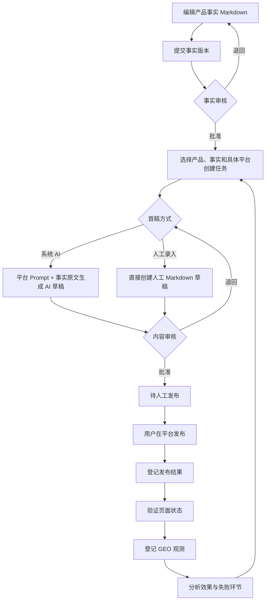
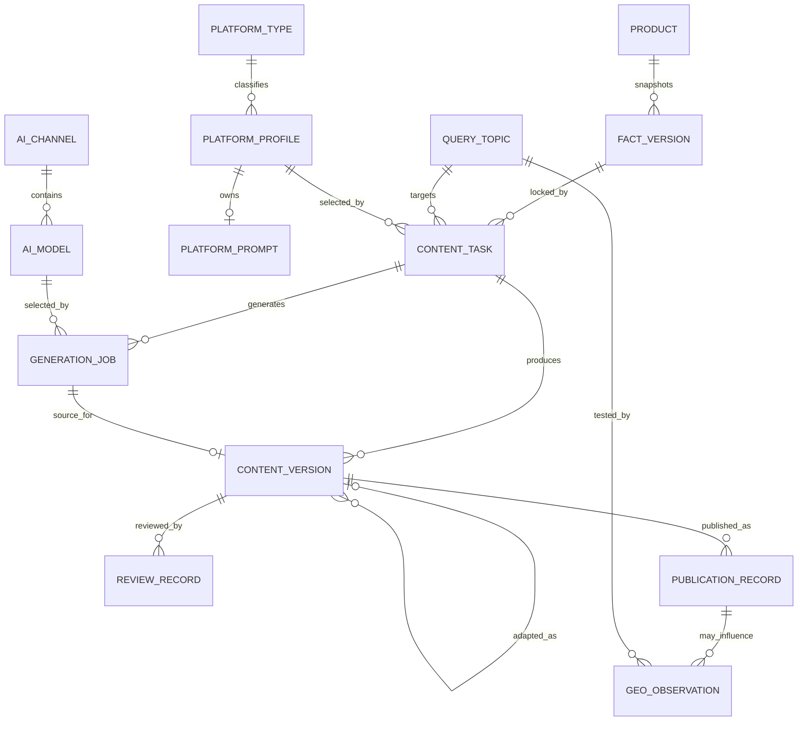
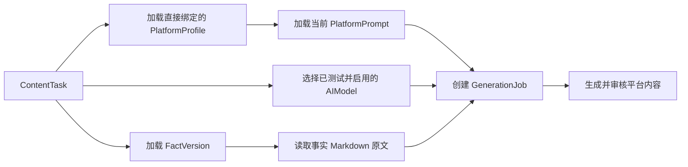
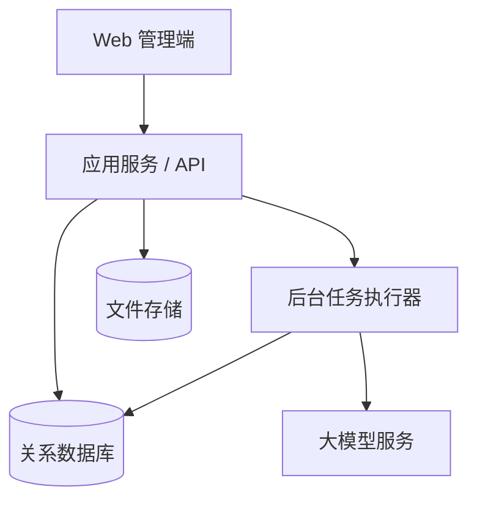

# 多平台 GEO 内容运营系统方案设计

> 文档版本：V2.1
> 编制日期：2026-07-27
> 当前阶段：MVP 已实现，受限任务与用户清理闭环已完成
> 关联文档：[GEO 项目会话归档](./GEO项目会话归档.md)
> 技术文档：[GEO 系统前后端技术与部署方案](./GEO系统前后端技术与部署方案.md)

## 1. 文档目的

本文定义面向电子元器件产品推广与国产替代业务的多平台 GEO 内容运营系统，包括业务目标、范围、核心规则、领域模型、系统架构、业务流程、数据结构、页面设计、质量控制、效果监测、实施计划和验收标准。

本文用于指导产品原型、数据库设计、接口设计和后续开发。未在本文确认的外部平台接口、模型能力和自动发布策略，不应在第一阶段被默认实现。

## 2. 方案摘要

系统采用“**权威事实库 + AI 差异化生成 + 人工审核 + 人工发布登记 + GEO 效果闭环**”的模式。

第一阶段不开发跨平台一键发布。普通用户在系统中完成产品资料维护、内容生成和人工审核后，将内容发布到目标网站，再登记最终文章 URL、平台审核状态和运营信息。系统随后记录文章收录、AI 检索、产品提及、引用、准确性及业务转化。

系统使用模块化单体架构，不采用微服务。产品事实、内容版本、发布记录和 GEO 观测分别拥有独立生命周期，并通过明确 ID 关联。未来接入官方 API 或 CDP 自动发布时，只增加发布适配器，不改变内容审核、发布记录和效果监测模型。

### 2.1 2026-07-11 会话决策与实现状态

本次会话先完成配置中心与真实 AI 生成能力，工作提交为 `d22d401`；随后完成账号精简与自助改密入口，工作提交为 `cebb0d0`。两个任务均已归档，契约检查、后端单元测试、PostgreSQL 迁移测试、前端测试、镜像构建和完整浏览器 E2E 均已通过。

已实现的产品边界：

- 首期只支持 OpenAI-compatible Chat Completions。`base_url` 是包含版本前缀的 API 根地址，例如 `https://example.com/v1`；模型发现固定调用 `GET {base_url}/models`，测试和生成固定调用 `POST {base_url}/chat/completions`，不支持 OpenAI Responses API，也不自动尝试其他路径。
- 管理员维护渠道描述、协议类型、供应商品牌、`base_url`、加密 API Key、渠道统一自定义 Header 和渠道下多个模型；“获取模型”只是便捷发现功能，`/models` 未实现或返回失败时仍可手工填写 `model_id`。
- 模型自定义参数支持按“参数名 + 任意 JSON 值”增删改查并原样发送，避免假定所有 OpenAI-compatible 服务支持同一参数集合；`model`、`messages`、`stream` 由系统保留。
- 渠道和模型默认停用。“获取模型”在弹窗中展示 `/models` 结果，已配置模型不可重复添加，未配置模型可逐个直接添加；该操作不能代替连接测试。连接测试只在具体模型上执行，携带该模型自定义参数并发送唯一用户消息 `hi`，只校验通用 Chat Completions 响应，不复用正式生成的严格四字段业务解析。至少一个模型测试成功后渠道才允许启用，每个模型仍必须分别测试成功才能启用。
- 连接、凭据、Header、`model_id` 或参数变化会使相关模型测试状态失效并要求重新测试。
- API Key 与敏感 Header 使用数据库密文、环境主密钥和永不回显策略；作业快照只保存普通 Header 与敏感 Header 名称，执行和重试只读取这些名称的当前敏感值。
- 每个具体平台最多一份普通 Markdown `system_prompt`。管理员可以原地覆盖或物理删除当前 Prompt；普通用户只读查看，历史含义由生成作业快照保留，不建设 Prompt 版本系统或模板语法。
- 产品数据手册在系统外完成 AI 总结；本系统只维护每个产品唯一的可编辑 Markdown 事实工作区及其分级和不可变审核版本，不保存参考型号、参数、证据或替代关系子表。
- 新任务只选择产品、同产品非空已批准事实版本和活动具体平台。系统 AI 生成恰好发送两条消息：平台当前 Prompt 原文作为 system，事实版本 Markdown 原文作为 user；不追加固定前缀或任务字段。
- 用户也可不调用系统 AI，直接创建首个人工 Markdown 草稿；AI 与人工首稿都进入同一内容审核、人工发布和 GEO 链路。
- 每次系统 AI 生成选择并锁定一个模型，作业保存完整不可变 v2 输入快照；重试复用原模型、参数和两条消息，只读取渠道当前凭据。旧 v1 快照只读且不得重试。
- 模型只返回严格四字段 JSON：`title`、`summary`、`body_markdown`、`tags`。代码块、附加字段、缺失字段或非法 JSON 均失败，不提取、修复或补值，也不再接收模型自报事实/证据 ID。
- AI 输出只创建 Markdown 草稿；电子工程师可以单人生成、编辑、提交并批准自己的事实和内容，所有状态转换和权限仍由服务端校验并记录审计。
- 身份模型只有 `ADMIN` 和 `ENGINEER`。管理员拥有工程师能力并额外管理用户、平台类型、Prompt、渠道和模型；长期账号使用启用/停用，不建设自定义角色系统。

账号精简任务已实现并归档至 `.trellis/tasks/archive/2026-07/07-11-user-cleanup/`：

- 旧版六个初始化账号只保留 `admin` 与 `content_editor`，一次性物理删除 `product_editor`、`product_reviewer`、`content_reviewer`、`analyst`。
- 任一目标账号存在业务或审计引用时，清理事务整体中止并明确报告，不改写历史归属、不级联删除业务数据。
- 空数据库使用独立的 `PARTSIGNAL_SEED_ADMIN_PASSWORD` 与 `PARTSIGNAL_SEED_ENGINEER_PASSWORD` 创建两个账号；新建 `content_editor` 首次登录必须改密。
- 既有 `content_editor` 保留当前密码，只设置 `must_change_password=true`；管理员可在密码遗失时设置临时密码。
- 工作台顶部已增加“修改密码”入口，用户管理默认隐藏停用账号但可显式查看；当前只允许管理员物理删除停用且没有业务历史引用的账号。

### 2.2 2026-07-25 Markdown 事实与直接平台任务

当前实现采用动态平台分类和具体平台单次生成，不建设批量分类生成或二次平台适配流程：

- 产品事实只有当前 Markdown 正文、分级、乐观锁和不可变审核版本；正文内容由用户对系统外总结结果负责。
- `PlatformType` 是管理员维护的业务分类；`PlatformProfile` 表示具体平台，并拥有零或一份当前 Markdown Prompt。
- `PlatformProfileVersion`、规则版本状态机和管理页面已经物理删除。工程师创建任务时直接选择活动具体平台；人工首稿不要求 Prompt，系统 AI 生成要求平台已有当前 Prompt。
- 每次生成作业冻结具体平台身份、事实版本身份与分级、最终 system/user message、模型和参数；当前配置后续变化不影响历史作业。
- 管理员可物理删除没有历史引用的产品和平台配置；服务端返回结构化直接引用，不级联删除或改写业务历史。

### 2.3 2026-07-22 AI 渠道与模型管理

- 配置中心使用“状态分类 + 渠道表格 + 右侧详情”的三栏工作区，保留稳定渠道详情 URL；列表搜索、状态/品牌筛选、稳定排序、分页和分类数量全部由服务端集合契约负责。
- `protocol_type` 与 `provider_brand` 分离：协议决定真实调用能力，品牌只用于管理识别、筛选和本地图标。当前协议只有 `openai-compatible-chat-completions`，品牌采用受控目录；未知组合明确失败，不按名称或 URL 猜测。
- 列表返回 `AIChannelSummary`，不返回 Header 值或模型数组；详情、模型、统计和操作日志按选中渠道读取。最近测试状态从子模型确定性投影，正式业务统计从 `generation_jobs` 按 7/30/90 天或全部时间实时聚合，测试和发现不计入。
- 供应商请求保持 `AT_MOST_ONCE`：开始发送后不自动重试，失败由用户显式创建新作业。页面显示“仅手动重试”，不增加无效的渠道重试次数配置。
- API Key 只在创建或重新配置时提交，敏感 Header 值永不回显；复制配置采用非敏感白名单。渠道、凭据、Header、模型、测试、发现、启停和删除均由服务端管理员权限与 CSRF 保护，并写入脱敏审计。
- 顶部全局搜索只搜索当前账号有权访问的页面、导航名称和功能关键词，并跳转既有路由；渠道名称、描述和地址继续由渠道页服务端搜索，不伪造跨域业务搜索。

### 2.4 2026-07-22 具体平台管理闭环

- `PlatformProfile.is_active` 是平台自身启停的唯一状态，既有平台迁移为启用。停用与配置完整性相互独立；停用平台仍可查看、编辑、维护 Prompt 及重新启用。
- 停用不联动既有账号，也不改写 Prompt、内容任务、发布记录、GEO 观测或审计历史；服务端在新建普通/修复任务、平台账号和发布记录前锁定平台并明确拒绝停用状态。
- 平台列表搜索、类型/状态/完整性筛选、分页、详情、实时汇总和 CSV 导出使用同一 PostgreSQL 权威集合。五张统计卡只显示当前实时计数，历史趋势没有快照来源时统一显示“暂无历史基线”。
- 平台引用数按直接引用该平台的唯一内容任务统计；最近 30 天使用同一 UTC `as_of` 的半开区间 `[as_of - 30 days, as_of)`，查看引用分析进入按平台筛选的内容任务列表。

### 2.5 2026-07-25 双首稿内容生产

- 新任务只保存产品、事实版本和具体平台，不再保存受众、内容角度、转化目标、格式、长度、任务 Prompt、平台类型快照或 canonical URL。
- 系统 AI 方式打开弹窗展示平台当前绑定的 Prompt，用户确认后选择已启用模型并创建 `GENERATE` 作业；提交时服务端重新校验 Prompt 身份与 revision，不提供默认安全 Prompt 或历史规则回退。
- 人工方式在任务上直接提交标题、摘要、Markdown 正文、标签和变更说明，创建 `source_type=HUMAN`、`status=DRAFT` 且生成与父版本引用为空的首稿。
- 两种方式只在首稿来源不同；后续人工修订、自然化、审核、批准、人工发布、验证和 GEO 观测共用既有状态机。

### 2.6 2026-07-23 Prompt 管理工作台

- Prompt 管理页形成“可复用模板列表—Markdown 编辑—真实输出预览/安全边界”工作台；一个平台最多绑定一份当前 Prompt，一份 Prompt 可供多个平台复用。
- 平台管理从同一服务端集合读取真实 Logo、类型、配置状态和当前 Prompt 摘要；配置完整性只由可空绑定实时派生。
- 平台 Prompt 模板与全局自然化 Prompt 分别使用各自唯一端点。保存使用 revision 乐观锁；共享模板保存前展示全部受影响平台，被绑定模板不可删除，未绑定模板可按当前 revision 删除。冲突保留本地草稿，切换标签、模板、路由或刷新前提示未保存修改。
- 输出预览不新增临时模型接口。管理员显式选择真实任务、模型及自然化源草稿后创建现有 `GENERATE | HUMANIZE` 作业，成功结果是可审计、可追溯的新 AI `DRAFT`；未保存 Prompt 不参与预览，既有结果始终归属原作业快照。

### 2.7 2026-07-23 业务设置与用户治理

- 业务设置维护发布账号；用户管理与审计日志只对管理员显示，配置中心不再重复这两个入口。问题主题以“GEO 问题库”归入 GEO 观测导航。
- 用户工作台的搜索、账号类型、状态、稳定排序和分页全部由服务端 PostgreSQL 查询负责；五张统计卡使用未筛选实时汇总，没有历史快照时明确显示“暂无历史基线”。
- 管理员新增账号时提交一次性临时密码；服务端只保存哈希，新账号默认启用且 `must_change_password=true`。新建账号临时密码最少 12 位，重置临时密码和用户自助改密的正式新密码最少 8 位；重置或停用账号会撤销目标用户全部活动会话。
- 单个与批量启停共享 revision、最后有效管理员和会话撤销规则。批量最多 100 个唯一用户，预期冲突逐项返回真实失败原因，非预期数据库或审计错误使整批回滚。
- 当前筛选可以导出单一 UTF-8 BOM CSV；允许字段不含 UUID、revision、密码、会话或认证信息，成功导出只记录非敏感筛选和行数审计。
- 用户启用、停用、改名和账号类型调整仍保留稳定 UUID 及历史归属。管理员只能删除停用且没有业务历史引用的账号；活动账号或仍被业务记录引用的账号由服务端拒绝。删除成功时清理会话，既有审计事件保留且该用户的操作者投影置空。

### 2.8 2026-07-26 发布账号与重复发布

- 一个具体平台可以维护多个不同发布账号；账号平台归属创建后不可编辑。业务标签与内部运营账号标识可编辑，账号可停用和重新启用，只有管理员能物理删除未被发布记录引用的账号。
- 运营账号标识用于内部识别，可以填写平台用户名或“注册手机号 + 持有人”等组合；写入时去除两侧空白，同平台按忽略大小写后的标识唯一。系统不保存账号密码、Cookie 或令牌，内部标识不写入日志和审计详情。
- 人工发布一篇文章只能单选一个账号。缺少匹配账号时，工作台直接进入当前具体平台筛选后的发布账号页。
- 同一具体平台下，以不可变内容哈希识别同一篇文章：进行中尝试阻止第二次登记，任一记录曾公开后永久阻止换账号重复发布。只有从未公开且已被拒绝的尝试允许换账号重试；不同具体平台互不阻断。
- “历史目标问题”统一命名为“GEO 问题库”，入口与观测记录、分析洞察并列；实体和历史关联保持不变。

### 2.9 2026-07-27 受限任务与用户清理

- 已取消内容任务只有在从未创建生成作业或内容版本时才能物理删除；已有生产历史时服务端返回生成作业、内容版本的真实引用数量，不级联清理。
- 用户管理只向停用账号提供删除。活动账号直接拒绝，业务历史外键继续阻断；会话随用户删除，历史审计事件保留但被删用户的操作者投影置空。
- `audit_logs` 仍禁止删除和普通更新；`0027_guard_audit_actor_user_delete` 只允许用户删除引起的外键级联把匹配用户的 `actor_id` 从原 UUID 置空，其他列必须完全不变。
- 用户统计中的管理员数量统计全部实际 `ADMIN`，包括停用账号，不等同于当前启用管理员数量。平台列表 Logo 统一按 24×24 CSS 像素展示，外部图片 URL 的原始 16/32 像素不会改变列表布局尺寸。

### 2.10 2026-07-27 平台 Logo 导入与清理

- MVP 由 Icon Horse 一次性发现官网主机名对应的一张候选；管理员预览并确认后，才把自有对象存储中的 `file_id` 随平台保存。取消预览不修改平台，系统不自行抓取官网、不展示多候选，也不转换 SVG。
- 新写入只接受公开、已校验的 `PLATFORM_LOGO` 文件。历史外链 Logo 继续读取但不能新建或改写；保存其他字段时保持原值，只有手工上传、官网候选确认或显式清空才退出旧外链。
- 未确认候选保留 24 小时，解除最后引用的旧 Logo 保留 7 天，失败或中止文件在下一轮清理。定时任务先锁定并标记 `DELETING`，再幂等删除对象并保留 `DELETED` 墓碑；删除前实时复核当前全部文件引用。

## 3. 背景与业务问题

公司需要推广电子元器件国产替代产品。当用户在豆包、DeepSeek、Grok 等具备联网搜索能力的 AI 产品中查询进口型号的国产替代、兼容料号、参数对比或替换方案时，希望公司的产品能够被准确检索、提及或引用。

国产替代是重要推广场景，但不是唯一场景。系统还应支持产品介绍、参数解析、选型指南、应用方案、工程排障、案例和供货信息等内容；没有替代关系的产品也必须能够建立事实版本和内容任务。

当前主要问题包括：

- 产品参数、替代结论和证据可能分散在多个文件或人员手中。
- 不同平台需要不同的文章角度，人工重复编写成本高。
- 多平台文章容易出现参数、型号和替代边界不一致。
- 发布后的平台地址、审核状态和内容版本缺少统一登记。
- 只统计发文数量，无法判断是否被 AI 检索、采信或正确引用。
- 过早开发跨平台自动发布会引入大量页面适配和维护成本。

## 4. 业务目标与非目标

### 4.1 业务目标

1. 建立电子元器件产品事实 Markdown 的唯一权威来源，所有允许用于写作的资料由用户在同一正文中维护、审核和追溯。
2. 基于同一事实版本和所选具体平台 Prompt 生成差异化内容。
3. 保证 AI 生成内容可人工修改、审核、追溯和回滚到历史版本。
4. 管理人工发布过程，准确记录内容版本、平台、账号和最终 URL。
5. 建立从产品内容到人工发布，再到站外搜索推荐结果和业务转化的闭环。
6. 用真实运营数据决定未来应自动化的平台和流程。

### 4.2 第一阶段非目标

- 不实现 Playwright、DrissionPage 或其他 CDP 跨平台自动发布。
- 不实现通用的页面选择器配置语言。
- 不自动绕过登录、验证码、平台审核或其他访问控制。
- 不自动生成缺少事实依据的参数或替代结论。
- 不自动发布未经人工审核的内容。
- 不建设微服务、消息总线、复杂规则引擎或插件平台。
- 不在第一版自动化调用所有目标模型进行大规模监测。
- 不以文章数量、关键词密度或单次模型回答作为唯一效果指标。

## 5. 设计原则与核心不变量

### 5.1 设计原则

- **事实优先**：AI 负责表达，不负责创造产品事实。
- **一个事实源**：每个产品只有一份当前事实 Markdown 工作区，生成只读取其已批准不可变版本。
- **先统一、后差异化**：先锁定统一事实快照，再生成平台版本。
- **平台级配置**：平台类型只负责分类，具体平台拥有当前 Prompt；规则草稿可编辑，激活或退役后冻结。
- **人工把关**：所有外发内容必须经过明确审核。
- **版本可追溯**：发布记录必须指向具体内容版本和事实版本。
- **发布方式解耦**：人工发布和未来自动发布共用同一发布结果模型。
- **闭环度量**：发布不是终点，必须继续记录收录、采信、准确性和转化。
- **小步实施**：先验证 5～10 个重点产品和少量平台，再扩大范围。

### 5.2 不可破坏的业务不变量

1. 只有状态为“已批准”的事实版本才能用于生成正式内容。
2. 每个内容版本必须绑定一个不可变的事实版本快照。
3. 事实版本更新后，历史内容不得被静默改写。
4. AI 生成结果只能创建草稿，不能直接成为已批准版本。
5. 只有已批准的内容版本才能进入待发布状态。
6. 每条发布记录必须绑定唯一的内容版本。
7. 已发布文章的 URL、平台和内容版本必须保留历史，不允许被新版本覆盖。
8. GEO 观测结果按测试时间追加记录，不覆盖历史观测。
9. 产品事实 Markdown 必须由用户明确保存并审核，系统不得猜测、补零或从外部资料自动补全未知事实。
10. 系统不得支持虚构权威、伪造数据或虚假交叉背书。
11. 每次系统 AI 生成必须保存不可变的 `GenerationJob.input_snapshot`，冻结平台 Prompt 原文、事实 Markdown 原文、平台、模型和参数；历史生成记录不得随当前配置更新而改变。
12. Markdown 是内容的唯一可编辑正文源，不并行维护可独立编辑的 HTML 或编辑器 JSON。
13. 平台类型由管理员维护；内容任务直接锁定一个具体平台，不经过规则版本。
14. AI 或人工来源的内容都必须先批准，才能创建发布记录。
15. 一篇文章在同一具体平台只能选择一个账号完成一次公开发布；曾公开后下线或验证失败也不得换账号重复发布。
16. 同一具体平台可以维护多个账号，但内部运营账号标识去除两侧空白并忽略大小写后必须唯一，停用账号仍保留历史身份。

## 6. 用户类型与流程权限

第一阶段不按产品维护、产品审核、内容运营、内容审核和数据分析等工作环节划分长期角色。这些名称只描述流程中的操作，不代表不同用户类型；同一个普通用户可以完成完整业务流程。

| 用户类型 | 主要职责 | 关键权限 |
|---|---|---|
| 普通用户 | 电子工程师及其他业务人员 | 维护和确认产品事实、查看平台 Prompt、选择模型、生成和编辑内容、审核定稿、登记发布及 GEO 观测 |
| 系统管理员 | 系统维护人员 | 拥有普通用户的业务能力，并额外管理平台类型、具体平台、平台 Prompt、用户、AI 渠道、Header、模型和系统安全配置 |

普通用户能否执行某个动作由对象当前状态决定，而不是由岗位角色决定。例如只有待审核版本可以批准，只有已批准内容可以进入待发布状态。MVP 允许同一用户创建、编辑并批准同一事实或内容版本；审核是必须显式执行并留痕的质量检查节点，不是强制换人的职责分离。

系统只保存 `ADMIN` / `ENGINEER` 账号类型和启停状态，不建设角色表、权限配置界面或自定义权限引擎。所有写操作都必须记录实际操作者，并在服务端同时校验账号状态、管理员能力和业务状态转换。普通用户可以在任务中只读查看所选平台 Prompt，但不能修改配置，也不能管理渠道和模型。

### 6.1 初始账号与密码治理

空数据库初始化时只创建两个账号：

- `admin`：`ADMIN`，初始密码来自 `PARTSIGNAL_SEED_ADMIN_PASSWORD`。
- `content_editor`：`ENGINEER`，初始密码来自独立的 `PARTSIGNAL_SEED_ENGINEER_PASSWORD`，首次登录必须修改密码。

初始化命令必须幂等，重复部署不得覆盖任何既有密码。所有登录用户都能从顶部账号区域进入自助改密，修改时必须验证当前密码并撤销其他会话；管理员只能通过该流程修改自己的密码。管理员可以新增用户、编辑显示名称与账号类型、为其他用户设置至少 8 位临时密码并单个或批量启停账号。只有停用且没有业务历史引用的账号可以物理删除；会话一并清理，历史审计保留并把该用户的操作者引用置空。管理员调整或停用自己时也必须满足“提交后仍至少有一个有效管理员”；自我停用成功后当前会话立即失效。

开发遗留的 `product_editor`、`product_reviewer`、`content_reviewer` 和 `analyst` 只通过一次性迁移物理删除。任一账号存在业务或审计引用时，迁移整体回滚并报告引用，不改写归属或级联删除数据。

## 7. 总体业务流程



### 7.1 事实维护流程

1. 用户把系统外完成的数据手册总结以 Markdown 原文填入产品事实工作区，并选择数据分级。
2. 系统按 `facts_revision` 乐观锁保存唯一工作区，不解析为参考型号、参数、证据或替代关系子表。
3. 用户从非空工作区创建新的事实版本草稿。
4. 用户核对 Markdown 原文与分级，并显式执行批准或退回；系统不以审核人与创建人是否相同作为阻断条件。
5. 审核通过后，正文和分级成为不可变的已批准事实版本。
6. 后续修改必须创建新版本，不允许直接修改已批准版本。

### 7.2 内容生成流程

1. 用户创建内容任务，只选择产品、该产品的非空已批准事实版本和活动具体平台。
2. 采用系统 AI 时，用户选择已启用模型；服务端要求平台当前 Prompt 存在，并冻结渠道非敏感信息、模型参数、具体平台、事实版本身份与分级及最终两条消息。
3. 供应商请求恰好包含 `system.content = PlatformPrompt.template_markdown` 和 `user.content = FactVersion.body_markdown`，原文逐字发送，不拼接任务字段、产品元数据或固定安全规则。
4. 采用人工方式时，用户直接提交标题、摘要、Markdown 正文、标签和变更说明；系统不创建生成作业。
5. 用户编辑并审核草稿；批准后才进入待发布列表。系统 AI 重试仅允许 v2 快照并创建新作业。

### 7.3 人工发布流程

1. 已批准且任务绑定明确具体平台的内容进入“待人工发布”列表。
2. 用户在按需 Drawer 中读取不可变发布包，只选择锁定平台下的一个匹配账号和目标栏目 URL；没有匹配账号时直接进入按当前具体平台筛选的发布账号页。系统先建立 `PENDING_MANUAL_PUBLISH PublicationRecord` 并固定内容版本。
3. 用户复制标题、Markdown 或纯文本，在目标平台人工发布；如平台存在处理或审核阶段，通过服务端允许命令登记 `PLATFORM_REVIEW`。
4. 发布完成后在同一 Drawer 登记实际标题、最终文章 URL、发布时间、非空操作说明和可选结果证据；服务端校验域名并原子写入结果、证据、状态事件和审计。
5. 普通用户人工核对页面正文与批准版本一致后执行验证；服务端只接受当前记录 `available_actions` 中的状态命令。
6. 页面下线或验证失败时保留发布历史并进入 `PublicationAttention` 显式处置流程。

### 7.4 GEO 观测流程

1. 选择一个产品，在豆包、DeepSeek、元宝等站外网站人工搜索。
2. 选择真实问题主题，并登记人工搜索平台、实际搜索词、测试时间和真实结果截图。
3. 系统列出该产品当前具有公开链接的全部已发布文章。
4. 操作人员逐篇登记发现、提及、推荐、引用和准确性事实，严格满足累计阶段，不得漏标或由系统猜测。
5. 系统追加保存观测、截图和逐篇事实，不调用模型联网搜索，也不覆盖历史。
6. 在观测记录页筛选追溯，需要修正时追加更正记录；分析洞察只使用当前链尾的完整人工观测和已批准公式。

## 8. 领域模型

### 8.1 领域划分

系统划分为七个业务模块：

1. **产品事实**：拥有产品 Markdown 工作区、分级和不可变事实版本。
2. **内容策划**：拥有直接绑定具体平台的产品驱动内容任务。
3. **AI 与平台配置**：拥有平台类型、当前 Prompt、渠道、Header 和模型配置。
4. **内容生产**：拥有生成作业、AI 草稿、Markdown 人工版本和审核记录。
5. **发布登记**：拥有平台、账号、发布计划和发布结果。
6. **GEO 观测**：拥有 GEO 问题库、人工文章搜索、逐篇推荐结果、历史模型观测和效果指标。
7. **身份审计**：拥有用户、管理员标识和关键操作日志。

模块之间只能通过明确的 ID 和应用服务交互，不直接修改其他模块的数据。

### 8.2 核心实体

| 实体 | 中文含义 | 责任 |
|---|---|---|
| `Product` | 公司产品 | 保存稳定型号身份、基础分类和当前事实 Markdown 工作区 |
| `FactVersion` | 事实版本 | 冻结一次已审核的事实 Markdown 与分级 |
| `QueryTopic` | GEO 问题库条目 | 保存人工 GEO 观测及历史任务/模型观测使用的问题、意图分类和关键词变体 |
| `PlatformProfile` | 具体平台 | 保存知乎、电子发烧友等平台官网身份、业务分类和当前 Prompt |
| `PlatformType` | 平台类型 | 管理员维护的具体平台业务分类 |
| `PlatformPrompt` | 平台 Prompt | 保存某具体平台当前唯一的 Markdown `system_prompt` |
| `AIChannel` | AI 渠道 | 保存描述、协议类型、受控供应商品牌、根地址、加密凭据、超时和渠道 Header |
| `AIModel` | AI 模型 | 保存渠道下的 `model_id`、自定义参数、测试和启停状态 |
| `ContentTask` | 内容任务 | 直接绑定产品、已批准事实版本和具体平台；历史任务可保留目标问题关联 |
| `GenerationJob` | 生成作业 | 冻结具体平台生成的完整非敏感输入并保存执行状态和指标 |
| `ContentVersion` | 内容版本 | 保存 AI 草稿和人工编辑版本 |
| `ReviewRecord` | 审核记录 | 保存审核结论、意见和审核人 |
| `PublicationRecord` | 发布记录 | 保存某内容版本在某平台的发布结果 |
| `GeoObservation` | GEO 观测 | 保存一次模型测试及其结果 |
| `AuditLog` | 审计日志 | 保存关键业务操作和变更摘要 |

### 8.3 实体关系



### 8.4 关键对象定义

#### `FactVersion`

`Product` 保存唯一可编辑的 `facts_body_markdown`、`facts_classification` 与 `facts_revision`。`FactVersion` 从该工作区冻结：

- `body_markdown` 原文与 `classification`。
- 产品引用、版本号、状态、创建人和时间。
- 追加式审核记录、审核人和批准时间。

已批准的 `FactVersion` 不允许更新，只能新建后续版本。

#### `ContentTask`

只包含：

```yaml
product_id: product_xxx
fact_version_id: fact_xxx_v3
platform_profile_id: platform_xxx
```

新普通任务固定 `query_topic_id=NULL`。受众、内容角度、转化目标、格式、长度和安全输出规则由平台 Prompt 自身负责，任务不重复保存。每次系统 AI 生成单独选择一个已启用模型；`GenerationJob.input_snapshot` 是实际模型调用上下文的权威记录，不能用任务、Prompt 或模型配置后来更新的当前值解释历史内容。

#### `PlatformType`、`PlatformProfile` 与 `PlatformPrompt`

`PlatformType` 是管理员维护的业务分类，只保存名称和唯一 `slug`，不拥有 Prompt，也不限制为固定枚举。被具体平台引用的类型不能删除；无引用类型可由管理员物理删除。

`PlatformProfile` 表示知乎或电子发烧友等具体平台，保存名称、唯一 `slug`、允许域名、所属类型和独立 `is_active` 状态。每个平台最多拥有一条当前 `PlatformPrompt`，正文是普通 Markdown，不支持变量、循环、条件或 Prompt 编排。管理员可以覆盖或删除当前 Prompt；删除后平台仍可用于人工首稿，但系统 AI 生成明确失败。历史含义由生成作业的最终 system message 冻结。

平台停用后继续保留上述配置能力，但不能用于新建内容任务、修复任务、平台账号或发布记录。各新建服务与启停命令共享“先锁平台、再检查状态”的事务顺序，避免并发停用被检查后写入穿透；既有账号和全部历史事实保持原状。

#### `AIChannel` 与 `AIModel`

`AIChannel` 是唯一外部调用连接边界，保存名称、描述、`protocol_type`、`provider_brand`、`base_url`、API Key 密文、10～600 秒超时、启停状态和渠道统一 Header。`protocol_type` 决定真实客户端，当前只允许 `openai-compatible-chat-completions`；`provider_brand` 采用 `OPENAI | ANTHROPIC | GOOGLE | AZURE_OPENAI | ZHIPU | QWEN | CUSTOM` 受控目录，只用于管理展示和筛选。品牌与协议组合由服务端目录校验，品牌不得改写请求协议或地址。`base_url` 必须是包含版本前缀的 API 根地址，例如 `https://example.com/v1`。Header 名称大小写不敏感且唯一，`Authorization`、`Host`、`Content-Length`、`Connection` 和 `Transfer-Encoding` 不允许覆盖；普通 Header 可以回显，敏感 Header 只返回是否已配置。

一个渠道拥有多个 `AIModel`。模型保存显示名、供应商 `model_id`、自定义 JSON 参数、测试状态和启停状态。自定义参数按唯一参数名维护，值可以是 JSON 字符串、数字、布尔、数组或对象，并按原名原值发送；`model`、`messages`、`stream` 由系统拥有，不能作为自定义参数。管理员可以对参数增删改查，不使用一套固定参数表猜测供应商能力。

“获取模型”调用 `GET {base_url}/models`，在独立弹窗中展示远端 ID；已配置 ID 标记为“已添加”，未配置 ID 由管理员逐个确认后才调用现有创建接口落库，接口缺失或失败时仍可手工填写 `model_id`。该发现结果不代表 Chat Completions 可用。“测试连接”只在具体模型上执行，调用 `POST {base_url}/chat/completions`，携带模型自定义参数且 `messages` 只有一条内容为 `hi` 的用户消息；成功只校验通用 Chat Completions 正文结构，不要求模型返回业务草稿四字段 JSON。至少一个模型测试成功后渠道才允许启用；每个模型仍需自身测试成功才能启用。

首期协议面只包含上述两个固定路径，不支持 OpenAI Responses API，不探测 `/responses`、无版本路径或其他兼容端点。渠道连接、API Key 或 Header 变化会停用渠道并使全部子模型回到未测试；模型 ID 或参数变化只使对应模型失效。

#### `GenerationJob`

每次调用模型创建一条不可变生成记录，至少保存：

- 内容任务、渠道与模型引用、具体平台和事实版本。
- 渠道非敏感信息、普通 Header、敏感 Header 名称和模型参数。
- 逐字冻结的平台 Prompt system message 与事实 Markdown user message。
- 适配器名称、固定契约版本、执行状态和非敏感错误摘要。
- 供应商请求 ID、本地耗时和可空 token 用量。
- 发起用户和由本次生成创建的内容版本。

重试创建新作业并完整复制原 `input_snapshot`，只读取渠道当前 API Key 和快照所列敏感 Header 的当前值。配置行已删除、停用或快照所需敏感 Header 不再存在时显式失败，不切换模型、Prompt 或开发生成器。

#### `ContentVersion`

建议保存：

- 所属任务。
- 绑定任务所选具体平台。
- 版本号和来源类型：AI 生成、人工编辑或基于旧版本修改。
- 标题、摘要、Markdown 正文、标签和建议图片。
- 绑定的事实版本和来源生成作业；AI 草稿通过作业快照追溯模型、Prompt 和用户输入。
- 创建人、变更说明和内容哈希。
- 审核状态。

模型不返回或自报 `used_fact_ids`、`used_evidence_ids`、`required_disclosure_ids`。Markdown 是内容唯一可编辑正文源；系统可以按目标平台临时渲染为 HTML 或纯文本，但不得保存另一份可独立编辑的正文。发布后的内容版本不得直接编辑，需要修改时创建新版本并重新审核。

#### `PublicationRecord`

当前保存：

- 锁定内容版本、内容哈希和创建人。
- 与任务锁定具体平台一致的发布账号，以及目标栏目 URL。
- 实际标题、最终文章 URL、发布时间和当前发布状态。
- 追加式 `PublicationStatusEvent`，保存每次真实状态、说明、操作者和时间。
- 追加式 `publication_attachments`，同时承载候选创建阶段证据和 `mark-published` 原子追加的结果证据。

`PublicationRecord` 是人工发布和未来自动发布的共同边界。最终 URL、平台、账号和内容版本属于历史，不得静默覆盖；发布后下线或验证失败只追加状态和关注事项。未来增加自动发布时不得新建第二套发布结果模型。

同一篇文章由不可变 `ContentVersion.content_hash` 识别。创建登记和登记已发布都按“具体平台 + 内容哈希”串行检查：同平台已有进行中尝试时不能换账号再次登记；任一记录曾进入 `PUBLISHED` 或 `VERIFIED` 后，后续下线或验证失败也不能撤销公开事实。只有从未公开且最终 `REJECTED` 的尝试可以改选另一个启用账号重试。

#### `GeoObservation`

当前人工观测保存：

- 被核对的产品、真实问题主题、人工搜索网站和实际搜索词。
- 测试时间、测试人员和补充说明。
- 该产品当前全部可观测文章的逐篇发现、提及、推荐、引用和准确性事实。
- 至少一张已验证的搜索结果截图。

旧模型观测继续保留原目标问题、模型、联网标识、回答摘要、引用和准确性等历史字段，但不再用于创建新的人工观测。人工观测不保存模型回答摘要。人工更正通过追加同产品、同问题主题、同搜索平台和同搜索词的新记录完成，不覆盖原记录；更正表单以待更正详情为唯一基线，预填观测时间、备注和全部逐篇事实，用户只修改需要纠正的字段。补采前主题为空的历史记录首次更正时必须补充真实主题，逐篇未知布尔事实必须由用户显式选择，不得推断为“否”。历史证据聚合展示，每个更正版本只关联本次新增证据。默认列表和指标只读取更正链尾，显式选择“包含历史更正记录”时才读取完整历史。

## 9. 生命周期与状态设计

不使用一个字段承载“生成、审核、发布、平台审核、效果验证”全部状态。事实、内容和发布分别维护生命周期，减少无效状态组合。

### 9.1 事实版本状态

```text
DRAFT → PENDING_REVIEW → APPROVED → RETIRED
                     ↘ CHANGES_REQUESTED
```

- `APPROVED` 后不可修改。
- `RETIRED` 表示不再用于新任务，但历史内容仍可追溯。

### 9.2 内容版本状态

```text
DRAFT → PENDING_REVIEW → APPROVED → SUPERSEDED
                     ↘ CHANGES_REQUESTED → PENDING_REVIEW
```

- AI 输出固定为 `DRAFT`。
- 只有任务绑定明确具体平台的 `APPROVED` 内容才能创建发布记录。
- 新版本批准后，旧版本可以标记为 `SUPERSEDED`，但历史发布关系保留。

### 9.3 发布记录状态

```text
PENDING_MANUAL_PUBLISH
→ PLATFORM_REVIEW
→ PUBLISHED
→ VERIFIED

异常：REJECTED / REMOVED / VERIFICATION_FAILED
```

- `PUBLISHED` 表示普通用户已登记最终 URL。
- `VERIFIED` 表示系统或人工确认页面公开可访问且关键内容正确。
- 平台拒绝和内容下线不能删除记录，只能更新状态并记录原因。
- 发布账号必须属于平台级内容锁定的具体平台；前端只展示匹配账号，服务端和 PostgreSQL 共同拒绝错绑。
- 一条发布记录只能选择一个账号；同平台同内容存在进行中尝试或曾公开历史时，服务端返回明确冲突。

### 9.4 内容任务状态

内容任务只保存宏观进度：

```text
OPEN → CANCELLED
OPEN -- 首条关联发布 VERIFIED --> COMPLETED
```

`COMPLETED` 记录任务曾完成至少一个发布闭环，是不可回退的历史终态。任务存在待人工发布、平台审核中或已发布记录时不能取消；生成和发布进度通过作业、内容版本和发布记录推导，不维护重复状态。

`CANCELLED` 任务只有在没有任何生成作业或内容版本时才可由普通用户物理删除。已有生产历史的取消任务继续保留，服务端返回真实阻断引用；前端不自行推导能否删除。

## 10. AI 内容生成设计

### 10.1 生成流水线



### 10.2 两条消息输入

原始系统 AI 生成不再构造任务级输入。服务端锁定任务、具体平台、当前 `PlatformPrompt`、非空 `APPROVED FactVersion` 和所选模型后，逐字冻结并发送：

- `system.content`：`PlatformPrompt.template_markdown` 原文。
- `user.content`：`FactVersion.body_markdown` 原文。

请求中不得增加固定安全前缀、产品元数据、任务字段、事实 JSON、附件地址或访问凭据。生成请求提交 `ai_model_id`、用户已确认的 `platform_prompt_id` 和 `platform_prompt_revision`；服务端重新校验它仍是平台当前绑定。事实分级不是 `PUBLIC` 时禁止第三方调用。

### 10.3 平台配置

`PlatformProfile` 表示具体平台官网，保存平台名称、Slug、所属动态业务类型、官网、允许域名、品牌信息、独立启停状态和可空的当前 Prompt 绑定。不存在平台规则版本或页面自动化选择器。

### 10.4 平台 Prompt

平台 Prompt 是管理员维护的可复用模板库，用于规定平台生成基线。一个具体平台最多绑定一份当前 Prompt，同一 Prompt 可绑定多个平台；正文是一篇可全选、复制、粘贴和修改的普通 Markdown，不需要理解模板语法。

平台 Prompt 主要定义：

- 身份和任务目标，例如以电子工程师身份回答技术选型问题。
- 内容类型、目标读者、语气、结构和 Markdown 格式要求。
- 平台表达约束，包括标题、外链、品牌露出、CTA 和禁用表达。

事实边界、安全要求、平台语气、结构和输出规则均由管理员写入每个平台 Prompt。管理员保存时原地覆盖当前 Prompt，也可以物理删除；误删后新的系统 AI 生成直接失败，不提供固定 Prompt、历史规则或默认规则回退。普通用户只读查看，不能编辑或选择历史版本。作业保存最终 system message，因此 Prompt 即时生效与历史追溯不冲突。

平台 Prompt 覆盖和物理删除都提交当前 `expected_revision`。服务端锁定当前 Prompt 行后比较修订号，冲突时返回 `REVISION_CONFLICT` 并保持当前行及审计不变；平台集合中的可空更新时间直接投影该行 `updated_at`，不使用平台自身更新时间代替。

生成内容时，服务端直接读取任务平台的当前 Prompt。Prompt 必须存在且事实版本必须非空并为 `PUBLIC`；否则明确阻止生成，不自动套用其他平台或类型级 Prompt。具体平台身份、事实版本身份与分级以及最终两条消息均写入新作业快照。

### 10.5 模型输出结构

模型应返回结构化结果，Markdown 正文作为其中的明确字段，不直接返回一段无法可靠解析的自由文本：

```json
{
  "title": "OP2280 国产替代选型：XXX 参数与替换注意事项",
  "summary": "概括产品事实与文章内容的摘要",
  "body_markdown": "# OP2280 国产替代选型\n\n完整 Markdown 正文",
  "tags": ["OP2280", "国产替代", "运放"]
}
```

`body_markdown` 是后续人工编辑和版本管理的唯一正文源。标题、摘要和标签作为发布辅助字段单独保存；HTML 或纯文本只在预览、复制或发布时由 Markdown 派生，不作为第二份可编辑正文。

`choices[0].message.content` 必须能直接解析为只含上述四个非空字段的 JSON 对象。系统不剥离代码块、不截取正文、不修复 JSON，也不从其他字段补值。技术陈述由电子工程师人工核对。解析失败时 `GenerationJob` 标记失败并保留非敏感错误摘要，不创建伪成功草稿。

### 10.6 自动质量检查

MVP 只实现可确定的检查，不建设复杂规则引擎：

- 型号拼写检查。
- 正文数字和单位与已批准事实版本的一致性检查。
- 禁用表达检查。
- 必要替代边界是否缺失。
- 标题、摘要和 `body_markdown` 是否为空且 Markdown 结构是否有效。
- 标题和正文长度是否符合平台建议。
- 官网权威页和证据链接是否有效填写。
- 内容是否与同一任务的其他平台版本高度重复。

检查失败时应返回明确问题，由人工修改；不得用默认值或模糊表达掩盖缺失事实。

## 11. 审核设计

### 11.1 审核维度

| 维度 | 审核内容 |
|---|---|
| 事实准确性 | 文章是否忠实于绑定事实 Markdown |
| 内容质量 | 结构是否清晰，表达是否符合业务目的 |
| 平台适配 | 是否符合该次作业冻结的平台 Prompt |
| 宣传合规 | 是否存在绝对化、虚构权威或误导表达 |
| 转化设计 | CTA 是否清晰且不过度干扰技术内容 |

### 11.2 审核操作

普通用户可以：

- 批准当前版本。
- 退回并填写具体修改意见。
- 查看本版本绑定的事实 Markdown。
- 对比 AI 原始版本与人工修改版本。
- 查看同一任务的其他平台版本，检查事实是否一致。

审核是内容进入待发布状态前必须完成的流程动作，不要求由另一账号执行。创建人可以审核自己的内容，但批准必须显式确认并生成 `ReviewRecord`；系统不得因操作者相同而跳过审核记录。事实与内容的退回意见去除空白后必须非空，提交和批准意见可选。审核记录不可删除，退回后重新提交会追加新记录，不覆盖上一次意见。

审核页面从单一服务端上下文读取当前不可变正文、版本差异、阻断和非阻断质量问题、任务绑定事实 Markdown、生成消息快照及完整审核时间线。该上下文不能用当前可编辑事实工作区或后来创建的事实版本补缺；阻断质量问题始终由服务端禁止批准。

## 12. 人工发布与发布登记

### 12.1 待发布工作台

发布工作台由全量服务端状态快照、三个真实列表和辅助信息组成，提供：

- 发布流程概览：`PENDING_MANUAL_PUBLISH`、`PLATFORM_REVIEW`、`PUBLISHED`、`VERIFIED` 和开放 `PublicationAttention`。
- 待发布候选：批准内容版本、锁定平台和服务端匹配账号。
- 发布记录：内容标题与版本、实际发布标题、平台账号、当前状态、最终 URL、发布时间、最后验证时间和 `available_actions`。
- 发布需关注：`REMOVED` / `VERIFICATION_FAILED` 的确定性分类、原发布上下文和修复任务状态。
- 标题、Markdown 和纯文本发布包复制，以及按需发布登记 Drawer。
- 真实发布指引、最近五条发布状态事件、异常摘要和滚动 7/30 天数据概览。

这里的“一键复制”只复制已审核内容，不执行外部发布操作。

### 12.2 按需发布登记 Drawer

页面不永久占用右侧空白；只有选中候选或发布记录时打开 Drawer，关闭后保留当前页签、筛选、周期和分页 URL 状态。

候选创建阶段只提交真实的 `ManualPublicationCreate` 字段：锁定的 `content_version_id`、匹配 `platform_account_id`、目标 `section_url` 和可选 `attachment_file_ids`。发布完成阶段的 `mark-published` 命令提交实际标题、最终 URL、带时区发布时间、非空说明和可选结果证据 ID。平台状态不是可自由填写的第二套枚举，而是由服务端状态转换与 `available_actions` 决定。

账号字段保持单选，并明确提示“本篇文章只能选择一个账号”。同一具体平台可维护多个运营账号，但系统不提供多选、批量分发或同文轮换账号；缺少账号时的入口必须携带当前 `platform_profile_id`，直接打开筛选后的发布账号页。

两阶段证据复用同一文件直传和完整性校验能力，只接受已验证的 `OPERATION_SCREENSHOT`。候选创建阶段可以关联已有证据；`mark-published` 可以在同一数据库事务中追加结果证据。文件上传成功但发布命令失败时，界面明确显示“已上传，尚未绑定”，文件记录仍可追溯，但不会伪装为已绑定发布记录。

Drawer 的锁定上下文直接来自 `PublicationRecord` 详情投影，包括内容标题/版本、目标平台、平台账号和内容哈希。旧发布详情路由只读保留历史，所有状态写操作统一返回工作台 Drawer，避免形成两套并发和错误处理路径。候选发布包读取失败时必须展示真实错误并阻止复制与登记。

如果用户在平台上修改了正文，而不只是标题或排版，应先回到系统创建新的内容版本并审核，再登记发布。这样可以保证系统保存的版本与实际外发内容一致。

### 12.3 发布验证

登记最终 URL 后，当前 MVP 由人工执行以下核对：

- URL 格式和域名是否属于目标平台。
- 页面是否公开可访问。
- 页面标题是否与登记标题一致。
- 页面正文是否包含产品型号和必要替代边界。
- 页面是否仍处于平台审核或登录可见状态。
- 页面正文是否与批准内容版本一致。

服务端当前以 `verify` 命令的明确 `content_matches=true` 和追加式状态事件记录验证通过，列表的最后验证时间从 `VERIFIED` / `VERIFICATION_FAILED` 状态事件推导。自动页面抓取不在当前范围；后续只有在只读验证稳定时才增加独立任务。

### 12.4 发布异常与修复任务

发布从 `VERIFIED` 或 `PUBLISHED` 进入 `REMOVED`、`VERIFICATION_FAILED` 时，不回退已经完成的内容任务，而是幂等创建唯一 `OPEN PublicationAttention`。异常详情保留原发布、原任务、触发状态和完整审计；只有普通用户填写非空处置说明并显式执行解决命令后才能进入 `RESOLVED`。

创建修复任务与解决异常是两个独立操作。修复任务固定继承原产品和直接平台；历史任务继续继承其真实目标问题，新产品驱动任务保持目标问题为空。普通用户必须从同产品当前非空 `APPROVED` 事实版本中重新选择，并查看与原版本的 Markdown 差异。创建修复任务只建立来源关联，不自动关闭异常待办。

### 12.5 发布数据概览与最近动态

数据概览只允许选择滚动 7 天或 30 天，默认 7 天。窗口使用同一响应中的 UTC `as_of` 和半开区间 `[window_start, as_of)`：

- 登记发布数：窗口内首次出现 `PUBLISHED` 事件的去重发布记录数。
- 验证通过数：上述发布 cohort 中截至 `as_of` 曾出现 `VERIFIED` 事件的记录数。
- 验证通过率：验证通过数 / 登记发布数；分母为零时返回空值。
- 新增异常数：窗口内出现 `REJECTED`、`REMOVED` 或 `VERIFICATION_FAILED` 事件的去重记录数。
- 当前未解决异常：查询时点状态为 `OPEN` 的 `PublicationAttention` 数，不受周期限制。

已发布后下线或验证失败仍计入原历史发布 cohort。当前状态数量从 `publication_records.status` 全量聚合，异常数量从状态和开放关注事项确定性归类；前端不得遍历分页结果推算。最近动态只读取最新五条发布状态事件及其内容和平台投影，不复用管理员全局审计日志。

### 12.6 开发阶段受约束物理删除

管理员可以清理没有历史引用的当前开发数据，工程师无删除权限。服务端锁定目标并统计直接引用，存在引用时返回对象类型与数量；前端只负责中文展示，不复制引用判断。

| 删除对象 | 直接阻断引用 | 成功后的边界 |
|---|---|---|
| 产品 | 事实版本、内容任务、GEO 观测 | 删除产品和当前事实工作区，不删除历史 |
| 事实版本 | 内容任务、内容版本 | 任意状态均可删；同事务显式清理该版本的从属事实审核记录 |
| 具体平台 | 内容任务、平台账号 | 当前 Prompt 随平台删除，业务历史不变 |
| 平台账号 | 发布记录 | 只删除未用于发布的内部运营账号标识 |
| 平台类型 | 具体平台 | 不自动删除具体平台 |
| 已取消内容任务 | 生成作业、内容版本 | 仅清理从未开始生产的取消任务 |
| 停用用户 | 业务历史外键 | 会话清理；历史审计保留并把操作者置空 |

平台当前 Prompt 可直接删除，因为历史作业已冻结最终消息。事实审核记录通常保持追加式；管理员删除无内容引用的事实版本时，其从属审核记录是随父版本显式清理的例外，并保留不含快照正文或审核意见的删除审计摘要。`0016_fact_review_cleanup` 通过事务本地父版本 ID 只放行该次清理。`0027_guard_audit_actor_user_delete` 通过事务本地用户 ID 只放行匹配用户删除引起的 `audit_logs.actor_id: UUID -> NULL`，其他审计字段更新和全部审计删除仍由 PostgreSQL 拒绝。其他删除不得自动级联事实版本、任务、内容、审核、发布、文件或观测历史；产品删除不会代替管理员逐个确认事实版本，清理引用后由管理员显式重试。

## 13. GEO 监测与分析

### 13.1 人工搜索维度与 GEO 问题库

当前 GEO 观测以产品、真实问题主题、人工搜索网站、实际搜索词和已发布文章为维度。操作人员在站外网站实际搜索后登记证据，系统不维护固定搜索网站枚举，也不自动联网复查。

`QueryTopic` 保存配置问题全集。新内容任务不创建该关联；新 `MANUAL_ARTICLE_SEARCH` 观测必须明确选择一个真实问题主题，同时保留实际搜索词，系统不得按文本相似度猜测关联。补采前人工观测的空关联保持历史原值并从洞察分母排除。

### 13.2 单次观测字段

人工观测只保存实际发生的搜索和逐篇核对结果：

| 字段 | 说明 |
|---|---|
| 产品 | 本次人工搜索的公司产品 |
| 问题主题 | 明确关联的真实 `QueryTopic`，用于覆盖分析 |
| 人工搜索平台 | 豆包、DeepSeek、元宝等实际访问网站 |
| 实际搜索词 | 本次在站外提交的完整内容 |
| 观测时间 | 记录变化趋势 |
| 搜索结果截图 | 至少一张已验证的真实结果截图 |
| 文章结果 | 该产品每篇当前已发布文章的发现、提及、推荐、引用和准确性事实 |
| 关联发布记录 | 逐篇结果关联的真实发布记录 |
| 人工备注 | 记录错误、竞争产品和失败原因 |

历史模型观测保留迁移前已经存在的目标问题、模型与版本、回答摘要、是否提及、观测级推荐、引用和准确性字段，仅用于只读追溯。页面按观测类型分型展示，不为人工观测生成、补空或推断回答摘要、准确性和观测级推荐。

### 13.3 核心指标

分析洞察在指定时间窗口内只计算当前更正链尾、字段完整的人工观测关系：

```text
提及率 = 达到“发现且提及”的逐篇关系数 / 完整逐篇关系数
推荐率 = 达到“发现、提及且推荐”的逐篇关系数 / 完整逐篇关系数
引用率 = 达到“发现、提及、推荐且引用”的逐篇关系数 / 完整逐篇关系数
结果准确率 = 达到全部前置阶段且 accuracy=ACCURATE 的逐篇关系数 / 完整逐篇关系数
未推荐内容数量 = 周期内有完整观测且从未达到推荐阶段的去重发布内容数
```

`/geo-metrics` 继续以 `legacy_*` 字段单独返回旧模型观测指标，不能与人工逐篇关系共用字段名或分母。无分母时比率为 `NULL`，不补成 0。系统不设置未经验证的统一“GEO 总分”。

### 13.4 失败诊断

| 观测现象 | 判断 | 后续动作 |
|---|---|---|
| 页面未被搜索结果发现 | 收录或渠道问题 | 检查页面可访问性、标题、站内链接和平台选择 |
| 页面出现但未被模型采用 | 相关性或证据不足 | 增强直接答案、参数依据和替代边界 |
| 产品被提及但未推荐 | 替代结论不足 | 补充验证条件、应用案例和工程证据 |
| 产品被推荐但参数错误 | 信息冲突 | 查找冲突页面并统一事实表达 |
| 单次命中但不稳定 | 样本不足或过拟合 | 扩充问题变体并跨周期复测 |

系统可以根据诊断创建优化任务，但不得自动修改已发布文章或已批准事实。

## 14. 系统架构

### 14.1 架构选择

第一阶段采用模块化单体：



选择理由：

- 当前团队、流量和边界尚未证明需要微服务。
- 核心业务事务需要在事实、内容版本和审核记录之间保持一致。
- 模块化单体便于快速迭代，也能通过模块接口保持清晰边界。
- AI 生成耗时较长，可以使用同一项目中的后台任务执行器，不需要单独拆服务。

### 14.2 模块边界

```text
modules/
├── product-facts       产品 Markdown 工作区和事实版本
├── content-planning    直接平台内容任务
├── configuration       平台类型、具体平台 Prompt、AI 渠道、Header 和模型
├── content-production  生成作业、内容版本和质量检查
├── review              事实审核和内容审核
├── publication         人工发布登记和页面验证
├── geo-observation     GEO 问题库、人工文章搜索、历史模型观测与效果指标
├── identity            用户、账号状态和管理员能力
└── audit               关键操作日志
```

目录仅表达职责边界，实际项目应遵循选定技术栈的约定。不要为每个实体额外创建无业务价值的多层包装。

### 14.3 依赖方向

- 领域规则不得依赖具体大模型 SDK、Web 框架或数据库实现。
- 生产 AI 调用由聚焦的 `OpenAICompatibleClient` 承担，只支持 `/models` 和非流式 `/chat/completions`；确定性 `ContentGenerator` 仅用于本地单元测试和明确开发场景。
- 文件存储通过既有对象存储服务接入。
- 未来自动发布通过 `Publisher` 端口接入。
- 平台发布适配器只能读取已批准内容并创建标准 `PublicationRecord`。
- GEO 观测只读取事实、内容和发布信息，不反向修改这些历史数据。

建议边界接口：

```ts
interface ContentGenerator {
  generate(input: GenerationInput): Promise<GeneratedDraft>;
}

interface PublicationService {
  recordManualPublication(input: ManualPublicationInput): Promise<PublicationRecord>;
}

interface Publisher {
  publish(input: ApprovedPublicationInput): Promise<PublicationResult>;
}
```

MVP 实现前两个能力；`Publisher` 只作为未来扩展边界记录在设计中，不需要提前实现框架、注册中心或插件系统。

### 14.4 数据存储

- 关系数据库：保存产品、事实版本、任务、内容版本、审核、发布和观测数据。
- 对象存储：保存数据手册、测试报告、截图和图片。
- 数据库全文检索：MVP 用于型号和文章搜索，不引入 Elasticsearch。
- 后台任务：处理 AI 生成和可能耗时的文件解析。
- Redis：只作为 Celery 消息代理和短期任务协调设施，不作为核心业务数据源；第一阶段不额外建设业务缓存层。

## 15. 建议数据表

以下为逻辑表，不限定具体数据库命名规范。

| 表 | 核心字段 |
|---|---|
| `users` | `id`, `username`, `display_name`, `account_type`, `is_active`, `must_change_password`, `revision` |
| `products` | `id`, `part_number`, `brand`, `category`, `status`, `facts_body_markdown`, `facts_classification`, `facts_revision` |
| `fact_versions` | `id`, `product_id`, `version`, `body_markdown`, `classification`, `status`, `approved_by` |
| `query_topics` | `id`, `canonical_question`, `intent_type`, `variants_json`, `status` |
| `platform_types` | `id`, `name`, `slug`, `revision`, `created_by` |
| `platform_prompts` | `id`, `name`, `template_markdown`, `revision`, `updated_by` |
| `platform_profiles` | `id`, `platform_type_id`, `platform_prompt_id`, `name`, `slug`, `official_url`, `allowed_domains`, `revision` |
| `ai_channels` | `id`, `name`, `description`, `protocol_type`, `provider_brand`, `base_url`, `api_key_ciphertext`, `timeout_seconds`, `is_enabled`, `revision` |
| `ai_channel_headers` | `id`, `channel_id`, `name`, `normalized_name`, `is_sensitive`, `plain_value` 或 `encrypted_value` |
| `ai_models` | `id`, `channel_id`, `display_name`, `model_id`, `request_parameters`, `test_status`, `is_enabled`, `revision` |
| `content_tasks` | `id`, `product_id`, `fact_version_id`, `platform_profile_id`, 可空历史 `query_topic_id`, `status` |
| `generation_jobs` | `id`, `task_id`, `ai_channel_id`, `ai_model_id`, `input_snapshot`, `status`, `provider_request_id`, `response_duration_ms`, token 用量, `created_by` |
| `content_versions` | `id`, `task_id`, `source_job_id`, `source_version_id`, `version`, `title`, `summary`, `body_markdown`, `tags`, `status`, `content_hash` |
| `review_records` | `id`, `target_type`, `target_id`, `decision`, `comments`, `reviewer_id` |
| `publication_records` | `id`, `content_version_id`, `platform_profile_id`, `account_id`, `url`, `status` |
| `geo_observations` | `id`, `observation_kind`, `product_id`, 可空历史 `query_topic_id`, `search_platform`, `search_query`, `tested_at`, `supersedes_id` |
| `geo_observation_publications` | `observation_id`, `publication_record_id`, `discovered`, `mentioned`, `accuracy` |
| `audit_logs` | `id`, `actor_id`, `business_module`, `action`, `target_type`, `target_id`, `outcome`, `result_message`, `error_code`, `change_summary` |

设计约束：

- 产品事实只保存 Markdown 工作区和不可变 Markdown 版本，不保存可独立编辑的结构化子表或编辑器 JSON。
- 关键状态使用明确枚举，不使用自由文本。
- `platform_prompts` 保存可复用模板；绑定模板只允许更新，未绑定模板才允许删除。`generation_jobs.input_snapshot` 创建后不可修改，是 Prompt、模型和输入的历史权威。
- `platform_types` 由管理员动态维护唯一 Slug；被具体平台引用时不能删除。
- 内容任务直接引用活动具体平台；系统 AI 作业冻结该平台当前 Prompt 和事实 Markdown，人工首稿不创建作业。
- 发布记录只能绑定已批准内容，且平台账号必须与任务直接绑定的具体平台一致。
- `body_markdown` 是文章唯一可编辑正文；HTML 和纯文本是按需派生结果，不在多个字段中重复维护可变正文。
- 文件只在对象存储保存一份，数据库保存文件元数据和引用关系。
- 所有业务表使用稳定 ID、创建时间和最后修改时间。

## 16. 应用接口

以下接口表达业务能力，不是最终 URL 清单。

### 16.1 产品事实

- 创建或更新产品草稿。
- 保存非空事实 Markdown 和分级。
- 创建事实版本。
- 提交、批准、退回或停用事实版本。

### 16.2 内容生产

- 创建内容任务。
- 普通用户选择产品、同产品非空已批准事实版本和活动具体平台创建任务，并只读查看当前 Prompt。
- 管理员维护动态平台类型、具体平台当前 Prompt、AI 渠道、渠道 Header 和模型。
- 管理员通过“获取模型”弹窗或手动方式添加模型，完成最小 `hi` 连接测试并启停渠道和模型。
- 管理员按名称、描述或根地址搜索渠道，按状态和受控品牌筛选、排序和分页，并查看渠道最近测试、正式业务使用统计和同一审计日志的渠道投影。
- 普通用户选择一个已启用模型，基于事实 Markdown 与所选平台当前 Prompt 创建严格两消息生成作业。
- 普通用户也可不调用系统 AI，直接创建人工首稿；缺少 Prompt 只阻止系统 AI 生成。
- 普通用户可删除已取消且没有生成作业或内容版本的任务；其他状态和存在生产历史的任务由服务端拒绝。
- 查询不可变生成作业、完整非敏感输入快照和调用指标。
- 保存人工编辑版本。
- 提交内容审核。
- 批准或退回内容版本。
- 导出或复制发布包。

### 16.3 发布登记

- 维护同一具体平台下的多个不同运营账号，按 revision 编辑、停用或启用；停用账号不进入新候选。
- 仅基于已批准且任务锁定具体平台的内容创建待人工发布记录。
- 一篇文章只选择一个账号，并按具体平台与内容哈希阻止重复登记和重复公开。
- 登记平台审核中状态。
- 登记最终 URL、实际标题、发布时间，并原子追加可选结果证据。
- 更新平台拒绝或内容下线状态。
- 验证已发布页面。
- 按 7/30 天返回服务端聚合的工作台状态、周期指标、异常数量和最近动态。

### 16.4 GEO 观测

- 选择产品并登记一次站外人工搜索。
- 上传真实搜索结果截图。
- 对该产品全部当前已发布文章逐篇标记推荐结果。
- 使用共享服务端口径按时间、类型、产品、搜索词、历史问题主题、模型、人工搜索平台、关联发布内容、结论和记录人筛选记录及指标。
- 使用稳定观测时间排序、20/50/100 服务端分页、列设置和仅看本人筛选。
- 在只读详情中查看完整搜索词或历史问题、分型结论、关联发布内容、证据截图、人工备注与记录信息。
- 人工更正追加新记录，服务端校验权限、链尾、产品、搜索平台、搜索词、当前全部文章和新证据。

### 16.5 身份与审计

- 管理员按用户名或显示名称搜索用户，按账号类型和启用状态筛选，并读取稳定分页列表与未筛选实时汇总。
- 管理员新增账号、编辑显示名称和账号类型、设置至少 8 位的重置临时密码，以及按 revision 单个或批量启停用户；服务端最终保护最后一个有效管理员并撤销被停用用户会话。
- 管理员按当前筛选导出唯一 CSV 格式；导出和用户变更写入脱敏审计。
- 管理员可删除停用且没有业务历史引用的用户；活动账号或存在业务引用时返回明确冲突。历史审计记录保留，被删用户的操作者引用受约束置空。
- 管理员在“审计与安全”中按北京时间范围、操作者、业务模块、动作、对象类型、结果、请求 ID 和安全关键字组合查询同一 `audit_logs`，查看稳定分页、白名单详情和固定关联入口。

所有写操作在服务端再次校验账号状态、管理员能力和业务状态，不依赖前端隐藏按钮保证业务规则。Prompt 与 AI 配置写接口只允许管理员访问；普通用户可以读取任务所用 Prompt，但不能修改。

## 17. 页面与交互设计

### 17.1 信息架构

```text
工作台
产品事实
├── 公司产品
└── 事实版本审核
内容生产
├── 内容任务
├── 内容编辑器
└── 内容审核
发布管理
├── 待人工发布
├── 发布记录
└── 发布需关注
GEO 观测
├── 观测记录
├── 分析洞察
└── GEO 问题库
业务设置
├── 发布账号
└── 用户管理（仅管理员）
审计与安全
└── 审计日志（仅管理员）
配置中心
├── 内容平台（包含平台类型入口）
├── 平台 Prompt
└── AI 渠道与模型
```

### 17.2 工作台

工作台优先展示需要行动的信息：

- 待审核的事实版本。
- 待审核的内容版本。
- 待人工发布内容。
- 平台审核中或验证失败的发布记录。
- 最近 GEO 观测中的未推荐文章。
- 重点产品在当前周期的人工观测数和文章推荐率。

不以累计文章数量作为首页核心指标。

### 17.3 内容编辑器

编辑器采用任务上下文、正文编辑和追溯信息分区：

- 左侧：产品、所选具体平台、只读 Prompt、模型选择和内容任务。
- 中间：标题、摘要和 Markdown 正文编辑。
- 右侧：产品事实 Markdown、生成输入快照和质量警告。

应支持查看 AI 原始版本与当前版本差异，并明确显示当前绑定的事实版本、具体平台 Prompt、完整 system/user message 快照、渠道、模型和参数。人工首稿明确显示 `HUMAN` 来源且无生成作业。普通用户只能查看 Prompt，不能修改。

配置中心仅对管理员显示并由服务端限制访问；普通用户通过内容任务页面查看所选具体平台 Prompt，不进入配置页面。

Prompt 管理使用高密度三栏桌面工作台：左侧为可搜索、按类型筛选和分页的平台集合，中间为带行号、字数/行数、保存状态和 revision 元数据的唯一 Markdown 编辑区，右侧为真实输出预览与配置说明。全局自然化标签隐藏平台列表但复用编辑与预览区域；窄屏按平台列表、编辑器、预览/说明顺序堆叠，页面本身不产生横向滚动。

编辑草稿只保存在页面本地，dirty 由当前正文与服务端基线比较。切换标签、平台、站内路由或刷新/关闭前必须确认；保存失败和 revision 冲突保留草稿，只有显式重新加载才用服务端当前值替换。预览会创建真实作业，按返回 Job ID 轮询任务级作业列表，成功后读取不可变内容版本；Markdown 经安全清理后展示，并支持全屏只读查看。

运营界面统一使用中文页眉、状态、枚举、字段、提示和错误；`model_id`、API Key、URL、Markdown、JSON、Header、Prompt 和机器值保持原样。AI 渠道列表一次返回表格所需摘要、分页总数和分类数量，不返回 Header 值或模型数组；只有选中渠道才读取详情和模型，避免 N+1 并缩小敏感配置暴露面。

### 17.4 发布工作台

发布工作台采用与登录页、总览页、内容任务台、内容审核页和全局导航一致的 macOS 磨砂玻璃视觉，使用现有主题 Token 和 Ant Design。页面顶部展示真实发布流程概览，中部使用高密度表格和 URL 驱动的页签/筛选，底部按有数据才展示的原则排列发布指引、最近动态、异常摘要和数据概览。

发布登记使用有选中对象才打开的右侧 Drawer；桌面宽度不超过 560px，移动端占满可用宽度。表格自身横向滚动，页面不得产生横向滚动。键盘可以操作页签、筛选、流程入口、表格操作和 Drawer，关闭后焦点回到触发位置。浅色、深色和跟随系统主题共享同一语义变量，不使用硬编码第二套色板。

工作台不展示负责人、优先级、计划发布时间、目标栏目、批量进度、流量、销售额、ROI、曝光或转化等当前契约不存在的数据，也不提供批量发布、导出、全局搜索或通知中心的空入口。

### 17.5 GEO 分析洞察

分析洞察与观测记录共用 GEO 二级导航。页面只请求一个服务端洞察读模型，时间范围、内容平台、GEO 观测平台、内容主题、发布内容和搜索问题六类筛选条件保存在 URL，并在服务端同时作用于全部指标、平台、漏斗、排行、覆盖和建议。前端只格式化服务端结果，不维护第二套公式。

洞察数据集只包含当前更正链尾的完整人工观测。完整观测必须有真实 `query_topic_id`，且其当前全部可观测发布内容都保存发现、提及、推荐、引用和准确性事实。阶段严格累计：引用必须已推荐，推荐必须已提及，提及必须已发现，“结果准确”只统计达到全部前置阶段的 `ACCURATE`。历史空值保持未知，不补零也不按否处理；页面显示排除计数和不可用原因。

五类趋势中，提及率、推荐率、引用率和准确率统一以“人工观测 × 发布内容关系”为分母，并返回真实分子和分母。“未推荐内容数量”是当前筛选周期内至少有一次完整观测、但从未达到 `RECOMMENDED` 阶段的去重 `publication_record_id` 数量；同一内容只要一次获得推荐就不再计入。环比使用紧邻等长前周期，空分母或无法定义的变化显示为不可计算。

平台表现按精确 GEO 平台名分组，不做别名猜测。转化链路依次显示完成发布、被检索发现、获得提及、获得推荐、展示引用和结果准确，数量与相邻阶段转化率都由服务端返回。

内容排行的固定规则如下：

- 表现最佳：当前周期至少 3 次完整观测，依次按引用率、推荐率、提及率、观测次数降序，最后按 `publication_record_id` 升序稳定排序；不使用加权综合分。
- 表现下降：当前与前周期均至少 3 次完整观测，任一引用率、推荐率或提及率下降至少 10 个百分点才入选，并返回触发依据。
- 长期未提及：筛选周期至少 30 天、内容已发布至少 30 天、当前至少 3 次完整观测且零提及；更早历史只用于确定最近提及时间。

搜索问题覆盖先按“问题主题 + GEO 平台 + 人工观测”去重，同一观测的任一逐篇关系获得提及即记为该问题命中。至少 3 次观测后，覆盖率不低于 60% 为稳定覆盖，30%–60% 为偶尔命中，低于 30% 为尚未覆盖；0–2 次明确标记数据不足。优化建议使用有限确定性规则产生，携带高、中、低优先级、触发值、阈值、影响关系数和关联 ID，缺失事实时跳过规则并显示不可用原因，不生成 AI 推测文案。

“导出洞察报告”打开携带当前全部查询参数的只读打印路由，复用同一洞察请求，展示筛选摘要、生成时间、数据质量和全部主要结果，使用浏览器原生打印或另存为 PDF。无数据或请求失败时保留真实说明，不产生空白成功文件。

### 17.6 用户管理工作台

用户管理采用“实时统计—服务端集合—说明与快捷操作”的桌面工作台。页面顶部展示总用户、启用、停用、必须改密和管理员数量；中部按 URL 保存搜索、账号类型、状态、页码和每页数量，并显示当前筛选总数、可选择表格及分页；右侧只解释真实账号类型、临时密码、安全边界和可执行批量操作。

管理员可以新增、编辑、重置临时密码、单个或批量启停、删除停用账号以及导出当前筛选。删除前明确说明会话清理和审计操作者置空影响；业务历史引用冲突由服务端返回。所有状态与权限以服务端响应为准，前端不从分页结果推算汇总、最后管理员、删除资格或会话影响。管理员数量统计全部实际 `ADMIN`（包括停用账号），加载、空、部分失败、revision 冲突和最后管理员保护均显式展示；页面不提供虚构趋势、跨页隐式选择或无后端能力的快捷入口。

### 17.7 审计日志工作台

审计日志采用“组合筛选—稳定分页表格—安全详情”的管理员工作台。筛选、页码和每页数量由 URL 持有；默认展示当前北京时间向前 3 天，时间在 API 中转换为 UTC 半开区间 `[created_from, created_to)`。自动刷新默认关闭，启用后只在页面可见时每 30 秒刷新，手动刷新与后台刷新都保留上次成功数据。

列表固定展示时间、操作者当前目录投影、账号类型、业务模块、动作、对象类型、对象标识、执行结果、请求 ID 和查看操作。详情只读取服务端批准的 `changes/facts`，明确显示历史未记录值、受控结果说明和稳定错误码；关联入口只映射现有路由，目标删除或类型不支持时保持审计可读，不猜测 URL。

## 18. 安全、合规与审计

### 18.1 内容安全

- 未批准事实不得进入正式生成输入。
- 外发内容必须经过人工审核。
- 对绝对化宣传、虚构权威、未验证认证和无依据替代结论进行提示或阻止。
- Markdown 渲染为 HTML 时进行清理，防止脚本注入；渲染结果不作为可编辑正文入库。
- 外部 URL 进行协议和域名校验，避免登记危险链接。

### 18.2 数据安全

- 明确哪些产品资料允许发送给第三方大模型。
- 未公开的测试报告或客户信息必须经过授权后才能进入生成上下文。
- 模型 API Key 和敏感 Header 使用 AES-256-GCM 加密保存，主密钥由 Base64 编码的 32 字节 `AI_CREDENTIAL_ENCRYPTION_KEY` 注入；响应、日志、审计和作业快照永不回显明文。
- 生产 AI 渠道只允许公网 HTTPS。每次请求单次解析完整 A/AAAA，只连接批准地址并在发送敏感 Header 前校验实际 peer；SNI、证书身份和 Host 保留原 hostname，禁止重定向、超限响应和发送后换址。本机 HTTP 只允许开发或测试环境显式开启，基础设施仍需配置出站防火墙。
- 事实分级随产品事实工作区和事实版本保存；只有绑定事实版本明确为 `PUBLIC` 时才允许第三方模型调用，历史空事实不得自动补为 `PUBLIC`。
- 对象存储凭据和未来平台账号凭据不得写入代码或普通日志。
- 文件下载和查看遵循账号状态、资料授权范围和审计要求，不依赖岗位角色名称。

### 18.3 审计要求

以下操作必须记录操作者、时间、对象和结果：

- 事实版本提交、批准、退回和停用。
- 内容生成、人工修改、提交审核和批准。
- 发布登记、URL 变更、拒绝和下线。
- GEO 观测创建和人工准确性判断。
- 平台 Prompt 覆盖或删除、具体平台创建/启停，AI 渠道、API Key 重新配置、Header、模型发现/测试/变更及启停。
- 用户账号、管理员标识和关键系统配置变更。
- 用户列表导出；摘要只保存非敏感筛选和值域及导出行数，不保存 CSV 正文。

审计日志保存变更摘要，不保存 `system_prompt` 正文、模型 API 密钥、平台 Cookie 或其他敏感值。

`audit_logs` 是业务审计唯一来源，并由 PostgreSQL 触发器保持追加后不可删除、不可普通修改。唯一受限更新是删除停用用户时，由外键级联把匹配历史事件的 `actor_id` 从该用户 UUID 置空；事务本地用户 ID 必须匹配且其他字段必须完全不变。成功事件与业务写入同事务提交；当前对事实版本状态转换、内容提交与审核、发布登记、GEO 观测、平台、平台 Prompt、AI 渠道与模型、用户状态与删除、用户导出等关键命令，在业务事务回滚后以独立事务记录 `FAILED` 或 `DENIED`。请求解析、身份认证、会话与 CSRF 失败不属于业务命令审计。历史平台规则审计允许只读展示，但系统不再产生新规则审计。

审计查询按 `created_at DESC, id DESC` 稳定分页，关键词只匹配已批准的非敏感字段；操作者名称和账号状态使用当前用户投影，历史用户被删除时仍保留事件。请求 ID 是一次调用的可检索关联值，允许重复，但只接受 1–100 个可打印 ASCII 字符。

## 19. 异常处理

系统应让错误明确暴露，不使用静默默认值掩盖问题。

| 场景 | 处理方式 |
|---|---|
| 事实版本 Markdown 为空或未批准 | 阻止创建任务或生成 |
| 普通用户尝试写入 `system_prompt` | 拒绝请求；普通用户只读查看，写接口仅限管理员 |
| `/models` 未实现或返回失败 | 允许管理员手工填写 `model_id`；不得把发现失败误判为模型测试结果 |
| 渠道或模型未测试、未启用或已删除 | 阻止生成，不自动切换模型或开发生成器 |
| 渠道 URL 解析到私网、回环或发生重定向 | 生产环境拒绝请求；开发环境只允许显式启用的本机 HTTP |
| 模型返回格式错误 | 标记生成任务失败，保存非敏感错误摘要，允许人工重试 |
| 模型返回额外字段或未知内容结构 | 严格解析失败，不创建草稿 |
| 审核期间事实版本被停用 | 阻止批准，要求选择新的事实版本重新生成或复核 |
| 所选具体平台缺少当前 Prompt | 允许创建任务和人工首稿；系统 AI 生成失败，不回退到类型级或默认 Prompt |
| 发布 URL 与平台不匹配 | 阻止登记为已发布 |
| 平台文章被删除 | 更新为 `REMOVED`，保留历史记录 |
| GEO 观测无法判断准确性 | 记录“无法判断”，不计入准确率分母 |

不得通过自动补零、猜测单位、模糊型号兼容或吞掉模型错误来让流程表面成功。

## 20. 测试与质量保障

### 20.1 单元测试

重点覆盖业务不变量：

- 未批准事实不能生成正式草稿。
- 内容版本必须绑定事实版本。
- 未批准内容不能创建发布记录。
- 已批准事实和内容不能被原地修改。
- 空白事实 Markdown 不能创建版本或内容任务。
- 发布记录必须绑定明确内容版本。
- 普通用户可以查看但不能创建、覆盖或删除平台 Prompt。
- 当前 Prompt 可以被管理员覆盖，但历史生成作业快照不能被原地修改。
- 平台列表 Prompt 时间来自当前 Prompt 行；未配置时保持为空，不能使用平台更新时间补值。
- 平台 Prompt 覆盖和删除都必须校验当前 revision；过期删除不改变当前行和审计。
- Prompt 管理的两类输出预览创建真实生成作业和 AI 草稿；未保存配置不能参与预览，Markdown 预览必须清理危险内容。
- API Key 和敏感 Header 只保存密文并永不回显。
- 协议类型与供应商品牌分离，未知品牌—协议组合明确拒绝，品牌不改变请求路径。
- 渠道列表搜索、筛选、排序、分页和分类数量使用同一服务端口径；使用统计排除测试/发现且缺失指标保持为空。
- 配置变化会使模型测试状态失效，未测试模型不能启用。
- 创建人与审核人为同一用户时仍可完成审核，并生成完整审核记录。
- 内容版本只能维护一份 `body_markdown` 可编辑正文。
- 平台类型由管理员动态维护；内容任务直接绑定一个活动具体平台。
- 系统 AI 请求必须恰好由平台 Prompt system message 与事实 Markdown user message 构成。
- 人工首稿必须创建无生成作业、无父版本的 `HUMAN DRAFT`，后续复用同一审核发布状态机。
- 平台 Prompt 更新或删除后，历史生成作业的消息快照不得变化。
- 用户实时汇总不随列表筛选变化；批量状态逐项保护 revision 和最后有效管理员，非预期错误整批回滚。
- 新账号和重置密码只保存临时密码哈希并强制下次改密，停用与重置撤销目标会话，停用/重启不改写历史业务归属。
- 重置临时密码和用户自助改密的正式新密码接受 8 位边界并拒绝 7 位；新建账号临时密码仍保持 12 位边界。
- 已取消且无生成作业或内容版本的任务可删除；已有生产历史的任务返回结构化引用冲突。
- 用户只可在停用且无业务历史引用时删除；会话被清理，审计操作者置空之外的历史内容不变。

### 20.2 集成测试

- 事实版本创建、审核和冻结。
- 动态平台类型、具体平台 Prompt 覆盖/删除、直接平台任务、普通用户只读查看和管理员权限校验。
- AI 渠道获取模型弹窗、手工模型、最小 `hi` 连接测试门禁和配置失效。
- AI 渠道服务端集合投影、最近测试、7/30/90 天与全部时间统计、渠道审计、管理员权限、CSRF 和敏感信息脱敏。
- AI 生成作业、严格两消息输入快照、严格四字段 JSON 解析、超时和 v2 重试边界。
- 人工首稿不创建生成作业，并与 AI 草稿共用审核和发布链。
- 内容版本、审核记录和发布登记事务一致性。
- 工作台 7/30 天事件聚合、列表投影和异常确定性分类。
- `mark-published` 成功时结果证据与状态原子提交，失败时不建立证据关联。
- 文件上传、权限校验和对象存储引用。
- GEO 观测保存和指标计算。
- 用户列表组合筛选、稳定分页、未筛选汇总、临时密码强制改密、单个/批量启停、最后管理员保护、会话撤销、CSV 安全字段与脱敏审计。
- 内容任务和用户受限删除、`0027` 审计操作者守卫及迁移升级/降级恢复。

### 20.3 端到端测试

至少覆盖以下主流程：

```text
管理员配置平台类型、具体平台 Prompt、渠道 Header 和模型
→ 模型严格测试通过并启用
→ 录入产品事实 Markdown
→ 批准事实版本
→ 选择产品、事实和具体平台创建内容任务
→ 分别创建 AI 首稿和人工首稿
→ 编辑并审核文章
→ 人工发布登记
→ 页面验证
→ 登记模型观测
→ 查看效果指标
```

AI 渠道管理另以 1572×999 桌面视口覆盖三栏页面加载、搜索、筛选、排序、分页、渠道选择、新增/编辑、换 Key、Header、模型发现、连接测试成功与失败、启停、统计、审计、复制脱敏、删除确认和普通用户权限限制。协议替身必须由服务端真实调用，不得由前端固定返回成功。

### 20.4 AI 质量评估集

选择第一批重点产品，建立固定评估样本：

- 每个产品至少包含一个代表性事实 Markdown 和对应平台任务。
- 保存期望出现的事实和禁止出现的结论，规则写入对应平台 Prompt。
- 模型或平台 Prompt 调整前后使用相同样本比较。
- 自动检查只评估确定性事实，表达质量由人工抽样判断。

## 21. MVP 范围与实施计划

### 21.1 MVP 范围

建议选择：

- 5～10 个商业价值较高的产品及其已审核事实 Markdown。
- 按业务需要维护少量平台类型、具体平台及当前 Prompt。
- 每个产品按实际渠道发布并登记若干可追溯文章，形成可供人工搜索核对的候选集合。
- 初始一个普通工程师账号和一个系统管理员，后续由管理员按需新增。

MVP 功能：

1. 产品事实 Markdown 工作区、分级和事实版本审核。
2. GEO 问题库、动态平台类型和具体平台当前 Prompt。
3. 直接平台内容任务、严格两消息生成输入快照、AI 首稿、人工首稿和版本管理。
5. 内容审核和审核记录。
6. 待人工发布工作台、复制发布包和发布登记。
7. GEO 人工观测登记、分析洞察、确定性建议和同筛选打印报告。
8. 普通用户与管理员能力边界和关键操作审计。
9. OpenAI-compatible 渠道、Header、模型发现/测试、当前平台 Prompt 和作业级生成追溯。

### 21.2 实施顺序

截至 2026-07-23，MVP 纵向闭环、配置中心、业务设置、用户治理、平台级 Prompt、AI 渠道与模型管理、受约束物理删除和运营界面中文化均已完成；阶段五仍属于未来评估范围。

#### 阶段一：事实基础

- 明确第一批产品和允许录入系统的事实数据范围。
- 在系统外完成数据手册总结并核对 Markdown。
- 实现产品事实 Markdown、分级和事实版本审核。

#### 阶段二：内容闭环

- 实现问题库、动态平台类型、具体平台 Prompt 和直接平台内容任务。
- 接入 OpenAI-compatible 渠道与多个可测试模型，完成严格两消息不可变输入快照、AI 首稿和人工首稿。
- 实现 Markdown 编辑、版本和内容审核。

#### 阶段三：人工发布闭环

- 实现待发布工作台、内容复制和发布登记。
- 实现最终 URL、平台状态和页面验证记录。

#### 阶段四：效果闭环

- 实现 GEO 观测登记、追加式更正和历史可追溯读取。
- 展示同一人工逐篇关系口径的趋势、平台、转化、内容排行和问题覆盖。
- 使用确定性建议和同筛选打印报告支持调整问题、内容和渠道。

#### 阶段五：自动化评估

- 统计各平台人工发布次数、耗时、失败率和维护风险。
- 优先评估官方 API。
- 只有在收益明确时才为个别平台开发 CDP 适配器。

## 22. MVP 验收标准

系统达到以下条件才算完成第一阶段：

1. 可以为重点产品维护唯一事实 Markdown 工作区并建立已批准事实版本。
2. 已批准事实版本不可被原地修改，历史版本可查询。
3. 管理员可以增删改查平台类型，并按具体平台维护当前 Prompt Markdown。
4. 管理员可以配置至少两个 OpenAI-compatible 渠道或模型；协议类型和受控品牌分离，渠道列表支持真实服务端搜索、筛选、排序和分页；`/models` 失败时仍能手工添加 `model_id`，至少一个模型测试成功后才能启用渠道，每个模型仍需分别测试成功。普通用户每次生成选择并锁定一个模型。
5. 每个内容任务直接锁定一个活动具体平台；平台缺少 Prompt 时仍可人工录入首稿，但系统 AI 生成明确失败。
6. AI 内容能够追溯到事实版本、具体平台 Prompt、完整两消息快照、渠道、模型和生成参数；人工首稿明确无生成作业。
7. 普通用户可以编辑 Markdown、提交审核、退回和批准内容，同一用户完成创建与审核时仍保留完整记录。
8. 未批准内容无法进入待发布列表。
9. 普通用户可以复制已批准的平台内容发布包并登记最终文章 URL。
10. 发布记录能够准确绑定内容版本、任务具体平台、账号和状态。
11. 发布工作台使用全量服务端统计，支持 7/30 天周期、按需 Drawer、真实状态筛选、开放异常和最近状态动态。
12. 候选创建阶段与 `mark-published` 结果阶段都能关联已验证证据，结果证据与状态命令原子提交。
13. 可以登记一次人工搜索中全部公开内容的发现、提及、推荐、引用和准确性事实。
14. 可以按六类精确筛选查看同口径 GEO 洞察，并导出复用同一响应的打印报告。
15. 关键事实、Prompt、生成、审核和发布操作均有审计记录；历史规则审计保持只读。
16. 完整主流程有自动化测试或明确的可重复验收脚本。
17. API Key 和敏感 Header 使用数据库密文且永不回显，生产环境拒绝非公网 HTTPS、重定向和保留 Header 覆盖。
18. 空数据库初始化得到一个管理员和一个强制首次改密的普通用户；管理员可以查询、分页、新增、编辑、单个/批量启停、以至少 8 位临时密码重置其他用户、删除无业务引用的停用账号和导出安全 CSV，并能修改自己的密码。最后有效管理员不可被移除，用户历史归属不会因启停或资料调整被改写。
19. AI 协议只调用带版本前缀 `base_url` 下的 `GET /models` 和 `POST /chat/completions`，不调用 Responses API，也不自动探测其他路径。

## 23. 运营验证指标

系统上线后的试运行应同时验证效率和业务效果。

### 23.1 运营效率

- 单篇差异化文章从任务创建到审核通过的平均时间。
- AI 草稿需要人工修改的比例和修改量。
- 单个平台人工发布平均耗时。
- 平台审核通过率和内容下线率。
- 因事实错误被退回的文章比例。

### 23.2 GEO 效果

- 产品提及率。
- 产品推荐率。
- 公司官网和外部文章引用率。
- 参数准确率。
- 重点问题的跨周期稳定性。
- 数据手册下载、样品申请和询价转化。

只有当自动发布能够显著减少高频、稳定平台的人工耗时，且不会明显提高失败和账号风险时，才进入开发计划。

## 24. 风险与控制措施

| 风险 | 影响 | 控制措施 |
|---|---|---|
| 产品资料总结不准确 | 多平台文章互相冲突 | 唯一 Markdown 工作区、人工审核和历史冻结 |
| AI 编造或扩大结论 | 工程和品牌风险 | 已批准事实输入、自动检查、人工审核 |
| Prompt 被普通用户篡改或当前配置覆盖历史含义 | 生成规则失控且无法追溯 | 服务端加载、管理员专属写权限和不可变作业快照 |
| 内容同质化 | 平台效果差或被视为低质内容 | 平台 Prompt 差异化和人工改写 |
| 平台 Prompt 变化 | 历史内容含义漂移 | 生成作业冻结完整两消息和人工发布反馈 |
| 只看单次模型结果 | 错误判断 GEO 成效 | 多问题、多模型、多周期观测 |
| 已发布内容与系统版本不一致 | 无法追溯 | 发布前锁定版本，实质修改需重新审核 |
| 过早自动化 | 项目复杂度和维护成本失控 | MVP 人工发布，用运营数据决定自动化 |
| 敏感资料发送给外部模型 | 数据泄露 | 资料分级、生成前授权、最小化上下文 |
| AI 凭据泄露或渠道指向内网 | 密钥泄露和 SSRF | 认证加密、永不回显、公网 HTTPS、DNS 校验、禁止重定向和出站防火墙 |

## 25. 未来自动发布扩展

自动发布不是当前 MVP 的组成部分。未来满足以下条件后再进入设计：

- 平台发布频率足够高。
- 人工发布耗时可量化且明显。
- 页面结构或官方 API 相对稳定。
- 平台条款允许相关自动化方式。
- 账号风险和失败恢复方案明确。
- 自动发布维护成本低于节省的人力成本。

扩展时遵循：

```text
已批准且绑定具体平台的 ContentVersion
→ Publisher 平台适配器
→ 平台发布
→ 返回 PublicationResult
→ 创建或更新标准 PublicationRecord
→ 沿用现有页面验证和 GEO 观测流程
```

如果采用 CDP：

- 使用独立自动化浏览器 Profile。
- CDP 端口只允许本机访问。
- 每个平台实现独立适配器。
- 使用确定性 DOM 定位，不依赖固定坐标。
- 发布操作具备幂等性，避免重试产生重复文章。
- 必须获取最终 URL 并验证实际页面。
- 失败时记录非敏感日志和页面截图。

不设计所谓“配置几个选择器即可适配所有平台”的通用发布器，除非后续实际平台流程证明存在稳定的共享结构。

## 26. 待确认决策

进入正式运营试点前，仍需业务方确认：

1. 第一批产品和商业优先级。
2. 产品数据、数据手册和测试报告的现有来源及系统外总结责任人。
4. 第一批具体平台的初始 Prompt Markdown 和管理员维护责任人。
5. 第一批具体平台、平台官网、栏目和账号。
6. 可发送给第三方大模型的数据范围。
7. 首批 OpenAI-compatible 模型渠道、预算、并发和数据保留要求。
8. GEO 测试频率、目标模型和首个试运行周期。
9. 样品申请、询价和下载转化数据能否回传系统。

## 27. 最终设计结论

第一阶段最重要的不是提高自动发文速度，而是验证以下闭环是否成立：

```text
真实且统一的产品事实
→ 有差异的高质量平台内容
→ 可追溯的人工审核和发布
→ 可重复的模型观测
→ 能指导下一轮内容和渠道决策的数据
```

方案通过不可变 Markdown 事实版本、具体平台 Prompt 与生成消息快照、内容版本、标准发布记录和追加式 GEO 观测建立清晰的数据所有者。该结构既能支持当前人工发布，也为未来按具体平台逐步增加自动发布保留了稳定边界，同时避免在业务价值尚未验证前引入跨平台 RPA 的复杂度。
