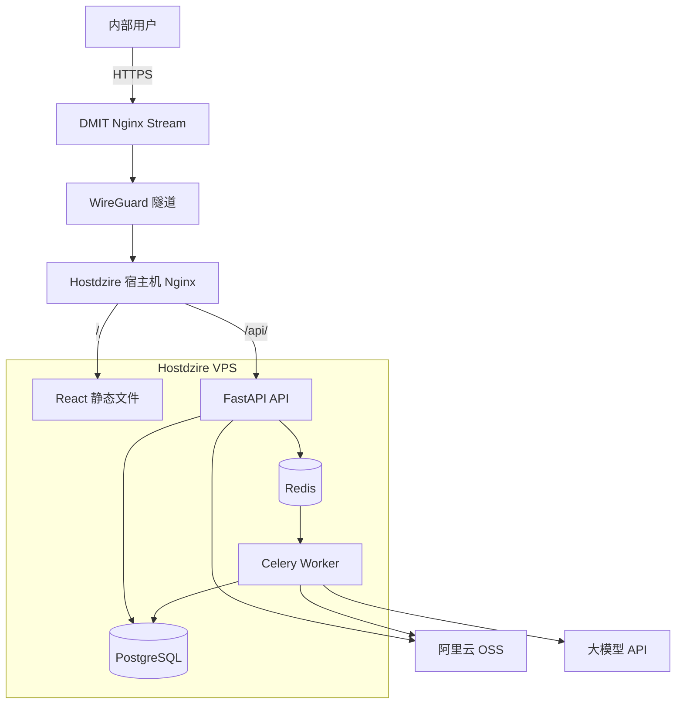
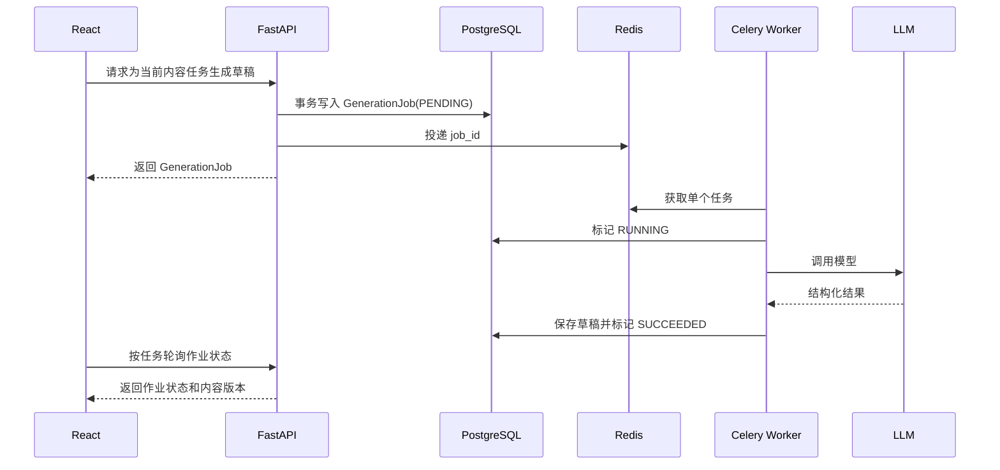

# GEO 系统前后端技术与部署方案

> 文档版本：V1.7
> 编制日期：2026-08-03
> 当前阶段：MVP 发布管理流程重设计实施中
> 业务方案：[多平台 GEO 内容运营系统方案设计](./GEO多平台内容运营系统方案设计.md)
> 会话背景：[GEO 项目会话归档](./GEO项目会话归档.md)

## 1. 文档目的

本文记录多平台 GEO 内容运营系统已经确认的前后端技术选型、应用架构、数据与文件存储、AI 后台任务、双 VPS 网络拓扑、Docker Compose 部署、Nginx 接入、备份、监控和发布策略。

本文是业务方案的技术实现补充。业务规则、领域模型和 MVP 功能范围以《多平台 GEO 内容运营系统方案设计》为准。

2026-07-22 已完成平台级 Prompt、具体平台可用性、受约束物理删除、运营界面中文化和 AI 渠道三栏管理工作区。本文件按当前实现描述动态平台分类、具体平台单次生成以及渠道配置与调用契约。

本文不包含 SSH 私钥、AccessKey、主机公网地址、白名单地址或其他敏感信息。部署时通过服务器上的受控配置注入这些信息。

## 2. 已确认决策

| 决策项 | 已确认方案 |
|---|---|
| 系统形态 | 内部运营管理系统，前后端分离 |
| 架构 | 模块化单体，不采用微服务 |
| 前端 | React + TypeScript + Vite |
| 后端 | Python + FastAPI + Pydantic |
| ORM | SQLAlchemy |
| 数据迁移 | Alembic |
| 数据库 | 独立 PostgreSQL |
| 后台任务 | Celery + 独立 Redis |
| 文件存储 | 阿里云 OSS |
| 正文格式 | Markdown 为唯一可编辑正文源 |
| 产品事实 | 每个产品唯一可编辑 Markdown 工作区、分级和不可变审核版本 |
| 平台类型 | 管理员按业务需要维护的动态分类 |
| 平台配置 | 具体平台拥有零或一个当前 Markdown Prompt，不存在规则版本 |
| 内容任务 | 直接锁定产品、非空已批准事实版本和活动具体平台；支持 AI 或人工首稿 |
| AI 配置 | 协议类型与受控供应商品牌分离；“获取模型”使用弹窗逐个添加；模型连接测试发送唯一用户消息 `hi`，不复用业务草稿解析 |
| 发布方式 | MVP 人工发布并登记结果 |
| 部署方式 | Hostdzire VPS 上使用 Docker Compose |
| 公网入口 | DMIT Nginx Stream 前置转发 |
| 七层入口 | Hostdzire 宿主机 Nginx |
| 域名 | `geo.962850.xyz` |
| HTTPS | 复用现有 `962850.xyz` 通配符证书和自动续期 |

## 3. 设计目标

技术方案需要满足：

1. 支持产品事实、内容版本、审核、人工发布登记和 GEO 观测完整闭环。
2. 确保已批准事实版本和内容版本不可被静默修改。
3. AI 调用失败、超时或重试时不产生无法追踪的重复内容。
4. 产品资料和发布素材安全存储在 OSS，应用服务器不承担长期文件存储。
5. 复用现有 DMIT、WireGuard、Hostdzire Nginx 和证书体系。
6. 在 `4C / 6G / 100G` 的项目机资源内稳定运行。
7. 保持部署和运维简单，不引入 Kubernetes、微服务或多余中间件。
8. 为未来增加按平台自动发布保留稳定接口，但不预先实现自动化框架。
9. 保证具体平台 Prompt 和模型配置变化不改变历史生成作业的解释结果。

## 4. 非目标

- 不在 MVP 中实现 SSR 或公开门户站点。
- 不在前端直接调用大模型或持有模型密钥。
- 不使用 LangChain 等编排框架包装简单生成流程。
- 不共享其他项目的 PostgreSQL 或 Redis 实例。
- 不把 PostgreSQL、Redis 或 FastAPI 端口直接暴露到公网。
- 不在 Docker Compose 内重复部署 Caddy 或第二套公网反向代理。
- 不在第一阶段实现 WebSocket；生成任务状态使用轮询。
- 不把 Markdown、HTML 和编辑器 JSON 同时作为可编辑正文源。
- 不自动发布未经人工审核的内容。
- 平台缺少当前 Prompt 时不允许系统 AI 生成，但仍允许创建任务和人工首稿。

## 5. 总体架构



### 5.1 请求路径

```text
浏览器
→ geo.962850.xyz
→ DMIT 公网入口
→ WireGuard
→ Hostdzire 宿主机 Nginx
├── /          React SPA 静态文件
└── /api/      FastAPI 容器的宿主机回环端口
```

DMIT 继续只承担公网入口、SNI 分流、PROXY Protocol 和线路优化，不部署应用容器。Hostdzire 负责 TLS 终止、静态前端、API 反向代理和全部业务容器。

### 5.2 当前基础设施结论

只读检查已确认：

- DMIT 资源较低，适合作为纯前置机，不适合部署 GEO 服务。
- DMIT 到 Hostdzire 的 WireGuard 隧道工作正常。
- DMIT 已将普通 `80/443` 请求转发到 Hostdzire，并携带 PROXY Protocol。
- Hostdzire 防火墙默认拒绝公网入站，只允许来自 WireGuard 的必要流量。
- Hostdzire 当前约有 `3.5G` 可用内存和 `78G` 可用磁盘。
- Hostdzire 已安装并运行 Docker 与 Docker Compose。
- 现有通配符证书包含 `962850.xyz` 和 `*.962850.xyz`，自动续期及 Nginx reload 已配置。
- `geo.962850.xyz` 的公共 DNS 已指向 DMIT。
- Hostdzire 尚无 `geo.962850.xyz` 独立 Nginx 站点；部署前必须补充。
- Hostdzire 当前没有 Swap，新增 AI Worker 前建议增加约 `2G` Swap。
- Hostdzire 的主动出站流量当前默认经过 WireGuard 和 DMIT，需要在试运行中监测大模型及 OSS 请求延迟。

## 6. 前端技术方案

### 6.1 技术栈

| 能力 | 选型 | 说明 |
|---|---|---|
| 框架 | React + TypeScript | 适合复杂表单、审核和内容工作台 |
| 构建 | Vite | 输出静态文件，由宿主机 Nginx 提供 |
| 路由 | React Router | 内部 SPA 不需要 SSR |
| 服务端状态 | TanStack Query | 请求缓存、失效、轮询和错误状态 |
| UI 组件 | Ant Design | 表格、表单、抽屉、对话框和审核控件 |
| 表单 | Ant Design Form | MVP 足够；复杂动态表单出现后再评估其他方案 |
| 内容编辑 | Markdown 原文 + 预览 | 保持单一正文源和可移植性 |
| 单元测试 | Vitest + Testing Library | 组件和业务交互测试 |
| 端到端测试 | Playwright | 覆盖核心内部工作流 |

Ant Design 只提供基础交互组件。页面视觉应通过设计 Token、排版、色彩和布局形成统一系统，不直接使用无调整的默认后台模板。

### 6.2 状态管理

MVP 不默认引入 Redux 或 Zustand：

- 服务器数据由 TanStack Query 管理。
- 表单状态由表单组件管理。
- 编辑器未保存内容由页面局部状态管理。
- 用户身份和少量全局配置由 React Context 管理。

只有出现跨页面持续编辑、复杂离线草稿或大量客户端状态时，再引入专用状态容器。

### 6.3 正文存储

Markdown 是 `ContentVersion` 的唯一可编辑正文：

```text
Markdown 原文
├── 编辑器展示
├── HTML 安全预览
├── text/html 剪贴板输出
├── text/plain 剪贴板输出
├── 平台发布包
└── 历史版本差异
```

HTML、纯文本和平台发布格式均由 Markdown 派生，不作为第二份可编辑正文保存。

### 6.4 Markdown 编辑器验证

正式选定编辑器前进行一个小型技术验证，候选可以包含 Markdown 原生或 Markdown 兼容的 React 编辑器。必须验证：

- 中文输入法和大段文本编辑。
- 标题、列表、表格、图片、链接和代码块。
- AI 生成内容插入及局部重写。
- 历史版本差异。
- HTML 安全预览。
- 复制到目标论坛或内容平台后的格式保留情况。
- 只读审核模式和评论定位能力。

如果所选 WYSIWYG 编辑器无法稳定无损地回写 Markdown，MVP 应优先采用 Markdown 编辑与独立预览，而不是维护编辑器私有 JSON。

### 6.5 具体平台内容交互

- 创建内容任务时直接选择产品、同产品非空已批准事实版本和活动具体平台。
- 平台已停用时从新建任务、账号和发布工作的可选集合排除；缺少当前 Prompt 只使系统 AI 生成不可用，不影响人工首稿。
- 编辑器展示任务直接绑定的具体平台、当前 Prompt 和事实 Markdown。
- 管理员可继续配置没有 Prompt 的平台；保存 Prompt 后恢复系统 AI 生成。
- 待发布列表只查询已批准内容，服务端复核平台账号与任务锁定平台一致。
- 配置中心保留“平台类型”“平台管理”“Prompt 管理”路由，不再提供平台规则路由或隐藏入口。平台管理维护身份、归类、域名、官网、单一来源 Logo 和独立启停，列表筛选/分页/统计/CSV 及详情引用摘要全部来自服务端 PostgreSQL 投影。Prompt 页使用服务端平台搜索/类型筛选/分页和稳定选中 URL，在同一工作台维护具体平台当前 Markdown 与全局自然化 Prompt；未配置平台仍可选择并首次保存，列表时间只投影当前 Prompt 的 `updated_at`。新 Logo 只能绑定公开、已校验的自有存储文件；管理员可以手工上传，或由服务端从固定 Icon Horse 地址一次性导入官网主机名对应的一张候选，预览确认后再随平台保存。历史外链只读保留，编辑其他字段不触发批量导入或替换。
- 平台列表 Logo 使用固定 24×24 CSS 像素布局；外部 URL 返回的 16/32 像素只影响源图采样，不改变列表展示盒尺寸。
- 全站用户可见业务文本使用中文，枚举的显示 label 与提交 value 分离；`model_id`、API Key、URL、Markdown、JSON、Header、Prompt 和机器值保持原样。
- AI 渠道列表由服务端按名称/描述/地址搜索、状态/品牌筛选、稳定排序和分页，一次返回表格摘要、总数与分类数量，不携带 Header 值或模型数组；只有选中渠道读取详情和模型，前端不得逐渠道追加请求。

### 6.6 前端目录边界

建议按业务能力组织：

```text
frontend/src/
├── app/                 路由、应用入口和全局 Provider
├── features/
│   ├── product-facts/
│   ├── content-tasks/
│   ├── content-editor/
│   ├── reviews/
│   ├── publications/
│   └── geo-observations/
├── shared/
│   ├── api/             OpenAPI 生成客户端
│   ├── components/      真正跨业务复用的组件
│   ├── formatting/
│   └── validation/
└── styles/              设计 Token 和全局样式
```

不要按 `pages/components/hooks/services` 建立大量全局目录后让业务代码互相穿插。共享组件只有在确实跨业务复用时才进入 `shared`。

### 6.7 API 客户端

FastAPI 输出 OpenAPI 文档，前端根据 OpenAPI 生成 TypeScript 请求和响应类型：

```text
Pydantic Schema
→ OpenAPI
→ TypeScript API Client
→ TanStack Query 封装
```

禁止在前后端各手写一套字段定义。前端仍需要编写 UI 表单规则，但服务端是权限、状态和业务不变量的最终校验者。

## 7. 后端技术方案

### 7.1 技术栈

| 能力 | 选型 |
|---|---|
| Web/API | FastAPI |
| 数据校验 | Pydantic |
| ORM | SQLAlchemy |
| 数据迁移 | Alembic |
| 数据库驱动 | PostgreSQL 对应的稳定 Python 驱动 |
| HTTP 请求 | HTTPX |
| 后台任务 | Celery |
| 消息代理 | Redis |
| OSS | 阿里云 OSS/STS Python SDK，通过适配器封装 |
| 包管理 | `uv` |
| 格式和静态检查 | Ruff + mypy |
| 测试 | pytest |

### 7.2 模块结构

```text
backend/app/
├── main.py
├── core/                    配置、数据库、权限和通用错误
├── product_facts/           产品事实 Markdown 工作区和事实版本
├── content_planning/        直接平台内容任务
├── configuration/           平台类型、具体平台 Prompt、AI 渠道和模型
├── content_production/      两级生成作业、内容版本和质量检查
├── review/                  事实审核和内容审核
├── publication/             人工发布登记和验证
├── geo_observation/         GEO 问题库、人工文章搜索、历史模型观测和效果指标
├── files/                   文件元数据和访问授权
├── identity/                用户、会话、账号状态和管理员能力
├── audit/                   审计日志
└── integrations/
    ├── llm/                 模型适配器
    └── oss/                 OSS 和 STS 适配器
```

模块不强制套用完全相同的多层目录。简单模块可以由 `models.py`、`schemas.py`、`service.py` 和 `api.py` 组成；只有当逻辑确实复杂时才继续拆分。

### 7.3 API 设计

- 使用 JSON REST API。
- API 前缀统一为 `/api/v1`。
- 使用 Pydantic 定义输入和输出契约。
- 列表接口采用统一分页结构。
- 错误返回使用稳定错误码和中文开发者信息。
- 所有状态转换使用明确命令接口，不允许通用 PATCH 任意修改状态。

示例：

```text
POST /api/v1/fact-versions/{id}/submit
POST /api/v1/fact-versions/{id}/approve
POST /api/v1/content-tasks/{id}/generation-jobs
POST /api/v1/content-tasks/{id}/manual-versions
DELETE /api/v1/content-tasks/{id}
POST /api/v1/generation-jobs/{id}/retry
POST /api/v1/content-versions/{id}/submit-review
POST /api/v1/content-versions/{id}/approve
POST /api/v1/publications/manual
POST /api/v1/geo-observations
DELETE /api/v1/users/{id}
```

### 7.4 事务和并发

- 事实版本批准、内容版本批准和发布登记分别使用数据库事务。
- 已批准版本更新使用数据库约束和服务层双重阻止。
- 生成作业在短事务中创建并独立执行；不得用一个长事务包住外部模型调用。
- 平台启停与新建普通/修复任务、平台账号、发布工作统一先锁定 `PlatformProfile` 再检查 `is_active`，避免并发停用后的写入穿透；停用不修改既有账号、配置和历史。
- 创建任务时校验平台活动和事实版本同产品、非空且已批准；创建系统 AI 作业时额外校验当前 Prompt；创建发布工作时校验平台账号属于任务直接绑定平台。
- 普通任务创建先按带命名空间的请求键获取 PostgreSQL 事务 advisory lock；同键同三字段返回原任务且不重复审计，同键异载荷返回冲突。数据库唯一约束兜底，前端 loading 只提供即时反馈。
- 幂等键只负责同一生成或提交请求的安全重放；人工发布还按“具体平台 + 不可变内容哈希”获取 PostgreSQL 事务 advisory lock，并检查追加式公开历史，不能用换账号或换幂等键绕过。
- 并发编辑使用明确版本号进行乐观锁校验；平台 Prompt 覆盖和物理删除、发布账号编辑与启停都要求 `expected_revision`，服务端按固定顺序锁行后比较，冲突时保留当前数据并返回 `REVISION_CONFLICT`。
- 不使用分布式锁解决单机数据库事务能够解决的问题。

### 7.5 身份认证建议

MVP 建议使用内部账号、密码哈希和服务端会话：

- 浏览器只保存 `HttpOnly`、`Secure`、`SameSite=Lax` 会话 Cookie。
- 会话记录保存在 PostgreSQL，可撤销并记录设备和最后活动时间。
- 写操作使用 CSRF 防护。
- 账号类型只使用 `ADMIN` 和 `ENGINEER`；平台 Prompt、AI 渠道和模型写操作仅允许管理员。
- 管理员重置其他用户的临时密码和用户自助改密的正式新密码最少 8 位；新建用户的临时密码仍保持 12 位校验。
- 用户物理删除只允许停用且没有业务历史引用的账号。会话随外键级联清理，历史审计操作者由 `0027` 受约束置空；活动账号和业务引用冲突由服务端明确拒绝。
- 不把长期 JWT 存在 `localStorage`。

如果公司已有 OIDC/SSO，后续用身份适配器替换登录入口，管理员标识和账号启停状态仍保存在本系统。

该项属于推荐方案，进入认证模块开发前需要业务方确认。

## 8. AI 生成与后台任务

### 8.1 不直接使用复杂编排框架

MVP 的生成过程是确定的流水线：

```text
加载已批准 FactVersion
→ 加载任务直接绑定的 PlatformProfile
→ 加载该平台当前 PlatformPrompt
→ 创建一个 GenerationJob
→ 调用模型并创建 DRAFT ContentVersion
→ 人工编辑并批准内容
→ 发布前复核具体平台与账号
→ 使用不可变作业快照追溯生成输入
→ 创建并推进标准 PublicationWork
→ 首次核验成功形成只读 PublishedArticle
→ 发布后问题与 GEO 观测继续追加历史
```

原始生成请求只包含两条消息：`system.content` 逐字等于当前平台 Prompt，`user.content` 逐字等于批准事实版本 Markdown。系统不附加产品元数据、任务字段、固定前缀或事实 JSON。

使用项目自有的最小同步 HTTP/1.1 传输实现 `ContentGenerator` 适配器：单次解析完整 A/AAAA、只连接批准地址、发送敏感 Header 前校验 peer，并以原 hostname 完成 SNI、证书校验和 Host。不得使用会按 hostname 二次解析的通用默认传输，也不增加 LangChain、Agent 框架或图编排系统。

配置中心的“获取模型”通过现有 `GET {base_url}/models` 结果弹窗展示，用户逐个确认后才创建本地模型；已配置 ID 不可重复添加。模型“测试连接”使用独立协议方法调用 `POST {base_url}/chat/completions`，发送唯一用户消息 `hi` 并校验通用响应结构；正式内容生成继续使用独立的严格四字段业务 JSON 解析，两种成功判定不得混用。

渠道 `protocol_type` 是调用协议和作业快照一致性的唯一依据，当前只接受 `openai-compatible-chat-completions`。`provider_brand` 使用 `OPENAI | ANTHROPIC | GOOGLE | AZURE_OPENAI | ZHIPU | QWEN | CUSTOM`，仅用于管理识别、筛选和本地图标；服务端显式校验品牌—协议组合，不能根据品牌、名称或 URL 切换客户端或改写路径。所有供应商请求保持 `AT_MOST_ONCE`，开始发送后不自动重试；用户重试创建新的关联作业。

### 8.2 后台任务模型



### 8.3 任务数据所有权

PostgreSQL 中的 `generation_jobs` 是任务状态的权威来源，Redis 只传递消息：

```text
id
content_task_id
idempotency_key
status
input_snapshot
ai_channel_id
ai_model_id
adapter_name
attempt_count
dispatch_attempt_count
content_version_id
retry_of_id
error_code
error_summary
created_at
started_at
finished_at
```

内容任务直接锁定一个具体平台；作业读取该平台当前 Prompt。`input_snapshot` 冻结具体平台身份、最终 system/user message、事实版本身份与分级、模型和参数，配置变化不得重新解释历史作业。

Prompt 管理页的输出预览复用上述真实链路：管理员选择符合门禁的任务、模型，以及自然化场景下的 AI 源草稿，创建现有 `GENERATE` 或 `HUMANIZE` 作业；页面按创建响应中的 Job ID 从任务级作业列表轮询，成功后读取不可变 `ContentVersion` 并安全渲染 Markdown。预览会留下真实作业和 `DRAFT`，未保存 Prompt 不参与调用，页面也不读取包含完整输入快照的作业详情。

内容任务列表使用独立只读聚合契约展示产品名称、任务直接绑定的平台、任务状态、创建时间和最新原始生成状态。平台名称、官网和 Logo 读取平台当前品牌信息；生成状态只取按 `created_at DESC, id DESC` 排序后的最新 `GENERATE` 作业，`HUMANIZE` 作为内容版本后处理不覆盖任务主体状态。产品、平台、Logo 文件、发布占用状态与作业状态均批量读取，不按任务追加请求。

渠道管理的使用统计直接按 `generation_jobs.ai_channel_id` 和 `created_at` 聚合 `GENERATE`/`HUMANIZE` 作业，提供 7/30/90 天和全部时间，默认 30 天。连接测试与模型发现不写入业务作业统计；成功率只用成功与失败终态作为分母，缺失耗时或 Token 保持 `null`。渠道操作日志继续读取 `audit_logs`，模型事件用脱敏 `channel_id` 关联，不新增统计表或日志表。

Worker 启动、成功和失败都更新 PostgreSQL。不得把关键结果只保存在 Celery Result Backend。

### 8.4 重试规则

- API 投递失败保持 PostgreSQL `PENDING`，Beat 只能补投递超龄 `PENDING` 的 Job UUID。
- Worker 声明 `RUNNING` 后，同一 Job 不因网络超时、服务端错误或进程丢失自动再次调用供应商；过期租约显式失败。
- 用户重试创建关联原 Job 的新 Job 并复用不可变快照，不覆盖原失败记录。
- 模型返回不符合结构时记录失败，不通过重试掩盖提示或契约问题。
- 同一幂等键只能生成一个有效任务。
- 具体平台缺少当前 Prompt 时拒绝创建作业；不得回退到类型级或其他平台 Prompt。
- 只有绑定事实版本明确为 `PUBLIC` 时才允许第三方模型调用；历史空事实不得默认放行。
- 旧 `chat-json-v1` 与 `humanization-json-v1` 快照只读且不得重试。
- 错误日志不保存模型密钥、Prompt、响应正文、未公开资料全文或个人敏感信息。

### 8.5 并发配置

Hostdzire 当前还运行其他项目。MVP 建议：

- FastAPI 使用 `2` 个 Uvicorn Worker。
- Celery `concurrency=1`。
- 单用户同时运行的生成任务设置合理上限。
- PostgreSQL 连接池保持保守配置。
- 观察排队时间和内存后，再将 Celery 并发调整为 `2`。

## 9. PostgreSQL 与 Redis

### 9.1 独立实例

GEO 项目使用独立 PostgreSQL 和独立 Redis 容器，不复用当前其他项目实例。理由：

- 避免版本、备份、资源和停机窗口相互影响。
- 防止误操作其他业务数据库。
- 便于独立恢复和迁移。
- 资源占用在当前 VPS 可接受范围内。

### 9.2 PostgreSQL

- 使用固定主版本镜像，不使用浮动 `latest`。
- 数据卷独立挂载到 GEO 项目目录。
- 字符集使用 UTF-8，时区统一保存 UTC，前端按北京时间展示。
- Alembic 是唯一正式迁移入口。
- API 和 Worker 使用不同连接池但共享数据库。
- 对型号、状态、关联 ID、发布时间和测试时间建立必要索引。
- MVP 使用 PostgreSQL 自带全文能力，不引入 Elasticsearch。

### 9.3 业务契约与迁移要求

当前平台与内容生产模型至少涉及以下数据库契约：

- `platform_types.slug` 保持唯一；管理员可增删改查，删除被具体平台引用的类型时返回结构化冲突。
- `platform_profiles` 保存具体平台和所属类型，并拥有零或一份当前 Prompt；不存在规则版本表。
- `platform_profiles.website_url` 保存可选官网；Logo 只能在 `logo_file_id` 与历史 `logo_external_url` 中选择一个。新写入只接受公开、已校验的 `PLATFORM_LOGO` 文件，历史外链仅允许保持、清空或转换为文件；下载地址由对象存储临时签发。
- 官网候选确认前保留 24 小时；平台解除最后一个文件引用后保留 7 天。`FAILED`、`ABORTED` 和中止上传在下一轮清理中处理，`DELETING` 由幂等任务持续重试；清理前实时复核当前全部文件外键，先提交删除声明，再删除对象并保留 `DELETED` 数据库墓碑。
- `content_tasks` 直接锁定 `platform_profile_id`、产品和事实版本；`query_topic_id` 只为历史任务保留并允许为空，新任务不再选择目标问题。普通任务的非空 `idempotency_key` 唯一，历史任务和发布修复任务保持空值。
- `audit_logs` 是业务审计唯一来源，保存业务模块、动作、可空对象标识、`SUCCESS | FAILED | DENIED` 结果、非敏感结果说明和稳定错误码；列表使用 `(created_at DESC, id DESC)` 稳定分页，当前用户信息只作实时投影。
- 平台引用数直接聚合 `content_tasks.platform_profile_id`；不保存汇总列或前端推导第二口径。
- `generation_jobs.input_snapshot` 写入具体平台身份，并冻结最终消息、事实版本、渠道和模型。
- `content_versions` 保持单一内容版本模型；`publication_works` 只允许引用已批准内容，`published_articles` 只能由首次成功核验形成。

`0014_platform_prompt_ownership` 用新表把旧类型 Prompt 复制给该类型下每个具体平台，孤立 Prompt 不保留，然后移除旧表和旧字段。平台 Prompt 分化后无法可靠合并，降级依赖迁移前 PostgreSQL 备份。既有任务、生成快照、内容、审核和发布历史保持只读一致。

`0016_fact_review_cleanup` 只给 `fact_review_records` 替换专用触发器：服务锁定父事实版本并确认无内容引用后，在当前事务声明父版本 ID；只有归属完全匹配的审核记录可删除，UPDATE、未声明或错配 ID 的删除继续拒绝。其他追加式历史表、`RESTRICT` 外键和显式删除顺序不变，降级恢复原通用触发器。

`0021_ai_channel_model_management` 为 `ai_channels` 增加非空 `description`、`protocol_type` 和 `provider_brand`，旧行只把协议回填为当前唯一实现、品牌回填为 `CUSTOM`，不根据名称或 URL 猜测；运行时不设置数据库默认。迁移同时增加 `generation_jobs(ai_channel_id, created_at)` 索引。降级会丢失渠道身份数据，只有隔离测试数据库在不存在不可还原值时允许执行，生产应前滚或恢复迁移前备份。

`0024_audit_outcome` 为历史审计精确回填业务模块，为审计结果增加 `outcome`、`result_message` 和 `error_code`，并允许命令在尚未产生业务对象时以空 `target_id` 记录失败。迁移只接受已知历史动作与对象组合，未知组合必须中止；存在空对象标识时降级以 PostgreSQL `55000` 失败，要求前滚或恢复迁移前备份。

`0025_markdown_facts_direct_platform` 把现有结构化事实确定性渲染为 Markdown，回填任务直接平台后物理删除规范化事实子图、规则版本表和旧任务字段。新原始生成与自然化分别使用 `content-markdown-v2` 和 `humanization-markdown-v2` 快照；旧 v1 快照保持只读。迁移发现旧契约 `PENDING | RUNNING` 作业时失败，downgrade 明确拒绝。

`0026_publication_account_dedup` 为发布账号增加非负 revision、非空检查和同平台规范化标识唯一索引。迁移先锁表检查空值与重复组，无法无损处理时以 `55000` 失败，不自动合并或删除账号。该 revision 的旧发布门禁只描述历史；`0034` 保留账号唯一性并把当前发布身份改为一个内容版本一个工作、同平台同内容哈希最多一个未关闭工作。

`0027_guard_audit_actor_user_delete` 不新增列，只替换 `audit_logs` 的追加式触发器。事务本地 `partsignal.user_delete_id` 必须等于旧 `actor_id`，更新必须处于用户删除引起的外键级联触发上下文，更新后只能是 `NULL`，且其余审计字段逐项完全不变；错配、未声明、手工更新和审计 DELETE 统一以 `55000` 拒绝。降级恢复原通用触发器。

`0031_reusable_platform_prompts` 把每个平台独占 Prompt 迁移为独立模板库，并在平台上增加可空当前绑定。迁移保留旧正文、revision、操作者和时间，以旧平台 UUID 作为模板 UUID 后原样回绑；新原始生成使用冻结 Prompt 身份、名称与 revision 的 `content-markdown-v3`，v2 只作历史读取和原快照重试。存在未绑定模板或任一模板不是一对一绑定时禁止降级。

`0032_content_task_idempotency` 为 `content_tasks` 增加可空请求键和非空值唯一约束，不回填历史。普通任务创建在当前业务校验前锁定请求键并处理重放；降级只删除新增结构，不删除任务。

`0033_task_owned_history_delete` 允许普通用户删除 `CANCELLED` 任务及其生成作业、内容审核记录和 `DRAFT | PENDING_REVIEW | CHANGES_REQUESTED` 内容版本。`0034` 将当前阻断来源替换为任一 `PublicationWork` 或非空 `source_published_content_issue_id`；任务列表与详情使用同一服务端动作投影，删除服务仍在锁内重新校验。

`0034_publication_redesign` 只在旧发布、关注事项、附件和依赖旧发布身份的 GEO 表全部为空时替换结构；任一非空时以 PostgreSQL `55000` 汇总阻断，不猜测映射。新结构由 `publication_works`、追加式事件与核验、只读 `published_articles`、`published_content_issues` 和工作附件组成；GEO 外键统一为 `published_article_id`，修复来源统一为 `source_published_content_issue_id`。发布业务对象不提供物理删除，downgrade 明确失败。

管理员删除其他当前开发数据时，服务先锁定目标并统计直接引用，冲突统一返回结构化 `409`：产品检查事实版本、内容任务和 GEO 观测；事实版本检查内容任务和内容版本；具体平台检查内容任务和平台账号；平台账号检查发布工作；平台类型检查具体平台；停用用户由既有业务外键阻断。无引用事实版本可在任意状态删除，其从属事实审核记录在同一事务显式清理并保留安全审计摘要；产品删除不会自动删除事实版本。停用用户删除会清理会话并保留审计历史。除 `0033` 明确允许清理的任务自有未批准历史外，其他删除不级联或改写业务历史。

### 9.4 Redis

- 只在 Docker 内部网络暴露。
- 开启 AOF 持久化，降低服务器重启时队列丢失风险。
- 设置内存上限和明确淘汰策略。
- 不存储唯一业务数据。
- 不与其他项目共享数据库编号或实例。

## 10. 阿里云 OSS 方案

### 10.1 文件分类

| 类型 | 示例 | MVP 访问方式 |
|---|---|---|
| 私有证据 | 数据手册、测试报告、客户授权材料 | 私有 Bucket，短期签名访问 |
| 运营文件 | 审核截图、模型测试截图 | 私有 Bucket，按角色授权 |
| 发布素材 | 产品图、参数图、文章配图 | MVP 私有保存，运营人员下载后上传平台 |

未来若官网需要稳定公开图片地址，单独建立公开素材 Bucket 或独立公开域名，不在私有 Bucket 上混用对象 ACL。

### 10.2 对象 Key

不使用用户文件名作为对象 Key：

```text
{environment}/{category}/{year}/{month}/{uuid}.{extension}
```

原文件名只保存在数据库中用于展示。

### 10.3 文件元数据

`file_records` 至少保存：

```text
id
original_filename
bucket
object_key
content_type
size
sha256
access_level
uploader_id
upload_status
created_at
verified_at
```

### 10.4 浏览器直传

推荐流程：

```text
前端请求上传意图
→ 后端校验权限、文件类型和大小
→ 后端生成限定 Key 和时效的 STS/签名上传信息
→ 浏览器直传 OSS
→ 前端提交完成确认
→ 后端 HEAD 校验对象
→ 创建 VERIFIED FileRecord
```

这样可以避免文件流量经过 DMIT、WireGuard 和 Hostdzire，特别适合较大的数据手册和测试报告。

OSS CORS 只允许 `https://geo.962850.xyz` 等明确来源，限制方法和请求头；生产环境不使用 `*`。

### 10.5 凭据

- 创建专用 RAM 身份和角色，不使用主账号 AccessKey。
- VPS 上只保存最小权限凭据。
- 前端只获得短时、限定目录和操作范围的凭据。
- 凭据通过部署环境或 Secret 文件注入，不写入代码、镜像和日志。
- OSS 下载通过后端鉴权后签发短期 URL。

## 11. Docker Compose 设计

### 11.1 Compose 服务

```text
geo-api       FastAPI HTTP 服务
geo-worker    Celery Worker
geo-postgres  PostgreSQL
geo-redis     Redis Broker
geo-migrate   一次性 Alembic 迁移任务
```

宿主机 Nginx 和 React 静态文件不放入 Compose，避免重复入口层。

### 11.2 端口与网络

- `geo-api` 只绑定宿主机回环地址的固定端口，例如 `127.0.0.1:19000`。
- PostgreSQL 和 Redis 不设置宿主机端口映射。
- Worker 不设置端口映射。
- 所有业务容器加入独立 `geo-internal` 网络。
- Nginx 通过回环地址访问 API。

### 11.3 数据卷

```text
/opt/geo/
├── compose.yaml
├── .env
├── secrets/
├── data/
│   ├── postgres/
│   └── redis/
├── backups/
└── scripts/
```

生产源码不通过宿主机目录挂载到容器。镜像包含应用代码，数据卷只保存需要持久化的数据。

### 11.4 资源限制

建议初始限制：

| 服务 | 内存上限 | CPU 建议 |
|---|---:|---:|
| `geo-api` | 512 MB | 1.0 |
| `geo-worker` | 1 GB | 1.5 |
| `geo-postgres` | 768 MB | 1.0 |
| `geo-redis` | 128 MB | 0.25 |

限制用于防止单个项目挤压现有服务，不代表服务需要长期占满该资源。运行一段时间后根据峰值调整。

### 11.5 镜像和版本

- 使用多阶段构建。
- API 和 Worker 复用同一应用镜像，通过不同启动命令运行。
- 使用明确版本或提交哈希标签，不长期使用 `latest`。
- 依赖使用锁文件固定。
- 基础镜像固定到受控版本，并定期安排升级。

### 11.6 Compose 结构示意

以下仅表达边界，实际镜像版本和密钥在实施时确定：

```yaml
services:
  api:
    image: geo-backend:${GEO_VERSION}
    env_file: .env
    ports:
      - "127.0.0.1:19000:8000"
    depends_on:
      postgres:
        condition: service_healthy
      redis:
        condition: service_healthy
    restart: unless-stopped
    mem_limit: 512m
    cpus: 1.0

  worker:
    image: geo-backend:${GEO_VERSION}
    command: ["celery", "-A", "app.worker", "worker", "--concurrency=1"]
    env_file: .env
    depends_on:
      postgres:
        condition: service_healthy
      redis:
        condition: service_healthy
    restart: unless-stopped
    mem_limit: 1g
    cpus: 1.5

  postgres:
    image: postgres:${POSTGRES_VERSION}-alpine
    env_file: .env
    volumes:
      - ./data/postgres:/var/lib/postgresql/data
    healthcheck:
      test: ["CMD-SHELL", "pg_isready -U $$POSTGRES_USER -d $$POSTGRES_DB"]
      interval: 10s
      timeout: 5s
      retries: 5
    restart: unless-stopped
    mem_limit: 768m

  redis:
    image: redis:${REDIS_VERSION}-alpine
    command: ["redis-server", "--appendonly", "yes"]
    volumes:
      - ./data/redis:/data
    healthcheck:
      test: ["CMD", "redis-cli", "ping"]
      interval: 10s
      timeout: 3s
      retries: 5
    restart: unless-stopped
    mem_limit: 128m

networks:
  default:
    name: geo-internal
```

正式 Compose 还需补充只读文件系统、临时目录、日志轮转、Secret 和更严格的容器权限。

## 12. Nginx 接入设计

### 12.1 入口策略

继续使用 Hostdzire 宿主机 Nginx：

- 监听 Hostdzire 的 WireGuard 地址。
- 接收 DMIT 发送的 PROXY Protocol。
- 使用现有通配符证书片段和 SSL 安全片段。
- `/api/` 代理到 `127.0.0.1:19000`。
- `/` 从 `/var/www/geo-frontend/current` 提供 React 静态文件。
- SPA 未命中路径回退到 `index.html`。

### 12.2 站点配置示意

配置以 `deploy/nginx/partsignal.conf.template` 和
`deploy/nginx/partsignal-security-headers.conf` 为权威，下面仅表达结构：

```nginx
upstream geo_api_backend {
    server 127.0.0.1:19000;
    keepalive 16;
}

server {
    listen <HOSTDZIRE_WG_ADDRESS>:80 proxy_protocol;
    server_name geo.962850.xyz;

    include /etc/nginx/snippets/acme-challenge.conf;

    location / {
        return 301 https://$host$request_uri;
    }
}

server {
    listen <HOSTDZIRE_WG_ADDRESS>:443 ssl proxy_protocol;
    http2 on;
    server_name geo.962850.xyz;

    include /etc/nginx/snippets/cert-962850.xyz.conf;
    include /etc/nginx/snippets/ssl-common.conf;
    include /etc/nginx/snippets/partsignal-security-headers.conf;
    add_header_inherit merge;

    root /var/www/geo-frontend/current;
    index index.html;
    client_max_body_size 10m;

    location ^~ /api/ {
        include /etc/nginx/snippets/proxy-common.conf;
        proxy_set_header Connection "";
        proxy_next_upstream off;
        proxy_pass http://geo_api_backend;
    }

    location /assets/ {
        try_files $uri =404;
        access_log off;
        expires 7d;
    }

    location / {
        try_files $uri $uri/ /index.html;
    }
}
```

因为大文件直接上传 OSS，Nginx 不需要为数据手册设置很大的请求体限制。

### 12.3 DMIT 配置

DMIT 当前默认已将普通 Web 域名转发到 Hostdzire，因此首次部署不需要修改核心转发逻辑。可以在后续维护窗口为 `geo.962850.xyz` 增加显式 SNI 映射，提升配置可读性，但这不是上线前置条件。

### 12.4 当前域名问题

由于 Hostdzire 尚未配置独立 `geo.962850.xyz` 虚拟主机：

- HTTP 当前会落到默认拒绝站点。
- HTTPS 当前可能命中其他站点的默认虚拟主机。

上线前必须先创建 GEO 站点配置，执行 `nginx -t`，再 reload；不能在当前状态下直接发布 DNS 或宣布上线。

## 13. 前端发布

### 13.1 发布目录

```text
/root/geo-releases/<release-id>/frontend
/var/www/geo-frontend/current -> <release frontend directory>
```

### 13.2 原子切换

1. 构建前端静态文件。
2. 上传或提取到新的版本目录。
3. 检查 `index.html` 和静态资源完整性。
4. 原子更新 `current` 软链接。
5. 访问静态资源和 SPA 路由进行冒烟测试。

旧版本目录暂时保留，前端回滚只需将软链接切回上一版本。

## 14. 后端发布

### 14.1 部署顺序

```text
构建并标记镜像
→ 上传或拉取到 Hostdzire
→ 备份数据库
→ 运行一次性 Alembic 迁移
→ 启动 API 和 Worker
→ 检查健康状态
→ 切换前端版本
→ 验证 Nginx 和完整业务链路
```

建议命令流程：

```bash
docker compose pull
docker compose run --rm migrate
docker compose up -d
docker compose ps
```

不要让每个 API 或 Worker 进程在启动时自动执行迁移，避免并发迁移和启动竞态。

### 14.2 镜像交付

短期可在 VPS 上构建，但正式试运行后建议由 CI 构建版本化镜像，VPS 只拉取和运行。镜像仓库可在后续选择阿里云容器镜像服务或现有私有仓库。

### 14.3 回滚

- 前端：切换到上一版本软链接。
- API/Worker：将 `GEO_VERSION` 改回上一镜像版本并重启。
- 数据库：迁移应优先保持向后兼容；破坏性迁移前必须创建备份。
- 不在未验证的情况下自动执行数据库降级迁移。

## 15. 配置与 Secret

### 15.1 配置分类

普通配置：

```text
APP_ENV
APP_BASE_URL
LOG_LEVEL
API_WORKERS
CELERY_CONCURRENCY
OSS_ENDPOINT
OSS_BUCKET
```

敏感配置：

```text
DATABASE_PASSWORD
SESSION_SECRET
OSS_ACCESS_KEY_ID
OSS_ACCESS_KEY_SECRET
LLM_API_KEY
```

### 15.2 管理规则

- `.env` 和 Secret 文件不进入 Git。
- 文件归部署用户所有，权限限制为最小可读范围。
- Secret 不写入镜像层、前端构建变量、日志和错误响应。
- 生产、测试和本地环境使用不同凭据。
- 密钥轮换后只重启依赖服务，不需要重新构建镜像。

## 16. 健康检查与日志

### 16.1 健康检查

FastAPI 提供：

```text
GET /api/health/live
GET /api/health/ready
```

- `live` 只判断进程是否可响应。
- `ready` 检查 PostgreSQL 和 Redis 的必要连接。
- OSS 和大模型属于外部依赖，不应因短期不可用让 API 完全退出服务；在任务执行时返回明确失败。

### 16.2 日志

- API 和 Worker 输出结构化日志到标准输出。
- Docker 配置日志轮转，避免耗尽磁盘。
- 请求日志包含请求 ID、用户 ID、接口、状态和耗时。
- AI 任务日志包含作业 ID、具体平台、快照契约版本、模型适配器、尝试次数和错误码。
- 不记录密码、Cookie、AccessKey、API Key、Authorization/敏感 Header、供应商响应正文和未公开资料全文；渠道审计只记录非敏感字段、配置状态和安全错误码。
- 业务审计日志写入 PostgreSQL，与运行日志分离；除 `0027` 受约束的删除用户操作者置空外，审计记录仍不可修改或删除。
- 审计成功事件与业务写入同事务提交；仅对已批准的九类关键命令在原事务回滚后，以独立事务记录 `FAILED` 或 `DENIED`。请求解析、身份认证、会话与 CSRF 失败不写业务审计。
- 审计明细只公开按业务模块批准的 `changes` 与 `facts` 字段；关键词不扫描原始 JSONB，管理员权限由服务端校验。

Docker 日志建议：

```yaml
logging:
  driver: json-file
  options:
    max-size: 10m
    max-file: "3"
```

## 17. 监控与告警

MVP 不部署完整 Prometheus/Grafana，先监测最关键指标：

- 域名 HTTPS 可用性。
- API `ready` 状态。
- Worker 是否在线和队列积压。
- PostgreSQL 连接及备份结果。
- VPS 内存、Swap、磁盘和负载。
- 容器重启次数和 OOM。
- OSS 上传失败率。
- AI 生成任务成功率、耗时和重试次数。
- 平台 Prompt 缺失和事实分级拒绝次数。

可先使用现有外部可用性检测或轻量定时脚本；达到实际监控需求后再引入完整指标系统。

## 18. 备份与恢复

### 18.1 备份范围

- PostgreSQL 逻辑备份。
- 部署配置和 Nginx 站点配置的安全副本。
- OSS 中的业务文件由 OSS 生命周期和版本策略保护。
- Redis 不作为业务备份来源。

### 18.2 PostgreSQL 策略

```text
每日：pg_dump 后压缩、加密并上传 OSS
保留：最近 7 个每日备份
保留：最近 4 个每周备份
保留：最近 6 个每月备份
验证：每月至少执行一次实际恢复测试
```

建议由宿主机 cron 启动一次性备份容器。备份任务失败必须产生可见告警，不能只写本地日志。

### 18.3 恢复顺序

```text
停止 API 和 Worker 写入
→ 创建干净 PostgreSQL 实例
→ 恢复指定备份
→ 运行只读一致性检查
→ 启动 API
→ 启动 Worker
→ 验证事实 Markdown、平台类型、具体平台 Prompt、生成作业快照、内容版本、发布工作与发布成果
```

## 19. 安全设计

### 19.1 网络

- 公网只通过 DMIT 的 `80/443` 进入。
- Hostdzire Web 入口只接受 WireGuard 来源。
- GEO API 只绑定 `127.0.0.1`。
- PostgreSQL、Redis 和 Worker 仅在 Docker 内部网络访问。
- 不改变现有防火墙默认拒绝策略。

### 19.2 Web 安全

- 同源部署，默认不开放通配 CORS。
- Cookie 使用 `Secure`、`HttpOnly` 和适当的 `SameSite`。
- 使用 CSRF 防护。
- Markdown 转 HTML 后进行清理。
- 设置 CSP、HSTS、`X-Content-Type-Options` 等安全响应头。
- 上传文件校验类型、大小、哈希和访问级别。
- 外部 URL 校验协议和允许的业务范围。

### 19.3 数据与 AI

- 只有已批准事实进入正式生成上下文。
- 只有锁定具体平台有效规则并经过批准的内容才能发布。
- 对资料标记公开、内部和受限等级。
- 未授权的客户资料和测试数据不得发送给第三方模型。
- 模型输出必须经过结构校验、事实检查和人工审核。

## 20. 容量规划

Hostdzire 当前资源可以支持 MVP，但需要约束新增服务：

```text
API          约 200～512 MB
Worker       约 300 MB～1 GB
PostgreSQL   约 200～768 MB
Redis        约 20～128 MB
```

主要风险不是磁盘，而是 Worker、现有容器和系统缓存叠加后的内存峰值。因此：

1. 上线前增加约 `2G` Swap。
2. Worker 初期只运行一个并发任务。
3. 所有新容器设置内存限制。
4. 文件通过浏览器直传 OSS。
5. 定期清理未使用的构建缓存和过期镜像，但不自动删除未知项目资源。

## 21. 出站流量说明

Hostdzire 当前默认通过 WireGuard 和 DMIT 出站，这意味着：

- Worker 调用大模型可能经过 DMIT。
- 后端访问 OSS 也可能经过 DMIT。
- 浏览器直传 OSS 不经过服务器链路，可以显著减少影响。

MVP 先维持现有路由，监测 AI 请求耗时、OSS 请求耗时和 DMIT 带宽。只有观察到明确瓶颈后，再设计 GEO 容器的选择性直连路由；不在上线前修改全局策略路由。

## 22. 开发与测试环境

### 22.1 本地开发

- 前端使用 Vite 开发服务器。
- 后端使用 FastAPI 开发模式。
- PostgreSQL 和 Redis 使用本地 Docker Compose。
- OSS 使用独立开发前缀或开发 Bucket。
- 大模型使用开发密钥和预算限制。

### 22.2 测试层级

| 层级 | 工具 | 重点 |
|---|---|---|
| 后端单元测试 | pytest | 平台可用性、规则状态机、版本不变量、权限校验，以及九类关键命令的成功、失败与拒绝审计 |
| 后端集成测试 | pytest + PostgreSQL | Prompt 所有权迁移、事实审核与 `0027` 审计操作者守卫、AI 渠道身份/列表/统计/审计、审计回填与降级门禁、任务/用户受限删除、生成作业、发布约束和 OSS 适配器 |
| 前端单元测试 | Vitest + Testing Library | 平台可用性与 24 像素 Logo、内容任务/停用用户删除、8 位重置密码边界、AI 渠道三栏 URL 状态与敏感 mutation 清理、审计筛选/URL/刷新/详情/脱敏展示、中文枚举、表单、审核、编辑和异常状态 |
| API 契约测试 | OpenAPI 客户端构建 | 前后端类型一致性 |
| 端到端测试 | Playwright | 产品事实到发布，以及真实本机协议替身上的 AI 渠道创建、测试成功/失败、统计审计与删除闭环 |
| AI 质量评估 | 固定评估集 | 事实命中、禁止结论和平台差异化 |

外部 OSS 和模型测试需要预算与环境隔离，普通单元测试使用明确的适配器替身，不伪造业务成功状态。

## 23. 代码仓库建议

建议使用单仓库：

```text
geo-platform/
├── frontend/
├── backend/
├── deploy/
│   ├── compose.yaml
│   ├── nginx/
│   └── scripts/
├── docs/
├── .env.example
└── README.md
```

前后端虽然独立构建，但在同一仓库中可以统一版本、CI、接口契约和部署文档。当前规模没有拆分多个仓库的收益。

## 24. 实施顺序

### 阶段一：工程骨架

- 初始化单仓库。
- 建立 React、FastAPI、PostgreSQL、Redis 和 Celery 骨架。
- 配置 Ruff、mypy、pytest、Vitest 和 OpenAPI 客户端生成。
- 建立 Docker Compose 开发环境。

### 阶段二：基础设施验证

- 创建 `/opt/geo` 和发布目录。
- 增加 Swap 和容器资源限制。
- 部署最小 API 健康检查和静态前端。
- 新建 `geo.962850.xyz` Nginx 站点。
- 验证 DMIT、WireGuard、Nginx、Docker 完整链路。

### 阶段三：核心业务

- 产品事实 Markdown 工作区、分级、版本和审核。
- 动态平台类型和具体平台 Prompt。
- 直接平台内容任务、AI/人工首稿和内容版本。
- 人工发布登记和 GEO 观测。

### 阶段四：运维闭环

- OSS 直传和权限。
- PostgreSQL 备份与恢复验证。
- 运行日志、审计日志和基础告警。
- 完整端到端验收。

## 25. 上线检查表

### 25.1 基础设施

- [ ] Hostdzire 已增加 Swap。
- [ ] GEO 容器均设置资源限制。
- [ ] PostgreSQL 和 Redis 没有公网端口。
- [ ] API 只绑定宿主机回环地址。
- [ ] Docker 日志轮转已启用。

### 25.2 域名和 Nginx

- [ ] `geo.962850.xyz` 独立站点已创建。
- [ ] `nginx -t` 通过。
- [ ] HTTP 正确跳转 HTTPS。
- [ ] HTTPS 返回 GEO 前端，而不是其他虚拟主机。
- [ ] PROXY Protocol 后真实客户端 IP 正确。
- [ ] `/api/health/ready` 可访问。

### 25.3 应用

- [ ] Alembic 迁移成功且只执行一次。
- [ ] API 和 Worker 健康。
- [ ] Redis AOF 生效。
- [ ] OSS 上传、下载和权限验证通过。
- [ ] AI 失败和重试可在 `generation_jobs` 中追踪。
- [ ] 渠道协议类型与受控品牌分离，未知组合明确失败，品牌不改变请求路径。
- [ ] 渠道搜索、筛选、排序、分页、分类数量、最近测试、业务统计和操作日志来自服务端权威投影。
- [ ] API Key 与敏感 Header 在读取、日志、审计、复制配置、浏览器状态和截图中均不可恢复。
- [ ] 平台类型可由管理员维护，被具体平台引用时删除返回结构化冲突。
- [ ] 停用平台不能用于新任务；缺少当前 Prompt 时人工首稿可用而系统 AI 明确失败。
- [ ] 内容任务只提交产品、同产品非空已批准事实版本和活动具体平台。
- [ ] 系统 AI 请求恰好包含平台 Prompt system message 与事实 Markdown user message。
- [ ] 人工首稿不创建生成作业，并与 AI 草稿共用审核和发布链。
- [ ] 已取消任务可连同生成作业、审核记录和未批准内容版本删除；已批准/曾批准内容、发布工作或发布后问题修复来源返回真实引用冲突且保持不变。
- [ ] 发布工作失败核验后继续待处理，首次成功核验原子形成只读成果并完成来源任务，显式关闭原子取消来源任务。
- [ ] 发布成果打开问题后退出新 GEO 候选；创建修复任务、解决问题和新内容重新发布互不代替。
- [ ] 停用且无业务引用的用户可删除，会话清理且历史审计仅将操作者置空；8 位重置临时密码通过、7 位拒绝。
- [ ] 历史作业的平台、事实和两条消息快照不随当前配置变化，旧 v1 快照不能重试。
- [ ] 审核和发布业务不变量测试通过。

### 25.4 安全和备份

- [ ] Secret 未进入 Git、镜像和前端变量。
- [ ] OSS RAM 权限符合最小权限原则。
- [ ] Cookie、CSRF 和安全响应头生效。
- [ ] 每日数据库备份任务已启用。
- [ ] 已完成至少一次恢复演练。

## 26. 待确认事项

1. MVP 登录采用内部账号还是接入现有 OIDC/SSO。
2. 第一阶段使用的具体模型、预算、并发和供应商数据保留要求；接口协议已固定为 OpenAI-compatible Chat Completions。
3. OSS Bucket、区域、开发与生产前缀划分。
4. Python、PostgreSQL 和 Redis 的固定版本。
5. Markdown 编辑器技术验证结果。
6. 镜像仓库使用阿里云容器镜像服务还是其他现有仓库。
7. CI 平台及自动部署权限范围。
8. GEO 系统是否只允许特定公网来源访问，还是允许所有已登录用户访问。
9. 数据库备份加密密钥的托管方式。
10. 出站经过 DMIT 后的大模型和 OSS 实测性能是否满足要求。

## 27. 最终结论

推荐实施基线为：

```text
React + TypeScript + Vite
→ Hostdzire 宿主机 Nginx
→ FastAPI 模块化单体
→ PostgreSQL
→ Celery + Redis
→ 阿里云 OSS
→ Docker Compose 单机部署
```

该方案复用现有双 VPS、WireGuard、Nginx 和证书体系，不增加第二套公网入口。应用容器保持独立数据与资源边界，能够在现有 Hostdzire 配置上支持 MVP，同时通过 `ContentGenerator`、对象存储服务和未来 `Publisher` 边界保留后续扩展能力。
