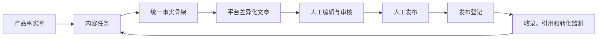

# GEO 内容运营项目会话归档

> 归档日期：2026-07-10
> 用途：供后续新会话快速恢复项目背景、已确认方案和后续工作。
> 说明：本文是对本次会话的结构化整理，不是逐字聊天记录。

## 1. 项目背景

公司需要推广电子元器件产品，目标是让用户在豆包、DeepSeek、Grok 等带联网搜索能力的 AI 产品中查询“某进口型号的国产替代”时，能够检索、提及或引用公司的替代产品。

典型问题示例：

- `OP2280 国产替代`
- `OP2280 Pin-to-Pin 国产替代`
- `OP2280 替换方案`
- `OP2280 与某国产型号参数对比`
- `某类运放国产替代推荐`

当前推广方式是在电子元器件行业网站、论坛、问答平台及部分头部网站发布相关文章，增加产品型号和替代关系的网络曝光。后续计划建设一个内部项目，根据产品信息生成适配不同平台的差异化文章，经过人工编辑和审核后发布，并登记发布结果和 GEO 效果。

术语说明：此前提到的 `gork` 应为 **Grok**。

## 2. 对 GEO 的核心认识

GEO（Generative Engine Optimization，生成式引擎优化）与 SEO 的目标相似，但作用对象包含带检索能力的生成式 AI。AI 联网回答通常可以抽象为以下过程：

```text
理解用户问题
→ 改写或扩展搜索词
→ 调用搜索工具或内部索引
→ 筛选候选网页
→ 读取和抽取网页内容
→ 判断相关性与可信度
→ 生成答案并选择是否引用来源
```

因此，文章发布到网上不代表一定会进入 AI 答案。完整链路是：

```text
文章发布
→ 被搜索系统发现并收录
→ 与目标问题高度匹配
→ 进入模型本次搜索的候选结果
→ 模型成功读取正文
→ 内容被模型采纳
→ 产品被提及、推荐或引用
```

需要区分以下状态：

- **已发布**：页面可以公开访问。
- **已收录**：搜索系统能够找到页面。
- **被检索**：页面进入某次 AI 搜索的候选结果。
- **被采用**：AI 使用了页面中的信息。
- **被引用**：最终答案展示了页面链接。

GEO 不应只追求关键词出现次数或软文数量。电子元器件场景的重点是建立**可检索、可验证、可引用的替代关系证据库**。

## 3. 已确定的 GEO 方法闭环

最初总结的方法为：

1. 确定内容，包括目标问题和关键词。
2. 分析模型引用源，挑选发布载体。
3. 分析模型搜索关键词，反向确定发布内容。
4. 如果搜索结果包含文章但答案未采用，则分析模型采信依据并修改内容，循环验证。

经过讨论，建议扩展为以下可执行闭环：

```text
目标问题库
→ 引用源分析
→ 查询意图反推
→ 权威内容制作
→ 渠道发布与收录
→ 检索、采信和准确性验证
→ 定向修改
→ 周期性复测
```

注意事项：

- 模型真实生成的搜索词通常无法被完整观测，只能通过模型展示的信息、引用页面、标题和搜索结果进行反推。
- 不应以某个固定提示词的一次命中作为成功标准，避免内容对单条提示词过拟合。
- 成功应定义为：产品在一组相关问题中，连续多个周期被多个目标模型稳定且准确地提及或引用。

### 3.1 失败环节诊断

| 现象 | 主要问题 | 优化方向 |
|---|---|---|
| 搜索结果没有页面 | 页面发现或收录失败 | 检查 URL、抓取权限、站内链接、渠道和标题 |
| 搜索结果有，但模型未读取 | 相关性或排序不足 | 优化问题匹配度、标题、首段和发布载体 |
| 模型读取但未采用 | 可信度或证据不足 | 增加数据来源、测试条件、参数对比和第三方验证 |
| 模型采用但未推荐 | 替代结论不充分 | 明确兼容条件、应用案例和替换边界 |
| 模型推荐但参数错误 | 信息冲突或表达含糊 | 统一事实源，修正冲突页面，明确测试条件 |

## 4. 内容体系：1+N 结构

建议采用“1+N”内容结构：

- `1`：公司官网上的唯一权威事实页。
- `N`：行业媒体、工程论坛、问答平台、B2B 平台等外部差异化内容。

所有外部文章应保持事实一致，并指向官网权威页。外部内容需要针对平台和用户问题提供不同的信息增量，而不是在多个网站复制同一篇软文。

### 4.1 官网权威事实页

建议每个产品和替代关系使用稳定、独立的页面，例如：

```text
/products/xxx
/alternatives/op2280
/compare/op2280-vs-xxx
/application-notes/op2280-replacement
```

替代页面至少包含：

- 原型号、国产型号、制造商和产品类别。
- 封装、引脚定义以及是否 `Pin-to-Pin`。
- 工作电压、失调电压、偏置电流、噪声、带宽、压摆率、温度范围等关键参数。
- 数据来源、参数测试条件和文档版本。
- 可以直接替换的应用条件。
- 不能直接替换或需要重新验证的应用场景。
- 数据手册、测试报告、应用笔记和样品申请入口。
- 发布日期、最后更新时间和责任主体。

关键参数应直接出现在可读取的 HTML 正文或表格中，不要只存在于图片、扫描 PDF 或复杂 JavaScript 组件里。

### 4.2 外部平台的差异化内容

| 平台类型 | 推荐内容形式 |
|---|---|
| 公司官网 | 完整参数、证据、替换边界、数据手册 |
| 行业媒体 | 行业背景、选型方法、应用案例 |
| 工程论坛 | 工程问题、实测过程、排障经验 |
| 问答平台 | 直接结论、判断依据、替代注意事项 |
| B2B 平台 | 产品参数、供货信息、数据手册和询价入口 |

差异化应来自内容角度、信息深度和读者意图，而不是简单同义改写。

### 4.3 推荐文章结构

```text
问题型标题
→ 首段直接结论
→ 原型号与国产型号参数对比表
→ 替代等级与判断依据
→ 可替代和不可直接替代的场景
→ 测试条件或应用案例
→ 数据来源和文档版本
→ 数据手册、样品或咨询入口
```

### 4.4 替代结论分级

不要仅凭部分典型参数接近就宣称“完全替代”。建议采用可验证的分级表达：

```text
功能相近
参数兼容
引脚兼容
Pin-to-Pin
已完成样板验证
已通过指定温度范围测试
已通过客户量产验证
```

每个等级需要有明确标准和证据。文章中的参数、兼容结论和测试范围必须与产品事实库一致。

## 5. 参考文章及边界

本次会话检查了以下公开页面，页面无需登录即可读取正文：

- [【AI与AI安全】聊聊黑GEO，也就是怎么给大模型搜索下毒](https://linux.do/t/topic/2416059)

文章通过虚构“OSINT 专家”、伪造权威标题和多文章互相背书，演示了如何影响模型搜索与采信。文中包含：

- GEO 与 SEO 的关系。
- 模型引用源分析。
- 模型搜索关键词分析。
- 模型采信依据分析。
- 虚构身份和伪造榜单的实验。
- 对黑 GEO 风险的反思。

该文章可用于理解模型的检索和采信薄弱点，但公司项目必须与黑 GEO 明确区分。系统应禁止以下行为：

- 虚构产品参数、测试结果、客户案例或人物身份。
- 伪装政府、机构、媒体或官方公告。
- 使用多个虚假来源互相背书。
- 故意隐藏替代限制或工程风险。
- 为影响模型而制造虚假“权威榜单”。

系统应坚持真实产品信息、可追溯证据、明确替换边界和人工审核。

## 6. 拟建设的内容运营项目

项目定位为：**AI 辅助的多平台 GEO 内容运营系统**。

目标不是自动批量生成软文，而是将真实产品信息转换为适合不同渠道的内容，并管理审核、发布登记和效果验证。

总体流程：



### 6.1 产品事实库

产品事实库是系统唯一的权威数据源，建议保存：

- 公司产品型号、类别、封装和参数。
- 被替代型号及其数据来源。
- 参数对比和测试条件。
- 替代等级及其证据。
- 可替代与不可直接替代的场景。
- 数据手册、测试报告和应用案例。
- 已批准的宣传用语和禁用表述。
- 数据版本、更新时间和审核责任人。

AI 只能基于事实库组织内容，不得自行补充缺失参数。新平台版本应先生成统一事实骨架，再按平台转换，避免不同文章出现冲突。

### 6.2 内容任务

每篇文章应先建立结构化任务，例如：

```yaml
target_question: OP2280 有哪些国产替代型号
target_product: 公司型号 XXX
target_platform: 某电子工程论坛
target_audience: 模拟电路工程师
content_angle: 参数对比与替换注意事项
conversion_goal: 查看数据手册或申请样品
fact_version: XXX 数据手册 V1.3
```

建议记录的核心字段：

- 目标问题和关键词组。
- 产品和被替代型号。
- 目标平台与栏目。
- 目标受众和内容角度。
- 期望文章形式与长度。
- 事实库版本。
- 转化目标。
- 生成提示和模型信息。

### 6.3 人工编辑与审核

编辑和审核模块至少支持：

- 富文本或 Markdown 编辑。
- AI 修改前后的差异对比。
- 参数与事实库自动核对。
- “完全替代”“性能领先”等高风险表述提醒。
- 外部链接和联系方式检查。
- 审核人、内容版本和审核时间记录。

推荐内容状态：

```text
草稿
→ 待审核
→ 已批准
→ 待人工发布
→ 平台审核中
→ 已发布
→ 已验证

异常状态：发布失败、平台拒绝、内容下线
```

## 7. 发布方式的决策变化

### 7.1 曾讨论的自动发布方案

曾考虑使用 DrissionPage、Playwright 等工具，通过 CDP 控制带登录状态的本地真实浏览器，实现跨平台一键发布。该方案技术上可行，但存在持续维护成本：

- 不同平台使用不同富文本编辑器、标签和发布流程。
- 页面改版会导致定位器和流程失效。
- 发布超时或重试可能产生重复文章。
- 需要验证最终文章 URL 和页面实际内容，而不能只依赖成功提示。
- CDP 可以完整控制已登录浏览器，必须限制为本机访问并使用独立自动化 Profile。
- 平台审核、账号风控和内容规则不能仅靠已有登录状态解决。

如果未来实施，建议采用“共享浏览器基础设施 + 每个平台独立适配器 + 统一发布记录”的结构，而不是试图用一套选择器配置适配所有平台。

### 7.2 当前确定方案：第一阶段人工发布

当前决定暂缓一键发布，先采用人工发布和发布登记，优先验证业务闭环。MVP 流程如下：

```text
创建内容任务
→ 选择目标平台和内容角度
→ AI 生成平台文章
→ 人工编辑并审核
→ 标记为待人工发布
→ 运营人员复制到目标平台发布
→ 填写发布记录
→ 定期检查收录、引用和转化
```

第一阶段不应在界面中保留不可用的一键发布按钮，也不必提前实现复杂的自动化框架。人工发布与未来自动发布只需最终生成相同结构的 `PublicationRecord`，即可保证后续监测流程不受发布方式影响。

### 7.3 发布登记对话框

| 字段 | 说明 |
|---|---|
| 发布平台 | 知乎、CSDN、行业论坛等 |
| 平台栏目/论坛地址 | 计划或实际发布的版块地址 |
| 发布文章 URL | 发布成功后的最终页面地址 |
| 内容版本 | 自动关联已审核文章版本 |
| 发布账号 | 区分不同运营账号 |
| 发布时间 | 默认当前时间，可修改 |
| 发布状态 | 已发布、审核中、被拒绝、已删除等 |
| 原创/转载 | 管理平台差异和内容属性 |
| 备注 | 审核原因、平台限制、运营说明等 |
| 截图 | 可选，保留发布或审核证据 |

建议额外保存：

- 内容任务 ID。
- 平台文章标题。
- 官网权威页 URL。
- 发布内容哈希或版本号。
- 最后验证时间。
- 收录、引用和转化状态。

## 8. 效果监测

发布数量和收录数量不能单独代表 GEO 成功。建议建立 30～50 个测试问题，覆盖：

- 品牌词。
- 公司产品型号词。
- 进口型号及国产替代词。
- `Pin-to-Pin`、兼容、参数对比等决策词。
- 应用场景词。
- 替换故障和排障词。

定期在目标模型中使用新会话抽样测试，并记录：

| 指标 | 含义 |
|---|---|
| 检索出现率 | 公司或外部发布页面是否进入来源列表 |
| 产品提及率 | 公司产品是否出现在答案中 |
| 推荐率 | 是否被明确列为候选替代 |
| 引用率 | 是否展示公司或外部文章链接 |
| 参数准确率 | 模型是否正确描述参数和替代边界 |
| 官网引用占比 | 官网权威页成为来源的比例 |
| 竞品占比 | 回答中其他替代产品的出现情况 |
| 业务转化 | 数据手册下载、样品申请和询价 |

初期可以人工检测和登记，不需要立即开发自动调用所有模型的监测系统。

## 9. MVP 建议范围

第一版建议控制在以下范围：

1. 选择 5～10 个商业价值较高的产品或替代关系。
2. 建立产品事实库和参数证据。
3. 建立内容任务和目标问题库。
4. 生成统一事实骨架和不同平台版本。
5. 提供人工编辑、版本管理和审核。
6. 提供复制或导出能力，运营人员人工发布。
7. 通过对话框登记平台、栏目、文章 URL 和状态。
8. 人工维护收录、模型引用、回答准确性和转化结果。

第一版暂不包含：

- CDP 自动发布。
- 通用平台自动化配置语言。
- 自动绕过登录、验证码或平台审核。
- 大规模自动查询所有模型。
- 基于不确定数据的自动替代结论。

## 10. 后续是否自动发布的判断依据

实际运营一段时间后，根据数据决定自动化优先级：

- 发布频率最高的平台优先。
- 单次人工发布耗时最长的平台优先。
- 页面结构和编辑器相对稳定的平台优先。
- 账号和内容审核风险较低的平台优先。
- 有官方发布 API 的平台优先于 CDP 自动化。
- 经常改版、频繁审核失败或账号风险高的平台继续人工处理。

自动化发布必须复用现有 `PublicationRecord` 和状态流程，不能形成第二套发布记录或效果统计。

## 11. 当前已确认的项目原则

1. 官网权威事实页是唯一事实源，外部平台用于差异化分发。
2. AI 生成内容必须基于已验证的产品数据和证据。
3. 先生成统一事实骨架，再生成平台版本。
4. 保留人工编辑和人工审核，不允许未经审核直接发布。
5. 第一阶段采用人工发布和链接登记，不开发一键发布。
6. 发布成功不等于 GEO 成功，必须继续检查收录、采信、准确性和转化。
7. 不以一次命中为成功标准，应进行多问题、多模型、多周期验证。
8. 不使用虚构权威、虚假交叉背书、伪造数据等黑 GEO 方法。
9. 先用小范围 MVP 验证业务价值，再根据真实运营数据决定自动化投入。

## 12. 尚待确定的问题

- 第一批 5～10 个产品型号及优先级。
- 产品参数和替代关系的现有数据来源及质量。
- 第一批目标平台、栏目和运营账号。
- 文章审核责任人及替代结论的批准标准。
- 使用哪一种大模型生成内容。
- 项目的技术栈、部署方式和用户权限。
- 官网是否已有标准化产品页及可调用的数据接口。
- GEO 监测频率、目标模型和成功阈值。
- 产品数据、文章版本和发布记录的具体数据库结构。

## 13. 新会话可直接使用的上下文提示

```text
我们正在设计一个面向电子元器件国产替代业务的 GEO 内容运营系统。

业务目标：当用户在豆包、DeepSeek、Grok 等联网 AI 中查询某进口型号的国产替代时，提高公司产品被准确提及或引用的概率。

已确定采用“1+N”内容结构：
1 是公司官网的唯一权威产品/替代事实页；
N 是行业网站、工程论坛、问答和 B2B 平台上的差异化内容。

系统核心流程：产品事实库 → 内容任务 → 统一事实骨架 → 平台差异化文章 → 人工编辑审核 → 人工发布 → 发布登记 → 收录/引用/转化监测。

当前 MVP 不做一键发布。运营人员人工发布后，通过对话框登记平台、栏目地址、最终文章 URL、内容版本、账号、时间、状态和备注。未来如果增加官方 API 或 CDP 自动发布，也必须生成同一种 PublicationRecord，并复用现有监测流程。

内容必须基于真实产品参数、测试条件和数据来源；禁止虚构权威、虚假交叉背书、伪造数据或隐藏替代风险。替代结论应区分功能相近、参数兼容、引脚兼容、Pin-to-Pin、样板验证和量产验证等等级。

第一版计划选择 5～10 个重点型号和少量平台，验证内容质量、审核效率、发布流程、AI 提及率、引用率、参数准确率及样品/询价转化，再决定是否开发自动发布。

请基于以上约束继续协助进行需求分析、数据建模、原型设计或技术实现，不要重新引入未经验证的一键发布复杂度。
```
