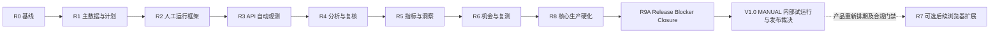

# PartSignal GEO 实施路线图

| 项目 | 内容 |
|---|---|
| 文档版本 | V1.0 |
| 文档状态 | 目标实施基线 |
| 交付方式 | 分阶段纵向切片；每个任务独立契约、迁移、实现和验收 |

## 1. 实施原则

1. 不推翻现有产品事实、内容、发布和人工 GEO；
2. 先建立统一回答级运行模型，再自动化；
3. 先人工采集证明数据和页面语义，再接 API；
4. 采集和分析分离，分析和人工复核分离；
5. 先建立原始证据和资格，再开发指标；
6. 先用确定性规则形成机会，再考虑智能建议；
7. 浏览器采集最后进入，且必须有独立 ADR、合规和运维门禁；
8. 每个增量默认关闭新入口，通过功能开关逐步启用；
9. 每个任务一次只改变一个稳定业务切片；
10. 不把“完成代码”视为完成，必须有契约、迁移、测试、页面状态和文档证据。

## 2. 发布增量



当前范围依据[ADR-006](../05-decisions/ADR-006-defer-browser-collection-and-adopt-manual-first-core.md)：MANUAL 是正式回答级采集方式，R6 直接进入 R8；R7 不再是核心前置门禁。801～803 保留 done，804～807 deferred/post-core，恢复条件以 manifest 和 ADR 为准。

V1.0 的细目由 [ADR-007](../05-decisions/ADR-007-manual-first-v1-release-scope.md) 和[能力矩阵](../01-product/05-v1-release-capability-matrix.md)冻结：R8 后增加 R9A；R0—R8 原交付/接受记录保留，以下阶段目标不等于首发每个入口已实现。

## 3. R0：文档、决策和当前基线

### 目标

确保 Codex 和团队使用同一目标、术语、架构决策和当前实现基线。

### 交付

- 本文档包进入仓库；
- 五项 ADR 接受；
- 当前 GEO 路由、表、服务、测试和页面盘点；
- 功能开关和环境配置；
- GEO 金标测试基础目录。

### 退出门禁

- 文档导航可从仓库 README/AGENTS 找到；
- 当前 `make verify` 基线结果已记录；
- 未发生任何业务行为变化；
- 新 GEO 入口默认关闭；
- WBS 中任务可被单独引用。

## 4. R1：监测主数据与计划

### 目标

能够配置监测对象、问题变体、AI 观测面、采集配置和计划，并由服务端预览运行矩阵。

### 业务演示

1. 管理员为一个现有 Product 建立 OWN_PRODUCT 监测对象；
2. 添加型号别名和自有域名；
3. 添加一个竞品；
4. 工程师为现有 QueryTopic 添加点名和非点名变体；
5. 管理员创建 MANUAL profile；
6. 工程师创建计划；
7. 服务端预览 `问题 × profile × repeat` 数量；
8. 计划可以启用、暂停和归档，但尚不自动采集。

### 退出门禁

- Catalog、PromptVariant、EngineSurface/Profile、Plan 数据和 API 完成；
- 计划快照和运行数预览语义稳定；
- 所有可变资源使用 revision；
- 历史引用删除阻断完成；
- 管理配置页面和计划向导 E2E 通过。

## 5. R2：统一观测运行与人工采集

### 目标

在不依赖真实外部 API 的情况下，完成从批次到原始回答、引用、截图、分析触发入口的纵向框架。

### 业务演示

1. 从计划创建 3 次重复的 MANUAL 批次；
2. 运行中心展示批次和 3 个 PENDING run；
3. 人工保存草稿；
4. 上传截图；
5. 提交回答和引用；
6. 原始证据冻结；
7. Run 进入 COLLECTED/待分析；
8. 详情可查看输入快照、答案、引用、文件和时间线。

### 退出门禁

- Batch/Run/Answer/Citation 数据模型完成；
- MANUAL draft 和 submit 完成；
- 原始答案不可变；
- 幂等、并发提交和取消测试通过；
- 运行中心和详情 E2E 通过；
- 现有文章关系观测未被破坏。

## 6. R3：API 自动观测

### 目标

至少一个受控 API Collector 可以通过现有 AIChannel/AIModel 执行监测，并具备可靠状态、费用和恢复。

### 业务演示

1. 管理员创建 API profile 并测试；
2. 计划生成 API runs；
3. Worker 领取 run；
4. fake/批准 provider 返回回答、引用、usage 和 cost；
5. Run 保存 AnswerSnapshot；
6. 重复消息不重复调用；
7. 发送后超时进入 UNKNOWN_OUTCOME；
8. 用户显式创建新 attempt。

### 退出门禁

- Collector protocol 和 fake provider 完成；
- OpenAI-compatible collector 完成；
- at-most-once、租约、补投递和迟到结果测试通过；
- 预算/费用未知语义明确；
- 生产开关默认关闭；
- API 自动观测纵向 E2E 通过。

## 7. R4：分析与人工复核

### 目标

从原始答案中形成可版本化的提及、推荐、引用归属和事实准确性结果，并允许人工修正。

### 业务演示

1. 机器识别自有产品和竞品；
2. 区分列举和明确推荐；
3. 分类自有/竞品/行业来源；
4. 提取参数或替代声明；
5. 与已批准 FactVersion 对比；
6. 低置信或严重错误进入 NEEDS_REVIEW；
7. 人工确认或修正；
8. 原机器分析和复核历史均保留。

### 退出门禁

- AnalysisRevision 和 Review 数据模型完成；
- 中文型号金标通过；
- 分析失败不丢原始证据；
- 新 revision 不覆盖旧 revision；
- 人工复核页面和 E2E 通过；
- 敏感数据外发门禁通过。

## 8. R5：指标、洞察与报告

### 目标

用可解释的服务端公式展示可见率、推荐率、SOV、引用、准确性、稳定性和数据质量。

### 业务演示

- 总览显示自然可见率、推荐率、自有信源覆盖和风险；
- 洞察按产品、问题、平台、模式和时间筛选；
- 点名与非点名分离；
- API/MANUAL 分离；
- 每个比率显示分子/分母；
- 点击指标下钻到运行；
- 打印报告和 CSV 与页面一致。

### 退出门禁

- MetricEligibility 和公式金标通过；
- 30 天洞察性能达标；
- 无分母返回 NULL；
- 样本不足不触发趋势；
- 数据质量排除原因完整；
- 报告和导出安全测试通过。

## 9. R6：机会、行动和复测

### 目标

把确定性异常转化为任务和同口径复测，完成运营闭环。

### 业务演示

1. 核心问题稳定样本零提及；
2. 系统创建 `TOPIC_COVERAGE_GAP`；
3. 用户确认并创建 ContentTask；
4. 任务完成/发布后关联干预；
5. 创建严格同口径复测；
6. 展示前后指标、样本和差异；
7. 用户显式解决或继续处理。

### 退出门禁

- 规则和机会 identity 去重完成；
- 所有机会保存规则快照和来源运行；
- 行动通过现有领域服务创建；
- 任务完成不自动解决；
- 复测不可比时明确阻断；
- 机会纵向 E2E 通过。

## 10. R7：浏览器采集试点（post-core 可选扩展）

### 目标

以下目标设计保留，当前不执行：801～803 已接受 done，804～807 deferred/post-core。产品重新排期并满足 ADR-006 恢复条件后，在合规批准下，对一个真实 AI 产品界面完成小规模、可停止、可审计的试点；不作为核心上线条件。

### 交付

- 独立 browser collector 服务；
- 加密会话引用；
- 本地模拟站 contract tests；
- 一个真实平台 adapter；
- 临时会话、答案稳定检测、引用和截图；
- kill switch、频率限制、会话健康；
- 与人工结果交叉核验报告。

### 退出门禁

- ADR-005 所有条件满足；
- 不在 CI 访问真实平台；
- Cookie/账号不进入日志、截图和 DB 明文；
- 选择器变化明确失败；
- 会话过期可检测和撤销；
- 试点频率、账号和责任人明确；
- 未批准其他平台仍保持关闭。

## 11. R8：生产硬化

### 目标

完善长期运行需要的数据保留、监控、备份、性能和安全验收。

### 交付

- retention/cleanup；
- 运行、成本、失败和积压监控；
- 数据库/OSS/适用密钥备份恢复演练；Browser 会话仅在 R7 部署或实际存在材料时适用，否则记录有依据的 N/A；
- 100,000 run 洞察性能验证；
- 安全与合规复核；
- 运维 runbook；
- 仅把实际实现并验收的核心范围标记已实现，804～807 保持延期，不宣称 Browser 已实现；
- GEO-901 的 Browser 临时数据清理条件适用；GEO-903 未部署且无材料时会话恢复 N/A；GEO-904/906 实测 Browser false、服务未启用且无生产会话。

### GEO-906 实际进入状态（2026-10-05）

903/904/905已人工接受为done，可开始906；904现场与905目标容量限制保留。
当前完成范围为本地发布准备，生产阶段NOT_STARTED；入口、固定candidate、阶段批准与观察期输入尚缺。
执行与阶段退出见[核心发布Runbook](../03-technical/10-core-rollout-runbook.md)，
实际验证、最终验收缺口和恢复条件见[验收记录](./13-r8-core-release-acceptance.md)。
生产Browser事实未验证，清理/会话恢复不能写N/A；Plan cron与自动evaluator未接线不从ADR-006获得延期。
R7延期不是核心阻断原因；生产输入缺失与上述核心缺口不能被本地通过或依赖done消除。

## 11A. R9A Release Blocker Closure

### 目标

按 [GEO-1001 NO-GO 审计](../06-reviews/GEO-1001-release-readiness-audit.md) 闭合 V1.0 人工优先首发阻断，保留历史任务状态与接受记录。GEO-1002 只冻结范围，完工 review；后续任务本次只 planned。

### 交付与顺序

| 步骤 | 任务与边界 |
|---|---|
| 范围裁决 | GEO-1002：Accepted ADR-007、能力矩阵、任务/门禁；不修改代码/协议/部署 |
| 首发修复 | GEO-1003 production Browser 硬禁止；1004 Catalog 当前身份；1005 CRON 禁用/既存状态治理；1006 管理员显式评估；1008 升级失败安全恢复 |
| 能力真实性 | GEO-1007：依赖 1005/1006，校准页面和操作说明，不实现范围外自动化/UI/CSV |
| main 门禁接受 | GEO-1009：固定 clean main 完整门禁验证已获人工接受；未生成的候选工件与冻结移交 UI done 后的 GEO-1010-DEPLOY |
| 现场裁决 | GEO-1010：同候选/目标的配置、MANUAL 闭环/内部试用、监控/容量/停止/恢复与 Go/No-Go 签署 |

每项完整依赖、交付物、测试及验收以 [WBS](./02-work-breakdown-structure.md) 和 [manifest](./task-manifest.yaml) 为准。GEO-1001 作为审计输入，不补造任务状态；R9A 不依赖 deferred R7。CRON 自动建批次、周期 evaluator、完整 Action/Retest UI、Opportunity CSV、公共重分析另行排期，不纳入本阶段实现。

2026-10-07 用户批准的范围调整见 [ADR-008](../05-decisions/ADR-008-manual-pilot-ui-first-delivery-and-candidate-ownership.md) 和 [GEO-1009 接受记录](../06-reviews/2026-10-07-geo-1009-main-gate-acceptance.md)：GEO-1009 的 done 只接受固定 main 完整门禁验证；同候选 archive/images/manifest/schema/hash 与候选冻结仍由后续 DEPLOY 收口。旧 SHA 的成功不证明未来 UI 候选已验证。

### 退出门禁

- GEO-1002～1009 已人工接受；不通过旧 done 或范围裁决跳过新增修复。
- Browser production 硬禁止＋现场零启用，Catalog 权限竞态闭合，CRON 无假 ACTIVE，管理员经真实入口评估；现有分析/补投递继续工作。
- 升级 artifact 失败安全恢复演练通过；候选 commit/archive/manifest/images/schema/hashes 一致且完整门禁通过。
- GEO-1010 所有必需现场门禁 MET，业务/运维签署及对应阶段授权齐全；未知或缺批准即 NO-GO。
- 阶段完成与任务接受、生产批准分别记录；任务交付先 review，人工接受才 done。

## 12. 关键路径

```text
GEO-001 → GEO-003
→ GEO-101/102/103/104
→ GEO-201/203/206/207/208
→ GEO-301/303/304/305/306
→ GEO-401/404/405/406
→ GEO-501/506/507
→ GEO-601/602/603/604
→ GEO-701/702/704/705
→ GEO-901/902/903/906
```

V1.0 当前关键路径为 R6 → R8 → R9A（1002 → 1003/1004/1005/1006/1008 → 1007 → 1009 → 1010）。以上 R0—R8 编号路径为历史交付链，状态不改。R7 是 post-core 可选扩展，deferred 不阻断核心发布；API 能力仍按原依赖和批准范围保留，不更改 MANUAL/API 行为。人工操作见[观测 SOP](../02-business/05-manual-geo-observation-sop.md)。

## 13. Codex 执行节奏

每次只选择一个任务，创建任务说明后执行：

```text
读取关联文档
→ 检查依赖任务
→ 运行当前基线
→ 契约/迁移设计
→ 后端实现和测试
→ 前端实现和测试
→ 纵向验收
→ 更新任务状态和文档
```

不得把一个发布增量作为单个 Codex 任务。

## 14. 建议的首批任务顺序

```text
GEO-001 文档落库
GEO-002 ADR 接受
GEO-003 当前基线盘点
GEO-004 功能开关
GEO-005 金标夹具基础
GEO-101 Catalog 契约
GEO-102 Catalog 数据库
GEO-103 Catalog Schema/Policy
GEO-104 Catalog Service/API
GEO-105 Catalog UI
GEO-106 Catalog E2E
```

首批不创建 Run、Collector 或指标，先证明主数据模型和开发流程稳定。
